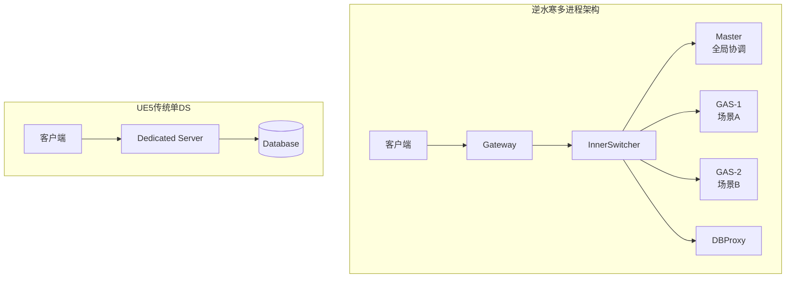
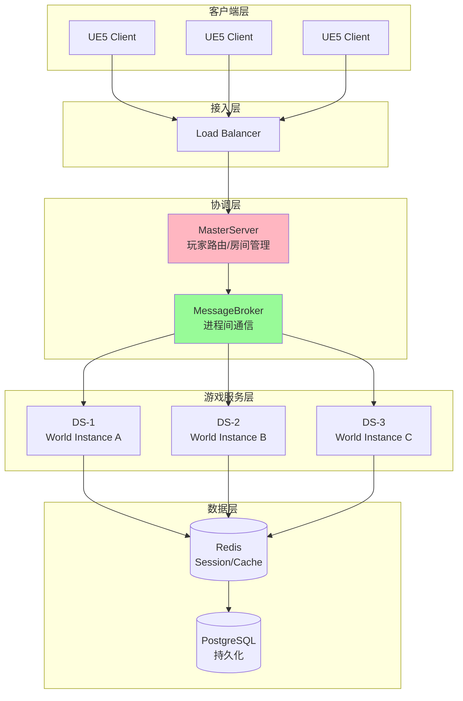
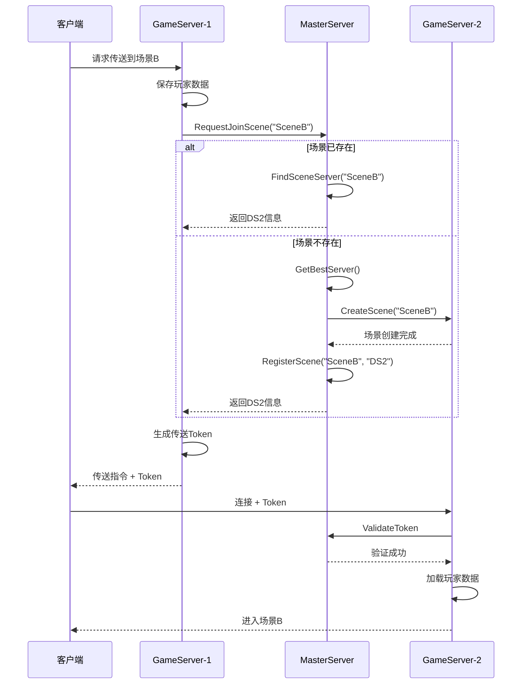
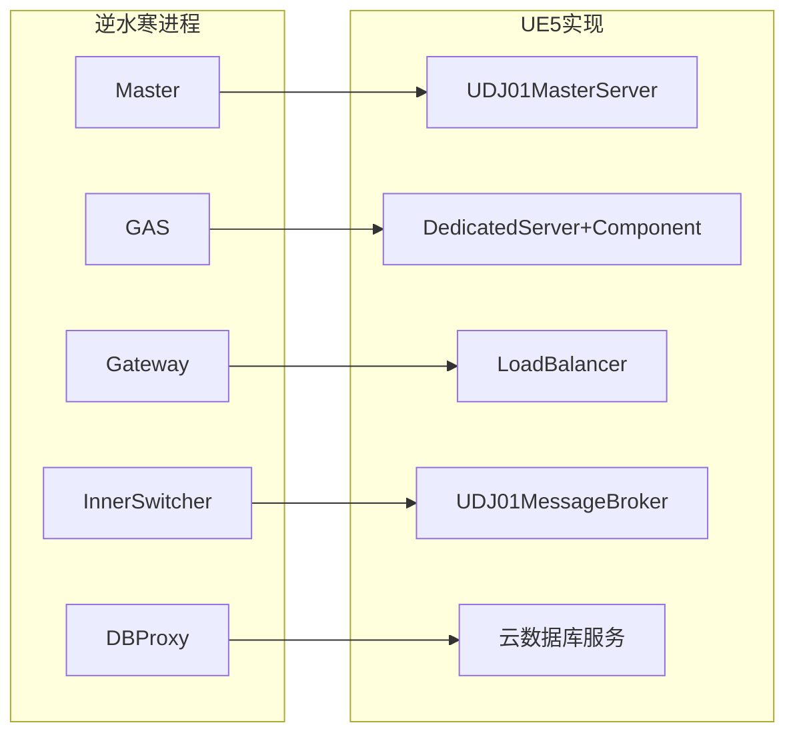

# 08 - 分布式服务器架构

## 概述

传统UE5使用单Dedicated Server（DS）模式，难以承载MMO级别的大规模并发。本文档分析逆水寒的多进程分布式架构，并探讨如何在UE5项目中实现类似的分布式设计。

---

## 架构对比

### 逆水寒 vs UE5传统模式



| 方面 | 逆水寒 | UE5传统 |
|------|--------|---------|
| **进程模型** | 多进程（Master/GAS/Gateway） | 单进程DS |
| **扩展方式** | 水平扩展GAS | 增加DS实例 |
| **玩家路由** | Master智能分配 | 直连或简单负载均衡 |
| **进程通信** | Switcher中转RPC | 无内置支持 |
| **单进程容量** | ~2000玩家/GAS | ~64-100玩家/DS |

---

## 核心进程角色映射

### 进程职责对比

| 逆水寒进程 | 职责 | UE5对应方案 |
|------------|------|-------------|
| **Master** | 全局协调、场景分配、玩家路由 | 自定义MatchmakingService |
| **GAS** | 游戏逻辑、战斗、AI | Dedicated Server |
| **Gateway** | 客户端接入、协议转发 | 可选的代理层 |
| **DBProxy** | 数据持久化、缓存 | GameLiftFlexMatch + DynamoDB |
| **InnerSwitcher** | 区内RPC路由 | 自定义消息总线 |

---

## UE5分布式架构设计

### 整体架构



### 组件职责

```cpp filePath=Source/DJ01/Network/Distributed/DJ01DistributedTypes.h
#pragma once

#include "CoreMinimal.h"
#include "DJ01DistributedTypes.generated.h"

// 服务器类型（类似逆水寒的进程类型）
UENUM(BlueprintType)
enum class EDJ01ServerType : uint8
{
    Master = 0,         // 全局协调（类似Master）
    GameServer = 1,     // 游戏逻辑（类似GAS）
    LoginServer = 2,    // 登录验证（类似Login）
    ChatServer = 3,     // 聊天服务
    MatchServer = 4,    // 匹配服务
};

// 服务器状态
UENUM(BlueprintType)
enum class EDJ01ServerStatus : uint8
{
    Starting = 0,
    Running = 1,
    Busy = 2,           // 高负载
    Stopping = 3,
    Offline = 4,
};

// 服务器信息
USTRUCT(BlueprintType)
struct FDJ01ServerInfo
{
    GENERATED_BODY()
    
    UPROPERTY(BlueprintReadOnly)
    FString ServerId;
    
    UPROPERTY(BlueprintReadOnly)
    EDJ01ServerType ServerType = EDJ01ServerType::GameServer;
    
    UPROPERTY(BlueprintReadOnly)
    EDJ01ServerStatus Status = EDJ01ServerStatus::Offline;
    
    UPROPERTY(BlueprintReadOnly)
    FString Address;
    
    UPROPERTY(BlueprintReadOnly)
    int32 Port = 7777;
    
    UPROPERTY(BlueprintReadOnly)
    int32 CurrentPlayers = 0;
    
    UPROPERTY(BlueprintReadOnly)
    int32 MaxPlayers = 100;
    
    UPROPERTY(BlueprintReadOnly)
    float CPUUsage = 0.0f;
    
    UPROPERTY(BlueprintReadOnly)
    float MemoryUsage = 0.0f;
    
    // 计算负载权重（类似逆水寒的权重算法）
    float CalculateWeight() const
    {
        // weight = 100 * (2 - CPU - PlayerCount/MaxPlayers)
        float PlayerRatio = MaxPlayers > 0 ? 
            static_cast<float>(CurrentPlayers) / MaxPlayers : 1.0f;
        return 100.0f * (2.0f - CPUUsage - PlayerRatio);
    }
};
```

---

## Master服务器实现

### 核心职责

Master服务器负责：
1. **服务注册与发现**：跟踪所有GameServer状态
2. **玩家路由**：智能分配玩家到最优GameServer
3. **场景管理**：管理WorldInstance的创建与销毁
4. **负载均衡**：根据CPU/玩家数选择服务器

```cpp filePath=Source/DJ01/Network/Distributed/DJ01MasterServer.h
#pragma once

#include "CoreMinimal.h"
#include "DJ01DistributedTypes.h"
#include "Subsystems/GameInstanceSubsystem.h"
#include "DJ01MasterServer.generated.h"

DECLARE_DYNAMIC_MULTICAST_DELEGATE_OneParam(FOnServerRegistered, const FDJ01ServerInfo&, ServerInfo);
DECLARE_DYNAMIC_MULTICAST_DELEGATE_OneParam(FOnServerUnregistered, const FString&, ServerId);

/**
 * Master服务器 - 全局协调器
 * 类似逆水寒的Master进程
 */
UCLASS()
class UDJ01MasterServer : public UGameInstanceSubsystem
{
    GENERATED_BODY()
    
public:
    virtual void Initialize(FSubsystemCollectionBase& Collection) override;
    virtual void Deinitialize() override;
    
    // === 服务注册 ===
    
    // 注册GameServer（类似ServiceMgr:OnAllModulesStartUp）
    UFUNCTION(BlueprintCallable, Category = "Master|Registration")
    void RegisterServer(const FDJ01ServerInfo& ServerInfo);
    
    // 注销GameServer
    UFUNCTION(BlueprintCallable, Category = "Master|Registration")
    void UnregisterServer(const FString& ServerId);
    
    // 更新服务器状态（心跳）
    UFUNCTION(BlueprintCallable, Category = "Master|Registration")
    void UpdateServerStatus(const FString& ServerId, const FDJ01ServerInfo& UpdatedInfo);
    
    // === 玩家路由 ===
    
    // 获取最优GameServer（类似ChooseGasSrvAddr）
    UFUNCTION(BlueprintCallable, Category = "Master|Routing")
    bool GetBestServer(FDJ01ServerInfo& OutServerInfo, 
        const TArray<FString>& ExcludeServerIds = TArray<FString>());
    
    // 请求进入特定场景（类似ChooseSceneForTeleport）
    UFUNCTION(BlueprintCallable, Category = "Master|Routing")
    bool RequestJoinScene(const FString& PlayerId, const FString& SceneId, 
        FDJ01ServerInfo& OutServerInfo);
    
    // === 场景管理 ===
    
    // 注册场景到服务器
    UFUNCTION(BlueprintCallable, Category = "Master|Scene")
    void RegisterScene(const FString& SceneId, const FString& ServerId);
    
    // 查找场景所在服务器
    UFUNCTION(BlueprintCallable, Category = "Master|Scene")
    bool FindSceneServer(const FString& SceneId, FDJ01ServerInfo& OutServerInfo);
    
    // === 事件 ===
    
    UPROPERTY(BlueprintAssignable)
    FOnServerRegistered OnServerRegistered;
    
    UPROPERTY(BlueprintAssignable)
    FOnServerUnregistered OnServerUnregistered;
    
protected:
    // 已注册的服务器
    UPROPERTY()
    TMap<FString, FDJ01ServerInfo> RegisteredServers;
    
    // 场景到服务器的映射
    UPROPERTY()
    TMap<FString, FString> SceneToServerMap;
    
    // 心跳超时检测
    FTimerHandle HeartbeatCheckHandle;
    TMap<FString, float> ServerLastHeartbeat;
    
    void CheckHeartbeatTimeout();
    
    // 按权重选择服务器（类似_GetFreeGasSrvAddr_Mod）
    FString SelectServerByWeight(const TArray<FString>& AvailableServers);
};
```

```cpp filePath=Source/DJ01/Network/Distributed/DJ01MasterServer.cpp
#include "DJ01MasterServer.h"
#include "TimerManager.h"

void UDJ01MasterServer::Initialize(FSubsystemCollectionBase& Collection)
{
    Super::Initialize(Collection);
    
    // 每5秒检查心跳超时
    if (UWorld* World = GetWorld())
    {
        World->GetTimerManager().SetTimer(
            HeartbeatCheckHandle,
            this,
            &UDJ01MasterServer::CheckHeartbeatTimeout,
            5.0f,
            true);
    }
    
    UE_LOG(LogTemp, Log, TEXT("MasterServer Initialized"));
}

void UDJ01MasterServer::Deinitialize()
{
    if (UWorld* World = GetWorld())
    {
        World->GetTimerManager().ClearTimer(HeartbeatCheckHandle);
    }
    Super::Deinitialize();
}

void UDJ01MasterServer::RegisterServer(const FDJ01ServerInfo& ServerInfo)
{
    // 类似逆水寒 ServiceMgr:OnServiceStatusChanged
    RegisteredServers.Add(ServerInfo.ServerId, ServerInfo);
    ServerLastHeartbeat.Add(ServerInfo.ServerId, GetWorld()->GetTimeSeconds());
    
    OnServerRegistered.Broadcast(ServerInfo);
    
    UE_LOG(LogTemp, Log, TEXT("Server Registered: %s (%s:%d)"), 
        *ServerInfo.ServerId, *ServerInfo.Address, ServerInfo.Port);
}

void UDJ01MasterServer::UnregisterServer(const FString& ServerId)
{
    RegisteredServers.Remove(ServerId);
    ServerLastHeartbeat.Remove(ServerId);
    
    // 清理该服务器上的场景
    TArray<FString> ScenesToRemove;
    for (const auto& Pair : SceneToServerMap)
    {
        if (Pair.Value == ServerId)
        {
            ScenesToRemove.Add(Pair.Key);
        }
    }
    for (const FString& SceneId : ScenesToRemove)
    {
        SceneToServerMap.Remove(SceneId);
    }
    
    OnServerUnregistered.Broadcast(ServerId);
    
    UE_LOG(LogTemp, Log, TEXT("Server Unregistered: %s"), *ServerId);
}

void UDJ01MasterServer::UpdateServerStatus(const FString& ServerId, 
    const FDJ01ServerInfo& UpdatedInfo)
{
    // 类似逆水寒 OnRecvHeartBeat
    if (FDJ01ServerInfo* Existing = RegisteredServers.Find(ServerId))
    {
        Existing->Status = UpdatedInfo.Status;
        Existing->CurrentPlayers = UpdatedInfo.CurrentPlayers;
        Existing->CPUUsage = UpdatedInfo.CPUUsage;
        Existing->MemoryUsage = UpdatedInfo.MemoryUsage;
        
        ServerLastHeartbeat.Add(ServerId, GetWorld()->GetTimeSeconds());
    }
}

bool UDJ01MasterServer::GetBestServer(FDJ01ServerInfo& OutServerInfo, 
    const TArray<FString>& ExcludeServerIds)
{
    // 类似逆水寒 GetFreeGasSrvAddr
    
    // 1. 收集可用服务器
    TArray<FString> AvailableServers;
    for (const auto& Pair : RegisteredServers)
    {
        const FDJ01ServerInfo& Info = Pair.Value;
        
        // 检查状态
        if (Info.Status != EDJ01ServerStatus::Running)
            continue;
            
        // 检查是否在排除列表
        if (ExcludeServerIds.Contains(Info.ServerId))
            continue;
            
        // 检查是否满员
        if (Info.CurrentPlayers >= Info.MaxPlayers)
            continue;
            
        AvailableServers.Add(Info.ServerId);
    }
    
    if (AvailableServers.Num() == 0)
    {
        return false;
    }
    
    // 2. 按权重选择
    FString SelectedId = SelectServerByWeight(AvailableServers);
    if (FDJ01ServerInfo* SelectedInfo = RegisteredServers.Find(SelectedId))
    {
        OutServerInfo = *SelectedInfo;
        return true;
    }
    
    return false;
}

FString UDJ01MasterServer::SelectServerByWeight(const TArray<FString>& AvailableServers)
{
    // 类似逆水寒的加权随机选择
    // weight = 100 * (2 - CPU - PlayerCount/MaxPlayers)
    
    float TotalWeight = 0.0f;
    TArray<TPair<FString, float>> ServerWeights;
    
    for (const FString& ServerId : AvailableServers)
    {
        if (const FDJ01ServerInfo* Info = RegisteredServers.Find(ServerId))
        {
            float Weight = Info->CalculateWeight();
            Weight = FMath::Max(Weight, 1.0f); // 最小权重为1
            ServerWeights.Add(TPair<FString, float>(ServerId, Weight));
            TotalWeight += Weight;
        }
    }
    
    // 加权随机选择
    float RandomValue = FMath::FRand() * TotalWeight;
    float CurrentSum = 0.0f;
    
    for (const auto& Pair : ServerWeights)
    {
        CurrentSum += Pair.Value;
        if (RandomValue <= CurrentSum)
        {
            return Pair.Key;
        }
    }
    
    // 兜底返回第一个
    return AvailableServers[0];
}

bool UDJ01MasterServer::RequestJoinScene(const FString& PlayerId, 
    const FString& SceneId, FDJ01ServerInfo& OutServerInfo)
{
    // 类似逆水寒 ChooseSceneForTeleport
    
    // 1. 检查场景是否已存在
    if (FString* ExistingServerId = SceneToServerMap.Find(SceneId))
    {
        if (FDJ01ServerInfo* ServerInfo = RegisteredServers.Find(*ExistingServerId))
        {
            OutServerInfo = *ServerInfo;
            return true;
        }
    }
    
    // 2. 场景不存在，选择最优服务器创建
    return GetBestServer(OutServerInfo);
}

void UDJ01MasterServer::RegisterScene(const FString& SceneId, const FString& ServerId)
{
    SceneToServerMap.Add(SceneId, ServerId);
    UE_LOG(LogTemp, Log, TEXT("Scene %s registered to Server %s"), *SceneId, *ServerId);
}

bool UDJ01MasterServer::FindSceneServer(const FString& SceneId, 
    FDJ01ServerInfo& OutServerInfo)
{
    if (FString* ServerId = SceneToServerMap.Find(SceneId))
    {
        if (FDJ01ServerInfo* Info = RegisteredServers.Find(*ServerId))
        {
            OutServerInfo = *Info;
            return true;
        }
    }
    return false;
}

void UDJ01MasterServer::CheckHeartbeatTimeout()
{
    const float TimeoutSeconds = 30.0f;
    float CurrentTime = GetWorld()->GetTimeSeconds();
    
    TArray<FString> TimedOutServers;
    
    for (const auto& Pair : ServerLastHeartbeat)
    {
        if (CurrentTime - Pair.Value > TimeoutSeconds)
        {
            TimedOutServers.Add(Pair.Key);
        }
    }
    
    for (const FString& ServerId : TimedOutServers)
    {
        UE_LOG(LogTemp, Warning, TEXT("Server %s heartbeat timeout, unregistering"), *ServerId);
        UnregisterServer(ServerId);
    }
}
```

---

## 消息总线实现

### Switcher模式的UE5实现

逆水寒使用InnerSwitcher作为RPC中转中心，UE5中可以使用消息总线实现类似功能：

```cpp filePath=Source/DJ01/Network/Distributed/DJ01MessageBroker.h
#pragma once

#include "CoreMinimal.h"
#include "DJ01DistributedTypes.h"
#include "DJ01MessageBroker.generated.h"

// 跨服务器消息
USTRUCT(BlueprintType)
struct FDJ01CrossServerMessage
{
    GENERATED_BODY()
    
    UPROPERTY()
    FString SourceServerId;
    
    UPROPERTY()
    FString TargetServerId;  // 空表示广播
    
    UPROPERTY()
    FString MessageType;
    
    UPROPERTY()
    FString Payload;  // JSON序列化的数据
    
    UPROPERTY()
    double Timestamp = 0.0;
};

DECLARE_DYNAMIC_MULTICAST_DELEGATE_OneParam(FOnCrossServerMessage, 
    const FDJ01CrossServerMessage&, Message);

/**
 * 消息总线 - 跨服务器通信
 * 类似逆水寒的InnerSwitcher
 */
UCLASS()
class UDJ01MessageBroker : public UGameInstanceSubsystem
{
    GENERATED_BODY()
    
public:
    virtual void Initialize(FSubsystemCollectionBase& Collection) override;
    
    // 发送消息到指定服务器
    UFUNCTION(BlueprintCallable, Category = "MessageBroker")
    void SendMessage(const FString& TargetServerId, const FString& MessageType, 
        const FString& Payload);
    
    // 广播消息到所有服务器
    UFUNCTION(BlueprintCallable, Category = "MessageBroker")
    void BroadcastMessage(const FString& MessageType, const FString& Payload);
    
    // 发送消息到特定类型的所有服务器
    UFUNCTION(BlueprintCallable, Category = "MessageBroker")
    void SendToServerType(EDJ01ServerType ServerType, const FString& MessageType, 
        const FString& Payload);
    
    // 消息接收事件
    UPROPERTY(BlueprintAssignable)
    FOnCrossServerMessage OnMessageReceived;
    
    // 注册消息处理器
    void RegisterMessageHandler(const FString& MessageType, 
        TFunction<void(const FDJ01CrossServerMessage&)> Handler);
    
protected:
    FString LocalServerId;
    
    // 消息处理器映射
    TMap<FString, TFunction<void(const FDJ01CrossServerMessage&)>> MessageHandlers;
    
    // 模拟网络延迟的消息队列（实际项目中应使用真实网络）
    TQueue<FDJ01CrossServerMessage> PendingMessages;
    
    void ProcessPendingMessages();
};
```

```cpp filePath=Source/DJ01/Network/Distributed/DJ01MessageBroker.cpp
#include "DJ01MessageBroker.h"
#include "Kismet/GameplayStatics.h"

void UDJ01MessageBroker::Initialize(FSubsystemCollectionBase& Collection)
{
    Super::Initialize(Collection);
    
    // 生成本地服务器ID
    LocalServerId = FGuid::NewGuid().ToString();
    
    UE_LOG(LogTemp, Log, TEXT("MessageBroker Initialized with ID: %s"), *LocalServerId);
}

void UDJ01MessageBroker::SendMessage(const FString& TargetServerId, 
    const FString& MessageType, const FString& Payload)
{
    FDJ01CrossServerMessage Message;
    Message.SourceServerId = LocalServerId;
    Message.TargetServerId = TargetServerId;
    Message.MessageType = MessageType;
    Message.Payload = Payload;
    Message.Timestamp = FPlatformTime::Seconds();
    
    // 在实际项目中，这里应该通过网络发送
    // 这里简化为直接入队（假设是同进程测试）
    PendingMessages.Enqueue(Message);
    
    UE_LOG(LogTemp, Verbose, TEXT("Message sent: %s -> %s [%s]"), 
        *LocalServerId, *TargetServerId, *MessageType);
}

void UDJ01MessageBroker::BroadcastMessage(const FString& MessageType, 
    const FString& Payload)
{
    // 空的TargetServerId表示广播
    SendMessage(TEXT(""), MessageType, Payload);
}

void UDJ01MessageBroker::RegisterMessageHandler(const FString& MessageType, 
    TFunction<void(const FDJ01CrossServerMessage&)> Handler)
{
    MessageHandlers.Add(MessageType, Handler);
}

void UDJ01MessageBroker::ProcessPendingMessages()
{
    FDJ01CrossServerMessage Message;
    while (PendingMessages.Dequeue(Message))
    {
        // 检查是否是发给本服务器的
        if (Message.TargetServerId.IsEmpty() || Message.TargetServerId == LocalServerId)
        {
            // 广播事件
            OnMessageReceived.Broadcast(Message);
            
            // 调用注册的处理器
            if (auto* Handler = MessageHandlers.Find(Message.MessageType))
            {
                (*Handler)(Message);
            }
        }
    }
}
```

---

## 玩家跨服传送

### 跨服流程



### 传送实现

```cpp filePath=Source/DJ01/Network/Distributed/DJ01ServerTransfer.h
#pragma once

#include "CoreMinimal.h"
#include "DJ01DistributedTypes.h"
#include "DJ01ServerTransfer.generated.h"

// 传送Token
USTRUCT()
struct FDJ01TransferToken
{
    GENERATED_BODY()
    
    UPROPERTY()
    FString TokenId;
    
    UPROPERTY()
    FString PlayerId;
    
    UPROPERTY()
    FString SourceServerId;
    
    UPROPERTY()
    FString TargetServerId;
    
    UPROPERTY()
    FString TargetSceneId;
    
    UPROPERTY()
    double ExpirationTime = 0.0;
    
    UPROPERTY()
    FString PlayerDataJson;  // 序列化的玩家数据
};

/**
 * 跨服传送管理器
 */
UCLASS()
class UDJ01ServerTransfer : public UGameInstanceSubsystem
{
    GENERATED_BODY()
    
public:
    // 发起跨服传送
    UFUNCTION(BlueprintCallable, Category = "Transfer")
    bool InitiateTransfer(APlayerController* Player, const FString& TargetSceneId);
    
    // 验证传送Token
    UFUNCTION(BlueprintCallable, Category = "Transfer")
    bool ValidateTransferToken(const FString& TokenId, FDJ01TransferToken& OutToken);
    
    // 完成传送（在目标服务器调用）
    UFUNCTION(BlueprintCallable, Category = "Transfer")
    bool CompleteTransfer(const FString& TokenId, APlayerController* Player);
    
protected:
    // 待验证的Token
    TMap<FString, FDJ01TransferToken> PendingTokens;
    
    // 生成Token
    FDJ01TransferToken GenerateToken(APlayerController* Player, 
        const FString& TargetServerId, const FString& TargetSceneId);
    
    // 序列化玩家数据
    FString SerializePlayerData(APlayerController* Player);
    
    // 反序列化玩家数据
    bool DeserializePlayerData(APlayerController* Player, const FString& DataJson);
};
```

```cpp filePath=Source/DJ01/Network/Distributed/DJ01ServerTransfer.cpp
#include "DJ01ServerTransfer.h"
#include "DJ01MasterServer.h"
#include "Kismet/GameplayStatics.h"
#include "GameFramework/PlayerState.h"

bool UDJ01ServerTransfer::InitiateTransfer(APlayerController* Player, 
    const FString& TargetSceneId)
{
    if (!Player) return false;
    
    // 1. 向Master请求目标服务器
    UDJ01MasterServer* Master = GetGameInstance()->GetSubsystem<UDJ01MasterServer>();
    if (!Master) return false;
    
    FDJ01ServerInfo TargetServer;
    if (!Master->RequestJoinScene(
            Player->PlayerState->GetPlayerName(), TargetSceneId, TargetServer))
    {
        UE_LOG(LogTemp, Warning, TEXT("No available server for scene: %s"), *TargetSceneId);
        return false;
    }
    
    // 2. 生成传送Token
    FDJ01TransferToken Token = GenerateToken(Player, TargetServer.ServerId, TargetSceneId);
    PendingTokens.Add(Token.TokenId, Token);
    
    // 3. 保存玩家数据
    Token.PlayerDataJson = SerializePlayerData(Player);
    
    // 4. 通知客户端传送
    // 类似逆水寒的 Gas2Gac:TeleportToScene
    FString TravelURL = FString::Printf(TEXT("%s:%d?Token=%s"), 
        *TargetServer.Address, TargetServer.Port, *Token.TokenId);
    
    Player->ClientTravel(TravelURL, ETravelType::TRAVEL_Absolute);
    
    UE_LOG(LogTemp, Log, TEXT("Transfer initiated: Player %s -> Server %s"), 
        *Player->PlayerState->GetPlayerName(), *TargetServer.ServerId);
    
    return true;
}

FDJ01TransferToken UDJ01ServerTransfer::GenerateToken(APlayerController* Player,
    const FString& TargetServerId, const FString& TargetSceneId)
{
    FDJ01TransferToken Token;
    Token.TokenId = FGuid::NewGuid().ToString();
    Token.PlayerId = Player->PlayerState->GetPlayerName();
    Token.TargetServerId = TargetServerId;
    Token.TargetSceneId = TargetSceneId;
    Token.ExpirationTime = FPlatformTime::Seconds() + 30.0; // 30秒过期
    
    return Token;
}

bool UDJ01ServerTransfer::ValidateTransferToken(const FString& TokenId, 
    FDJ01TransferToken& OutToken)
{
    if (FDJ01TransferToken* Token = PendingTokens.Find(TokenId))
    {
        // 检查是否过期
        if (FPlatformTime::Seconds() > Token->ExpirationTime)
        {
            PendingTokens.Remove(TokenId);
            return false;
        }
        
        OutToken = *Token;
        return true;
    }
    return false;
}

bool UDJ01ServerTransfer::CompleteTransfer(const FString& TokenId, 
    APlayerController* Player)
{
    FDJ01TransferToken Token;
    if (!ValidateTransferToken(TokenId, Token))
    {
        return false;
    }
    
    // 恢复玩家数据
    if (!DeserializePlayerData(Player, Token.PlayerDataJson))
    {
        return false;
    }
    
    // 移除已使用的Token
    PendingTokens.Remove(TokenId);
    
    UE_LOG(LogTemp, Log, TEXT("Transfer completed: Player %s"), *Token.PlayerId);
    return true;
}

FString UDJ01ServerTransfer::SerializePlayerData(APlayerController* Player)
{
    // 序列化玩家关键数据
    // 实际项目中应该序列化更多数据（背包、属性、Buff等）
    TSharedPtr<FJsonObject> JsonObject = MakeShared<FJsonObject>();
    
    if (Player->PlayerState)
    {
        JsonObject->SetStringField(TEXT("PlayerName"), 
            Player->PlayerState->GetPlayerName());
        JsonObject->SetNumberField(TEXT("Score"), 
            Player->PlayerState->GetScore());
    }
    
    FString OutputString;
    TSharedRef<TJsonWriter<>> Writer = TJsonWriterFactory<>::Create(&OutputString);
    FJsonSerializer::Serialize(JsonObject.ToSharedRef(), Writer);
    
    return OutputString;
}

bool UDJ01ServerTransfer::DeserializePlayerData(APlayerController* Player, 
    const FString& DataJson)
{
    TSharedPtr<FJsonObject> JsonObject;
    TSharedRef<TJsonReader<>> Reader = TJsonReaderFactory<>::Create(DataJson);
    
    if (!FJsonSerializer::Deserialize(Reader, JsonObject))
    {
        return false;
    }
    
    // 恢复玩家数据
    // ...
    
    return true;
}
```

---

## GameServer实现

### 服务器自注册

```cpp filePath=Source/DJ01/Network/Distributed/DJ01GameServerComponent.h
#pragma once

#include "Components/ActorComponent.h"
#include "DJ01DistributedTypes.h"
#include "DJ01GameServerComponent.generated.h"

/**
 * GameServer组件 - 附加到GameMode上
 * 负责向Master注册和发送心跳
 */
UCLASS(ClassGroup=(Network), meta=(BlueprintSpawnableComponent))
class UDJ01GameServerComponent : public UActorComponent
{
    GENERATED_BODY()
    
public:
    UDJ01GameServerComponent();
    
    virtual void BeginPlay() override;
    virtual void EndPlay(const EEndPlayReason::Type EndPlayReason) override;
    virtual void TickComponent(float DeltaTime, ELevelTick TickType, 
        FActorComponentTickFunction* ThisTickFunction) override;
    
    // 获取当前服务器信息
    UFUNCTION(BlueprintPure, Category = "GameServer")
    FDJ01ServerInfo GetServerInfo() const;
    
protected:
    // 服务器配置
    UPROPERTY(EditDefaultsOnly, Category = "Config")
    int32 MaxPlayers = 100;
    
    UPROPERTY(EditDefaultsOnly, Category = "Config")
    float HeartbeatInterval = 5.0f;
    
    // 当前状态
    FDJ01ServerInfo CurrentInfo;
    float TimeSinceLastHeartbeat = 0.0f;
    
    // 向Master注册
    void RegisterWithMaster();
    
    // 发送心跳
    void SendHeartbeat();
    
    // 更新服务器指标
    void UpdateMetrics();
};
```

```cpp filePath=Source/DJ01/Network/Distributed/DJ01GameServerComponent.cpp
#include "DJ01GameServerComponent.h"
#include "DJ01MasterServer.h"
#include "GameFramework/GameModeBase.h"
#include "GameFramework/GameStateBase.h"
#include "Kismet/GameplayStatics.h"

UDJ01GameServerComponent::UDJ01GameServerComponent()
{
    PrimaryComponentTick.bCanEverTick = true;
}

void UDJ01GameServerComponent::BeginPlay()
{
    Super::BeginPlay();
    
    // 仅在服务器上运行
    if (!GetOwner()->HasAuthority())
    {
        return;
    }
    
    // 初始化服务器信息
    CurrentInfo.ServerId = FGuid::NewGuid().ToString();
    CurrentInfo.ServerType = EDJ01ServerType::GameServer;
    CurrentInfo.Status = EDJ01ServerStatus::Starting;
    CurrentInfo.MaxPlayers = MaxPlayers;
    
    // 获取地址信息
    CurrentInfo.Address = TEXT("127.0.0.1"); // 实际项目应该获取真实IP
    CurrentInfo.Port = GetWorld()->URL.Port;
    
    RegisterWithMaster();
}

void UDJ01GameServerComponent::EndPlay(const EEndPlayReason::Type EndPlayReason)
{
    // 从Master注销
    if (UGameInstance* GI = Cast<UGameInstance>(UGameplayStatics::GetGameInstance(this)))
    {
        if (UDJ01MasterServer* Master = GI->GetSubsystem<UDJ01MasterServer>())
        {
            Master->UnregisterServer(CurrentInfo.ServerId);
        }
    }
    
    Super::EndPlay(EndPlayReason);
}

void UDJ01GameServerComponent::TickComponent(float DeltaTime, ELevelTick TickType,
    FActorComponentTickFunction* ThisTickFunction)
{
    Super::TickComponent(DeltaTime, TickType, ThisTickFunction);
    
    if (!GetOwner()->HasAuthority())
    {
        return;
    }
    
    // 更新指标
    UpdateMetrics();
    
    // 定时发送心跳
    TimeSinceLastHeartbeat += DeltaTime;
    if (TimeSinceLastHeartbeat >= HeartbeatInterval)
    {
        SendHeartbeat();
        TimeSinceLastHeartbeat = 0.0f;
    }
}

void UDJ01GameServerComponent::RegisterWithMaster()
{
    if (UGameInstance* GI = Cast<UGameInstance>(UGameplayStatics::GetGameInstance(this)))
    {
        if (UDJ01MasterServer* Master = GI->GetSubsystem<UDJ01MasterServer>())
        {
            CurrentInfo.Status = EDJ01ServerStatus::Running;
            Master->RegisterServer(CurrentInfo);
        }
    }
}

void UDJ01GameServerComponent::SendHeartbeat()
{
    if (UGameInstance* GI = Cast<UGameInstance>(UGameplayStatics::GetGameInstance(this)))
    {
        if (UDJ01MasterServer* Master = GI->GetSubsystem<UDJ01MasterServer>())
        {
            Master->UpdateServerStatus(CurrentInfo.ServerId, CurrentInfo);
        }
    }
}

void UDJ01GameServerComponent::UpdateMetrics()
{
    // 更新玩家数量
    if (AGameStateBase* GameState = GetWorld()->GetGameState())
    {
        CurrentInfo.CurrentPlayers = GameState->PlayerArray.Num();
    }
    
    // 更新CPU使用率（简化：使用帧时间估算）
    float DeltaSeconds = GetWorld()->GetDeltaSeconds();
    CurrentInfo.CPUUsage = FMath::Clamp(DeltaSeconds / (1.0f/60.0f), 0.0f, 1.0f);
    
    // 更新状态
    if (CurrentInfo.CurrentPlayers >= CurrentInfo.MaxPlayers * 0.9f ||
        CurrentInfo.CPUUsage > 0.8f)
    {
        CurrentInfo.Status = EDJ01ServerStatus::Busy;
    }
    else
    {
        CurrentInfo.Status = EDJ01ServerStatus::Running;
    }
}

FDJ01ServerInfo UDJ01GameServerComponent::GetServerInfo() const
{
    return CurrentInfo;
}
```

---

## 架构总结

### 概念映射



### 核心差异

| 方面 | 逆水寒 | UE5方案 |
|------|--------|---------|
| **进程隔离** | 多进程，共享内存少 | 多DS实例，完全隔离 |
| **通信方式** | Switcher中转RPC | HTTP/WebSocket/消息队列 |
| **状态同步** | Lua共享表 | 外部存储（Redis） |
| **扩展粒度** | 进程级 | DS实例级 |

### 学习路径建议

1. **阶段一**：实现单Master + 多DS的基础架构
2. **阶段二**：添加玩家跨服传送功能
3. **阶段三**：引入消息总线，实现进程间通信
4. **阶段四**：接入云服务（GameLift等）实现自动扩缩容

---

## 下一步

- [09_PracticalExercises.md](./09_PracticalExercises.md) - 实战练习与项目整合