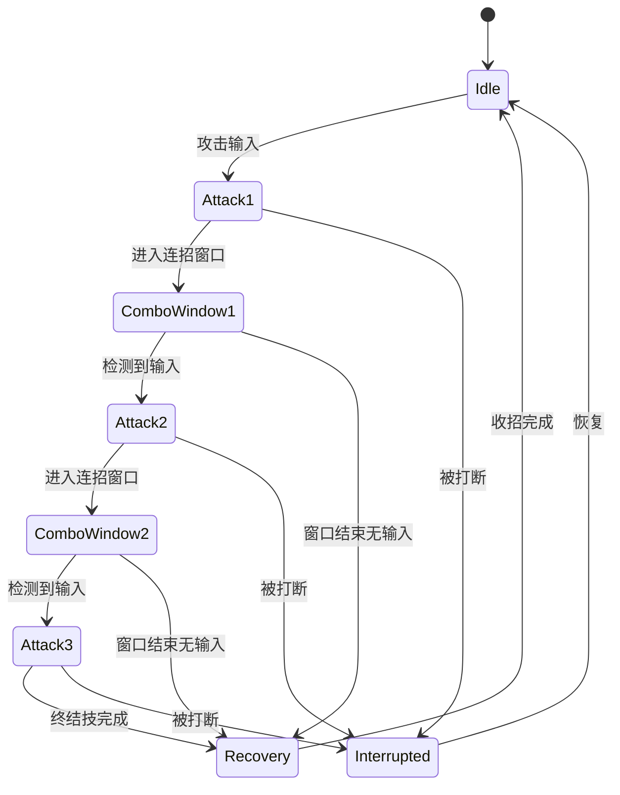

# DJ01 动画系统 - 连招系统

> 返回 [动画系统总览](./AnimationSystem_Overview.md)

---

## 目录

1. [连招架构](#1-连招架构)
2. [输入缓冲系统](#2-输入缓冲系统)
3. [连招窗口通知](#3-连招窗口通知)
4. [打断优先级系统](#4-打断优先级系统)
5. [GA_MeleeCombo 实现](#5-ga_meleecombo-实现)
6. [蒙太奇设计方案](#6-蒙太奇设计方案)

---

## 1. 连招架构

### 1.1 整体流程图

```
┌─────────────────────────────────────────────────────────────────────────┐
│                          Combo System Architecture                       │
├─────────────────────────────────────────────────────────────────────────┤
│                                                                          │
│   ┌──────────────┐     ┌──────────────┐     ┌──────────────┐            │
│   │   Input      │────▶│ Input Buffer │────▶│   Ability    │            │
│   │   Action     │     │   (缓冲输入)  │     │   (技能)     │            │
│   └──────────────┘     └──────────────┘     └──────────────┘            │
│                                                    │                     │
│                              ┌─────────────────────┘                     │
│                              ▼                                           │
│   ┌───────────────────────────────────────────────────────────────┐     │
│   │                    Montage 播放                                │     │
│   │  ┌─────────┬──────────┬──────────┬──────────┬─────────┐      │     │
│   │  │ Attack1 │ComboWin1 │ Attack2  │ComboWin2 │ Attack3 │      │     │
│   │  │ Section │  (ANS)   │ Section  │  (ANS)   │ Section │      │     │
│   │  └────┬────┴────┬─────┴────┬─────┴────┬─────┴────┬────┘      │     │
│   │       │         │          │          │          │            │     │
│   │       ▼         ▼          ▼          ▼          ▼            │     │
│   │  [播放攻击1] [窗口开启] [跳转攻击2] [窗口开启] [跳转攻击3]     │     │
│   │                 │                     │                       │     │
│   │          检测缓冲输入            检测缓冲输入                 │     │
│   │          有→跳转下一段           有→跳转下一段                │     │
│   │          无→自然结束             无→自然结束                  │     │
│   └───────────────────────────────────────────────────────────────┘     │
│                                                                          │
└─────────────────────────────────────────────────────────────────────────┘
```

### 1.2 状态流转图



---

## 2. 输入缓冲系统

**文件**: `Source/DJ01/Input/DJ01InputBuffer.h/cpp`

### 2.1 缓冲条目结构

```cpp
USTRUCT(BlueprintType)
struct FBufferedInput
{
    GENERATED_BODY()
    
    /** 输入对应的技能Tag */
    UPROPERTY()
    FGameplayTag AbilityTag;
    
    /** 输入时间戳 */
    UPROPERTY()
    float InputTime = 0.f;
    
    /** 缓冲有效期 (秒) */
    UPROPERTY()
    float BufferDuration = 0.2f;
    
    bool IsValid(float CurrentTime) const
    {
        return (CurrentTime - InputTime) < BufferDuration;
    }
};
```

### 2.2 输入缓冲管理器

```cpp
UCLASS(BlueprintType)
class DJ01_API UDJ01InputBuffer : public UActorComponent
{
    GENERATED_BODY()

public:
    /** 添加缓冲输入 */
    UFUNCTION(BlueprintCallable, Category = "Input Buffer")
    void BufferInput(FGameplayTag AbilityTag, float BufferDuration = 0.2f);
    
    /** 消费缓冲输入 (返回最高优先级的有效输入) */
    UFUNCTION(BlueprintCallable, Category = "Input Buffer")
    bool ConsumeBufferedInput(FGameplayTag& OutAbilityTag);
    
    /** 检查是否有特定类型的缓冲输入 */
    UFUNCTION(BlueprintCallable, Category = "Input Buffer")
    bool HasBufferedInput(FGameplayTag AbilityTag) const;
    
    /** 清空所有缓冲 */
    UFUNCTION(BlueprintCallable, Category = "Input Buffer")
    void ClearBuffer();
    
    /** 缓冲有效期 (可在角色上配置) */
    UPROPERTY(EditDefaultsOnly, Category = "Input Buffer")
    float DefaultBufferDuration = 0.2f;

private:
    UPROPERTY()
    TArray<FBufferedInput> BufferedInputs;
    
    /** 根据Tag获取优先级 (数值越小优先级越高) */
    int32 GetPriority(FGameplayTag AbilityTag) const;
    
    /** 清理过期的缓冲输入 */
    void CleanupExpiredInputs();
};
```

### 2.3 实现

```cpp
void UDJ01InputBuffer::BufferInput(FGameplayTag AbilityTag, float BufferDuration)
{
    CleanupExpiredInputs();
    
    FBufferedInput NewInput;
    NewInput.AbilityTag = AbilityTag;
    NewInput.InputTime = GetWorld()->GetTimeSeconds();
    NewInput.BufferDuration = BufferDuration > 0.f ? BufferDuration : DefaultBufferDuration;
    
    BufferedInputs.Add(NewInput);
}

bool UDJ01InputBuffer::ConsumeBufferedInput(FGameplayTag& OutAbilityTag)
{
    CleanupExpiredInputs();
    
    if (BufferedInputs.Num() == 0)
    {
        return false;
    }
    
    // 按优先级排序，取最高优先级
    BufferedInputs.Sort([this](const FBufferedInput& A, const FBufferedInput& B)
    {
        return GetPriority(A.AbilityTag) < GetPriority(B.AbilityTag);
    });
    
    OutAbilityTag = BufferedInputs[0].AbilityTag;
    BufferedInputs.RemoveAt(0);
    return true;
}

int32 UDJ01InputBuffer::GetPriority(FGameplayTag AbilityTag) const
{
    // 重攻击优先级高于轻攻击
    if (AbilityTag.MatchesTag(DJ01GameplayTags::Ability_Attack_Heavy))
    {
        return 10;
    }
    if (AbilityTag.MatchesTag(DJ01GameplayTags::Ability_Attack_Light))
    {
        return 20;
    }
    return 100;
}
```

---

## 3. 连招窗口通知

**文件**: `Source/DJ01/Animation/Notifies/ANS_ComboWindow.h/cpp`

### 3.1 类定义

```cpp
UCLASS(BlueprintType, meta = (DisplayName = "Combo Window"))
class DJ01_API UANS_ComboWindow : public UAnimNotifyState
{
    GENERATED_BODY()

public:
    UANS_ComboWindow();
    
    virtual void NotifyBegin(USkeletalMeshComponent* MeshComp, 
                             UAnimSequenceBase* Animation, 
                             float TotalDuration,
                             const FAnimNotifyEventReference& EventReference) override;
    
    virtual void NotifyTick(USkeletalMeshComponent* MeshComp, 
                            UAnimSequenceBase* Animation, 
                            float FrameDeltaTime,
                            const FAnimNotifyEventReference& EventReference) override;
    
    virtual void NotifyEnd(USkeletalMeshComponent* MeshComp, 
                           UAnimSequenceBase* Animation,
                           const FAnimNotifyEventReference& EventReference) override;

    //========================================
    // 配置
    //========================================
    
    /** 
     * 跳转到的Section名 (用于单蒙太奇多Section方案)
     * 留空则仅发送事件，由技能处理
     */
    UPROPERTY(EditAnywhere, BlueprintReadWrite, Category = "Combo")
    FName NextSectionName;
    
    /** 允许的输入Tag (空=接受所有攻击输入) */
    UPROPERTY(EditAnywhere, BlueprintReadWrite, Category = "Combo")
    FGameplayTagContainer AllowedInputTags;
    
    /** 窗口开启时发送的事件Tag */
    UPROPERTY(EditAnywhere, BlueprintReadWrite, Category = "Combo")
    FGameplayTag WindowOpenEventTag = DJ01GameplayTags::Event_Animation_ComboWindow;
    
    /** 窗口关闭时发送的事件Tag */
    UPROPERTY(EditAnywhere, BlueprintReadWrite, Category = "Combo")
    FGameplayTag WindowCloseEventTag = DJ01GameplayTags::Event_Animation_ComboWindowEnd;
    
    /** 是否自动检查输入缓冲并跳转 */
    UPROPERTY(EditAnywhere, BlueprintReadWrite, Category = "Combo")
    bool bAutoCheckBuffer = true;

private:
    bool bWindowActive = false;
    
    void SendGameplayEvent(USkeletalMeshComponent* MeshComp, FGameplayTag EventTag);
    void CheckAndConsumeBuffer(USkeletalMeshComponent* MeshComp, UAnimMontage* Montage);
};
```

### 3.2 实现

```cpp
void UANS_ComboWindow::NotifyBegin(USkeletalMeshComponent* MeshComp, ...)
{
    bWindowActive = true;
    
    // 发送窗口开启事件
    SendGameplayEvent(MeshComp, WindowOpenEventTag);
    
    // 立即检查是否有缓冲输入
    if (bAutoCheckBuffer)
    {
        UAnimMontage* Montage = Cast<UAnimMontage>(Animation);
        if (Montage)
        {
            CheckAndConsumeBuffer(MeshComp, Montage);
        }
    }
}

void UANS_ComboWindow::NotifyTick(USkeletalMeshComponent* MeshComp, ...)
{
    // 持续检查输入缓冲
    if (bWindowActive && bAutoCheckBuffer)
    {
        UAnimMontage* Montage = Cast<UAnimMontage>(Animation);
        if (Montage)
        {
            CheckAndConsumeBuffer(MeshComp, Montage);
        }
    }
}

void UANS_ComboWindow::NotifyEnd(USkeletalMeshComponent* MeshComp, ...)
{
    bWindowActive = false;
    
    // 发送窗口关闭事件
    SendGameplayEvent(MeshComp, WindowCloseEventTag);
}

void UANS_ComboWindow::CheckAndConsumeBuffer(USkeletalMeshComponent* MeshComp, UAnimMontage* Montage)
{
    AActor* Owner = MeshComp->GetOwner();
    if (!Owner) return;
    
    UDJ01InputBuffer* InputBuffer = Owner->FindComponentByClass<UDJ01InputBuffer>();
    if (!InputBuffer) return;
    
    FGameplayTag BufferedTag;
    if (InputBuffer->ConsumeBufferedInput(BufferedTag))
    {
        // 检查是否是允许的输入
        if (AllowedInputTags.IsEmpty() || AllowedInputTags.HasTag(BufferedTag))
        {
            // 跳转到下一个Section
            if (!NextSectionName.IsNone())
            {
                UAnimInstance* AnimInstance = MeshComp->GetAnimInstance();
                if (AnimInstance)
                {
                    AnimInstance->Montage_JumpToSection(NextSectionName, Montage);
                    bWindowActive = false; // 防止重复跳转
                }
            }
        }
    }
}
```

---

## 4. 打断优先级系统

**文件**: `Source/DJ01/AbilitySystem/DJ01AbilityPriority.h`

### 4.1 优先级定义

```cpp
#pragma once

#include "CoreMinimal.h"
#include "GameplayTagContainer.h"

namespace DJ01AbilityPriority
{
    //========================================
    // 优先级常量 (数值越小优先级越高)
    //========================================
    
    constexpr int32 Death = 0;           // 死亡
    constexpr int32 Stagger = 10;        // 硬直/眩晕
    constexpr int32 Dodge = 20;          // 闪避
    constexpr int32 Block = 25;          // 格挡
    constexpr int32 HeavyAttack = 30;    // 重攻击
    constexpr int32 Skill = 35;          // 主动技能
    constexpr int32 LightAttack = 40;    // 轻攻击
    constexpr int32 Locomotion = 100;    // 移动
    constexpr int32 Idle = 200;          // 待机
    
    //========================================
    // 辅助函数
    //========================================
    
    /** 根据技能Tag获取优先级 */
    int32 GetPriorityForTag(const FGameplayTag& AbilityTag);
    
    /**
     * 检查能否打断
     * @param CurrentPriority  当前动作优先级
     * @param NewPriority      新动作优先级
     * @param bInCancelWindow  是否在取消窗口内
     * @return true 如果新动作可以打断当前动作
     */
    bool CanInterrupt(int32 CurrentPriority, int32 NewPriority, bool bInCancelWindow = false);
}
```

### 4.2 实现

```cpp
int32 DJ01AbilityPriority::GetPriorityForTag(const FGameplayTag& AbilityTag)
{
    // 死亡/硬直
    if (AbilityTag.MatchesTag(DJ01GameplayTags::Ability_Death))
        return Death;
    if (AbilityTag.MatchesTag(DJ01GameplayTags::State_Debuff_Stagger))
        return Stagger;
    
    // 防御动作
    if (AbilityTag.MatchesTag(DJ01GameplayTags::Ability_Dodge))
        return Dodge;
    if (AbilityTag.MatchesTag(DJ01GameplayTags::Ability_Block))
        return Block;
    
    // 攻击动作
    if (AbilityTag.MatchesTag(DJ01GameplayTags::Ability_Attack_Heavy))
        return HeavyAttack;
    if (AbilityTag.MatchesTag(DJ01GameplayTags::Ability_Attack_Light))
        return LightAttack;
    
    // 技能
    if (AbilityTag.MatchesTag(DJ01GameplayTags::Ability_Skill))
        return Skill;
    
    return Idle;
}

bool DJ01AbilityPriority::CanInterrupt(int32 CurrentPriority, int32 NewPriority, bool bInCancelWindow)
{
    // 规则1: 更高优先级总是可以打断
    if (NewPriority < CurrentPriority)
    {
        return true;
    }
    
    // 规则2: 同优先级在取消窗口内可以打断 (用于连招)
    if (NewPriority == CurrentPriority && bInCancelWindow)
    {
        return true;
    }
    
    // 规则3: 闪避可以打断大多数动作 (特殊处理)
    if (NewPriority == Dodge && CurrentPriority >= LightAttack)
    {
        return true;
    }
    
    return false;
}
```

### 4.3 优先级矩阵

| 当前动作 \ 新动作 | 死亡 | 硬直 | 闪避 | 格挡 | 重攻击 | 轻攻击 |
|-----------------|------|------|------|------|--------|--------|
| 轻攻击          | ✅   | ✅   | ✅   | ✅   | ✅     | 窗口内 |
| 重攻击          | ✅   | ✅   | ✅   | ❌   | ❌     | ❌     |
| 闪避            | ✅   | ✅   | ❌   | ❌   | ❌     | ❌     |
| 硬直            | ✅   | ❌   | ❌   | ❌   | ❌     | ❌     |

---

## 5. GA_MeleeCombo 实现

**文件**: `Source/DJ01/AbilitySystem/Abilities/GA_MeleeCombo.h/cpp`

### 5.1 类定义

```cpp
UCLASS()
class DJ01_API UGA_MeleeCombo : public UDJ01GameplayAbility
{
    GENERATED_BODY()

public:
    UGA_MeleeCombo();
    
    virtual void ActivateAbility(...) override;
    virtual void InputPressed(...) override;
    virtual void EndAbility(...) override;

protected:
    /** 当前连段索引 */
    UPROPERTY()
    int32 CurrentComboIndex = 0;
    
    /** 最大连段数 */
    UPROPERTY(EditDefaultsOnly, Category = "Combo")
    int32 MaxComboCount = 3;
    
    /** 连招窗口是否开启 */
    UPROPERTY()
    bool bComboWindowOpen = false;
    
    /** 是否有排队的下一段输入 */
    UPROPERTY()
    bool bNextAttackQueued = false;
    
    /** 当前的蒙太奇任务 */
    UPROPERTY()
    TObjectPtr<UDJ01AbilityTask_PlayMontageAndWait> CurrentMontageTask;
    
    void PlayCurrentComboMontage();
    
    UFUNCTION()
    void OnAnimEventReceived(FGameplayTag EventTag);
    
    UFUNCTION()
    void OnMontageCompleted();
    
    UFUNCTION()
    void OnMontageInterrupted();
    
    void TryAdvanceCombo();
    void ResetCombo();
    
    UDJ01InputBuffer* GetInputBuffer() const;
};
```

### 5.2 核心实现

```cpp
void UGA_MeleeCombo::ActivateAbility(...)
{
    Super::ActivateAbility(...);
    
    ResetCombo();
    PlayCurrentComboMontage();
}

void UGA_MeleeCombo::InputPressed(...)
{
    Super::InputPressed(...);
    
    if (bComboWindowOpen && CurrentComboIndex < MaxComboCount - 1)
    {
        // 窗口开启时直接标记下一段
        bNextAttackQueued = true;
        TryAdvanceCombo();
    }
    else
    {
        // 窗口未开启，缓冲输入
        if (UDJ01InputBuffer* Buffer = GetInputBuffer())
        {
            Buffer->BufferInput(DJ01GameplayTags::Ability_Attack_Light);
        }
    }
}

void UGA_MeleeCombo::OnAnimEventReceived(FGameplayTag EventTag)
{
    if (EventTag == DJ01GameplayTags::Event_Animation_ComboWindow)
    {
        bComboWindowOpen = true;
        
        // 检查缓冲输入
        if (UDJ01InputBuffer* Buffer = GetInputBuffer())
        {
            FGameplayTag BufferedTag;
            if (Buffer->ConsumeBufferedInput(BufferedTag))
            {
                bNextAttackQueued = true;
                TryAdvanceCombo();
            }
        }
    }
    else if (EventTag == DJ01GameplayTags::Event_Animation_ComboWindowEnd)
    {
        bComboWindowOpen = false;
        
        if (!bNextAttackQueued)
        {
            // 窗口关闭无输入，等待动画自然结束
        }
    }
    else if (EventTag == DJ01GameplayTags::Event_Animation_DamageFrame)
    {
        PerformDamageTrace();
    }
}

void UGA_MeleeCombo::TryAdvanceCombo()
{
    if (!bNextAttackQueued || !bComboWindowOpen)
    {
        return;
    }
    
    CurrentComboIndex++;
    bNextAttackQueued = false;
    bComboWindowOpen = false;
    
    if (CurrentComboIndex < MaxComboCount)
    {
        PlayCurrentComboMontage();
    }
}

void UGA_MeleeCombo::PlayCurrentComboMontage()
{
    UDJ01AnimDataAsset* AnimData = GetAnimDataAsset();
    if (!AnimData) return;
    
    UAnimMontage* Montage = AnimData->GetNextLightAttackMontage(CurrentComboIndex);
    if (!Montage) return;
    
    CurrentMontageTask = UDJ01AbilityTask_PlayMontageAndWait::CreatePlayMontageAndWaitProxy(
        this, NAME_None, Montage, 1.0f);
    
    CurrentMontageTask->OnCompleted.AddDynamic(this, &UGA_MeleeCombo::OnMontageCompleted);
    CurrentMontageTask->OnInterrupted.AddDynamic(this, &UGA_MeleeCombo::OnMontageInterrupted);
    CurrentMontageTask->OnGameplayEventReceived.AddDynamic(this, &UGA_MeleeCombo::OnAnimEventReceived);
    
    CurrentMontageTask->ReadyForActivation();
}
```

---

## 6. 蒙太奇设计方案

### 6.1 方案对比

| 方案 | 优点 | 缺点 | 适用场景 |
|-----|------|------|---------|
| **单蒙太奇多Section** | 过渡流畅、管理简单 | 灵活性低 | 固定连招序列 |
| **多独立蒙太奇** | 灵活组合、可复用 | 过渡需处理 | 分支连招 |

### 6.2 单蒙太奇方案 (推荐初期使用)

```
AM_LightAttackCombo
│
├── Section: "Attack1"
│   ├── [动画帧]
│   ├── AN_SendGameplayEvent (DamageFrame) @ 0.2s
│   └── ANS_ComboWindow (NextSection="Attack2") @ 0.3s-0.6s
│
├── Section: "Attack2"
│   ├── [动画帧]
│   ├── AN_SendGameplayEvent (DamageFrame) @ 0.15s
│   └── ANS_ComboWindow (NextSection="Attack3") @ 0.25s-0.5s
│
├── Section: "Attack3"
│   ├── [动画帧 - 终结技]
│   ├── AN_SendGameplayEvent (DamageFrame) @ 0.3s
│   └── 无ComboWindow
│
└── Section: "Recovery"
    └── [收招动画 - 可选]
```

### 6.3 多独立蒙太奇方案

```
DA_Anim_Sword.LightAttackCombo[]
├── [0] AM_LightAttack_Slash    # 横斩
├── [1] AM_LightAttack_Thrust   # 突刺
└── [2] AM_LightAttack_Spin     # 回旋斩

每个蒙太奇:
├── AN_SendGameplayEvent (DamageFrame)
└── ANS_ComboWindow (发送事件，不指定NextSection)
    └── 技能收到事件后决定播放哪个蒙太奇
```

---

## 更新日志

| 日期 | 变更内容 |
|-----|---------|
| 2024-12 | 从主文档拆分，补充完整连招实现 |