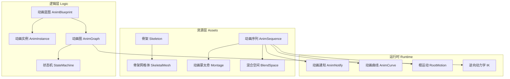
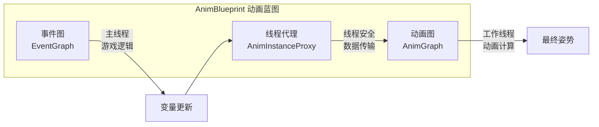
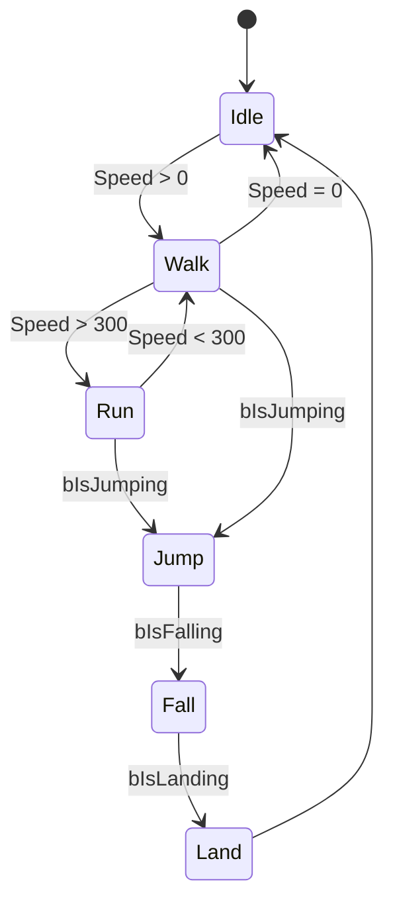
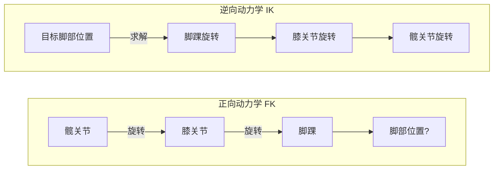
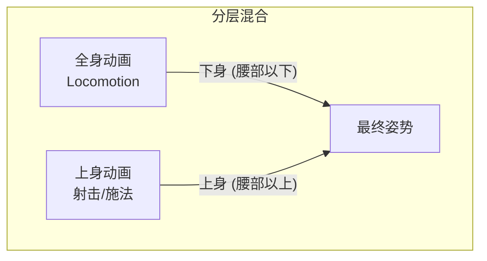
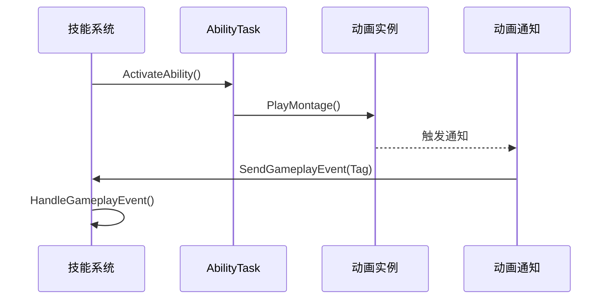
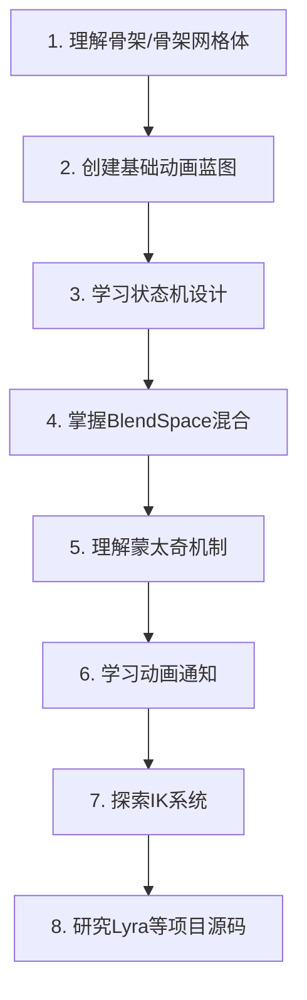

# UE动画系统 - 新手必备理论知识

> 📅 创建日期: 2024-12
> 📌 状态: 学习参考
> 🎯 目标: 为客户端开发工程师提供UE动画系统的基础理论框架

---

## 相关文档

| 文档 | 描述 |
|-----|------|
| [动画系统总览](./AnimationSystem_Overview.md) | 项目动画系统设计 |
| [核心组件设计](./AnimationSystem_CoreComponents.md) | C++类详细设计 |
| [GAS集成方案](./AnimationSystem_GAS_Integration.md) | 技能系统集成 |
| [连招系统](./AnimationSystem_ComboSystem.md) | 连招与打断机制 |

---

## 一、基础知识架构

### 1.1 动画系统核心概念图



---

### 1.2 核心资源类型

| 资源类型 | 描述 | 用途场景 |
|---------|------|---------|
| **骨架 (Skeleton)** | 骨骼位置和旋转的层级结构 | 所有动画的基础，可被多个骨架网格体共享 |
| **骨架网格体 (SkeletalMesh)** | 绑定到骨架的3D网格体 | 角色外观，与骨架分离存储 |
| **动画序列 (AnimSequence)** | 单个动画资源，包含关键帧数据 | 基础动画（走、跑、跳等） |
| **动画蒙太奇 (Montage)** | 可编程控制的动画组合 | 技能、攻击、特殊动作 |
| **混合空间 (BlendSpace)** | 基于多参数的动画混合 | 移动系统（速度+方向） |

---

### 1.3 动画蓝图架构

动画蓝图是动画系统的核心控制中心：



**关键组件：**
- **EventGraph (事件图)**：处理游戏逻辑，在主线程运行
- **AnimGraph (动画图)**：处理动画混合和姿势计算，可多线程运行
- **AnimInstance (动画实例)**：C++基类，暴露变量给蓝图使用

---

### 1.4 状态机 (State Machine)

状态机将动画拆分为逻辑状态，通过转换规则控制切换：



**状态机优势：**
- 图形化、直观的动画流程设计
- 清晰的状态转换逻辑
- 易于维护和扩展

---

## 二、特别的细节

### 2.1 动画通知 (Animation Notify)

动画通知是在动画特定时间点触发事件的机制：

| 通知类型 | 描述 | 常见用途 |
|---------|------|---------|
| **AnimNotify** | 单帧通知 | 脚步声、攻击判定点、特效触发 |
| **AnimNotifyState** | 持续时间通知 | 连击窗口、无敌帧、武器拖尾 |
| **骨架通知** | 自定义事件通知 | 与蓝图/C++逻辑交互 |

```cpp
// 自定义动画通知示例
UCLASS()
class UAN_SendGameplayEvent : public UAnimNotify
{
    GENERATED_BODY()
public:
    // 当通知触发时执行
    virtual void Notify(USkeletalMeshComponent* MeshComp, 
                       UAnimSequenceBase* Animation) override;
    
    UPROPERTY(EditAnywhere)
    FGameplayTag EventTag;
};
```

---

### 2.2 根运动 (Root Motion)

根运动允许动画直接控制角色位移，而非代码控制：

| 模式 | 说明 | 适用场景 |
|-----|------|---------|
| **No Root Motion** | 动画不控制移动 | 基础移动动画 |
| **Root Motion from Everything** | 所有动画控制移动 | 全部使用根运动 |
| **Root Motion from Montages Only** | 仅蒙太奇控制移动 | 推荐：技能/攻击动画 |

**注意事项：**
- 根运动需要动画资产中包含根骨骼的位移数据
- 确保Character Movement Component正确配置根运动模式

---

### 2.3 逆向动力学 (IK)

IK用于创建响应式动画，如脚踩不平地面：



**常用IK类型：**
- **双骨骼IK**：手臂、腿部
- **全身IK**：复杂的全身姿势调整
- **虚拟骨骼IK**：解决"游泳现象"问题

---

### 2.4 动画混合技术

#### 混合空间 (BlendSpace)

```
        前进(1)
          │
 左(-1) ──┼── 右(1)  ← 方向轴
          │
        后退(-1)
          
速度轴: 0 → 600
```

**1D BlendSpace**：单参数混合（如速度）
**2D BlendSpace**：双参数混合（如速度+方向）

#### 分层混合 (Layered Blend)



---

### 2.5 蒙太奇 (Montage) 关键概念

蒙太奇是技能系统与动画系统的桥梁：

| 概念 | 描述 |
|-----|------|
| **Section** | 蒙太奇中的可跳转区段 |
| **Slot** | 动画播放的插槽位置 |
| **Blend In/Out** | 进入/退出时的混合设置 |
| **Branch Point** | 分支点，用于跳转逻辑 |

```cpp
// C++中播放蒙太奇
UAnimInstance* AnimInstance = Character->GetMesh()->GetAnimInstance();
if (AnimInstance && AttackMontage)
{
    AnimInstance->Montage_Play(AttackMontage, 1.0f);
    // 绑定结束回调
    AnimInstance->Montage_SetEndDelegate(EndDelegate, AttackMontage);
}
```

---

### 2.6 与GAS技能系统集成



**关键集成点：**
- AbilityTask_PlayMontageAndWait：技能中播放蒙太奇的任务
- AnimNotify发送GameplayEvent给ASC
- GameplayTag驱动动画状态切换

---

### 2.7 性能优化要点

| 优化项 | 说明 |
|-------|------|
| **多线程动画更新** | 使用AnimInstanceProxy在工作线程计算 |
| **LOD系统** | 距离远的角色使用简化动画 |
| **更新频率控制** | 非主要角色降低更新频率 |
| **骨骼剔除** | 不可见骨骼不计算 |

---

## 三、学习路径建议



**推荐实践项目：**
1. 制作基础角色移动动画系统
2. 实现简单的攻击连招系统
3. 添加脚步声和特效的动画通知
4. 实现上下身分层动画混合

---

## 四、官方参考资料

- [动画系统概述](https://dev.epicgames.com/documentation/zh-cn/unreal-engine/animation-system-overview)
- [骨架网格体动画系统](https://dev.epicgames.com/documentation/zh-cn/unreal-engine/skeletal-mesh-animation-system)
- [Lyra中的动画](https://dev.epicgames.com/documentation/zh-cn/unreal-engine/animation-in-lyra-sample-game-in-unreal-engine)
- [动画通知（通知）](https://dev.epicgames.com/documentation/zh-cn/unreal-engine/animation-notifications-notifies)
- [IK设置](https://dev.epicgames.com/documentation/zh-cn/unreal-engine/ik-setups)
- [使用分层动画](https://dev.epicgames.com/documentation/zh-cn/unreal-engine/using-layered-animations)

---

## 更新日志

| 日期 | 版本 | 变更内容 |
|-----|------|---------|
| 2024-12 | v1.0 | 初始版本，整理动画系统基础理论知识 |