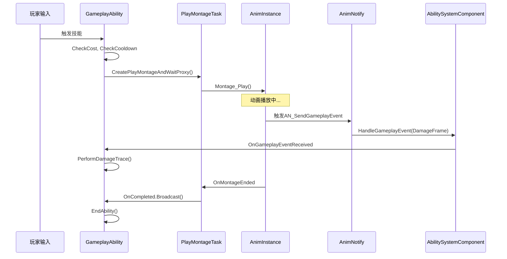

# DJ01 动画系统 - GAS集成方案

> 返回 [动画系统总览](./AnimationSystem_Overview.md)

---

## 目录

1. [GameplayTag定义](#1-gameplaytag定义)
2. [动画通知类](#2-动画通知类)
3. [技能调用动画流程](#3-技能调用动画流程)
4. [Tag驱动动画状态](#4-tag驱动动画状态)

---

## 1. GameplayTag定义

**文件**: `Source/DJ01/System/Private/DJ01GameplayTags.cpp` (扩展)

### 1.1 动画相关Tags

```cpp
namespace DJ01GameplayTags
{
    //========================================
    // 动画状态Tags
    //========================================
    
    UE_DEFINE_GAMEPLAY_TAG(State_Animation_FullBody, "State.Animation.FullBody");
    UE_DEFINE_GAMEPLAY_TAG(State_Animation_UpperBody, "State.Animation.UpperBody");
    
    //========================================
    // 战斗动画Tags
    //========================================
    
    UE_DEFINE_GAMEPLAY_TAG(Animation_Combat_LightAttack, "Animation.Combat.LightAttack");
    UE_DEFINE_GAMEPLAY_TAG(Animation_Combat_HeavyAttack, "Animation.Combat.HeavyAttack");
    UE_DEFINE_GAMEPLAY_TAG(Animation_Combat_Dodge, "Animation.Combat.Dodge");
    UE_DEFINE_GAMEPLAY_TAG(Animation_Combat_HitReact, "Animation.Combat.HitReact");
    
    //========================================
    // 技能动画Tags
    //========================================
    
    UE_DEFINE_GAMEPLAY_TAG(Animation_Ability_CastStart, "Animation.Ability.CastStart");
    UE_DEFINE_GAMEPLAY_TAG(Animation_Ability_CastLoop, "Animation.Ability.CastLoop");
    UE_DEFINE_GAMEPLAY_TAG(Animation_Ability_CastRelease, "Animation.Ability.CastRelease");
    
    //========================================
    // 动画事件Tags (由AnimNotify发送)
    //========================================
    
    UE_DEFINE_GAMEPLAY_TAG(Event_Animation_MontageEnd, "Event.Animation.MontageEnd");
    UE_DEFINE_GAMEPLAY_TAG(Event_Animation_ComboWindow, "Event.Animation.ComboWindow");
    UE_DEFINE_GAMEPLAY_TAG(Event_Animation_ComboWindowEnd, "Event.Animation.ComboWindowEnd");
    UE_DEFINE_GAMEPLAY_TAG(Event_Animation_DamageFrame, "Event.Animation.DamageFrame");
    UE_DEFINE_GAMEPLAY_TAG(Event_Animation_CastPoint, "Event.Animation.CastPoint");
}
```

### 1.2 Tag层次结构

```
GameplayTags
├── State.
│   ├── Animation.
│   │   ├── FullBody          # 正在播放全身动画
│   │   └── UpperBody         # 正在播放上身动画
│   ├── Combat.
│   │   ├── Attacking         # 正在攻击
│   │   └── Casting           # 正在施法
│   └── Debuff.
│       └── Stunned           # 被眩晕
│
├── Animation.
│   ├── Combat.
│   │   ├── LightAttack       # 轻攻击动画
│   │   ├── HeavyAttack       # 重攻击动画
│   │   ├── Dodge             # 闪避动画
│   │   └── HitReact          # 受击动画
│   └── Ability.
│       ├── CastStart         # 施法开始
│       ├── CastLoop          # 施法循环
│       └── CastRelease       # 施法释放
│
└── Event.
    └── Animation.
        ├── MontageEnd        # 蒙太奇结束
        ├── ComboWindow       # 连招窗口开启
        ├── ComboWindowEnd    # 连招窗口关闭
        ├── DamageFrame       # 伤害帧
        └── CastPoint         # 施法点
```

---

## 2. 动画通知类

### 2.1 AN_SendGameplayEvent

**文件**: `Source/DJ01/Animation/Notifies/AN_SendGameplayEvent.h/cpp`

向ASC发送GameplayEvent的动画通知。

```cpp
#pragma once

#include "CoreMinimal.h"
#include "Animation/AnimNotifies/AnimNotify.h"
#include "GameplayTagContainer.h"
#include "AN_SendGameplayEvent.generated.h"

UCLASS(BlueprintType, meta = (DisplayName = "Send Gameplay Event"))
class DJ01_API UAN_SendGameplayEvent : public UAnimNotify
{
    GENERATED_BODY()

public:
    UAN_SendGameplayEvent();
    
    virtual void Notify(USkeletalMeshComponent* MeshComp, 
                        UAnimSequenceBase* Animation,
                        const FAnimNotifyEventReference& EventReference) override;
    
    virtual FString GetNotifyName_Implementation() const override;

    /** 要发送的事件Tag */
    UPROPERTY(EditAnywhere, BlueprintReadWrite, Category = "GameplayEvent")
    FGameplayTag EventTag;
    
    /** 可选的事件数据 */
    UPROPERTY(EditAnywhere, BlueprintReadWrite, Category = "GameplayEvent")
    float EventMagnitude = 1.0f;
};
```

#### 实现

```cpp
void UAN_SendGameplayEvent::Notify(USkeletalMeshComponent* MeshComp, 
                                   UAnimSequenceBase* Animation,
                                   const FAnimNotifyEventReference& EventReference)
{
    Super::Notify(MeshComp, Animation, EventReference);
    
    if (!MeshComp) return;
    
    AActor* Owner = MeshComp->GetOwner();
    if (!Owner) return;
    
    // 获取ASC
    UAbilitySystemComponent* ASC = UAbilitySystemBlueprintLibrary::GetAbilitySystemComponent(Owner);
    if (!ASC) return;
    
    // 构建事件数据
    FGameplayEventData EventData;
    EventData.EventTag = EventTag;
    EventData.EventMagnitude = EventMagnitude;
    EventData.Instigator = Owner;
    EventData.Target = Owner;
    
    // 发送事件
    ASC->HandleGameplayEvent(EventTag, &EventData);
}
```

### 2.2 蒙太奇中的使用示例

```
AM_LightAttack_01 时间轴
│
├─[0.0s]─── 攻击起手
│
├─[0.2s]─── AN_SendGameplayEvent
│           └─ EventTag: Event.Animation.DamageFrame
│           └─ EventMagnitude: 1.0
│
├─[0.3s]─── ANS_ComboWindow (开始)
│           └─ NextSectionName: "Attack2" (如果使用Section方案)
│           └─ WindowOpenEventTag: Event.Animation.ComboWindow
│
├─[0.6s]─── ANS_ComboWindow (结束)
│
└─[0.8s]─── 动画结束
```

---

## 3. 技能调用动画流程

### 3.1 流程图



### 3.2 代码示例

```cpp
void UGA_RangedAttack::ActivateAbility(...)
{
    // 1. 获取动画数据
    UDJ01AnimDataAsset* AnimData = GetAnimDataAsset();
    UAnimMontage* AttackMontage = AnimData->GetMontageForTag(
        DJ01GameplayTags::Animation_Combat_LightAttack);
    
    if (!AttackMontage)
    {
        CancelAbility(...);
        return;
    }
    
    // 2. 创建蒙太奇任务
    UDJ01AbilityTask_PlayMontageAndWait* MontageTask = 
        UDJ01AbilityTask_PlayMontageAndWait::CreatePlayMontageAndWaitProxy(
            this,
            TEXT("AttackMontage"),
            AttackMontage,
            1.0f,              // PlayRate
            NAME_None,         // StartSection
            true               // bStopWhenAbilityEnds
        );
    
    // 3. 绑定回调
    MontageTask->OnCompleted.AddDynamic(this, &UGA_RangedAttack::OnMontageCompleted);
    MontageTask->OnInterrupted.AddDynamic(this, &UGA_RangedAttack::OnMontageInterrupted);
    MontageTask->OnGameplayEventReceived.AddDynamic(this, &UGA_RangedAttack::OnAnimEvent);
    
    // 4. 激活任务
    MontageTask->ReadyForActivation();
    
    // 5. 添加状态Tag
    GetAbilitySystemComponentFromActorInfo()->AddLooseGameplayTag(
        DJ01GameplayTags::State_Combat_Attacking);
}

void UGA_RangedAttack::OnAnimEvent(FGameplayTag EventTag)
{
    if (EventTag == DJ01GameplayTags::Event_Animation_CastPoint)
    {
        // 在施法点生成投射物
        SpawnProjectile();
    }
}

void UGA_RangedAttack::OnMontageCompleted()
{
    // 移除状态Tag
    GetAbilitySystemComponentFromActorInfo()->RemoveLooseGameplayTag(
        DJ01GameplayTags::State_Combat_Attacking);
    
    EndAbility(...);
}
```

---

## 4. Tag驱动动画状态

### 4.1 GameplayTagPropertyMap 配置

在 `DJ01AnimInstance` 中配置Tag到属性的映射：

```
GameplayTagPropertyMap 配置 (在动画蓝图Class Defaults中设置)
│
├── State.Combat          →  bIsInCombat (bool)
├── State.Combat.Attacking→  bIsAttacking (bool)  
├── State.Combat.Casting  →  bIsCasting (bool)
├── State.Debuff.Stunned  →  bIsStunned (bool)
└── State.Movement.Sprint →  bIsSprinting (bool)
```

### 4.2 动画蓝图中的使用

```
AnimGraph
│
├── Locomotion State Machine
│   │
│   ├── State: Idle
│   │   └── Transition to Run: bIsMoving == true
│   │
│   ├── State: Run
│   │   └── Transition to Sprint: bIsSprinting == true
│   │
│   └── State: Stunned
│       └── Entry: bIsStunned == true (最高优先级)
│
├── Layered Blend Per Bone
│   │
│   ├── Base: Locomotion Result
│   │
│   └── Blend: UpperBody Slot
│       └── 条件: bIsAttacking || bIsCasting
│       └── 混合骨骼: Spine_01 及以上
│
└── Output Pose
```

### 4.3 自动响应流程

```
技能激活
    │
    ▼
ASC->AddGameplayTag(State.Combat.Attacking)
    │
    ▼
GameplayTagPropertyMap 自动更新
    │
    ▼
bIsAttacking = true
    │
    ▼
动画蓝图状态机/Blend检测到变化
    │
    ▼
切换到攻击姿态/启用上身层混合
```

---

## 更新日志

| 日期 | 变更内容 |
|-----|---------|
| 2024-12 | 从主文档拆分 |