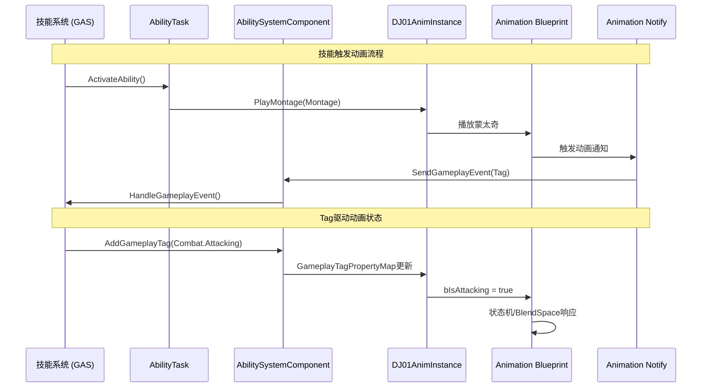

# DJ01 动画系统设计 - 总览

> 📅 创建日期: 2024-12
> 📌 状态: 规划阶段
> 🎯 目标: 构建与GAS深度集成的模块化动画系统

---

## 相关文档

| 文档 | 描述 |
|-----|------|
| [核心组件设计](./AnimationSystem_CoreComponents.md) | C++类详细设计 |
| [GAS集成方案](./AnimationSystem_GAS_Integration.md) | 技能系统集成 |
| [连招系统](./AnimationSystem_ComboSystem.md) | 连招与打断机制 |

---

## 1. 设计目标

### 1.1 核心目标

| 目标 | 描述 | 优先级 |
|-----|------|-------|
| **GAS深度集成** | 动画系统与技能系统无缝协作，支持蒙太奇播放、事件回调 | 🔴 高 |
| **模块化架构** | 采用链接动画层(Linked Anim Layers)实现可扩展的动画切换 | 🟡 中 |
| **性能优化** | 使用多线程动画更新，避免主线程阻塞 | 🟡 中 |
| **数据驱动** | 通过GameplayTag和数据资产配置动画行为 | 🔴 高 |

### 1.2 功能需求

```
角色动画需求
├── 移动动画 (Locomotion)
│   ├── Idle / Walk / Run / Sprint
│   ├── Jump / Fall / Land
│   └── 闪避 (Dodge Roll)
│
├── 战斗动画 (Combat)
│   ├── 轻攻击连段 (Light Attack Combo)
│   ├── 重攻击 (Heavy Attack)
│   ├── 受击反馈 (Hit React)
│   └── 死亡 (Death)
│
├── 技能动画 (Abilities)
│   ├── 施法准备 (Cast Start)
│   ├── 施法循环 (Cast Loop)
│   ├── 施法释放 (Cast Release)
│   └── 技能失败反馈 (Ability Failure)
│
└── 交互动画 (Interaction)
    ├── 拾取物品
    └── 与NPC交互
```

---

## 2. 架构概览

### 2.1 整体架构图

```
┌─────────────────────────────────────────────────────────────────────────────┐
│                              DJ01 Animation System                          │
├─────────────────────────────────────────────────────────────────────────────┤
│                                                                             │
│  ┌─────────────────────────────────────────────────────────────────────┐   │
│  │                     Animation Blueprint Layer                        │   │
│  │  ┌─────────────────────────────────────────────────────────────┐    │   │
│  │  │              ABP_DJ01Character_Base (主动画蓝图)              │    │   │
│  │  │  ┌──────────────┐  ┌──────────────┐  ┌──────────────┐       │    │   │
│  │  │  │ LocomotionSM │  │ UpperBody   │  │ FullBody    │       │    │   │
│  │  │  │   状态机      │  │ Slot (上身) │  │ Slot (全身) │       │    │   │
│  │  │  └──────────────┘  └──────────────┘  └──────────────┘       │    │   │
│  │  └─────────────────────────────────────────────────────────────┘    │   │
│  │                              ▲                                       │   │
│  │                              │ LinkAnimClassLayers                   │   │
│  │  ┌─────────────────────────────────────────────────────────────┐    │   │
│  │  │           Linked Animation Layers (链接动画层)                │    │   │
│  │  │  ┌──────────────┐  ┌──────────────┐  ┌──────────────┐       │    │   │
│  │  │  │ ABP_Unarmed  │  │ ABP_Sword   │  │ ABP_Magic   │       │    │   │
│  │  │  │   徒手动画    │  │   剑术动画   │  │   魔法动画   │       │    │   │
│  │  │  └──────────────┘  └──────────────┘  └──────────────┘       │    │   │
│  │  └─────────────────────────────────────────────────────────────┘    │   │
│  └─────────────────────────────────────────────────────────────────────┘   │
│                                                                             │
│  ┌─────────────────────────────────────────────────────────────────────┐   │
│  │                        C++ Runtime Layer                             │   │
│  │  ┌──────────────────┐  ┌──────────────────┐  ┌──────────────────┐   │   │
│  │  │ UDJ01AnimInstance│  │ALI_DJ01AnimLayers│  │ UDJ01AnimDataAsset│   │   │
│  │  │   动画实例基类    │  │  动画层接口       │  │   动画数据资产    │   │   │
│  │  └──────────────────┘  └──────────────────┘  └──────────────────┘   │   │
│  └─────────────────────────────────────────────────────────────────────┘   │
│                                                                             │
│  ┌─────────────────────────────────────────────────────────────────────┐   │
│  │                      GAS Integration Layer                           │   │
│  │  ┌──────────────────┐  ┌──────────────────┐  ┌──────────────────┐   │   │
│  │  │AT_PlayMontageWait│  │ AN_GameplayEvent │  │ GE_AnimationBased│   │   │
│  │  │  播放蒙太奇任务   │  │  动画通知        │  │  动画驱动的GE    │   │   │
│  │  └──────────────────┘  └──────────────────┘  └──────────────────┘   │   │
│  └─────────────────────────────────────────────────────────────────────┘   │
│                                                                             │
└─────────────────────────────────────────────────────────────────────────────┘
```

### 2.2 数据流向



---

## 3. 文件结构规划

```
Source/DJ01/
├── Animation/
│   ├── DJ01AnimInstance.h              # 动画实例基类 (现有，扩展)
│   ├── DJ01AnimInstance.cpp
│   ├── ALI_DJ01AnimLayers.h            # 动画层接口 (新建)
│   ├── DJ01AnimDataAsset.h             # 动画数据资产 (新建)
│   ├── DJ01AnimDataAsset.cpp
│   ├── DJ01InputBuffer.h               # 输入缓冲 (新建)
│   ├── DJ01InputBuffer.cpp
│   ├── Notifies/
│   │   ├── AN_SendGameplayEvent.h      # 发送GAS事件通知 (新建)
│   │   ├── AN_SendGameplayEvent.cpp
│   │   ├── ANS_ComboWindow.h           # 连段窗口通知状态 (新建)
│   │   └── ANS_ComboWindow.cpp
│   └── Animation_README.md
│
├── AbilitySystem/
│   ├── Tasks/
│   │   ├── DJ01AbilityTask_PlayMontageAndWait.h  # (新建)
│   │   └── DJ01AbilityTask_PlayMontageAndWait.cpp
│   ├── DJ01AbilityPriority.h           # 打断优先级 (新建)
│   └── ... (现有文件)
│
└── System/
    └── DJ01GameplayTags.cpp            # 添加动画Tags (扩展)

Content/Characters/Heroes/DJ01Hero/
├── Animations/
│   ├── ABP_DJ01Character_Base          # 主动画蓝图
│   ├── LinkedLayers/
│   │   ├── ABP_ItemAnimLayersBase
│   │   ├── ABP_UnarmedAnimLayers
│   │   └── ABP_SwordAnimLayers
│   ├── Locomotion/
│   │   └── BS_Locomotion
│   ├── Combat/
│   │   ├── AM_LightAttack_01
│   │   └── ...
│   └── DataAssets/
│       ├── DA_Anim_Unarmed
│       └── DA_Anim_Sword
```

---

## 4. 实施路线图

### Phase 1: 基础框架 (预计1-2天)

| 任务 | 文件 | 状态 |
|-----|------|------|
| 扩展 UDJ01AnimInstance | `Animation/DJ01AnimInstance.h/cpp` | ⬜ |
| 添加移动/战斗状态属性 | 同上 | ⬜ |
| 实现线程安全更新 | 同上 | ⬜ |
| 创建主动画蓝图 | `ABP_DJ01Character_Base` | ⬜ |
| 实现 LocomotionSM 状态机 | 同上 | ⬜ |

**✅ 里程碑**: 角色能正常播放Idle/Walk/Run/Jump动画

### Phase 2: GAS集成 (预计2-3天)

| 任务 | 文件 | 状态 |
|-----|------|------|
| 创建 PlayMontageAndWait 任务 | `AbilitySystem/Tasks/...` | ⬜ |
| 创建 AN_SendGameplayEvent 通知 | `Animation/Notifies/...` | ⬜ |
| 添加动画相关 GameplayTags | `System/DJ01GameplayTags.cpp` | ⬜ |
| 创建 DJ01AnimDataAsset | `Animation/DJ01AnimDataAsset.h/cpp` | ⬜ |
| 测试技能播放动画 | GA_TestAttack | ⬜ |

**✅ 里程碑**: 技能能触发动画，动画能回调技能

### Phase 3: 连招系统 (预计2天)

| 任务 | 文件 | 状态 |
|-----|------|------|
| 创建输入缓冲系统 | `Animation/DJ01InputBuffer.h/cpp` | ⬜ |
| 创建连招窗口通知 | `Animation/Notifies/ANS_ComboWindow.h/cpp` | ⬜ |
| 实现打断优先级 | `AbilitySystem/DJ01AbilityPriority.h` | ⬜ |
| 创建 GA_MeleeCombo 技能 | `Abilities/GA_MeleeCombo.h/cpp` | ⬜ |
| 制作测试连招蒙太奇 | Content资产 | ⬜ |

**✅ 里程碑**: 可执行3段轻攻击连招，可被闪避打断

### Phase 4: 链接动画层 (预计2天，可延后)

| 任务 | 文件 | 状态 |
|-----|------|------|
| 创建动画层接口 | `Animation/ALI_DJ01AnimLayers.h` | ⬜ |
| 主ABP实现接口 | `ABP_DJ01Character_Base` | ⬜ |
| 创建武器链接层蓝图 | `ABP_SwordAnimLayers` | ⬜ |
| 实现上下身分层混合 | 主ABP | ⬜ |

**✅ 里程碑**: 可根据武器动态切换动画集

---

## 5. 参考资料

### 官方文档
- [Lyra中的动画](https://dev.epicgames.com/documentation/zh-cn/unreal-engine/animation-in-lyra-sample-game-in-unreal-engine)
- [Lyra中的技能](https://dev.epicgames.com/documentation/zh-cn/unreal-engine/abilities-in-lyra-in-unreal-engine)
- [动画蓝图链接](https://dev.epicgames.com/documentation/zh-cn/unreal-engine/animation-blueprint-linking-in-unreal-engine)

### 项目内部文档
- [AbilitySystem架构](../../Source/DJ01/AbilitySystem/AbilitySystem_Architecture.md)
- [战斗系统设计](../CombatSystem.md)
- [开发路线图](../ROADMAP.md)

---

## 更新日志

| 日期 | 版本 | 变更内容 |
|-----|------|---------|
| 2024-12 | v0.1 | 初始规划，拆分为4个独立文档 |