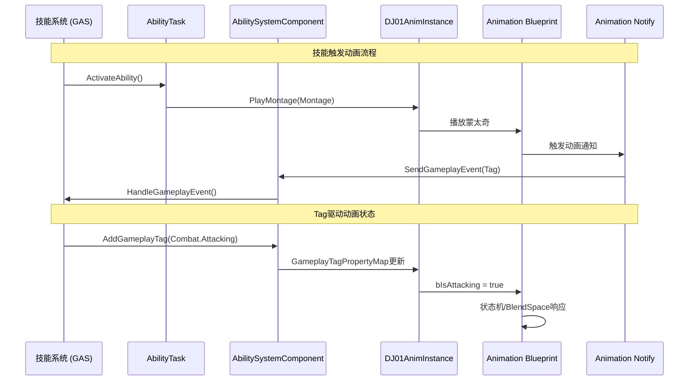

# DJ01 动画系统设计 - 文档索引

> 📅 更新日期: 2024-12
> 📌 状态: 规划阶段

---

## 📚 文档结构

动画系统设计已拆分为以下模块化文档：

| 文档 | 描述 | 链接 |
|-----|------|------|
| **总览** | 设计目标、架构图、路线图、文件结构 | [AnimationSystem_Overview.md](./Animation/AnimationSystem_Overview.md) |
| **核心组件** | C++类详细设计 (AnimInstance, AnimLayers, DataAsset, Task) | [AnimationSystem_CoreComponents.md](./Animation/AnimationSystem_CoreComponents.md) |
| **GAS集成** | GameplayTag定义、动画通知、技能调用流程 | [AnimationSystem_GAS_Integration.md](./Animation/AnimationSystem_GAS_Integration.md) |
| **连招系统** | 输入缓冲、连招窗口、打断优先级、GA_MeleeCombo | [AnimationSystem_ComboSystem.md](./Animation/AnimationSystem_ComboSystem.md) |

---

## 🚀 快速开始

1. 先阅读 [总览](./Animation/AnimationSystem_Overview.md) 了解整体架构
2. 按 Phase 顺序实施，参考对应文档

## 📋 实施状态

| Phase | 内容 | 状态 | 预计时间 |
|-------|------|------|---------|
| 1 | 基础框架 | ⬜ 待开始 | 1-2天 |
| 2 | GAS集成 | ⬜ 待开始 | 2-3天 |
| 3 | 连招系统 | ⬜ 待开始 | 2天 |
| 4 | 链接动画层 | ⬜ 可延后 | 2天 |

---

## 1. 设计目标

### 1.1 核心目标

| 目标 | 描述 | 优先级 |
|-----|------|-------|
| **GAS深度集成** | 动画系统与技能系统无缝协作，支持蒙太奇播放、事件回调 | 🔴 高 |
| **模块化架构** | 采用链接动画层(Linked Anim Layers)实现可扩展的动画切换 | 🟡 中 |
| **性能优化** | 使用多线程动画更新，避免主线程阻塞 | 🟡 中 |
| **数据驱动** | 通过GameplayTag和数据资产配置动画行为 | 🔴 高 |

### 1.2 功能需求

基于 `CombatSystem.md` 和 `ROADMAP.md` 的战斗系统需求：

```
角色动画需求
├── 移动动画 (Locomotion)
│   ├── Idle / Walk / Run / Sprint
│   ├── Jump / Fall / Land
│   └── 闪避 (Dodge Roll)
│
├── 战斗动画 (Combat)
│   ├── 轻攻击连段 (Light Attack Combo)
│   ├── 重攻击 (Heavy Attack)
│   ├── 受击反馈 (Hit React)
│   └── 死亡 (Death)
│
├── 技能动画 (Abilities)
│   ├── 施法准备 (Cast Start)
│   ├── 施法循环 (Cast Loop)
│   ├── 施法释放 (Cast Release)
│   └── 技能失败反馈 (Ability Failure)
│
└── 交互动画 (Interaction)
    ├── 拾取物品
    └── 与NPC交互
```

---

## 2. 架构概览

### 2.1 整体架构图

```
┌─────────────────────────────────────────────────────────────────────────────┐
│                              DJ01 Animation System                          │
├─────────────────────────────────────────────────────────────────────────────┤
│                                                                             │
│  ┌─────────────────────────────────────────────────────────────────────┐   │
│  │                     Animation Blueprint Layer                        │   │
│  │  ┌─────────────────────────────────────────────────────────────┐    │   │
│  │  │              ABP_DJ01Character_Base (主动画蓝图)              │    │   │
│  │  │  ┌──────────────┐  ┌──────────────┐  ┌──────────────┐       │    │   │
│  │  │  │ LocomotionSM │  │ UpperBody   │  │ FullBody    │       │    │   │
│  │  │  │   状态机      │  │ Slot (上身) │  │ Slot (全身) │       │    │   │
│  │  │  └──────────────┘  └──────────────┘  └──────────────┘       │    │   │
│  │  └─────────────────────────────────────────────────────────────┘    │   │
│  │                              ▲                                       │   │
│  │                              │ LinkAnimClassLayers                   │   │
│  │  ┌─────────────────────────────────────────────────────────────┐    │   │
│  │  │           Linked Animation Layers (链接动画层)                │    │   │
│  │  │  ┌──────────────┐  ┌──────────────┐  ┌──────────────┐       │    │   │
│  │  │  │ ABP_Unarmed  │  │ ABP_Sword   │  │ ABP_Magic   │       │    │   │
│  │  │  │   徒手动画    │  │   剑术动画   │  │   魔法动画   │       │    │   │
│  │  │  └──────────────┘  └──────────────┘  └──────────────┘       │    │   │
│  │  └─────────────────────────────────────────────────────────────┘    │   │
│  └─────────────────────────────────────────────────────────────────────┘   │
│                                                                             │
│  ┌─────────────────────────────────────────────────────────────────────┐   │
│  │                        C++ Runtime Layer                             │   │
│  │  ┌──────────────────┐  ┌──────────────────┐  ┌──────────────────┐   │   │
│  │  │ UDJ01AnimInstance│  │ALI_DJ01AnimLayers│  │ UDJ01AnimDataAsset│   │   │
│  │  │   动画实例基类    │  │  动画层接口       │  │   动画数据资产    │   │   │
│  │  │                  │  │                  │  │                  │   │   │
│  │  │ - TagPropertyMap │  │ - FullBodyLayer │  │ - DefaultMontages│   │   │
│  │  │ - MovementData   │  │ - UpperBodyLayer│  │ - MovementAnims  │   │   │
│  │  │ - CombatState    │  │ - LocomotionOvr │  │ - CombatAnims    │   │   │
│  │  └──────────────────┘  └──────────────────┘  └──────────────────┘   │   │
│  └─────────────────────────────────────────────────────────────────────┘   │
│                                                                             │
│  ┌─────────────────────────────────────────────────────────────────────┐   │
│  │                      GAS Integration Layer                           │   │
│  │  ┌──────────────────┐  ┌──────────────────┐  ┌──────────────────┐   │   │
│  │  │AT_PlayMontageWait│  │ AN_GameplayEvent │  │ GE_AnimationBased│   │   │
│  │  │  播放蒙太奇任务   │  │  动画通知        │  │  动画驱动的GE    │   │   │
│  │  └──────────────────┘  └──────────────────┘  └──────────────────┘   │   │
│  └─────────────────────────────────────────────────────────────────────┘   │
│                                                                             │
└─────────────────────────────────────────────────────────────────────────────┘
```

### 2.2 数据流向



---

## 3. 核心组件设计

### 3.1 UDJ01AnimInstance (扩展现有)

**文件**: `Source/DJ01/Animation/DJ01AnimInstance.h/cpp`

现有基础需要扩展的功能：

```cpp
UCLASS()
class DJ01_API UDJ01AnimInstance : public UAnimInstance
{
    GENERATED_BODY()

public:
    //========================================
    // 初始化与更新
    //========================================
    
    virtual void NativeInitializeAnimation() override;
    virtual void NativeThreadSafeUpdateAnimation(float DeltaSeconds) override;
    
    //========================================
    // 移动数据 (线程安全访问)
    //========================================
    
    UPROPERTY(BlueprintReadOnly, Category = "Locomotion")
    float GroundSpeed;
    
    UPROPERTY(BlueprintReadOnly, Category = "Locomotion")
    float MovementDirection;  // -180 to 180
    
    UPROPERTY(BlueprintReadOnly, Category = "Locomotion")
    bool bIsMoving;
    
    UPROPERTY(BlueprintReadOnly, Category = "Locomotion")
    bool bIsFalling;
    
    UPROPERTY(BlueprintReadOnly, Category = "Locomotion")
    bool bIsJumping;
    
    //========================================
    // 战斗状态 (由GameplayTag驱动)
    //========================================
    
    // 已有: FGameplayTagBlueprintPropertyMap GameplayTagPropertyMap;
    // 配置Tag到以下属性的映射:
    
    UPROPERTY(BlueprintReadOnly, Category = "Combat")
    bool bIsInCombat;         // State.Combat
    
    UPROPERTY(BlueprintReadOnly, Category = "Combat")
    bool bIsAttacking;        // State.Combat.Attacking
    
    UPROPERTY(BlueprintReadOnly, Category = "Combat")
    bool bIsCasting;          // State.Combat.Casting
    
    UPROPERTY(BlueprintReadOnly, Category = "Combat")
    bool bIsStunned;          // State.Debuff.Stunned
    
    //========================================
    // 链接动画层管理
    //========================================
    
    UFUNCTION(BlueprintCallable, Category = "Animation|Layers")
    void LinkAnimLayer(TSubclassOf<UAnimInstance> InAnimLayerClass);
    
    UFUNCTION(BlueprintCallable, Category = "Animation|Layers")
    void UnlinkAnimLayer(TSubclassOf<UAnimInstance> InAnimLayerClass);

protected:
    // 属性访问 (Property Access) - 用于线程安全更新
    UPROPERTY(Transient)
    TObjectPtr<ACharacter> OwningCharacter;
    
    UPROPERTY(Transient)
    TObjectPtr<UCharacterMovementComponent> MovementComponent;
};
```

### 3.2 UALI_DJ01AnimLayers (新建 - 动画层接口)

**文件**: `Source/DJ01/Animation/ALI_DJ01AnimLayers.h`

```cpp
#pragma once

#include "CoreMinimal.h"
#include "Animation/AnimInstance.h"
#include "ALI_DJ01AnimLayers.generated.h"

/**
 * 动画层接口 - 定义可被链接层覆盖的动画层
 * 
 * 使用方式:
 * 1. 主动画蓝图实现此接口
 * 2. 链接层蓝图也实现此接口并覆盖对应函数
 * 3. 运行时通过LinkAnimClassLayers动态切换
 */
UINTERFACE(MinimalAPI, Blueprintable, BlueprintType)
class UALI_DJ01AnimLayers : public UInterface
{
    GENERATED_BODY()
};

class DJ01_API IALI_DJ01AnimLayers
{
    GENERATED_BODY()

public:
    //========================================
    // 全身动画层 (用于技能、特殊动作)
    //========================================
    
    /** 全身动画覆盖层 - 用于需要完全控制角色的动画 */
    UFUNCTION(BlueprintImplementableEvent, BlueprintCallable, 
              Category = "Animation Layers|FullBody")
    FAnimPose GetFullBodyPose();
    
    //========================================
    // 上身动画层 (用于攻击、施法，可与移动混合)
    //========================================
    
    /** 上身动画覆盖层 - 用于边走边攻击等场景 */
    UFUNCTION(BlueprintImplementableEvent, BlueprintCallable, 
              Category = "Animation Layers|UpperBody")
    FAnimPose GetUpperBodyPose();
    
    //========================================
    // 移动动画层 (可根据武器/状态替换)
    //========================================
    
    /** 移动动画覆盖 - 不同武器可能有不同的跑步姿势 */
    UFUNCTION(BlueprintImplementableEvent, BlueprintCallable, 
              Category = "Animation Layers|Locomotion")
    FAnimPose GetLocomotionPose();
    
    //========================================
    // Idle动画层
    //========================================
    
    /** Idle姿势 - 不同武器/状态的待机姿势 */
    UFUNCTION(BlueprintImplementableEvent, BlueprintCallable, 
              Category = "Animation Layers|Idle")
    FAnimPose GetIdlePose();
};
```

### 3.3 UDJ01AnimDataAsset (新建 - 动画数据资产)

**文件**: `Source/DJ01/Animation/DJ01AnimDataAsset.h`

```cpp
#pragma once

#include "CoreMinimal.h"
#include "Engine/DataAsset.h"
#include "GameplayTagContainer.h"
#include "DJ01AnimDataAsset.generated.h"

/**
 * 动画蒙太奇条目 - 将GameplayTag映射到蒙太奇
 */
USTRUCT(BlueprintType)
struct FDJ01MontageEntry
{
    GENERATED_BODY()
    
    /** 触发此蒙太奇的GameplayTag */
    UPROPERTY(EditDefaultsOnly, Category = "Animation")
    FGameplayTag TriggerTag;
    
    /** 要播放的蒙太奇 */
    UPROPERTY(EditDefaultsOnly, Category = "Animation")
    TObjectPtr<UAnimMontage> Montage;
    
    /** 播放速率 */
    UPROPERTY(EditDefaultsOnly, Category = "Animation")
    float PlayRate = 1.0f;
    
    /** 起始Section名 (可选) */
    UPROPERTY(EditDefaultsOnly, Category = "Animation")
    FName StartSection = NAME_None;
};

/**
 * 动画数据资产 - 定义一套完整的动画配置
 * 
 * 可用于不同的角色类型、武器类型或职业
 * 例如: DA_Anim_Sword, DA_Anim_Staff, DA_Anim_Unarmed
 */
UCLASS(BlueprintType)
class DJ01_API UDJ01AnimDataAsset : public UPrimaryDataAsset
{
    GENERATED_BODY()

public:
    //========================================
    // 资产标识
    //========================================
    
    /** 动画集标识Tag，如 Animation.Set.Sword */
    UPROPERTY(EditDefaultsOnly, Category = "Identity")
    FGameplayTag AnimSetTag;
    
    //========================================
    // 链接动画层配置
    //========================================
    
    /** 此动画集对应的链接动画层蓝图类 */
    UPROPERTY(EditDefaultsOnly, Category = "Animation Layers")
    TSubclassOf<UAnimInstance> LinkedAnimLayerClass;
    
    //========================================
    // 战斗蒙太奇
    //========================================
    
    /** 轻攻击连段蒙太奇列表 (按顺序播放) */
    UPROPERTY(EditDefaultsOnly, Category = "Combat|Montages")
    TArray<TObjectPtr<UAnimMontage>> LightAttackCombo;
    
    /** 重攻击蒙太奇 */
    UPROPERTY(EditDefaultsOnly, Category = "Combat|Montages")
    TObjectPtr<UAnimMontage> HeavyAttackMontage;
    
    /** 闪避蒙太奇 */
    UPROPERTY(EditDefaultsOnly, Category = "Combat|Montages")
    TObjectPtr<UAnimMontage> DodgeMontage;
    
    /** 受击反馈蒙太奇 (可多个，随机选取) */
    UPROPERTY(EditDefaultsOnly, Category = "Combat|Montages")
    TArray<TObjectPtr<UAnimMontage>> HitReactMontages;
    
    /** 死亡蒙太奇 */
    UPROPERTY(EditDefaultsOnly, Category = "Combat|Montages")
    TObjectPtr<UAnimMontage> DeathMontage;
    
    //========================================
    // 技能蒙太奇映射
    //========================================
    
    /** Tag到蒙太奇的映射表 */
    UPROPERTY(EditDefaultsOnly, Category = "Abilities|Montages")
    TArray<FDJ01MontageEntry> AbilityMontages;
    
    //========================================
    // 辅助函数
    //========================================
    
    /** 根据Tag查找对应的蒙太奇 */
    UFUNCTION(BlueprintCallable, Category = "Animation")
    UAnimMontage* GetMontageForTag(FGameplayTag Tag) const;
    
    /** 获取轻攻击连段中的下一个蒙太奇 */
    UFUNCTION(BlueprintCallable, Category = "Animation")
    UAnimMontage* GetNextLightAttackMontage(int32 ComboIndex) const;
    
    /** 随机获取一个受击蒙太奇 */
    UFUNCTION(BlueprintCallable, Category = "Animation")
    UAnimMontage* GetRandomHitReactMontage() const;

    //========================================
    // UPrimaryDataAsset 接口
    //========================================
    
    virtual FPrimaryAssetId GetPrimaryAssetId() const override;
};
```

### 3.4 UDJ01AbilityTask_PlayMontageAndWait (新建)

**文件**: `Source/DJ01/AbilitySystem/Tasks/DJ01AbilityTask_PlayMontageAndWait.h`

```cpp
#pragma once

#include "CoreMinimal.h"
#include "Abilities/Tasks/AbilityTask.h"
#include "Animation/AnimMontage.h"
#include "DJ01AbilityTask_PlayMontageAndWait.generated.h"

DECLARE_DYNAMIC_MULTICAST_DELEGATE(FDJ01MontageNotifyDelegate);
DECLARE_DYNAMIC_MULTICAST_DELEGATE_OneParam(FDJ01MontageEventDelegate, FGameplayTag, EventTag);

/**
 * 播放蒙太奇并等待的技能任务
 * 
 * 功能:
 * - 播放蒙太奇并处理完成/中断/取消回调
 * - 监听动画通知发送的GameplayEvent
 * - 支持技能取消时自动停止动画
 * 
 * 基于Lyra和GAS最佳实践设计
 */
UCLASS()
class DJ01_API UDJ01AbilityTask_PlayMontageAndWait : public UAbilityTask
{
    GENERATED_BODY()

public:
    UDJ01AbilityTask_PlayMontageAndWait();
    
    //========================================
    // 静态工厂函数
    //========================================
    
    /**
     * 创建并开始播放蒙太奇任务
     * 
     * @param OwningAbility      拥有此任务的技能
     * @param TaskInstanceName   任务实例名
     * @param MontageToPlay      要播放的蒙太奇
     * @param Rate               播放速率
     * @param StartSection       起始Section
     * @param bStopWhenAbilityEnds 技能结束时是否停止蒙太奇
     * @param AnimRootMotionTranslationScale 根骨骼运动缩放
     */
    UFUNCTION(BlueprintCallable, Category = "Ability|Tasks", 
              meta = (DisplayName = "Play Montage and Wait (DJ01)",
                      HidePin = "OwningAbility",
                      DefaultToSelf = "OwningAbility",
                      BlueprintInternalUseOnly = "TRUE"))
    static UDJ01AbilityTask_PlayMontageAndWait* CreatePlayMontageAndWaitProxy(
        UGameplayAbility* OwningAbility,
        FName TaskInstanceName,
        UAnimMontage* MontageToPlay,
        float Rate = 1.0f,
        FName StartSection = NAME_None,
        bool bStopWhenAbilityEnds = true,
        float AnimRootMotionTranslationScale = 1.0f);

    //========================================
    // 委托 - 蓝图可绑定
    //========================================
    
    /** 蒙太奇播放完成 */
    UPROPERTY(BlueprintAssignable)
    FDJ01MontageNotifyDelegate OnCompleted;
    
    /** 蒙太奇被混合打断 */
    UPROPERTY(BlueprintAssignable)
    FDJ01MontageNotifyDelegate OnBlendOut;
    
    /** 蒙太奇被中断 */
    UPROPERTY(BlueprintAssignable)
    FDJ01MontageNotifyDelegate OnInterrupted;
    
    /** 蒙太奇被取消 */
    UPROPERTY(BlueprintAssignable)
    FDJ01MontageNotifyDelegate OnCancelled;
    
    /** 收到动画事件通知 */
    UPROPERTY(BlueprintAssignable)
    FDJ01MontageEventDelegate OnGameplayEventReceived;

    //========================================
    // UAbilityTask 接口
    //========================================
    
    virtual void Activate() override;
    virtual void ExternalCancel() override;
    virtual void OnDestroy(bool bInOwnerFinished) override;

protected:
    // ... 内部实现细节
    
    UPROPERTY()
    TObjectPtr<UAnimMontage> MontageToPlay;
    
    UPROPERTY()
    float Rate;
    
    UPROPERTY()
    FName StartSection;
    
    UPROPERTY()
    float AnimRootMotionTranslationScale;
    
    UPROPERTY()
    bool bStopWhenAbilityEnds;
    
    void OnMontageEnded(UAnimMontage* Montage, bool bInterrupted);
    void OnMontageBlendingOut(UAnimMontage* Montage, bool bInterrupted);
    void OnGameplayEvent(FGameplayTag EventTag, const FGameplayEventData* Payload);
    
    FOnMontageEnded EndedDelegate;
    FOnMontageBlendingOut BlendingOutDelegate;
    FDelegateHandle EventHandle;
};
```

---

## 4. GAS集成方案

### 4.1 GameplayTag定义

**文件**: `Source/DJ01/System/Private/DJ01GameplayTags.cpp` (扩展)

```cpp
namespace DJ01GameplayTags
{
    // 动画状态Tags
    UE_DEFINE_GAMEPLAY_TAG(State_Animation_FullBody, "State.Animation.FullBody");
    UE_DEFINE_GAMEPLAY_TAG(State_Animation_UpperBody, "State.Animation.UpperBody");
    
    // 战斗动画Tags
    UE_DEFINE_GAMEPLAY_TAG(Animation_Combat_LightAttack, "Animation.Combat.LightAttack");
    UE_DEFINE_GAMEPLAY_TAG(Animation_Combat_HeavyAttack, "Animation.Combat.HeavyAttack");
    UE_DEFINE_GAMEPLAY_TAG(Animation_Combat_Dodge, "Animation.Combat.Dodge");
    UE_DEFINE_GAMEPLAY_TAG(Animation_Combat_HitReact, "Animation.Combat.HitReact");
    
    // 技能动画Tags
    UE_DEFINE_GAMEPLAY_TAG(Animation_Ability_CastStart, "Animation.Ability.CastStart");
    UE_DEFINE_GAMEPLAY_TAG(Animation_Ability_CastLoop, "Animation.Ability.CastLoop");
    UE_DEFINE_GAMEPLAY_TAG(Animation_Ability_CastRelease, "Animation.Ability.CastRelease");
    
    // 动画事件Tags (由AnimNotify发送)
    UE_DEFINE_GAMEPLAY_TAG(Event_Animation_MontageEnd, "Event.Animation.MontageEnd");
    UE_DEFINE_GAMEPLAY_TAG(Event_Animation_ComboWindow, "Event.Animation.ComboWindow");
    UE_DEFINE_GAMEPLAY_TAG(Event_Animation_DamageFrame, "Event.Animation.DamageFrame");
    UE_DEFINE_GAMEPLAY_TAG(Event_Animation_CastPoint, "Event.Animation.CastPoint");
}
```

### 4.2 动画通知类

**文件**: `Source/DJ01/Animation/Notifies/AN_SendGameplayEvent.h`

```cpp
#pragma once

#include "CoreMinimal.h"
#include "Animation/AnimNotifies/AnimNotify.h"
#include "GameplayTagContainer.h"
#include "AN_SendGameplayEvent.generated.h"

/**
 * 动画通知 - 向ASC发送GameplayEvent
 * 
 * 用于在动画的特定帧触发技能逻辑，如:
 * - 伤害判定帧
 * - 施法点
 * - 连段窗口开启
 */
UCLASS(BlueprintType, meta = (DisplayName = "Send Gameplay Event"))
class DJ01_API UAN_SendGameplayEvent : public UAnimNotify
{
    GENERATED_BODY()

public:
    UAN_SendGameplayEvent();
    
    virtual void Notify(USkeletalMeshComponent* MeshComp, 
                        UAnimSequenceBase* Animation,
                        const FAnimNotifyEventReference& EventReference) override;
    
    virtual FString GetNotifyName_Implementation() const override;

    /** 要发送的事件Tag */
    UPROPERTY(EditAnywhere, BlueprintReadWrite, Category = "GameplayEvent")
    FGameplayTag EventTag;
    
    /** 可选的事件数据 (如伤害倍率等) */
    UPROPERTY(EditAnywhere, BlueprintReadWrite, Category = "GameplayEvent")
    float EventMagnitude = 1.0f;
};
```

### 4.3 连招系统设计

#### 4.3.1 连招架构图

```
┌─────────────────────────────────────────────────────────────────────────┐
│                          Combo System Architecture                       │
├─────────────────────────────────────────────────────────────────────────┤
│                                                                          │
│   ┌──────────────┐     ┌──────────────┐     ┌──────────────┐            │
│   │   Input      │────▶│ Input Buffer │────▶│   Ability    │            │
│   │   Action     │     │   (缓冲输入)  │     │   (技能)     │            │
│   └──────────────┘     └──────────────┘     └──────────────┘            │
│                                                    │                     │
│                              ┌─────────────────────┘                     │
│                              ▼                                           │
│   ┌───────────────────────────────────────────────────────────────┐     │
│   │                    Montage 播放                                │     │
│   │  ┌─────────┬──────────┬──────────┬──────────┬─────────┐      │     │
│   │  │ Attack1 │ComboWin1 │ Attack2  │ComboWin2 │ Attack3 │      │     │
│   │  │ Section │  (ANS)   │ Section  │  (ANS)   │ Section │      │     │
│   │  └────┬────┴────┬─────┴────┬─────┴────┬─────┴────┬────┘      │     │
│   │       │         │          │          │          │            │     │
│   │       ▼         ▼          ▼          ▼          ▼            │     │
│   │  [播放攻击1] [窗口开启] [跳转攻击2] [窗口开启] [跳转攻击3]     │     │
│   │                 │                     │                       │     │
│   │          检测缓冲输入            检测缓冲输入                 │     │
│   │          有→跳转下一段           有→跳转下一段                │     │
│   │          无→自然结束             无→自然结束                  │     │
│   └───────────────────────────────────────────────────────────────┘     │
│                                                                          │
│   ┌───────────────────────────────────────────────────────────────┐     │
│   │                    打断优先级系统                              │     │
│   │                                                               │     │
│   │   Priority 0 (最高): 死亡、硬直                               │     │
│   │   Priority 1: 闪避、格挡                                      │     │
│   │   Priority 2: 重攻击                                          │     │
│   │   Priority 3: 轻攻击连招                                      │     │
│   │   Priority 4 (最低): 移动、Idle                               │     │
│   │                                                               │     │
│   │   规则: 高优先级可打断低优先级，同级看时机窗口                  │     │
│   └───────────────────────────────────────────────────────────────┘     │
│                                                                          │
└─────────────────────────────────────────────────────────────────────────┘
```

#### 4.3.2 核心组件：输入缓冲系统

**文件**: `Source/DJ01/Input/DJ01InputBuffer.h`

```cpp
#pragma once

#include "CoreMinimal.h"
#include "GameplayTagContainer.h"
#include "DJ01InputBuffer.generated.h"

/**
 * 缓冲的输入条目
 */
USTRUCT(BlueprintType)
struct FBufferedInput
{
    GENERATED_BODY()
    
    /** 输入对应的技能Tag */
    UPROPERTY()
    FGameplayTag AbilityTag;
    
    /** 输入时间戳 */
    UPROPERTY()
    float InputTime = 0.f;
    
    /** 缓冲有效期 (秒) */
    UPROPERTY()
    float BufferDuration = 0.2f;
    
    bool IsValid(float CurrentTime) const
    {
        return (CurrentTime - InputTime) < BufferDuration;
    }
};

/**
 * 输入缓冲管理器
 * 
 * 功能:
 * - 在攻击动画期间缓冲玩家输入
 * - 连招窗口开启时检查并消费缓冲输入
 * - 支持优先级排序 (重攻击 > 轻攻击)
 */
UCLASS(BlueprintType)
class DJ01_API UDJ01InputBuffer : public UObject
{
    GENERATED_BODY()

public:
    /** 添加缓冲输入 */
    UFUNCTION(BlueprintCallable, Category = "Input Buffer")
    void BufferInput(FGameplayTag AbilityTag, float BufferDuration = 0.2f);
    
    /** 消费缓冲输入 (返回最高优先级的有效输入) */
    UFUNCTION(BlueprintCallable, Category = "Input Buffer")
    bool ConsumeBufferedInput(FGameplayTag& OutAbilityTag);
    
    /** 检查是否有特定类型的缓冲输入 */
    UFUNCTION(BlueprintCallable, Category = "Input Buffer")
    bool HasBufferedInput(FGameplayTag AbilityTag) const;
    
    /** 清空所有缓冲 */
    UFUNCTION(BlueprintCallable, Category = "Input Buffer")
    void ClearBuffer();

private:
    UPROPERTY()
    TArray<FBufferedInput> BufferedInputs;
    
    int32 GetPriority(FGameplayTag AbilityTag) const;
};
```

#### 4.3.3 核心组件：连招窗口通知状态

**文件**: `Source/DJ01/Animation/Notifies/ANS_ComboWindow.h`

```cpp
#pragma once

#include "CoreMinimal.h"
#include "Animation/AnimNotifies/AnimNotifyState.h"
#include "GameplayTagContainer.h"
#include "ANS_ComboWindow.generated.h"

/**
 * 动画通知状态 - 连招窗口
 * 
 * 在蒙太奇中放置此通知状态来标记可接受下一段输入的时间窗口
 * 窗口开启期间会自动检查输入缓冲并触发连招跳转
 */
UCLASS(BlueprintType, meta = (DisplayName = "Combo Window"))
class DJ01_API UANS_ComboWindow : public UAnimNotifyState
{
    GENERATED_BODY()

public:
    UANS_ComboWindow();
    
    virtual void NotifyBegin(USkeletalMeshComponent* MeshComp, 
                             UAnimSequenceBase* Animation, 
                             float TotalDuration,
                             const FAnimNotifyEventReference& EventReference) override;
    
    virtual void NotifyTick(USkeletalMeshComponent* MeshComp, 
                            UAnimSequenceBase* Animation, 
                            float FrameDeltaTime,
                            const FAnimNotifyEventReference& EventReference) override;
    
    virtual void NotifyEnd(USkeletalMeshComponent* MeshComp, 
                           UAnimSequenceBase* Animation,
                           const FAnimNotifyEventReference& EventReference) override;
    
    virtual FString GetNotifyName_Implementation() const override;

    //========================================
    // 配置
    //========================================
    
    /** 
     * 如果在窗口期间检测到输入，跳转到此Section
     * 留空则发送事件让技能自行处理
     */
    UPROPERTY(EditAnywhere, BlueprintReadWrite, Category = "Combo")
    FName NextSectionName;
    
    /** 允许的输入Tag (空=接受所有攻击输入) */
    UPROPERTY(EditAnywhere, BlueprintReadWrite, Category = "Combo")
    FGameplayTagContainer AllowedInputTags;
    
    /** 窗口开启时发送的事件Tag */
    UPROPERTY(EditAnywhere, BlueprintReadWrite, Category = "Combo")
    FGameplayTag WindowOpenEventTag;

private:
    bool bWindowActive = false;
    
    void CheckInputBuffer(USkeletalMeshComponent* MeshComp);
    void JumpToNextSection(UAnimInstance* AnimInstance, UAnimMontage* Montage);
};
```

#### 4.3.4 连招蒙太奇结构设计

```
AM_LightAttackCombo (单个蒙太奇包含多段)
├── Section: "Attack1"
│   ├── 攻击动画帧
│   ├── AN_SendGameplayEvent (Event.Animation.DamageFrame)  ← 伤害判定
│   └── ANS_ComboWindow (NextSection="Attack2")             ← 连招窗口
│       └── 检测到输入 → JumpToSection("Attack2")
│
├── Section: "Attack2" 
│   ├── 攻击动画帧
│   ├── AN_SendGameplayEvent (Event.Animation.DamageFrame)
│   └── ANS_ComboWindow (NextSection="Attack3")
│       └── 检测到输入 → JumpToSection("Attack3")
│
├── Section: "Attack3"
│   ├── 攻击动画帧 (终结技)
│   ├── AN_SendGameplayEvent (Event.Animation.DamageFrame)
│   └── 无ComboWindow (连招结束)
│
└── Section: "Recovery"  ← 所有攻击的收招动画
    └── 可被闪避/格挡打断
```

**或者使用独立蒙太奇方案：**

```
轻攻击连段 (独立蒙太奇)
├── AM_LightAttack_01
│   ├── 攻击动画
│   ├── ANS_ComboWindow → 发送 Event.Animation.ComboWindow
│   └── 技能收到事件 → 检查输入缓冲 → 播放 AM_LightAttack_02
│
├── AM_LightAttack_02
│   ├── 攻击动画
│   ├── ANS_ComboWindow → 发送 Event.Animation.ComboWindow
│   └── 技能收到事件 → 检查输入缓冲 → 播放 AM_LightAttack_03
│
└── AM_LightAttack_03
    ├── 终结攻击
    └── 无ComboWindow (连招结束)
```

#### 4.3.5 打断优先级系统

**文件**: `Source/DJ01/AbilitySystem/DJ01AbilityPriority.h`

```cpp
#pragma once

#include "CoreMinimal.h"
#include "GameplayTagContainer.h"

/**
 * 技能/动作打断优先级
 * 数值越小优先级越高
 */
namespace DJ01AbilityPriority
{
    constexpr int32 Death = 0;           // 死亡 - 最高优先级
    constexpr int32 Stagger = 10;        // 硬直/眩晕
    constexpr int32 Dodge = 20;          // 闪避
    constexpr int32 Block = 25;          // 格挡
    constexpr int32 HeavyAttack = 30;    // 重攻击
    constexpr int32 Skill = 35;          // 主动技能
    constexpr int32 LightAttack = 40;    // 轻攻击
    constexpr int32 Locomotion = 100;    // 移动
    constexpr int32 Idle = 200;          // 待机
    
    /** 
     * 根据技能Tag获取优先级
     * 在技能的AbilityTags中配置对应的优先级Tag
     */
    int32 GetPriorityForTag(const FGameplayTag& AbilityTag);
    
    /**
     * 检查能否打断
     * @return true 如果新动作可以打断当前动作
     */
    bool CanInterrupt(int32 CurrentPriority, int32 NewPriority, bool bInCancelWindow);
}
```

#### 4.3.6 GA_MeleeCombo 技能示例

```cpp
// GA_MeleeCombo.h
UCLASS()
class UGA_MeleeCombo : public UDJ01GameplayAbility
{
    GENERATED_BODY()

public:
    UGA_MeleeCombo();
    
    virtual void ActivateAbility(...) override;
    virtual void InputPressed(...) override;  // 监听持续输入
    virtual void EndAbility(...) override;

protected:
    /** 当前连段索引 */
    UPROPERTY()
    int32 CurrentComboIndex = 0;
    
    /** 最大连段数 */
    UPROPERTY(EditDefaultsOnly, Category = "Combo")
    int32 MaxComboCount = 3;
    
    /** 连招窗口是否开启 */
    UPROPERTY()
    bool bComboWindowOpen = false;
    
    /** 是否有缓冲的下一段输入 */
    UPROPERTY()
    bool bNextAttackQueued = false;
    
    /** 播放当前连段动画 */
    void PlayCurrentComboMontage();
    
    /** 动画事件回调 */
    UFUNCTION()
    void OnAnimEventReceived(FGameplayTag EventTag);
    
    /** 蒙太奇完成回调 */
    UFUNCTION()
    void OnMontageCompleted();
    
    /** 尝试进入下一连段 */
    void TryAdvanceCombo();
    
    /** 重置连段 */
    void ResetCombo();
};

// GA_MeleeCombo.cpp
void UGA_MeleeCombo::ActivateAbility(...)
{
    CurrentComboIndex = 0;
    bComboWindowOpen = false;
    bNextAttackQueued = false;
    
    PlayCurrentComboMontage();
}

void UGA_MeleeCombo::InputPressed(...)
{
    // 在连招窗口内收到输入
    if (bComboWindowOpen && CurrentComboIndex < MaxComboCount - 1)
    {
        bNextAttackQueued = true;
        TryAdvanceCombo();
    }
    else if (!bComboWindowOpen)
    {
        // 窗口未开启，缓冲输入
        // 通过InputBuffer组件处理
        if (UDJ01InputBuffer* Buffer = GetInputBuffer())
        {
            Buffer->BufferInput(DJ01GameplayTags::Ability_Attack_Light);
        }
    }
}

void UGA_MeleeCombo::OnAnimEventReceived(FGameplayTag EventTag)
{
    if (EventTag == DJ01GameplayTags::Event_Animation_ComboWindow)
    {
        bComboWindowOpen = true;
        
        // 检查是否有缓冲输入
        if (UDJ01InputBuffer* Buffer = GetInputBuffer())
        {
            FGameplayTag BufferedTag;
            if (Buffer->ConsumeBufferedInput(BufferedTag))
            {
                bNextAttackQueued = true;
                TryAdvanceCombo();
            }
        }
    }
    else if (EventTag == DJ01GameplayTags::Event_Animation_ComboWindowEnd)
    {
        bComboWindowOpen = false;
        
        // 窗口关闭时没有输入，连招结束
        if (!bNextAttackQueued)
        {
            // 播放收招，然后结束技能
        }
    }
    else if (EventTag == DJ01GameplayTags::Event_Animation_DamageFrame)
    {
        PerformDamageTrace();
    }
}

void UGA_MeleeCombo::TryAdvanceCombo()
{
    if (!bNextAttackQueued || !bComboWindowOpen) return;
    
    CurrentComboIndex++;
    bNextAttackQueued = false;
    bComboWindowOpen = false;
    
    if (CurrentComboIndex < MaxComboCount)
    {
        PlayCurrentComboMontage();
    }
    else
    {
        // 达到最大连段，结束技能
        EndAbility(...);
    }
}

void UGA_MeleeCombo::PlayCurrentComboMontage()
{
    UDJ01AnimDataAsset* AnimData = GetAnimDataAsset();
    UAnimMontage* Montage = AnimData->GetNextLightAttackMontage(CurrentComboIndex);
    
    auto* Task = UDJ01AbilityTask_PlayMontageAndWait::CreatePlayMontageAndWaitProxy(
        this, NAME_None, Montage
    );
    
    Task->OnGameplayEventReceived.AddDynamic(this, &UGA_MeleeCombo::OnAnimEventReceived);
    Task->OnCompleted.AddDynamic(this, &UGA_MeleeCombo::OnMontageCompleted);
    Task->ReadyForActivation();
}
```

### 4.4 技能使用动画的流程示例

```cpp
// GA_MeleeAttack.cpp 示例
void UGA_MeleeAttack::ActivateAbility(...)
{
    // 1. 获取动画数据资产
    UDJ01AnimDataAsset* AnimData = GetAnimDataAsset();
    if (!AnimData) { EndAbility(); return; }
    
    // 2. 获取当前连段的蒙太奇
    UAnimMontage* AttackMontage = AnimData->GetNextLightAttackMontage(CurrentComboIndex);
    if (!AttackMontage) { EndAbility(); return; }
    
    // 3. 创建播放蒙太奇任务
    UDJ01AbilityTask_PlayMontageAndWait* MontageTask = 
        UDJ01AbilityTask_PlayMontageAndWait::CreatePlayMontageAndWaitProxy(
            this,
            TEXT("AttackMontage"),
            AttackMontage,
            1.0f
        );
    
    // 4. 绑定回调
    MontageTask->OnCompleted.AddDynamic(this, &UGA_MeleeAttack::OnMontageCompleted);
    MontageTask->OnInterrupted.AddDynamic(this, &UGA_MeleeAttack::OnMontageInterrupted);
    MontageTask->OnGameplayEventReceived.AddDynamic(this, &UGA_MeleeAttack::OnAnimEventReceived);
    
    // 5. 开始任务
    MontageTask->ReadyForActivation();
}

void UGA_MeleeAttack::OnAnimEventReceived(FGameplayTag EventTag)
{
    if (EventTag.MatchesTag(DJ01GameplayTags::Event_Animation_DamageFrame))
    {
        // 执行伤害检测
        PerformDamageTrace();
    }
    else if (EventTag.MatchesTag(DJ01GameplayTags::Event_Animation_ComboWindow))
    {
        // 开启连段窗口
        bComboWindowOpen = true;
    }
}
```

---

## 5. 实施路线图

### Phase 1: 基础框架 (预计1-2天)

| 任务 | 文件 | 状态 |
|-----|------|------|
| 扩展 UDJ01AnimInstance | `Animation/DJ01AnimInstance.h/cpp` | ⬜ 待开始 |
| 添加移动数据属性 | 同上 | ⬜ 待开始 |
| 添加战斗状态属性 | 同上 | ⬜ 待开始 |
| 实现线程安全更新 | 同上 | ⬜ 待开始 |
| 创建主动画蓝图 | `ABP_DJ01Character_Base` | ⬜ 待开始 |
| 实现 LocomotionSM 状态机 | 同上 | ⬜ 待开始 |

**里程碑**: 角色能正常播放Idle/Walk/Run/Jump动画

### Phase 2: GAS集成 (预计2-3天)

| 任务 | 文件 | 状态 |
|-----|------|------|
| 创建 PlayMontageAndWait 任务 | `AbilitySystem/Tasks/...` | ⬜ 待开始 |
| 创建 AN_SendGameplayEvent 通知 | `Animation/Notifies/...` | ⬜ 待开始 |
| 添加动画相关 GameplayTags | `System/DJ01GameplayTags.cpp` | ⬜ 待开始 |
| 创建 DJ01AnimDataAsset | `Animation/DJ01AnimDataAsset.h/cpp` | ⬜ 待开始 |
| 创建测试攻击蒙太奇 | Content资产 | ⬜ 待开始 |
| 测试技能播放动画 | GA_TestAttack | ⬜ 待开始 |

**里程碑**: 技能能触发动画，动画能回调技能

### Phase 3: 链接动画层 (预计2天，可延后)

| 任务 | 文件 | 状态 |
|-----|------|------|
| 创建动画层接口 | `Animation/ALI_DJ01AnimLayers.h` | ⬜ 待开始 |
| 主ABP实现接口 | `ABP_DJ01Character_Base` | ⬜ 待开始 |
| 创建基础链接层蓝图 | `ABP_ItemAnimLayersBase` | ⬜ 待开始 |
| 实现武器切换动画层 | `ABP_SwordAnimLayers` | ⬜ 待开始 |
| 实现上下身分层混合 | 主ABP | ⬜ 待开始 |

**里程碑**: 可根据武器/状态动态切换动画集

### Phase 4: 高级功能 (后续迭代)

- 受击反馈系统 (方向性Hit React)
- 死亡动画与物理混合
- 程序化动画 (IK、Look At等)
- 动画压缩与优化

---

## 6. 文件结构规划

```
Source/DJ01/
├── Animation/
│   ├── DJ01AnimInstance.h              # 动画实例基类 (现有，扩展)
│   ├── DJ01AnimInstance.cpp
│   ├── ALI_DJ01AnimLayers.h            # 动画层接口 (新建)
│   ├── DJ01AnimDataAsset.h             # 动画数据资产 (新建)
│   ├── DJ01AnimDataAsset.cpp
│   ├── Notifies/
│   │   ├── AN_SendGameplayEvent.h      # 发送GAS事件通知 (新建)
│   │   ├── AN_SendGameplayEvent.cpp
│   │   ├── ANS_ComboWindow.h           # 连段窗口通知状态 (新建)
│   │   └── ANS_ComboWindow.cpp
│   └── Animation_README.md             # 动画系统说明文档
│
├── AbilitySystem/
│   ├── Tasks/
│   │   ├── DJ01AbilityTask_PlayMontageAndWait.h  # (新建)
│   │   └── DJ01AbilityTask_PlayMontageAndWait.cpp
│   └── ... (现有文件)
│
└── System/
    └── DJ01GameplayTags.cpp            # 添加动画Tags (扩展)

Content/Characters/Heroes/DJ01Hero/
├── Animations/
│   ├── ABP_DJ01Character_Base          # 主动画蓝图
│   ├── LinkedLayers/
│   │   ├── ABP_ItemAnimLayersBase      # 基础链接层
│   │   ├── ABP_UnarmedAnimLayers       # 徒手动画层
│   │   └── ABP_SwordAnimLayers         # 剑术动画层
│   ├── Locomotion/
│   │   ├── BS_Locomotion               # 移动BlendSpace
│   │   └── ...
│   ├── Combat/
│   │   ├── AM_LightAttack_01           # 轻攻击蒙太奇
│   │   ├── AM_LightAttack_02
│   │   └── ...
│   └── DataAssets/
│       ├── DA_Anim_Unarmed             # 徒手动画配置
│       └── DA_Anim_Sword               # 剑术动画配置
```

---

## 7. 参考资料

### 官方文档
- [Lyra中的动画](https://dev.epicgames.com/documentation/zh-cn/unreal-engine/animation-in-lyra-sample-game-in-unreal-engine)
- [Lyra中的技能](https://dev.epicgames.com/documentation/zh-cn/unreal-engine/abilities-in-lyra-in-unreal-engine)
- [Gameplay技能系统概述](https://dev.epicgames.com/documentation/zh-cn/unreal-engine/understanding-the-unreal-engine-gameplay-ability-system)
- [动画蓝图链接](https://dev.epicgames.com/documentation/zh-cn/unreal-engine/animation-blueprint-linking-in-unreal-engine)

### 项目内部文档
- [AbilitySystem架构](../Source/DJ01/AbilitySystem/AbilitySystem_Architecture.md)
- [战斗系统设计](./CombatSystem.md)
- [开发路线图](./ROADMAP.md)

---

## 更新日志

| 日期 | 版本 | 变更内容 |
|-----|------|---------|
| 2024-12 | v0.1 | 初始规划文档创建 |
