# DJ01 项目架构详细指南

> **项目类型**: Unreal Engine 5 RPG 游戏  
> **架构基础**: Epic Games Lyra Starter Game  
> **文档版本**: v1.0

---

## 目录

1. [项目概述](#1-项目概述)
2. [整体架构](#2-整体架构)
3. [模块详解](#3-模块详解)
   - [AbilitySystem](#31-abilitysystem-技能系统)
   - [Character](#32-character-角色系统)
   - [Experience](#33-experience-游戏体验系统)
   - [Input](#34-input-输入系统)
   - [Camera](#35-camera-相机系统)
   - [Player](#36-player-玩家系统)
   - [Team](#37-team-队伍系统)
   - [GameFeatureActions](#38-gamefeatureactions-模块化功能)
4. [核心设计模式](#4-核心设计模式)
5. [数据流与生命周期](#5-数据流与生命周期)
6. [扩展指南](#6-扩展指南)

---

## 1. 项目概述

DJ01 是一个基于 Unreal Engine 5 的 RPG 游戏项目，采用了 Epic Games 的 **Lyra Starter Game** 作为架构蓝本。这意味着项目具有以下特点：

- **高度模块化**: 功能通过 Game Features 插件系统组织
- **数据驱动**: 大量使用 Data Assets 配置游戏行为
- **组件化设计**: Actor 功能通过可复用组件实现
- **GAS 驱动**: 所有角色能力、状态、战斗都基于 Gameplay Ability System

### 1.1 源码结构

```
Source/
├── DJ01/                          # 主游戏模块
│   ├── AbilitySystem/             # GAS 技能系统
│   │   ├── Abilities/             # 技能类
│   │   ├── Attributes/            # 属性集
│   │   └── Public/                # ASC、AbilitySet 等
│   ├── Camera/                    # 相机系统
│   ├── Character/                 # 角色系统
│   ├── Experience/                # 游戏体验/模式
│   ├── Input/                     # 输入系统
│   ├── Player/                    # 玩家控制器/状态
│   ├── System/                    # 基础系统类
│   └── Team/                      # 队伍系统
└── GameFeatureActions/            # 可复用的 GFA
```

---

## 2. 整体架构

### 2.1 系统关系图

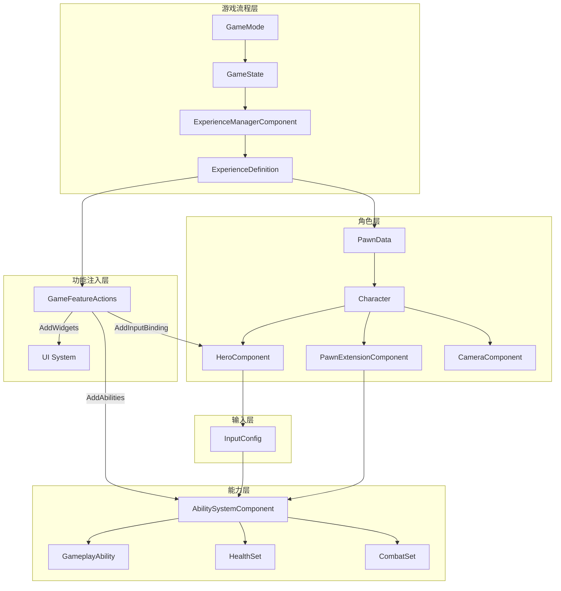

### 2.2 核心设计原则

| 原则 | 说明 | 实现方式 |
|------|------|----------|
| **模块化** | 功能可独立启用/禁用 | Game Features 插件 |
| **数据驱动** | 游戏行为通过配置定义 | PawnData, ExperienceDefinition, InputConfig |
| **组件化** | 功能封装为可复用组件 | PawnExtensionComponent, HeroComponent |
| **事件驱动** | 松耦合的系统通信 | 委托、GameplayTags |
| **网络优先** | 所有核心类支持多人游戏 | 复制、预测、Server Authority |

---

## 3. 模块详解

### 3.1 AbilitySystem (技能系统)

技能系统是游戏的核心，基于 UE 的 Gameplay Ability System (GAS) 构建。

#### 3.1.1 类层次结构

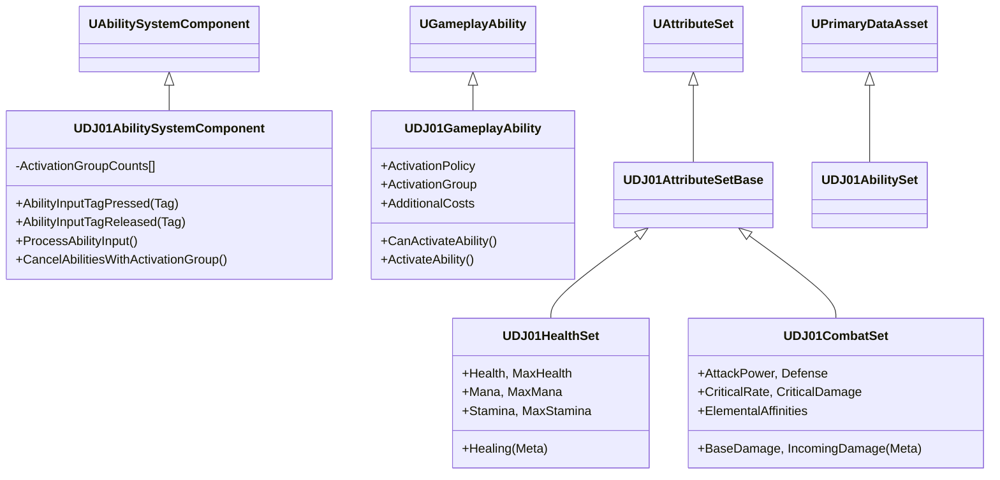

#### 3.1.2 技能激活流程

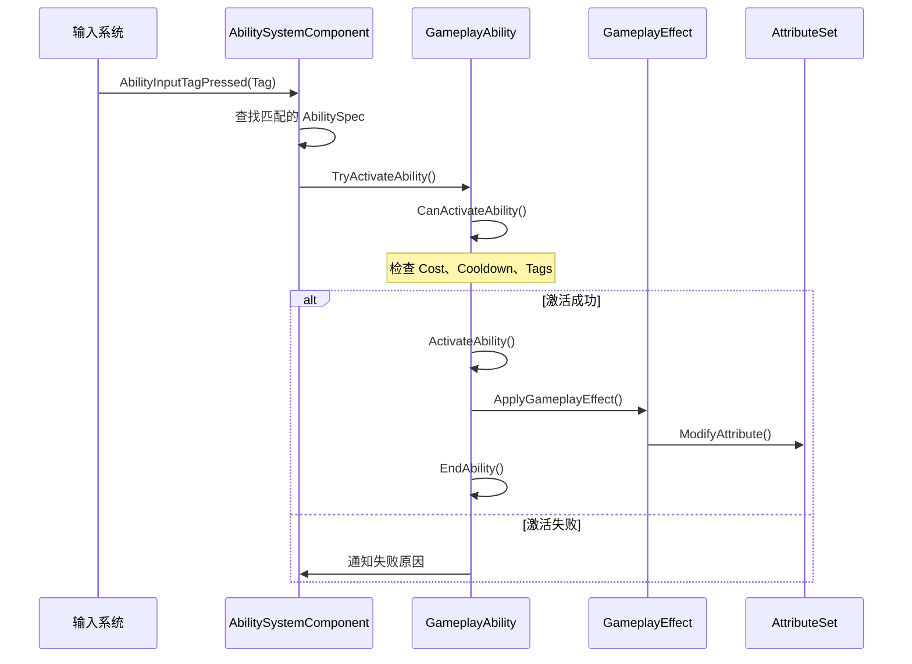

#### 3.1.3 激活组机制

技能激活组用于管理技能之间的互斥关系：

| 激活组 | 行为 | 使用场景 |
|--------|------|----------|
| `Independent` | 不影响其他技能 | 移动、普通攻击 |
| `Exclusive_Replaceable` | 可被同组技能替换 | 换弹、施法 |
| `Exclusive_Blocking` | 阻止其他互斥技能 | 处决动画、大招 |

#### 3.1.4 属性系统

**UDJ01HealthSet** - 生存属性：
- `Health` / `MaxHealth`: 生命值
- `Mana` / `MaxMana`: 魔法值  
- `Stamina` / `MaxStamina`: 体力值
- `Healing`: Meta 属性，用于计算治疗量

**UDJ01CombatSet** - 战斗属性：
- `AttackPower` / `Defense`: 基础攻防
- `CriticalRate` / `CriticalDamage`: 暴击系统
- `Fire/Ice/Lightning Affinity`: 元素增伤
- `Fire/Ice/Lightning Resistance`: 元素抗性
- `BaseDamage` / `IncomingDamage`: Meta 属性

---

### 3.2 Character (角色系统)

#### 3.2.1 组件架构

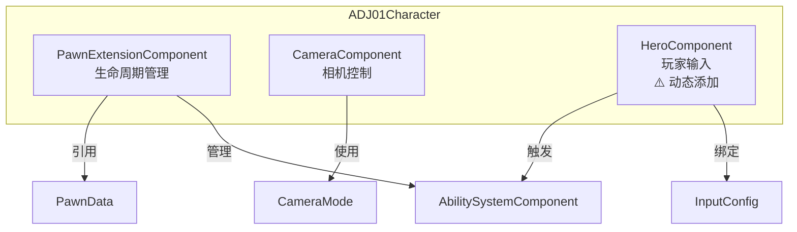

#### 3.2.2 初始化状态机

PawnExtensionComponent 使用状态机协调初始化：

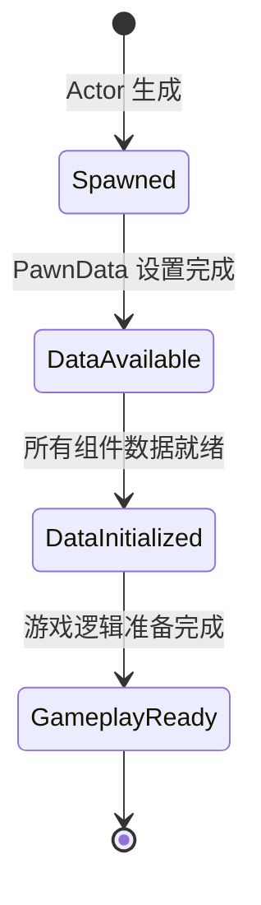

**状态说明**：
- **Spawned**: Pawn 已生成到世界，等待 PawnData
- **DataAvailable**: PawnData 已设置，Controller 已分配
- **DataInitialized**: ASC 初始化完成，属性集已添加
- **GameplayReady**: 可以开始游戏逻辑

#### 3.2.3 HeroComponent 为何动态添加？

HeroComponent 通过 GameFeatureAction 动态添加而非在 Character 构造函数中创建，原因：

1. **灵活性**: 不同 Pawn 可能需要不同控制组件（英雄/AI/载具）
2. **模块化**: 组件可根据 Experience 需要添加/移除
3. **复用性**: 同一 Character 类可用于不同游戏特性
4. **解耦**: 控制逻辑与角色本身分离

---

### 3.3 Experience (游戏体验系统)

Experience 系统定义了一个完整的游戏模式/玩法。

#### 3.3.1 核心概念

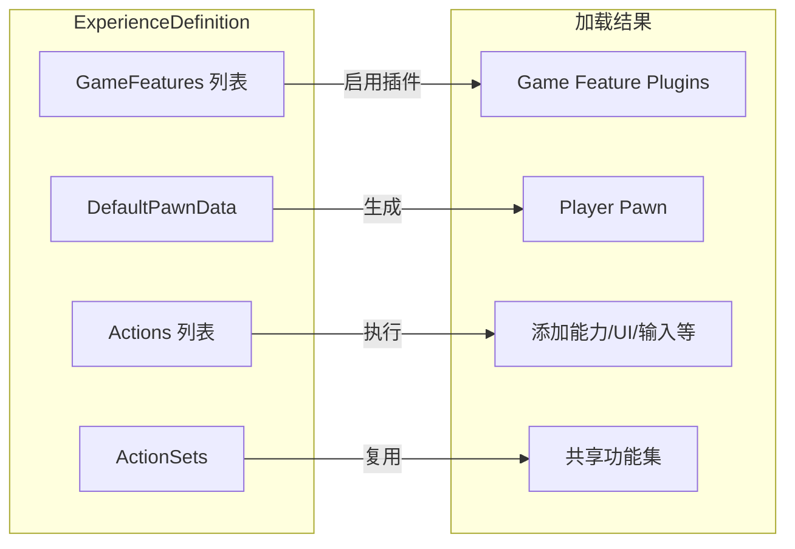

#### 3.3.2 加载流程

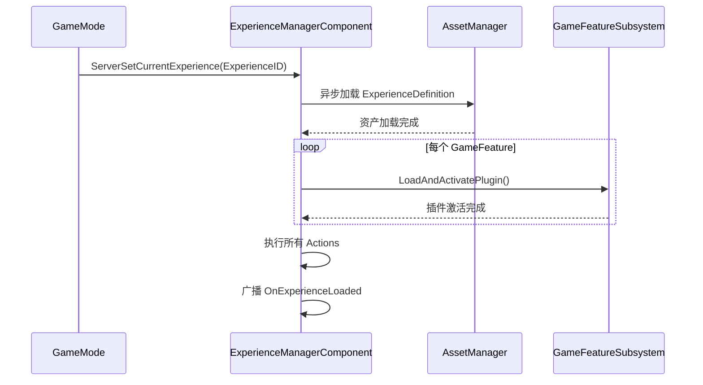

#### 3.3.3 等待 Experience 就绪

**C++ 方式**：
```cpp
ExperienceComponent->CallOrRegister_OnExperienceLoaded(
    FOnDJ01ExperienceLoaded::FDelegate::CreateUObject(
        this, &ThisClass::OnExperienceLoaded));
```

**蓝图方式**：
使用 `WaitForExperienceReady` 异步节点

---

### 3.4 Input (输入系统)

基于 UE5 Enhanced Input System 构建。

#### 3.4.1 输入流程

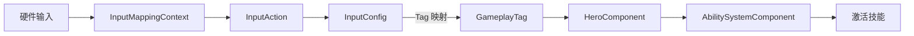

#### 3.4.2 InputConfig 结构

```cpp
// 输入配置 DataAsset
UCLASS()
class UDJ01InputConfig : public UDataAsset
{
    // 原生输入 - 直接绑定 C++ 函数
    UPROPERTY()
    TArray<FDJ01InputAction> NativeInputActions;
    
    // 技能输入 - 通过 Tag 触发技能
    UPROPERTY()
    TArray<FDJ01InputAction> AbilityInputActions;
};

// 单个输入映射
struct FDJ01InputAction
{
    UInputAction* InputAction;  // 输入动作资产
    FGameplayTag InputTag;       // 对应的 Tag
};
```

#### 3.4.3 输入绑定类型

| 类型 | 用途 | 示例 |
|------|------|------|
| NativeInput | 直接函数调用 | 移动、视角控制 |
| AbilityInput | 通过 Tag 触发技能 | 跳跃、攻击、技能 |

---

### 3.5 Camera (相机系统)

模块化的相机系统，支持多种相机模式和平滑切换。

#### 3.5.1 类结构

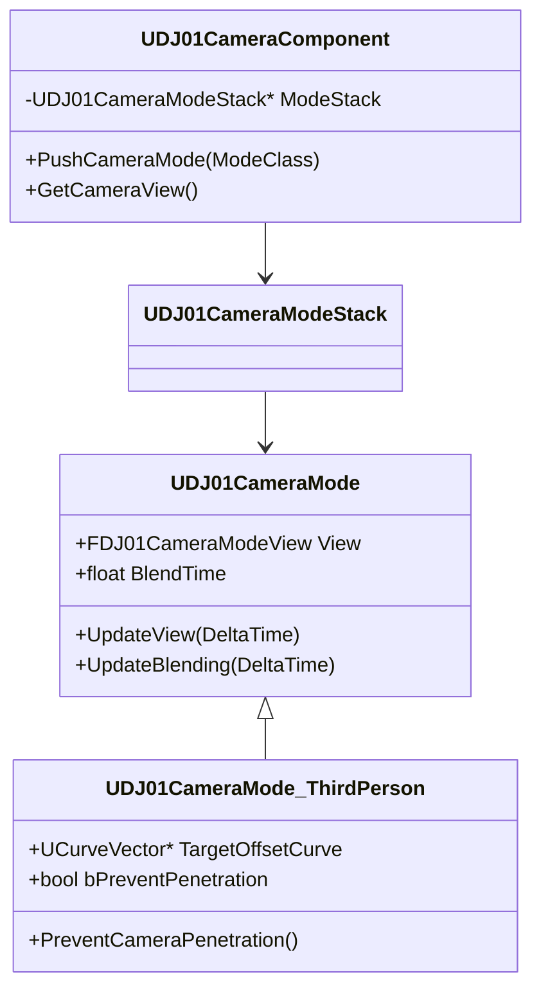

#### 3.5.2 相机模式栈

相机系统使用栈结构管理多个相机模式，支持：
- 模式推入/弹出
- 平滑混合过渡
- 优先级管理

---

### 3.6 Player (玩家系统)

#### 3.6.1 核心类

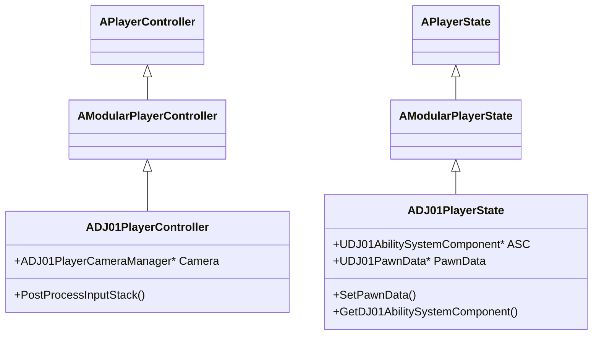

#### 3.6.2 ASC 所有权

在网络游戏中，ASC 的所有权模式很重要：

| 模式 | Owner | Avatar | 适用场景 |
|------|-------|--------|----------|
| PlayerState 拥有 | PlayerState | Pawn | 玩家角色（推荐） |
| Pawn 拥有 | Pawn | Pawn | AI、简单角色 |

DJ01 采用 **PlayerState 拥有 ASC** 的模式，确保角色重生时技能状态保持。

---

### 3.7 Team (队伍系统)

#### 3.7.1 接口与子系统

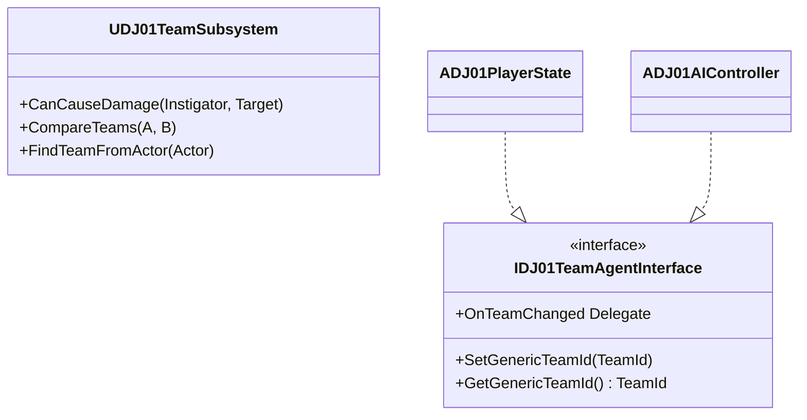

#### 3.7.2 队伍关系

```cpp
enum class EDJ01TeamComparison : uint8
{
    OnSameTeam,      // 友军
    DifferentTeams,  // 敌对
    InvalidArgument  // 无效参数
};
```

---

### 3.8 GameFeatureActions (模块化功能)

GameFeatureAction 是 UE5 Game Features 插件系统的核心，允许在运行时动态添加功能。

#### 3.8.1 可用 Actions

| Action | 功能 | 典型用途 |
|--------|------|----------|
| `AddAbilities` | 添加技能/属性到 Actor | 角色技能初始化 |
| `AddInputBinding` | 添加输入绑定 | 控制方案 |
| `AddInputContextMapping` | 添加输入上下文 | IMC 注册 |
| `AddWidgets` | 添加 UI 组件 | HUD、菜单 |

#### 3.8.2 Action 生命周期

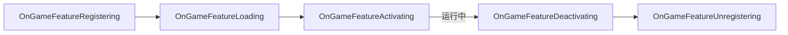

---

## 4. 核心设计模式

### 4.1 组件化模式

```cpp
// 不在 Actor 中实现功能，而是通过组件
class ADJ01Character : public AModularCharacter
{
    // 只持有组件引用，不实现具体逻辑
    UDJ01PawnExtensionComponent* PawnExtComponent;
    UDJ01CameraComponent* CameraComponent;
    // HeroComponent 通过 GFA 动态添加
};
```

### 4.2 数据驱动模式

```cpp
// 使用 DataAsset 配置行为
UCLASS()
class UDJ01PawnData : public UPrimaryDataAsset
{
    TSubclassOf<APawn> PawnClass;           // 要生成的 Pawn 类
    TArray<UDJ01AbilitySet*> AbilitySets;   // 技能配置
    UDJ01InputConfig* InputConfig;           // 输入配置
    TSubclassOf<UDJ01CameraMode> DefaultCameraMode;
};
```

### 4.3 委托回调模式

```cpp
// 使用委托解耦系统
DECLARE_MULTICAST_DELEGATE_OneParam(FOnDJ01ExperienceLoaded, const UDJ01ExperienceDefinition*);

// 注册回调
ExperienceComponent->CallOrRegister_OnExperienceLoaded(MyDelegate);
```

### 4.4 GameplayTag 通信

```cpp
// 使用 Tag 而非直接引用
FGameplayTag InputTag_Attack = FGameplayTag::RequestGameplayTag("InputTag.Attack");

// 通过 Tag 触发技能
ASC->AbilityInputTagPressed(InputTag_Attack);
```

---

## 5. 数据流与生命周期

### 5.1 游戏启动流程

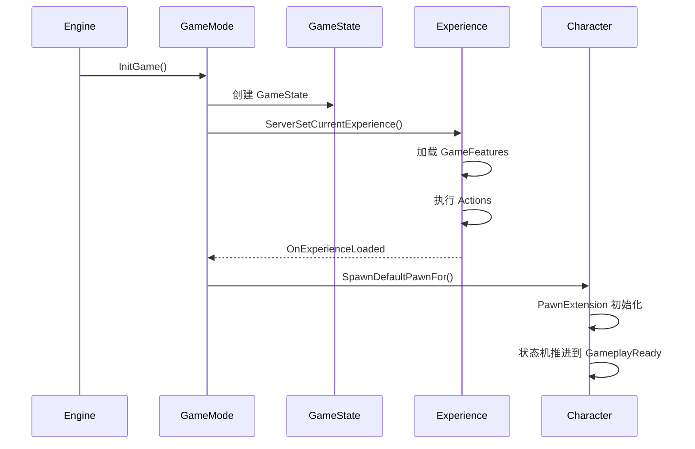

### 5.2 角色初始化流程

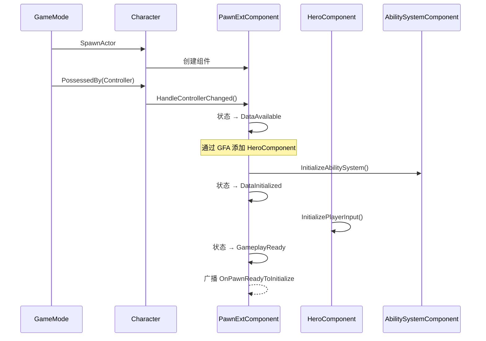

---

## 6. 扩展指南

### 6.1 添加新技能

1. **创建技能类**：
```cpp
UCLASS()
class UGA_MyAbility : public UDJ01GameplayAbility
{
    GENERATED_BODY()
public:
    UGA_MyAbility();
    virtual void ActivateAbility(...) override;
    virtual void EndAbility(...) override;
};
```

2. **创建技能集 DataAsset**：
   - Content Browser → 右键 → Data Asset → DJ01AbilitySet
   - 添加技能到列表，配置 InputTag

3. **在 PawnData 中引用**：
   - 打开 PawnData 资产
   - 将 AbilitySet 添加到 AbilitySets 数组

### 6.2 添加新属性

1. **创建属性集**：
```cpp
UCLASS()
class UDJ01MyAttributeSet : public UDJ01AttributeSetBase
{
    GENERATED_BODY()
public:
    UPROPERTY(BlueprintReadOnly, ReplicatedUsing=OnRep_MyAttribute)
    FGameplayAttributeData MyAttribute;
    ATTRIBUTE_ACCESSORS(UDJ01MyAttributeSet, MyAttribute)
    
    UFUNCTION()
    void OnRep_MyAttribute(const FGameplayAttributeData& OldValue);
};
```

2. **在 AbilitySet 中添加**：
   - 打开 AbilitySet DataAsset
   - 在 GrantedAttributes 中添加属性集类

### 6.3 添加新相机模式

1. **创建相机模式类**：
```cpp
UCLASS()
class UDJ01CameraMode_Custom : public UDJ01CameraMode
{
    GENERATED_BODY()
public:
    virtual void UpdateView(float DeltaTime) override;
};
```

2. **在 PawnData 中配置**：
   - 设置 DefaultCameraMode 为新模式

### 6.4 创建新 Experience

1. **创建 ExperienceDefinition DataAsset**：
   - Content Browser → Data Asset → DJ01ExperienceDefinition

2. **配置**：
   - 设置 DefaultPawnData
   - 添加需要的 GameFeatures
   - 添加 Actions 或引用 ActionSets

3. **在 GameMode 中使用**：
```cpp
void ADJ01GameMode::InitGame(...)
{
    FPrimaryAssetId ExpId = FPrimaryAssetId("DJ01ExperienceDefinition", "MyExperience");
    ExperienceComponent->ServerSetCurrentExperience(ExpId);
}
```

---

## 附录

### A. 重要文件速查

| 文件 | 说明 |
|------|------|
| `DJ01GameplayTags.h` | 所有原生 GameplayTag 定义 |
| `DJ01AbilitySystemComponent.h` | ASC 核心实现 |
| `DJ01GameplayAbility.h` | 技能基类 |
| `DJ01PawnData.h` | Pawn 配置数据 |
| `DJ01ExperienceDefinition.h` | Experience 定义 |
| `DJ01InputConfig.h` | 输入配置 |

### B. 调试命令

```
ShowDebug AbilitySystem    // 显示 GAS 调试信息
ShowDebug Camera           // 显示相机调试信息
LogGameplayEffects         // 输出 GE 日志
```

### C. 相关文档链接

- <a href="file:D:\UnrealProjects\DJ01\Source\DJ01\AbilitySystem\AbilitySystem_Architecture.md">AbilitySystem 架构文档</a>
- <a href="file:D:\UnrealProjects\DJ01\Source\DJ01\Character\README.md">Character 系统文档</a>
- <a href="file:D:\UnrealProjects\DJ01\Source\DJ01\Experience\README.md">Experience 系统文档</a>
- <a href="file:D:\UnrealProjects\DJ01\Source\DJ01\Camera\Docs\README.md">Camera 系统文档</a>

---

**文档版本**: v1.0  
**更新日期**: 2025  
**维护者**: DJ01 Team