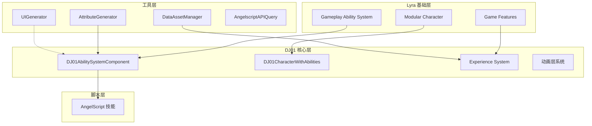
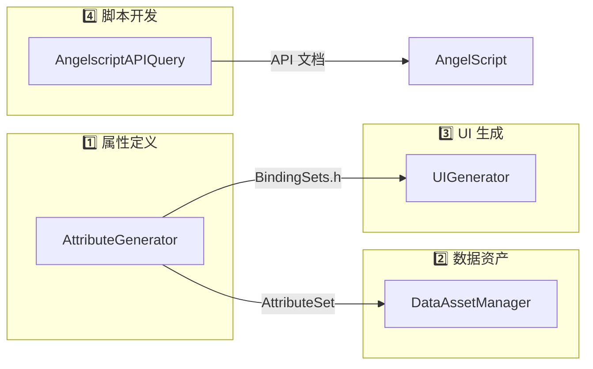
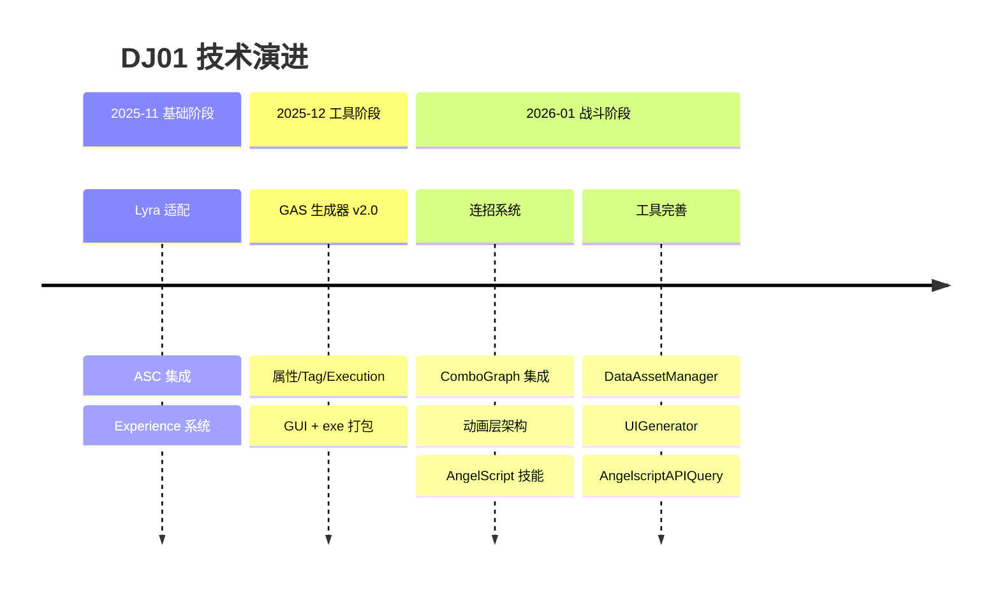

# 🗺️ DJ01 项目路标文档 (Roadmap)

> **项目名称**: DJ01 - UE5 动作战斗系统技术研究项目  
> **项目定位**: 基于 Lyra 架构的 GAS 战斗系统实现  
> **技术基础**: Lyra Starter Game 架构 + AngelScript  
> **文档版本**: v3.0  
> **更新日期**: 2026-01-18

---

## � 项目重新定位

### 从 RPG 游戏 → 技术研究项目

本项目原计划开发一款完整的动作 RPG 游戏《太多该死勇者》，包含复杂的社会系统、元素反应、6 大结局等内容。经过评估，这些内容对于个人开发者工作量过大。

**当前定位**：将项目转型为 **UE5 战斗系统技术 Demo**，重点展示：
- GAS 架构设计与实现能力
- 工具开发与工程化能力
- Lyra 框架理解与扩展能力
- 动画系统与连招实现

**原游戏设计文档保留为创意素材**，可在未来有团队时继续开发。

---

## 📋 文档导航

### 核心技术文档
| 文档 | 路径 | 内容概述 |
|------|------|----------|
| **架构指南** | `docs/Now/Architecture_Guide.md` | 系统整体架构、模块关系 |
| **GAS 架构** | `Source/DJ01/AbilitySystem/AbilitySystem_Architecture.md` | GAS 实现细节 |
| **GAS 使用指南** | `Source/DJ01/AbilitySystem/AbilitySystem_Usage_Guide.md` | 技能开发实践 |
| **动画系统** | `docs/Now/Animation/` | 5 篇动画系统文档 |
| **连招系统** | `docs/ComBoFirst/` | 13 篇连招教程 |
| **ComboGraph 分析** | `docs/ComboGraph/` | 10 篇插件源码分析 |
| **AngelScript 指南** | `docs/AngelscriptGuide/` | 12 篇深度指南 |

### 开发工具文档
| 工具 | 路径 | 功能 |
|------|------|------|
| **AttributeGenerator** | `Tools/AttributeGenerator/README.md` | GAS 代码生成器 |
| **DataAssetManager** | `Tools/DataAssetManager/` | 数据资产管理器 |
| **UIGenerator** | `Tools/UIGenerator/README.md` | UI 代码生成器 |
| **AngelscriptAPIQuery** | `Tools/AngelscriptAPIQuery/README.md` | API 查询工具 |

### 原设计文档 (长期愿景)
| 文档 | 路径 | 说明 |
|------|------|------|
| 游戏设计文档 | `docs/GameDesignDocument.md` | 核心玩法、世界观 |
| 世界历史设定 | `docs/History3.md` | 魔物牧场设定 |
| ~~战斗系统设计~~ | `docs/CombatSystem.md` | ⚠️ 元素反应已废弃 |

---

## 🏗️ 技术架构概览



---

## ✅ 已完成模块清单

### 一、C++ 核心框架

| 模块 | 路径 | 说明 |
|------|------|------|
| Character 系统 | `Source/DJ01/Character/` | DJ01Character、MovementComponent |
| Camera 系统 | `Source/DJ01/Camera/` | 第三人称相机、战斗相机 |
| Player 系统 | `Source/DJ01/Player/` | PlayerController、PlayerState |
| Experience 系统 | `Source/DJ01/Experience/` | Lyra 风格异步加载 |
| Input 系统 | `Source/DJ01/Input/` | Enhanced Input + 输入缓冲 |
| Team 系统 | `Source/DJ01/Team/` | 队伍子系统 |

### 二、GAS 技能系统

| 子系统 | 状态 | 说明 |
|--------|------|------|
| 自定义 ASC | ✅ | DJ01AbilitySystemComponent |
| 三层属性系统 | ✅ | Base/Flat/Percent + Current/Max |
| 伤害系统 | ✅ | DamageExecution + HealExecution |
| BindingSet | ✅ | GAS → UI/动画 自动绑定 |
| AbilitySet | ✅ | 技能/效果数据资产 |

### 三、动画系统

| 子系统 | 状态 | 说明 |
|--------|------|------|
| 动画层架构 | ✅ | Lyra 风格武器动画层 |
| 状态机设计 | ✅ | Locomotion + Action |
| BlendSpace | ✅ | 移动混合空间 |
| BindingSet 集成 | ✅ | GAS 属性 → 动画变量 |

### 四、连招系统

| 子系统 | 状态 | 说明 |
|--------|------|------|
| ComboGraph 集成 | ✅ | 可视化连招图 |
| 输入缓冲 | ✅ | 连招窗口输入缓存 |
| 武器连招 | ✅ | Katana 4 套连招 |

### 五、开发工具链

| 工具 | 状态 | 功能 |
|------|------|------|
| **AttributeGenerator** | ✅ | 属性/Tag/Execution/BindingSet/MMC 生成 |
| **AngelscriptAPIQuery** | ✅ | API 查询 + 数据库导出 |
| **DataAssetManager** | ✅ | Experience/PawnData/AbilitySet 管理 |
| **UIGenerator** | ✅ | Schema 驱动 UI + MVVM |

### 六、AngelScript 集成

| 内容 | 路径 |
|------|------|
| GA_Katana_LightAttack | `Script/GameAbilityAS/` |
| GA_CastStone | `Script/GameAbilityAS/` |
| GA_Jump | `Script/GameAbilityAS/` |
| AWeapon_Katana | `Script/Weapons/` |

---

## 🔧 开发工具详解

### 工具协作关系



### 各工具说明

#### AttributeGenerator
- **功能**: GAS 代码自动生成
- **输入**: CSV/JSON 配置文件
- **输出**: C++ 属性集、Execution、BindingSet、MMC
- **路径**: `Tools/AttributeGenerator/`

#### DataAssetManager
- **功能**: Lyra 数据资产可视化管理
- **支持类型**: Experience, PawnData, AbilitySet, InputConfig, ActionSet
- **特点**: 与 UE 编辑器实时通信
- **路径**: `Tools/DataAssetManager/`

#### UIGenerator
- **功能**: Schema 驱动的 UI 代码生成
- **特点**: 与 BindingSet 集成，实现 MVVM
- **输出**: C++ Widget 基类
- **路径**: `Tools/UIGenerator/`

#### AngelscriptAPIQuery
- **功能**: 运行时 AngelScript API 查询
- **输出**: JSON/Markdown 格式文档
- **数据库**: 100+ 类型文档已导出
- **路径**: `Tools/AngelscriptAPIQuery/`

---

## � 开发里程碑

### Phase 0: 基础设施 ✅ 已完成
- ✅ Lyra 架构适配
- ✅ ASC 基础架构
- ✅ 属性系统
- ✅ GAS 生成器

### Phase 1: 核心战斗框架 ✅ 已完成
- ✅ 伤害计算系统
- ✅ 输入系统 + 输入缓冲
- ✅ 近战连招系统
- ✅ 动画层系统
- ✅ 相机系统

### Phase 1.5: 工具链完善 ✅ 已完成
- ✅ AttributeGenerator
- ✅ AngelscriptAPIQuery
- ✅ DataAssetManager
- ✅ UIGenerator

### Phase 2: Demo 完善 🔄 当前阶段

**目标**: 可演示的战斗 Demo

| 任务 | 状态 | 优先级 | 预估时间 |
|------|------|--------|----------|
| 测试敌人 Pawn | ⬜ 待做 | P0 | 2-4h |
| 伤害流程闭环 | ⬜ 待做 | P0 | 2-4h |
| 简单敌人 AI | ⬜ 待做 | P1 | 4-8h |
| 受击/死亡反馈 | ⬜ 待做 | P1 | 4h |
| Demo 视频录制 | ⬜ 待做 | P0 | 2h |

### Phase 3+: 长期愿景 📋 保留

> 以下内容保留为创意文档，暂不列入开发计划

- 世界构建（格兰维尔城区）
- NPC/对话/任务系统
- 社会系统
- ~~元素反应系统~~ (已废弃)
- 6 大结局

---

## 🎯 下一步行动

### 立即可做 (Quick Wins)

```
┌────────────────────────────────────────────────────────────────┐
│  🎯 核心目标: 录制 30 秒可演示的战斗 Demo                        │
│     玩家连招攻击敌人 → 伤害数字 → 敌人死亡                       │
└────────────────────────────────────────────────────────────────┘
```

| 优先级 | 任务 | 预估时间 |
|--------|------|----------|
| ⭐⭐⭐ | 创建 BP_TestEnemy (有 ASC + HealthSet) | 2-4h |
| ⭐⭐⭐ | 验证伤害流程闭环 | 2-4h |
| ⭐⭐ | 简单敌人 AI (行为树) | 4-8h |
| ⭐⭐ | 录制 Demo 视频 | 2h |

---

## 💼 求职展示建议

### 项目亮点

#### 1. GAS 战斗系统架构 ⭐⭐⭐⭐⭐
- 三层属性系统 (Base/Flat/Percent)
- 数据驱动的伤害计算
- GameplayTag 条件系统

**面试话术**:
> "我基于 Lyra 架构搭建了完整的 GAS 战斗框架。属性系统采用三层设计，伤害计算使用自定义 ExecutionCalculation，支持数据驱动的公式配置。"

#### 2. 开发工具链 ⭐⭐⭐⭐
- 4 个可用的 Python GUI 工具
- 代码生成、配置驱动开发
- Python ↔ UE 进程通信

**面试话术**:
> "为了提升开发效率，我开发了一套 Python 工具链。AttributeGenerator 可以通过配置自动生成 GAS 代码，DataAssetManager 通过 UE Python Remote Execution 与编辑器通信。"

#### 3. 动画层系统 + 连招 ⭐⭐⭐⭐
- Lyra 风格模块化动画
- ComboGraph 可视化连招
- 输入缓冲系统

#### 4. Lyra 架构理解 ⭐⭐⭐
- Experience 异步加载
- PawnData 数据驱动
- GameFeatureAction

### 建议的展示材料

1. **Demo 视频** (30 秒) - 玩家连招打敌人
2. **技术文档** - 已有完善文档
3. **代码片段** - DamageExecution、AttributeSet、工具代码

---

## 📈 进度追踪

### 里程碑完成记录

| 日期 | 里程碑 | 主要成果 |
|------|--------|----------|
| 2026-01 | 连招系统 v1.0 | ComboGraph + 动画层 + AngelScript |
| 2026-01 | 工具链完善 | 4 个 GUI 工具可用 |
| 2025-12 | GAS 工具链 v2.0 | 属性/标签/Execution 生成器 |
| 2025-12 | 伤害系统 | DamageExecution |
| 2025-11 | 项目基础架构 | Lyra 框架适配 |

### 技术演进时间线



---

## 🗑️ 废弃内容

| 内容 | 原位置 | 废弃原因 |
|------|--------|----------|
| 元素反应系统 | `CombatSystem.md` | 需要大量特效，工作量过大 |
| 五系魔法系统 | `CombatSystem.md` | 同上 |
| 7 元素弱点 | DamageExecution | 框架保留，暂不使用 |

---

**文档维护**: 每完成一个里程碑后更新  
**最后更新**: 2026-01-18

*"技术积累是实打实的，项目可以迭代，能力会一直留下。"*