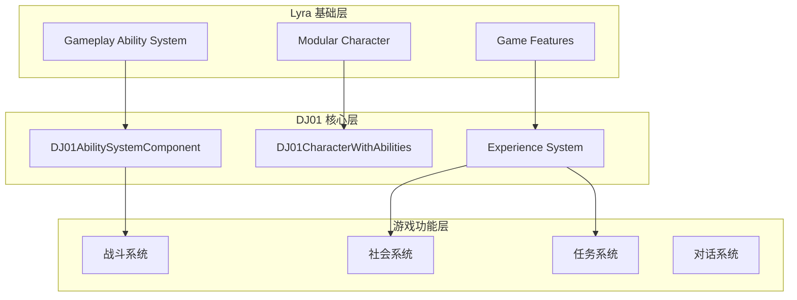
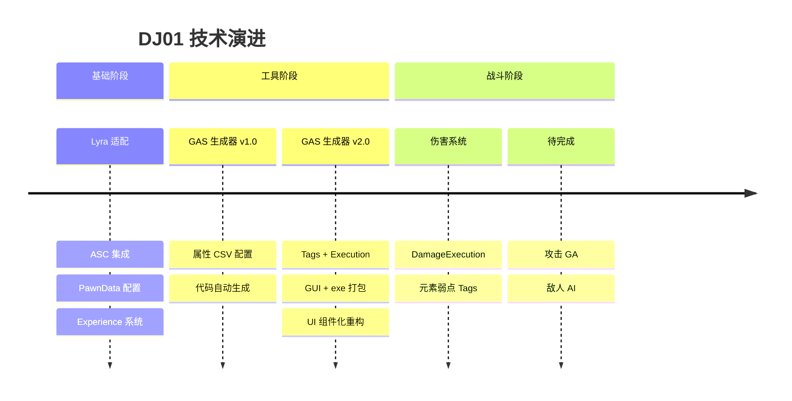

# 🗺️ DJ01 项目路标文档 (Roadmap)

> **项目名称**: Too Many Damn Heroes (太多该死勇者)  
> **项目类型**: UE5 动作RPG / 社会讽刺 / 黑色幽默  
> **技术基础**: Lyra Starter Game 架构  
> **文档版本**: v2.0  
> **更新日期**: 2025-12-19

---

## 📋 文档导航 (与AI沟通时引用)

### 核心设计文档
| 文档 | 路径 | 内容概述 |
|------|------|----------|
| 游戏设计文档 | `docs/GameDesignDocument.md` | 核心玩法、世界观、角色职业、结局系统 |
| 世界历史设定 | `docs/History3.md` | 魔物牧场体系、200年历史演进、社会控制机制 |
| 战斗系统设计 | `docs/CombatSystem.md` | 五系魔法、武器系统、敌人类型、战斗机制 |
| 魔王工业设计 | `docs/MaouIndustryDesign.md` | 繁殖场运营、产业链设计 |

### 技术架构文档
| 文档 | 路径 | 内容概述 |
|------|------|----------|
| 架构指南 | `docs/Now/Architecture_Guide.md` | 系统整体架构、模块关系、扩展指南 |
| 技能系统架构 | `Source/DJ01/AbilitySystem/AbilitySystem_Architecture.md` | GAS 实现细节 |
| 技能系统使用指南 | `Source/DJ01/AbilitySystem/AbilitySystem_Usage_Guide.md` | 技能开发实践 |
| **伤害系统配置** | `Source/DJ01/AbilitySystem/Executions/DamageSystem_Configuration_Guide.md` | 伤害公式配置指南 |
| 相机集成指南 | `Source/DJ01/AbilitySystem/CameraMode_Integration_Guide.md` | 相机模式实现 |
| 移动组件说明 | `Source/DJ01/Character/MOVEMENT_COMPONENT_README.md` | 角色移动系统 |

### 开发工具文档
| 文档 | 路径 | 内容概述 |
|------|------|----------|
| **GAS 生成器** | `Tools/AttributeGenerator/README.md` | 属性/标签/Execution 代码生成器使用指南 |

### 废案参考
| 文档 | 路径 | 说明 |
|------|------|------|
| 旧版框架 | `docs/OLD_version/GameFramework.md` | 早期设计思路(已废弃) |

---

## 🎯 项目核心定位

```
┌─────────────────────────────────────────────────────────────┐
│                    游戏核心概念                              │
├─────────────────────────────────────────────────────────────┤
│  表层: 勇者讨伐魔物的传统 RPG                                │
│  中层: 发现"魔物是工业化繁殖产品"的真相                      │
│  深层: 讽刺现代社会内卷、就业危机、制造危机等问题             │
└─────────────────────────────────────────────────────────────┘
```

### 核心玩法循环
```
接取讨伐任务 → 真实战斗 → 发现违和感 → 调查真相 → 道德抉择 → 结局分化
       ↑                                              ↓
       ←←← 社会模拟：阶层流动、关系网络、经济生存 ←←←←
```

---

## 🏗️ 技术架构概览



### 已实现的技术基础
- ✅ AbilitySystemComponent (ASC) 基础架构
- ✅ HealthSet / CombatSet 属性集
- ✅ **DamageExecution 伤害计算系统 (数据驱动+硬编码双模式)**
- ✅ **GameplayTags 伤害类型/元素弱点系统**
- ✅ PawnData 数据驱动角色配置
- ✅ Experience 系统框架
- ✅ GameFeatureAction 模块化功能注入
- ✅ 相机模式系统
- ✅ 输入系统 (Enhanced Input)
- ✅ 队伍系统 (Team)

### 🆕 开发工具链 (v2.0)
- ✅ **GAS 代码生成器 GUI** (`Tools/AttributeGenerator/`)
  - ✅ 三层属性系统 (Base/Flat/Percent) + 资源属性 (Current/Max)
  - ✅ GameplayTags 层级化管理与代码生成
  - ✅ ExecutionCalculation 可视化配置 (属性捕获/标签条件)
  - ✅ 打包为独立 exe，无需 Python 环境

---

## 📅 开发里程碑

### Phase 0: 基础设施 ✅ (已完成)
**目标**: 建立高效的开发工具链

| 任务 | 状态 | 优先级 | 说明 |
|------|------|--------|------|
| GAS 属性生成器 | ✅ 已完成 | P0 | CSV 配置 → C++ 代码自动生成 |
| 三层属性宏系统 | ✅ 已完成 | P0 | Base/Flat/Percent 分层计算 |
| GameplayTags 生成器 | ✅ 已完成 | P0 | JSON 配置 → Tag 代码生成 |
| Execution 生成器 | ✅ 已完成 | P0 | 可视化配置伤害公式 |
| 工具 GUI 封装 | ✅ 已完成 | P1 | Tkinter GUI + exe 打包 |

### Phase 1: 核心战斗原型 (当前阶段) 🔄
**目标**: 可玩的基础战斗 Demo

| 任务 | 状态 | 优先级 | 说明 |
|------|------|--------|------|
| 基础攻击技能 | 🔄 进行中 | P0 | 基于 GAS 的近战/远程攻击 |
| 伤害计算系统 | ✅ 已完成 | P0 | DamageExecution + 数据驱动公式配置 |
| 元素弱点系统 | ✅ 已完成 | P1 | 7 元素 + Tag 驱动弱点机制 |
| **测试敌人 Pawn** | ⬜ 待开始 | P0 | 创建可攻击的测试目标 |
| **伤害流程验证** | ⬜ 待开始 | P0 | GE 触发 → Execution → 血量变化 |
| 基础敌人 AI | ⬜ 待开始 | P1 | 行为树 + 繁殖魔物行为模式 |
| 角色移动完善 | ⬜ 待开始 | P1 | 闪避、冲刺等动作 |
| 五系魔法原型 | ⬜ 待开始 | P2 | 至少实现 2 个系的基础技能 |

### Phase 2: 世界构建
**目标**: 可探索的游戏世界

| 任务 | 状态 | 优先级 | 说明 |
|------|------|--------|------|
| 核心区域场景 | ⬜ 待开始 | P0 | 格兰维尔城区、贫民窟 |
| NPC 系统 | ⬜ 待开始 | P0 | 基础对话、商店 |
| 任务系统 | ⬜ 待开始 | P1 | 讨伐任务框架 |
| 繁殖场场景 | ⬜ 待开始 | P2 | 隐藏区域(后期解锁) |

### Phase 3: 社会系统
**目标**: 社会模拟核心玩法

| 任务 | 状态 | 优先级 | 说明 |
|------|------|--------|------|
| 关系网络系统 | ⬜ 待开始 | P1 | NPC 好感度、派系声望 |
| 经济系统 | ⬜ 待开始 | P1 | 魔能货币、物价波动 |
| 道德选择系统 | ⬜ 待开始 | P1 | 选择追踪、结局影响 |
| 证据收集系统 | ⬜ 待开始 | P2 | 真相揭示机制 |

### Phase 4: 内容填充
**目标**: 完整游戏内容

| 任务 | 状态 | 优先级 | 说明 |
|------|------|--------|------|
| 主线任务链 | ⬜ 待开始 | P0 | 4 章剧情 |
| 6 大结局实现 | ⬜ 待开始 | P1 | 分支剧情 |
| 随机事件库 | ⬜ 待开始 | P2 | 50+ 社会事件 |
| 武器装备系统 | ⬜ 待开始 | P1 | 工具改造、勇者装备 |

### Phase 5: 打磨发布
**目标**: 可发布版本

| 任务 | 状态 | 优先级 | 说明 |
|------|------|--------|------|
| 平衡性调整 | ⬜ 待开始 | P0 | 战斗、经济平衡 |
| UI/UX 完善 | ⬜ 待开始 | P0 | 界面优化 |
| 音效音乐 | ⬜ 待开始 | P1 | 魔法朋克风格 |
| 性能优化 | ⬜ 待开始 | P1 | 帧率、加载优化 |

---

## 🔧 当前技术债务

| 问题 | 影响 | 解决方案 | 状态 |
|------|------|----------|------|
| 文档分散 | 查找困难 | 本路标文档作为索引 | ✅ 已缓解 |
| Lyra 参考代码 (.txt) | 需要对照学习 | 逐步替换为自己实现 | 🔄 进行中 |
| 缺少完整战斗循环 | 无法验证设计 | Phase 1 优先完成 | ⬜ 待解决 |
| ~~手动添加属性繁琐~~ | ~~修改多处代码~~ | ~~GAS 生成器~~ | ✅ 已解决 |

---

## 💬 与 AI 沟通指南

### 询问技术实现时
```
请参考以下文档:
- 架构: docs/Now/Architecture_Guide.md
- 技能系统: Source/DJ01/AbilitySystem/AbilitySystem_Architecture.md
当前任务: [具体任务]
需要帮助: [具体问题]
```

### 询问游戏设计时
```
请参考以下文档:
- 游戏设计: docs/GameDesignDocument.md
- 世界设定: docs/History3.md
- 战斗设计: docs/CombatSystem.md
当前讨论: [具体设计问题]
```

### 讨论新功能时
```
项目背景: UE5 RPG, 基于 Lyra 架构
核心主题: 魔物工业化繁殖的社会讽刺
当前阶段: [Phase X]
想要实现: [功能描述]
```

---

## 📊 关键数据参考

### 游戏世界数据
- 总人口: 12-15 万人 (城邦规模)
- 首都格兰维尔: 4 万人
- 勇者相关从业: ~3.5 万人 (25%)
- 繁殖场员工: ~3500 人 (机密)
- 年产魔物: 12 万只

### 技术栈
- 引擎: Unreal Engine 5
- 框架基础: Lyra Starter Game
- 核心系统: Gameplay Ability System (GAS)
- 模块化: Game Features + Modular Gameplay

---

## 🎯 下一步行动 (Next Actions)

### 🏆 推荐优先级 (基于当前进度)

```
┌────────────────────────────────────────────────────────────────┐
│  🎯 核心目标: 验证完整的伤害流程闭环                            │
│     攻击动作 → GE 触发 → Execution 计算 → 血量变化 → UI 反馈    │
└────────────────────────────────────────────────────────────────┘
```

### 立即可做 (Quick Wins)
| 优先级 | 任务 | 预估时间 | 说明 |
|--------|------|----------|------|
| ⭐⭐⭐ | 创建测试敌人 Pawn | 2-4h | 有 ASC 的靶子，用于测试攻击 |
| ⭐⭐⭐ | 创建伤害测试 GE | 1-2h | 简单 GE 触发 DamageExecution |
| ⭐⭐ | 基础近战 GA | 4-8h | 播放蒙太奇 + 命中检测 + 应用 GE |

### 本周目标
1. [ ] 🔴 创建 `BP_TestEnemy` 测试敌人 (含 ASC + HealthSet)
2. [ ] 🔴 创建 `GE_TestDamage` 触发伤害计算
3. [ ] 🟡 实现基础近战攻击 GameplayAbility
4. [ ] 🟡 验证伤害数值在 UI 中显示 (可选)

### 中期目标 (Phase 1 完成标准)
- [ ] 玩家可以攻击敌人并造成伤害
- [ ] 敌人可以攻击玩家并造成伤害
- [ ] 血量归零时有死亡反馈
- [ ] 至少 2 种不同元素的攻击技能

### 待解决设计问题
| 问题 | 优先级 | 思考方向 |
|------|--------|----------|
| "繁殖魔物"的行为模式设计 | P1 | 可预测但有威胁，暗示工业化特征 |
| 五系魔法的技能树结构 | P2 | 参考 CombatSystem.md 中的元素设定 |
| 社会系统的数据结构 | P3 | Phase 3 再详细设计 |

---

## 📈 进度追踪

### 里程碑完成记录
| 日期 | 里程碑 | 主要成果 |
|------|--------|----------|
| 2025-12 | GAS 工具链 v2.0 | 属性/标签/Execution 生成器 + GUI |
| 2025-12 | 伤害系统 | DamageExecution + 元素弱点 |
| 2025-11 | 项目基础架构 | Lyra 框架适配 + ASC 集成 |

### 技术栈演进


---

**文档维护**: 每完成一个里程碑后更新  
**最后更新**: 2025-12-19

*"在这个人人都能屠龙的时代，真正的怪物是什么？"*