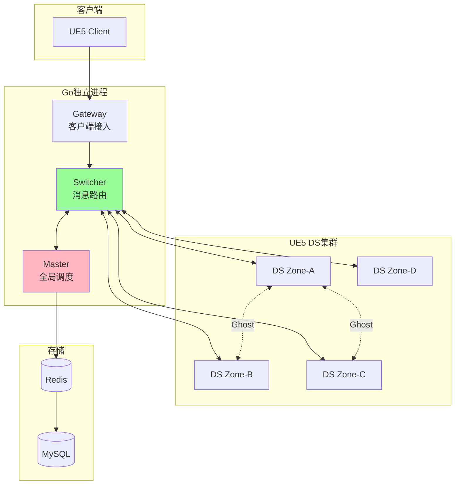

# 00 - 分布式多DS架构总览

## 📋 里程碑追踪

| # | 里程碑 | 状态 | 验收标准 |
|---|--------|:----:|----------|
| M1 | 文档理解 | ⬜ | 理解整体架构和技术栈 |
| M2 | 项目结构 | ⬜ | 创建Go和UE5目录结构 |

> **进度**: 0/2 = 0%

---

### M1: 文档理解

- [ ] 理解Go/UE5分工
- [ ] 理解5个Phase的目标
- [ ] 理解服务地址编码概念
- [ ] 理解场景分割概念

**完成日期**: ____

---

### M2: 项目结构创建

**Go侧**:
- [ ] 创建 `ServerGo/` 目录
- [ ] 运行 `go mod init`
- [ ] 创建 `cmd/` 子目录
- [ ] 创建 `internal/` 子目录
- [ ] 创建 `pkg/` 子目录

**UE5侧**:
- [ ] 创建 `Source/DJ01/Network/` 目录
- [ ] 创建 `Distributed/` 子目录
- [ ] 创建 `Ghost/` 子目录
- [ ] 创建 `ScenePartition/` 子目录

**Proto侧**:
- [ ] 创建 `Proto/` 目录

**验收**: 目录结构与文档一致

**完成日期**: ____

---

## 项目目标

构建一个**企业级分布式MMO服务器架构Demo**，展示以下核心能力：

| 能力 | 说明 | 技术要点 |
|------|------|---------|
| **场景分割** | 大世界切割到多个DS节点 | World Partition + Zone划分 |
| **跨DS同步** | DS边界区域的实体同步 | Ghost实体 + 增量同步 |
| **消息路由** | 独立进程消息中转 | Switcher + 服务发现 |
| **无缝传送** | 玩家跨DS迁移 | 权威转移 + 状态迁移 |

---

## 技术栈

| 层级 | 技术 | 说明 |
|------|------|------|
| **游戏逻辑** | UE5 C++ | DS节点、GAS战斗、物理 |
| **独立进程** | **Go** | Master、Switcher、Gateway |
| **通信协议** | TCP + Protobuf | 低延迟、强类型 |
| **存储** | Redis + MySQL | 缓存 + 持久化 |

> 💡 选择Go的原因：原生goroutine并发、net/http成熟、单二进制部署、游戏服务器主流选择

---

## 系统架构图



---

## 进程职责

| 进程 | 语言 | 核心职责 |
|------|------|---------|
| **Gateway** | Go | 客户端长连接、协议转换、DDoS防护 |
| **Switcher** | Go | 服务间RPC路由、消息分发、负载感知 |
| **Master** | Go | 服务发现、负载均衡、玩家路由、Zone管理 |
| **DS** | UE5 C++ | 游戏逻辑、GAS战斗、物理、AI |

---

## 服务地址编码 (32位)

```
┌─────────────────────────────────────────────────────────┐
│  Bit 31-24   │  Bit 23-16    │  Bit 15-0              │
│  ServerId    │  ServiceType  │  ServiceIndex          │
│  区服ID      │  服务类型     │  实例索引              │
└─────────────────────────────────────────────────────────┘
```

**服务类型枚举**：
- `0x01` Master
- `0x02` Switcher  
- `0x03` Gateway
- `0x10` GAS (DS)
- `0x11` Chat
- `0x12` Match

---

## 场景分割概念

```
┌─────────────────────────────────────────┐
│           大世界 8km × 8km              │
├───────────────┬───────────────┬─────────┤
│   Zone(0,0)   │   Zone(1,0)   │   ...   │
│   DS-1        │   DS-2        │         │
│   ┌───────┐   │   ┌───────┐   │         │
│   │边界带 │◄──┼──►│边界带 │   │         │
│   │ 200m  │   │   │ 200m  │   │         │
│   └───────┘   │   └───────┘   │         │
├───────────────┼───────────────┼─────────┤
│   Zone(0,1)   │   Zone(1,1)   │   ...   │
│   DS-3        │   DS-4        │         │
└───────────────┴───────────────┴─────────┘
```

**关键概念**：
- **Zone**：2km×2km 的世界分区，每个Zone由一个DS负责
- **边界带**：Zone边缘200m范围，进入后创建Ghost
- **Ghost实体**：在相邻DS的只读副本，用于跨边界可见性
- **权威转移**：玩家跨越Zone中线时，权威DS切换

---

## 文档索引

| # | 文档 | 内容概要 | 优先级 |
|---|------|---------|-------|
| 01 | [01_ServiceAddress.md](./01_ServiceAddress.md) | 服务地址编码规范 | P0 |
| 02 | [02_Switcher.md](./02_Switcher.md) | Switcher设计纲要 | P0 |
| 03 | [03_Master.md](./03_Master.md) | Master设计纲要 | P0 |
| 04 | [04_Gateway.md](./04_Gateway.md) | Gateway设计纲要 | P1 |
| 05 | [05_MessageProtocol.md](./05_MessageProtocol.md) | 消息协议定义 | P0 |
| 06 | [06_SceneSegmentation.md](./06_SceneSegmentation.md) | 场景分割策略 | P1 |
| 07 | [07_GhostEntity.md](./07_GhostEntity.md) | Ghost实体系统 | P1 |
| 08 | [08_AuthorityTransfer.md](./08_AuthorityTransfer.md) | 权威转移机制 | P1 |
| 09 | [09_DS_Integration.md](./09_DS_Integration.md) | UE5 DS集成 | P1 |
| 10 | [10_TestPlan.md](./10_TestPlan.md) | 测试与演示计划 | P2 |

---

## 代码目录规划

```
DJ01/
├── Source/DJ01/Network/
│   ├── Distributed/          # UE5侧分布式模块
│   ├── Ghost/                # Ghost实体
│   └── ScenePartition/       # 场景分割
│
├── ServerGo/                 # Go服务端 (新建)
│   ├── cmd/
│   │   ├── master/           # Master入口
│   │   ├── switcher/         # Switcher入口
│   │   └── gateway/          # Gateway入口
│   ├── internal/
│   │   ├── protocol/         # 协议定义
│   │   ├── service/          # 服务逻辑
│   │   └── registry/         # 服务注册
│   └── go.mod
│
└── Proto/                    # Protobuf定义
    ├── common.proto
    ├── service.proto
    └── game.proto
```

---

## 开发阶段

### Phase 1: 通信基础 (Week 1)
- [ ] 服务地址编码 (Go + UE5)
- [ ] 消息协议定义 (Protobuf)
- [ ] Switcher骨架
- [ ] UE5 SwitcherClient

### Phase 2: 服务协调 (Week 2)  
- [ ] Master服务发现
- [ ] DS自动注册
- [ ] 心跳与健康检查
- [ ] 负载均衡

### Phase 3: 场景分割 (Week 3)
- [ ] Zone边界检测
- [ ] Ghost实体创建/销毁
- [ ] 跨DS状态同步
- [ ] 权威转移

### Phase 4: 演示集成 (Week 4)
- [ ] 2×2 Zone测试地图
- [ ] 边界穿越演示
- [ ] Debug HUD
- [ ] 性能测试

---

## 下一步

从 **[01_ServiceAddress.md](./01_ServiceAddress.md)** 开始，定义服务地址的编码规范。