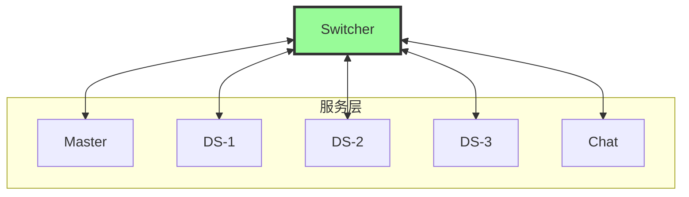
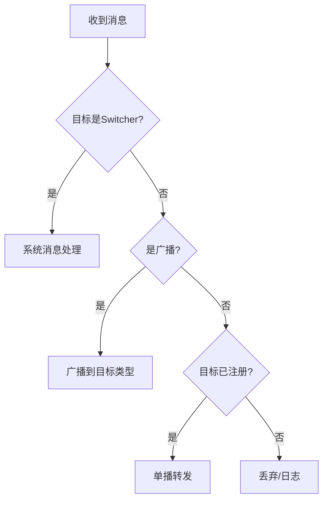

# 02 - Switcher 设计纲要

## 📋 里程碑追踪

| # | 里程碑 | 状态 | 验收标准 |
|---|--------|:----:|----------|
| M1 | 文档理解 | ⬜ | 理解32字节Header和路由逻辑 |
| M2 | Go-TCP监听 | ⬜ | 能接受连接并打印日志 |
| M3 | Go-消息解析 | ⬜ | 正确解析Header |
| M4 | Go-消息路由 | ⬜ | 按Target转发消息 |
| M5 | UE5-Client | ⬜ | 能连接Switcher发消息 |
| M6 | 集成测试 | ⬜ | DS↔Switcher双向通信 |

> **进度**: 0/6 = 0%

---

### M1: 文档理解

**验收标准**:
- [ ] 理解32字节Header结构
- [ ] 理解路由表设计
- [ ] 理解连接管理

**完成日期**: ____

---

### M2: Go-TCP监听

**目标**: `ServerGo/cmd/switcher/main.go`

**任务**:
- [ ] 创建main入口
- [ ] 实现TCP Listen
- [ ] 实现Accept循环
- [ ] 每个连接打印日志

**验收标准**:
```bash
go run cmd/switcher/main.go
# 监听 :9000 成功
# telnet localhost 9000 连接成功
```

**完成日期**: ____

---

### M3: Go-消息解析

**目标**: `ServerGo/internal/protocol/frame.go`

**任务**:
- [ ] 定义 `FrameHeader` struct (32字节)
- [ ] 实现 `ReadFrame()` 从conn读取
- [ ] 实现 `WriteFrame()` 写入conn
- [ ] 实现Header校验 (Magic Number)

**验收标准**:
```bash
go test ./internal/protocol/... -v
# 全部 PASS
```

**完成日期**: ____

---

### M4: Go-消息路由

**目标**: `ServerGo/internal/switcher/router.go`

**任务**:
- [ ] 实现路由表 `map[ServiceAddress]Connection`
- [ ] 实现 `Register()` 注册服务
- [ ] 实现 `Route()` 消息转发
- [ ] 处理目标不存在

**验收标准**:
```
两个telnet客户端互相发消息成功
```

**完成日期**: ____

---

### M5: UE5-SwitcherClient

**目标**: `Source/DJ01/Network/Distributed/DJ01SwitcherClient.h/cpp`

**任务**:
- [ ] 创建 `UDJ01SwitcherClient` GameInstanceSubsystem
- [ ] 实现 `Connect(Host, Port)`
- [ ] 实现 `Disconnect()`
- [ ] 实现 `SendMessage(Target, MsgType, Payload)`
- [ ] 实现消息接收回调

**验收标准**:
```
UE5编辑器中连接Switcher成功
```

**完成日期**: ____

---

### M6: 集成测试

**测试用例**:
- [ ] TC-1: UE5连接Switcher
- [ ] TC-2: UE5发送消息到Switcher
- [ ] TC-3: 两个UE5实例互相发消息

**完成日期**: ____

## 定位

Switcher是分布式系统的**消息路由中心**，所有服务间通信都经过它中转。



---

## 核心职责

| 职责 | 说明 |
|------|------|
| **连接管理** | 维护所有服务的TCP长连接 |
| **消息路由** | 根据目标地址转发消息 |
| **服务注册** | 接收服务注册，维护服务表 |
| **心跳检测** | 检测服务存活状态 |
| **广播分发** | 处理广播消息 |

---

## 消息头格式 (32字节)

```
┌──────────┬──────────┬──────────┬──────────┐
│ Magic    │ TotalLen │ SrcAddr  │ DstAddr  │
│ (4B)     │ (4B)     │ (4B)     │ (4B)     │
├──────────┼──────────┼──────────┼──────────┤
│ MsgType  │ SeqId    │ Timestamp│ Flags    │
│ (4B)     │ (4B)     │ (4B)     │ (4B)     │
└──────────┴──────────┴──────────┴──────────┘
```

| 字段 | 大小 | 说明 |
|------|------|------|
| Magic | 4B | 固定值 0x444A3031 ("DJ01") |
| TotalLen | 4B | 消息总长度(含头) |
| SrcAddr | 4B | 源ServiceAddress |
| DstAddr | 4B | 目标ServiceAddress |
| MsgType | 4B | 消息类型ID |
| SeqId | 4B | 序列号(请求响应匹配) |
| Timestamp | 4B | Unix时间戳 |
| Flags | 4B | 标志位 |

---

## 消息类型分配

| 范围 | 类别 | 示例 |
|------|------|------|
| 0x0001-0x00FF | 系统消息 | 心跳、注册、发现 |
| 0x0100-0x01FF | 玩家消息 | 登录、传送 |
| 0x0200-0x02FF | 场景消息 | 进入、离开 |
| 0x0300-0x03FF | Ghost消息 | 创建、销毁、同步 |
| 0x0400-0x04FF | 战斗消息 | 技能、伤害 |
| 0x0500-0x05FF | 聊天消息 | 世界、私聊 |

---

## 路由规则



---

## 待实现

### Go实现 (ServerGo/cmd/switcher/)
- [ ] TCP Server启动
- [ ] 连接管理 (goroutine per conn)
- [ ] 消息解析与路由
- [ ] 服务注册表
- [ ] 心跳超时检测
- [ ] 广播逻辑

### UE5实现 (SwitcherClient)
- [ ] TCP客户端连接
- [ ] 消息序列化/反序列化
- [ ] 自动重连
- [ ] 心跳发送

### Proto定义
- [ ] MessageHeader
- [ ] SystemMessages (心跳、注册)
- [ ] 各类游戏消息

---

## 接口定义

### Go
```go
// Switcher主结构 (待实现)
type Switcher struct {
    services map[uint32]*ServiceConn  // addr -> conn
    // ...
}

func (s *Switcher) Start(addr string) error
func (s *Switcher) RouteMessage(msg *Message) error
func (s *Switcher) RegisterService(addr ServiceAddress, conn net.Conn)
func (s *Switcher) UnregisterService(addr ServiceAddress)
func (s *Switcher) Broadcast(targetType ServiceType, msg *Message)
```

### UE5
```cpp
// SwitcherClient (待实现)
UCLASS()
class UDJ01SwitcherClient : public UGameInstanceSubsystem
{
    bool Connect(const FString& Host, int32 Port);
    void Disconnect();
    void SendMessage(FDJ01ServiceAddress Target, int32 MsgType, const TArray<uint8>& Payload);
    void RegisterService(FDJ01ServiceAddress LocalAddr, int32 GamePort);
    
    UPROPERTY() FOnMessageReceived OnMessageReceived;
};
```

---

## 配置项

| 配置 | 默认值 | 说明 |
|------|--------|------|
| ListenPort | 9000 | 监听端口 |
| HeartbeatInterval | 5s | 心跳间隔 |
| HeartbeatTimeout | 30s | 心跳超时 |
| MaxMessageSize | 64KB | 最大消息大小 |
| MaxConnections | 1000 | 最大连接数 |