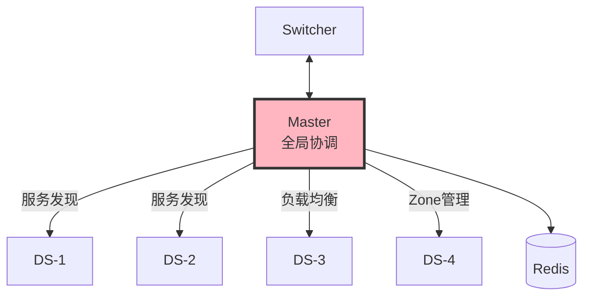
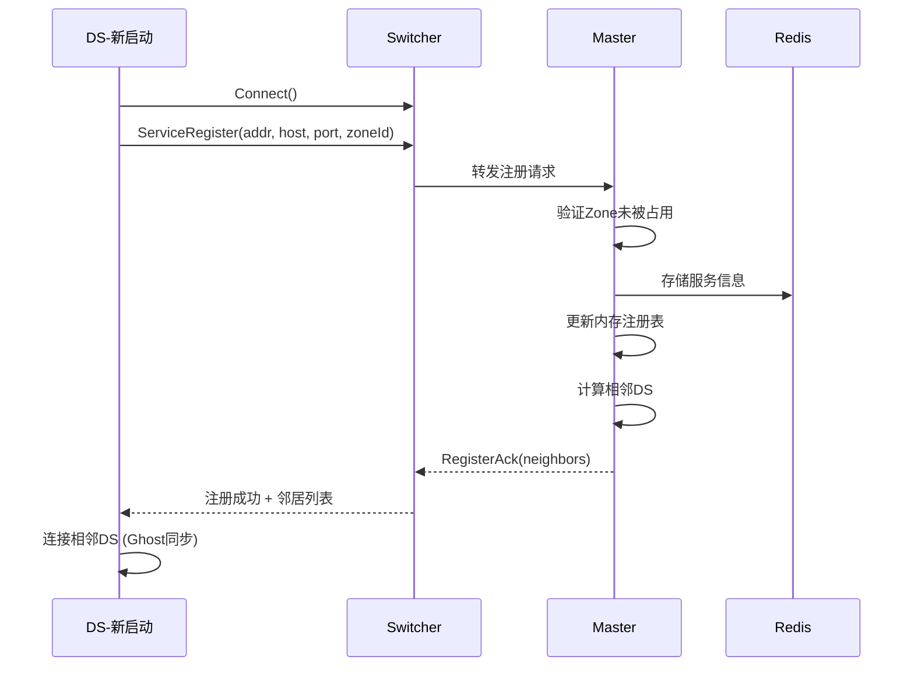
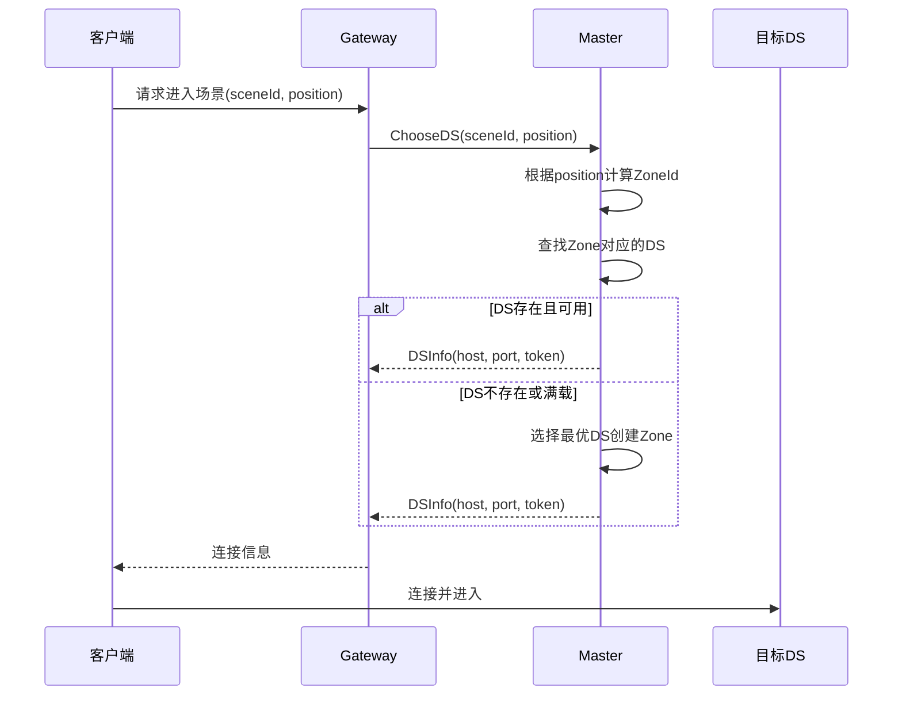
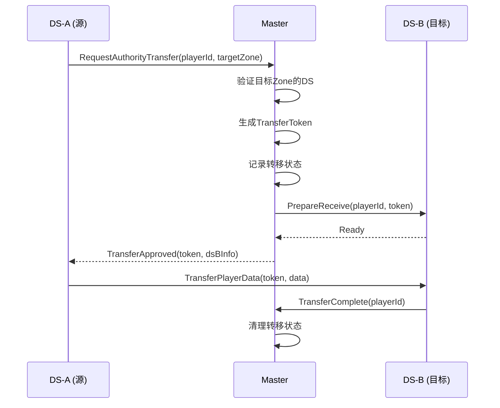

# 03 - Master 设计纲要

## 📋 里程碑追踪

| # | 里程碑 | 状态 | 验收标准 |
|---|--------|:----:|----------|
| M1 | 文档理解 | ⬜ | 理解服务注册/发现机制 |
| M2 | Go-服务注册 | ⬜ | DS注册成功，Master记录 |
| M3 | Go-服务发现 | ⬜ | 查询返回正确DS列表 |
| M4 | Go-负载均衡 | ⬜ | 优先返回低负载DS |
| M5 | Go-心跳检测 | ⬜ | 超时DS自动剔除 |

> **进度**: 0/5 = 0%

---

### M1: 文档理解

- [ ] 理解注册协议
- [ ] 理解发现协议
- [ ] 理解负载均衡算法

**完成日期**: ____

---

### M2: Go-服务注册

**目标**: `ServerGo/internal/master/registry.go`

- [ ] 实现 `Registry` struct
- [ ] 实现 `Register(ServiceInfo)` 
- [ ] 实现 `Unregister(ServiceAddress)`
- [ ] 处理重复注册

**验收**: DS发送注册消息，Master打印日志

**完成日期**: ____

---

### M3: Go-服务发现

- [ ] 实现 `GetServicesByType(type)` 
- [ ] 实现 `GetServiceByAddress(addr)`
- [ ] 实现 `GetZoneDS(zoneId)`

**验收**: 查询API返回正确结果

**完成日期**: ____

---

### M4: Go-负载均衡

- [ ] DS上报负载指标
- [ ] 实现加权选择算法
- [ ] 测试负载分散

**验收**: 100次请求，负载均衡分布

**完成日期**: ____

---

### M5: Go-心跳检测

- [ ] DS定期发心跳
- [ ] Master记录最后心跳时间
- [ ] 超时30秒剔除
- [ ] 日志输出

**验收**: 停止DS，30秒后Master剔除

**完成日期**: ____

## 定位

Master是分布式系统的**全局协调中心**，负责服务发现、负载均衡、玩家路由。



---

## 核心职责

| 职责 | 说明 |
|------|------|
| **服务注册** | 接收DS启动时的注册请求 |
| **服务发现** | 提供服务查询接口 |
| **负载均衡** | 根据权重选择最优DS |
| **Zone管理** | 维护Zone与DS的映射关系 |
| **玩家路由** | 决定玩家进入哪个DS |
| **权威转移协调** | 协调跨DS的权威转移 |

---

## 数据结构

### 服务注册表

```
ServiceRegistry {
    services: Map<ServiceAddress, ServiceInfo>
    byType: Map<ServiceType, Set<ServiceAddress>>
    byZone: Map<ZoneId, ServiceAddress>
}
```

### 服务信息

```
ServiceInfo {
    address: ServiceAddress      // 服务地址
    host: string                 // IP地址
    port: int                    // 游戏端口
    status: ServiceStatus        // 状态
    lastHeartbeat: timestamp     // 最后心跳
    
    // 负载指标
    cpuUsage: float             // CPU使用率 0-1
    memoryUsage: float          // 内存使用率 0-1
    playerCount: int            // 当前玩家数
    maxPlayers: int             // 最大玩家数
    
    // Zone信息 (仅GAS类型)
    zoneId: ZoneId              // 负责的Zone
    neighbors: []ServiceAddress // 相邻DS
}
```

### 服务状态

```
ServiceStatus {
    Starting = 0    // 启动中
    Running = 1     // 运行中
    Busy = 2        // 高负载
    Stopping = 3    // 停止中
    Offline = 4     // 离线
}
```

### Zone定义

```
ZoneId {
    worldId: int16     // 世界实例ID
    x: int8            // Zone X坐标
    y: int8            // Zone Y坐标
}

// 编码: worldId << 16 | x << 8 | y
// 示例: Zone(1, 0, 0) = 0x00010000
```

---

## 核心流程

### 1. DS启动注册



### 2. 玩家进入场景



### 3. 负载均衡算法

```
计算权重:
weight = 100 * (2.0 - cpuUsage - playerCount/maxPlayers)

选择策略:
1. 过滤掉 status != Running 的服务
2. 过滤掉 playerCount >= maxPlayers 的服务
3. 按权重随机选择 (权重越高被选中概率越大)
```

### 4. 权威转移协调



---

## 消息定义

| 消息类型 | ID | 方向 | 说明 |
|---------|-----|------|------|
| ServiceRegister | 0x0010 | DS→Master | 服务注册 |
| ServiceRegisterAck | 0x0011 | Master→DS | 注册响应 |
| ServiceUnregister | 0x0012 | DS→Master | 服务注销 |
| ServiceHeartbeat | 0x0013 | DS→Master | 心跳(含负载) |
| ServiceQuery | 0x0020 | Any→Master | 查询服务 |
| ServiceQueryResult | 0x0021 | Master→Any | 查询结果 |
| ChooseDS | 0x0030 | GW→Master | 选择DS |
| ChooseDSResult | 0x0031 | Master→GW | DS信息 |
| AuthorityTransferReq | 0x0040 | DS→Master | 请求转移 |
| AuthorityTransferApproved | 0x0041 | Master→DS | 转移批准 |
| AuthorityTransferComplete | 0x0042 | DS→Master | 转移完成 |

---

## 待实现

### Go实现 (ServerGo/cmd/master/)

```
master/
├── main.go              # 入口
├── config.go            # 配置
├── server.go            # 主服务
├── registry.go          # 服务注册表
├── balancer.go          # 负载均衡
├── zone_manager.go      # Zone管理
└── transfer.go          # 权威转移
```

**核心接口：**

```go
// 服务注册表 (待实现)
type Registry interface {
    Register(info *ServiceInfo) error
    Unregister(addr ServiceAddress) error
    Update(addr ServiceAddress, metrics *Metrics) error
    
    Get(addr ServiceAddress) (*ServiceInfo, bool)
    GetByType(svcType ServiceType) []*ServiceInfo
    GetByZone(zoneId ZoneId) (*ServiceInfo, bool)
}

// 负载均衡器 (待实现)
type Balancer interface {
    ChooseBest(svcType ServiceType, exclude []ServiceAddress) (*ServiceInfo, error)
    ChooseForZone(zoneId ZoneId) (*ServiceInfo, error)
}

// Zone管理器 (待实现)
type ZoneManager interface {
    AssignZone(zoneId ZoneId, ds ServiceAddress) error
    GetDSForZone(zoneId ZoneId) (ServiceAddress, bool)
    GetNeighbors(zoneId ZoneId) []ServiceAddress
    CalculateZone(worldId int, position Vector3) ZoneId
}
```

### 消息处理器

```go
// Master消息处理 (待实现)
func (m *Master) HandleMessage(msg *Message) {
    switch msg.Type {
    case MsgServiceRegister:
        m.handleRegister(msg)
    case MsgServiceHeartbeat:
        m.handleHeartbeat(msg)
    case MsgChooseDS:
        m.handleChooseDS(msg)
    case MsgAuthorityTransferReq:
        m.handleTransferRequest(msg)
    // ...
    }
}
```

---

## 配置项

| 配置 | 默认值 | 说明 |
|------|--------|------|
| HeartbeatTimeout | 30s | 心跳超时时间 |
| ZoneSizeMeters | 2000 | Zone边长(米) |
| MaxPlayersPerDS | 100 | 单DS最大玩家 |
| BusyThreshold | 0.8 | 繁忙阈值(CPU) |
| RedisAddr | localhost:6379 | Redis地址 |

---

## Redis数据结构

```
# 服务信息 (Hash)
service:{address} -> {
    host: "192.168.1.10",
    port: 7777,
    status: 1,
    cpu: 0.3,
    players: 50,
    zoneId: 65536
}

# 按类型索引 (Set)
services:type:{typeId} -> [addr1, addr2, ...]

# Zone映射 (Hash)  
zones:{worldId} -> {
    "0,0": addr1,
    "1,0": addr2,
    ...
}

# 活跃服务 (Sorted Set, score=最后心跳时间)
services:active -> [(addr1, ts1), (addr2, ts2), ...]
```

---

## 高可用考虑

| 场景 | 处理方式 |
|------|---------|
| Master宕机 | Redis持久化 + 快速重启恢复 |
| DS宕机 | 心跳超时检测 → 通知相邻DS → 清理Ghost |
| 网络分区 | 心跳超时 → 保守策略(不分配新玩家) |

> 💡 Demo阶段先实现单Master，后续可扩展为主备模式

---

## 下一步

- `04_Gateway.md` - 客户端接入网关
- `05_MessageProtocol.md` - 完整消息协议定义