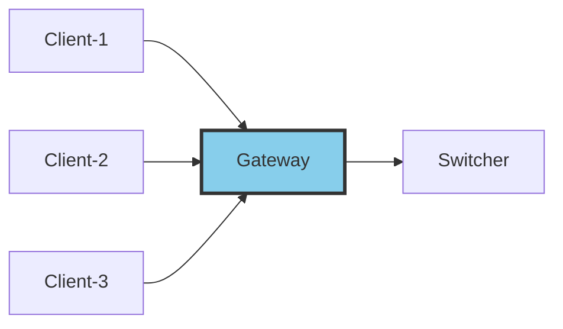
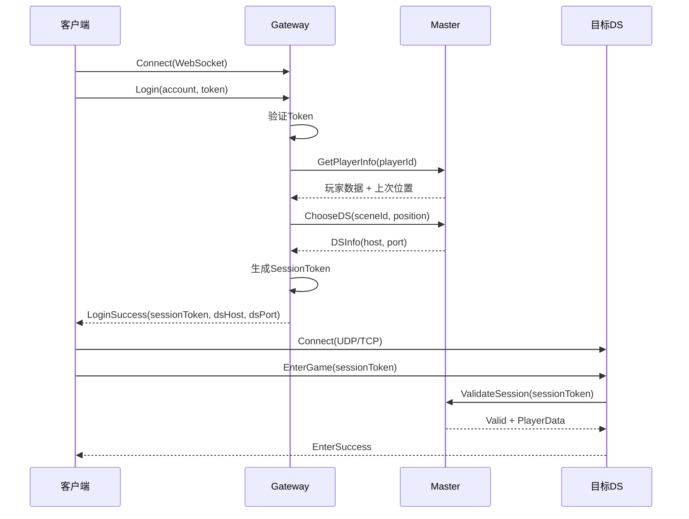

# 04 - Gateway 设计纲要

## 📋 里程碑追踪

| # | 里程碑 | 状态 | 验收标准 |
|---|--------|:----:|----------|
| M1 | 文档理解 | ⬜ | 理解登录/分配流程 |
| M2 | Go-HTTP服务 | ⬜ | 监听8080端口 |
| M3 | Go-登录API | ⬜ | /api/login 返回Token |
| M4 | Go-进入世界API | ⬜ | /api/enter_world 返回DS地址 |
| M5 | UE5-HTTP客户端 | ⬜ | 登录→获取DS→连接成功 |

> **进度**: 0/5 = 0%

---

### M1: 文档理解

- [ ] 理解Gateway在架构中的位置
- [ ] 理解登录流程
- [ ] 理解Token机制
- [ ] 理解与Master的交互

**完成日期**: ____

---

### M2: Go-HTTP服务

**目标**: `ServerGo/cmd/gateway/main.go`

- [ ] 创建main入口
- [ ] 使用 `net/http` 监听8080
- [ ] 添加CORS支持
- [ ] 添加日志中间件

**验收**:
```bash
go run cmd/gateway/main.go
curl http://localhost:8080/health
# {"status":"ok"}
```

**完成日期**: ____

---

### M3: Go-登录API

**目标**: `ServerGo/internal/gateway/handler_login.go`

- [ ] 实现 POST `/api/login`
- [ ] 解析 username/password
- [ ] 生成JWT Token
- [ ] 返回 token + player_id

**验收**:
```bash
curl -X POST http://localhost:8080/api/login \
  -H "Content-Type: application/json" \
  -d '{"username":"test","password":"123"}'
# {"success":true,"token":"xxx","player_id":1001}
```

**完成日期**: ____

---

### M4: Go-进入世界API

**目标**: `ServerGo/internal/gateway/handler_enter.go`

- [ ] 实现 POST `/api/enter_world`
- [ ] 验证Token
- [ ] 向Master查询DS
- [ ] 生成EntryToken
- [ ] 返回DS地址

**验收**:
```bash
curl -X POST http://localhost:8080/api/enter_world \
  -H "Authorization: Bearer xxx" \
  -H "Content-Type: application/json"
# {"success":true,"ds_ip":"127.0.0.1","ds_port":7777,"entry_token":"yyy"}
```

**完成日期**: ____

---

### M5: UE5-HTTP客户端

**目标**: `Source/DJ01/Network/Distributed/DJ01ConnectionManager.h/cpp`

- [ ] 创建 `UDJ01ConnectionManager` Subsystem
- [ ] 实现 `Login(username, password, callback)`
- [ ] 实现 `EnterWorld(callback)`
- [ ] 实现 `ConnectToDS(ip, port, token)`
- [ ] 错误处理

**验收**: UE5中运行，登录→进入世界→连接DS成功

**完成日期**: ____

## 定位

Gateway是**客户端接入层**，负责处理外部连接、协议转换、身份验证。



---

## 核心职责

| 职责 | 说明 |
|------|------|
| **连接管理** | 维护客户端长连接(WebSocket/TCP) |
| **协议转换** | 客户端协议 ↔ 内部协议 |
| **身份验证** | Token验证、Session管理 |
| **消息转发** | 客户端消息转发到对应DS |
| **安全防护** | 限流、DDoS防护、加密 |

---

## 连接模式

### 方案A: Gateway代理模式

```
Client ──WebSocket──> Gateway ──TCP──> DS
                         │
                         └──TCP──> Switcher
```

- 客户端只连Gateway
- Gateway转发所有消息
- 优点：统一入口，便于安全控制
- 缺点：Gateway压力大

### 方案B: Gateway+直连混合模式 (推荐)

```
Client ──WebSocket──> Gateway (登录、选服)
   │
   └────UDP/TCP────> DS (游戏数据)
```

- 登录/选服走Gateway
- 游戏数据直连DS
- 优点：减轻Gateway压力
- 缺点：需要DS暴露端口

> 💡 Demo阶段采用方案B，降低复杂度

---

## 客户端连接流程



---

## 消息定义

### 客户端→Gateway

| 消息 | ID | 说明 |
|------|-----|------|
| C2G_Login | 0x1001 | 登录请求 |
| C2G_Logout | 0x1002 | 登出请求 |
| C2G_SelectServer | 0x1003 | 选择服务器 |
| C2G_EnterScene | 0x1004 | 进入场景请求 |
| C2G_Heartbeat | 0x1005 | 心跳 |

### Gateway→客户端

| 消息 | ID | 说明 |
|------|-----|------|
| G2C_LoginResult | 0x2001 | 登录结果 |
| G2C_ServerList | 0x2002 | 服务器列表 |
| G2C_EnterSceneResult | 0x2003 | 进入场景结果(含DS信息) |
| G2C_Kick | 0x2004 | 踢下线 |
| G2C_HeartbeatAck | 0x2005 | 心跳响应 |

---

## 数据结构

### 客户端Session

```
ClientSession {
    sessionId: string           // Session ID
    accountId: string           // 账号ID
    playerId: uint64            // 玩家ID
    
    connectedAt: timestamp      // 连接时间
    lastActive: timestamp       // 最后活跃
    
    currentDS: ServiceAddress   // 当前所在DS
    state: SessionState         // 状态
}
```

### Session状态

```
SessionState {
    Connected = 0      // 已连接，未登录
    LoggedIn = 1       // 已登录
    InGame = 2         // 游戏中
    Transferring = 3   // 传送中
}
```

---

## 待实现

### Go实现 (ServerGo/cmd/gateway/)

```
gateway/
├── main.go              # 入口
├── config.go            # 配置
├── server.go            # WebSocket服务器
├── session.go           # Session管理
├── handler.go           # 消息处理
├── auth.go              # 身份验证
└── ratelimit.go         # 限流
```

**核心接口：**

```go
// Session管理 (待实现)
type SessionManager interface {
    Create(conn *websocket.Conn) *Session
    Get(sessionId string) (*Session, bool)
    GetByPlayer(playerId uint64) (*Session, bool)
    Remove(sessionId string)
    
    UpdateState(sessionId string, state SessionState)
    UpdateDS(sessionId string, ds ServiceAddress)
}

// 消息处理器 (待实现)
type Handler interface {
    HandleLogin(session *Session, msg *C2G_Login) error
    HandleLogout(session *Session) error
    HandleEnterScene(session *Session, msg *C2G_EnterScene) error
}

// 限流器 (待实现)
type RateLimiter interface {
    Allow(clientIP string) bool
    AllowMessage(sessionId string, msgType int) bool
}
```

---

## 配置项

| 配置 | 默认值 | 说明 |
|------|--------|------|
| ListenAddr | :8080 | WebSocket监听地址 |
| MaxConnections | 10000 | 最大连接数 |
| SessionTimeout | 300s | Session超时 |
| HeartbeatInterval | 30s | 心跳间隔 |
| RateLimit | 100/s | 单IP请求限制 |
| MessageRateLimit | 50/s | 单Session消息限制 |

---

## 安全措施

| 措施 | 说明 |
|------|------|
| **Token验证** | 登录时验证账号Token |
| **Session签名** | SessionToken使用HMAC签名 |
| **限流** | IP级别 + Session级别限流 |
| **消息校验** | 验证消息格式、长度 |
| **TLS** | WebSocket使用WSS |

---

## 与其他组件的交互

| 组件 | 交互方式 | 用途 |
|------|---------|------|
| Switcher | TCP长连接 | 内部消息路由 |
| Master | 通过Switcher | 玩家路由、Session验证 |
| Redis | 直连 | Session存储 |

---

## 下一步

- `05_MessageProtocol.md` - 完整的Protobuf消息定义