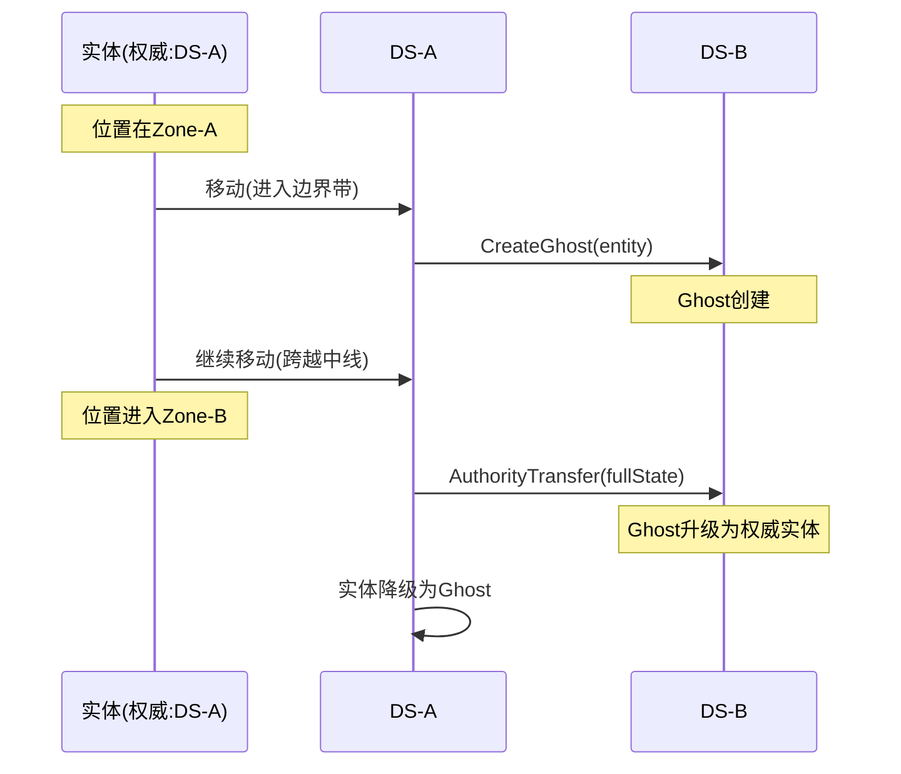

# 06 - 场景分割策略

## 📋 里程碑追踪

| # | 里程碑 | 状态 | 验收标准 |
|---|--------|:----:|----------|
| M1 | 文档理解 | ⬜ | 理解Zone划分和边界带 |
| M2 | UE5-ZoneManager | ⬜ | 坐标→Zone计算正确 |
| M3 | UE5-边界检测 | ⬜ | 进入边界带触发事件 |
| M4 | 集成测试 | ⬜ | 边界检测→Ghost创建链路通 |

> **进度**: 0/4 = 0%

---

### M1: 文档理解

- [ ] 理解Zone尺寸 (2km × 2km)
- [ ] 理解边界带宽度 (200m)
- [ ] 理解Zone坐标计算公式
- [ ] 理解邻居Zone查询

**完成日期**: ____

---

### M2: UE5-ZoneManager

**目标**: `Source/DJ01/Network/ScenePartition/DJ01ZoneManager.h/cpp`

- [ ] 创建 `ADJ01ZoneManager` Actor
- [ ] 配置 ZoneSize, BoundaryWidth
- [ ] 实现 `CalculateZone(WorldPos)` → ZoneId
- [ ] 实现 `IsInBoundary(WorldPos)` → bool
- [ ] 实现 `GetNeighborZones(WorldPos)` → array

**验收**:
| 输入坐标 | 期望Zone | 期望InBoundary |
|----------|----------|----------------|
| (0, 0, 0) | (0, 0) | false |
| (190000, 0, 0) | (0, 0) | true (东边界) |
| (210000, 0, 0) | (1, 0) | true (西边界) |

**完成日期**: ____

---

### M3: UE5-边界检测

**目标**: `Source/DJ01/Network/ScenePartition/DJ01ZoneBoundaryComponent.h/cpp`

- [ ] 创建 `UDJ01ZoneBoundaryComponent` 
- [ ] Tick中检测位置变化
- [ ] 进入边界带时广播 `OnEnterBoundary`
- [ ] 离开边界带时广播 `OnLeaveBoundary`
- [ ] 携带邻居Zone列表

**验收**: 角色移动到边界，控制台输出事件日志

**完成日期**: ____

---

### M4: 集成测试

**前置**: M2, M3, 07_GhostEntity M2 完成

**测试用例**:
- [ ] 角色进入边界带 → `OnEnterBoundary` 触发
- [ ] GhostManager收到事件
- [ ] 向相邻DS发送Ghost创建请求

**完成日期**: ____

## 概述

将大世界地图分割成多个Zone，每个Zone由独立的DS负责，实现水平扩展。

---

## Zone划分

### 网格布局

```
┌─────────────────────────────────────────────────────────┐
│                    大世界 (8km × 8km)                    │
├─────────────┬─────────────┬─────────────┬─────────────┤
│  Zone(0,0)  │  Zone(1,0)  │  Zone(2,0)  │  Zone(3,0)  │
│    DS-1     │    DS-2     │    DS-3     │    DS-4     │
│  2km×2km    │  2km×2km    │  2km×2km    │  2km×2km    │
├─────────────┼─────────────┼─────────────┼─────────────┤
│  Zone(0,1)  │  Zone(1,1)  │  Zone(2,1)  │  Zone(3,1)  │
│    DS-5     │    DS-6     │    DS-7     │    DS-8     │
├─────────────┼─────────────┼─────────────┼─────────────┤
│  Zone(0,2)  │  Zone(1,2)  │  Zone(2,2)  │  Zone(3,2)  │
│    DS-9     │    DS-10    │    DS-11    │    DS-12    │
├─────────────┼─────────────┼─────────────┼─────────────┤
│  Zone(0,3)  │  Zone(1,3)  │  Zone(2,3)  │  Zone(3,3)  │
│    DS-13    │    DS-14    │    DS-15    │    DS-16    │
└─────────────┴─────────────┴─────────────┴─────────────┘
```

### 参数配置

| 参数 | 默认值 | 说明 |
|------|--------|------|
| ZoneSize | 2000m | Zone边长 |
| BoundaryWidth | 200m | 边界带宽度 |
| WorldOrigin | (0, 0, 0) | 世界原点 |

---

## 边界带设计

### 边界带位置

```
┌─────────────────────────────────────────┐
│                Zone(0,0)                 │
│  ┌───────────────────────────────────┐  │
│  │                                   │  │
│  │          内部区域                  │  │
│  │        (1600m × 1600m)            │  │
│  │                                   │  │
│  │                                   │  │
│  └───────────────────────────────────┘  │
│  │◄─────── 边界带 200m ───────►│        │
└──┴───────────────────────────────┴──────┘
```

### 边界类型

| 边界 | 相邻Zone | 方向 |
|------|---------|------|
| 北边界 | (x, y-1) | -Y |
| 南边界 | (x, y+1) | +Y |
| 西边界 | (x-1, y) | -X |
| 东边界 | (x+1, y) | +X |
| 角落 | 对角Zone | 四角 |

---

## 坐标计算

### Zone坐标计算

```
输入: 世界坐标 (worldX, worldY)
输出: ZoneId (zoneX, zoneY)

zoneX = floor(worldX / ZoneSize)
zoneY = floor(worldY / ZoneSize)
```

### Zone内局部坐标

```
localX = worldX - zoneX * ZoneSize
localY = worldY - zoneY * ZoneSize
```

### 判断是否在边界带

```
isInBoundary = (localX < BoundaryWidth) ||
               (localX > ZoneSize - BoundaryWidth) ||
               (localY < BoundaryWidth) ||
               (localY > ZoneSize - BoundaryWidth)
```

### 获取相邻Zone

```
neighbors = []
if localX < BoundaryWidth:
    neighbors.append(Zone(zoneX-1, zoneY))  // 西
if localX > ZoneSize - BoundaryWidth:
    neighbors.append(Zone(zoneX+1, zoneY))  // 东
if localY < BoundaryWidth:
    neighbors.append(Zone(zoneX, zoneY-1))  // 北
if localY > ZoneSize - BoundaryWidth:
    neighbors.append(Zone(zoneX, zoneY+1))  // 南
// 角落处理...
```

---

## 权威归属判定

### 规则

实体的权威归属取决于其**中心位置**所在的Zone：

```
权威Zone = CalculateZone(entity.position)
```

### 权威转移触发条件

```
当 CurrentAuthorityZone != CalculateZone(newPosition) 时触发转移
```

### 转移时序



---

## UE5集成

### World Partition

- 使用UE5 World Partition作为基础
- Zone边界对齐World Partition Grid
- 利用Level Streaming加载/卸载

### 关键类

| 类 | 职责 |
|-----|------|
| `ADJ01WorldPartitionManager` | Zone管理、边界检测 |
| `UDJ01ZoneBoundaryComponent` | 边界检测组件 |
| `FDJ01ZoneId` | Zone标识结构 |

---

## 待实现

### UE5侧

```cpp
// Zone管理器 (待实现)
UCLASS()
class ADJ01WorldPartitionManager : public AActor
{
    // 配置
    float ZoneSize = 200000.f;      // 2km = 200000 UU
    float BoundaryWidth = 20000.f;  // 200m
    
    // 计算Zone
    FDJ01ZoneId CalculateZone(const FVector& WorldPos) const;
    
    // 判断是否在边界
    bool IsInBoundary(const FVector& WorldPos) const;
    
    // 获取相邻Zone
    TArray<FDJ01ZoneId> GetNeighborZones(const FVector& WorldPos) const;
};
```

```cpp
// 边界检测组件 (待实现)
UCLASS()
class UDJ01ZoneBoundaryComponent : public UActorComponent
{
    // 当进入边界带时触发
    UPROPERTY() FOnEnterBoundary OnEnterBoundary;
    
    // 当离开边界带时触发
    UPROPERTY() FOnLeaveBoundary OnLeaveBoundary;
    
    // 当跨越Zone时触发
    UPROPERTY() FOnZoneCrossing OnZoneCrossing;
};
```

### Go侧

```go
// Zone计算工具 (待实现)
type ZoneCalculator struct {
    ZoneSize       float64
    BoundaryWidth  float64
}

func (z *ZoneCalculator) CalculateZone(x, y float64) ZoneId
func (z *ZoneCalculator) IsInBoundary(x, y float64) bool
func (z *ZoneCalculator) GetNeighbors(zoneId ZoneId) []ZoneId
```

---

## 配置项

| 配置 | 默认值 | 说明 |
|------|--------|------|
| ZoneSizeMeters | 2000 | Zone边长(米) |
| BoundaryWidthMeters | 200 | 边界带宽度(米) |
| MaxZonesPerWorld | 256 | 单世界最大Zone数 |
| ZoneLoadRadius | 1 | 预加载相邻Zone半径 |

---

## 下一步

- `07_GhostEntity.md` - Ghost实体系统设计