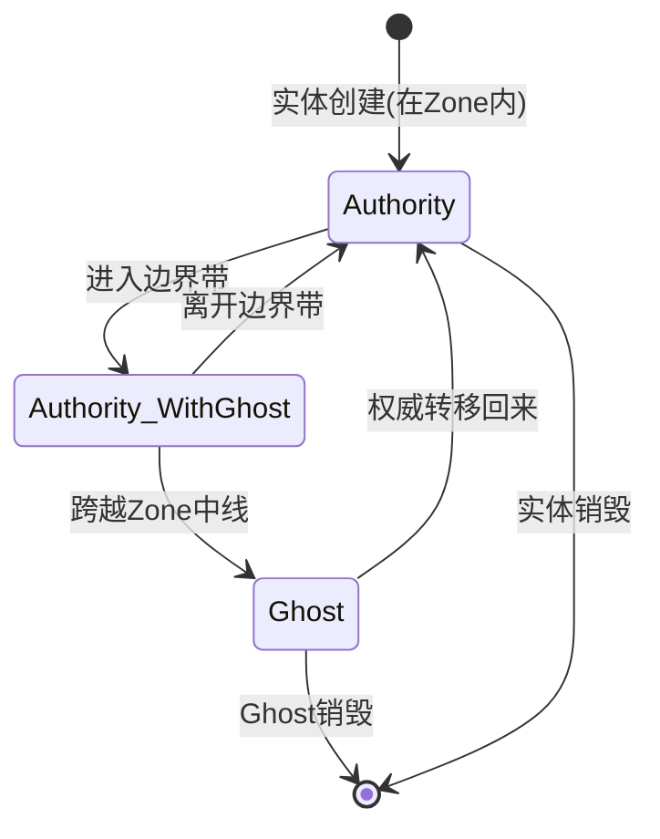
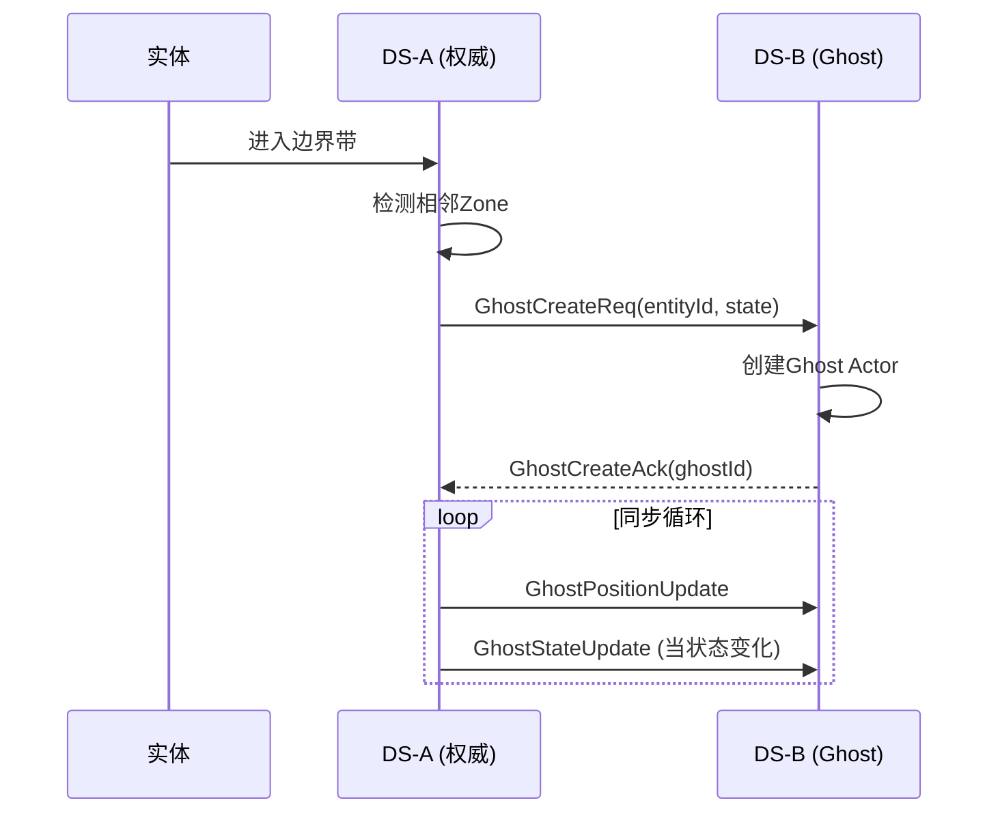
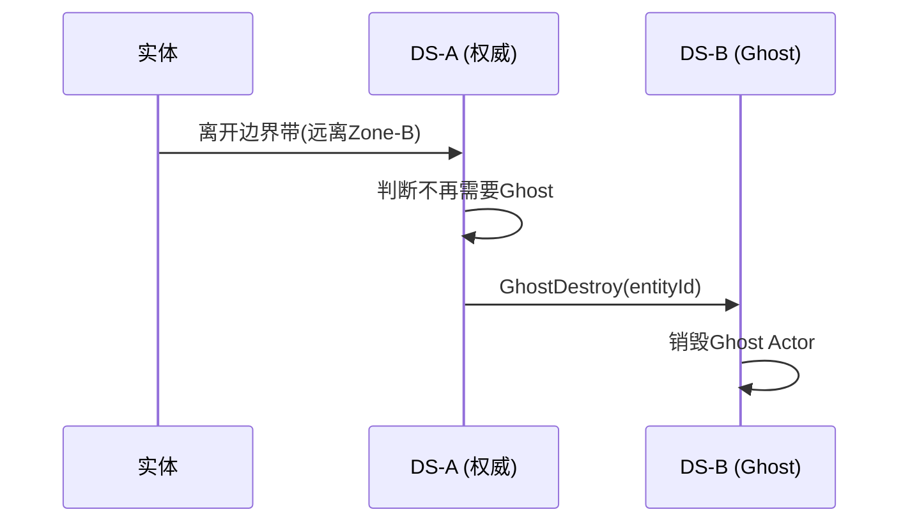
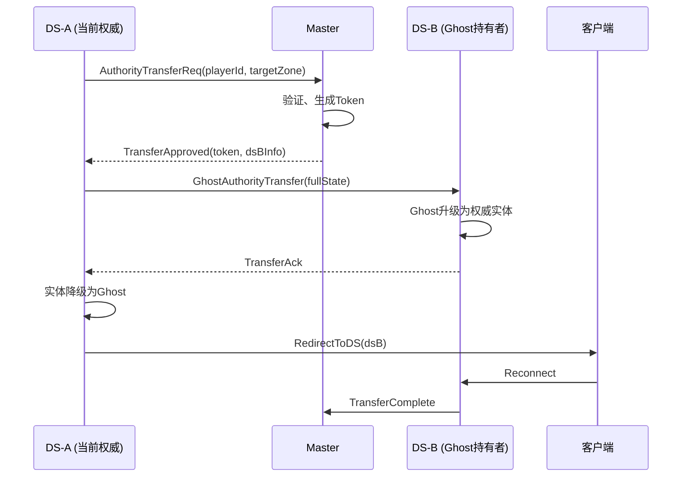

# 07 - Ghost实体系统

## 📋 里程碑追踪

| #   | 里程碑              | 状态  | 验收标准                  |
| --- | ---------------- | :-: | --------------------- |
| M1  | 文档理解             |  ⬜  | 理解Ghost生命周期           |
| M2  | UE5-GhostManager |  ⬜  | 创建/销毁Ghost            |
| M3  | UE5-GhostActor   |  ⬜  | 接收位置更新                |
| M4  | UE5-位置插值         |  ⬜  | Ghost移动平滑             |
| M5  | 跨DS同步测试          |  ⬜  | DS-A实体 → DS-B Ghost同步 |

> **进度**: 0/5 = 0%

---

### M1: 文档理解

- [ ] 理解Ghost vs 权威实体区别
- [ ] 理解创建/销毁时机
- [ ] 理解同步频率 (位置20Hz)
- [ ] 理解插值/预测策略

**完成日期**: ____

---

### M2: UE5-GhostManager

**目标**: `Source/DJ01/Network/Ghost/DJ01GhostManager.h/cpp`

- [ ] 创建 `UDJ01GhostManager` WorldSubsystem
- [ ] 实现 `CreateGhost(EntityId, Type, InitData)`
- [ ] 实现 `DestroyGhost(EntityId)`
- [ ] 实现 `GetGhost(EntityId)`
- [ ] 维护 `TMap<EntityId, GhostActor>`

**验收**: 代码中调用CreateGhost，场景中出现Ghost Actor

**完成日期**: ____

---

### M3: UE5-GhostActor

**目标**: `Source/DJ01/Network/Ghost/DJ01GhostActor.h/cpp`

- [ ] 创建 `ADJ01GhostActor` 基类
- [ ] 创建 `ADJ01GhostCharacter` 子类
- [ ] 实现 `UpdateFromNetwork(Pos, Vel, Time)`
- [ ] 实现 `ApplyStateData(bytes)`
- [ ] 禁用碰撞/输入

**验收**: Ghost Actor能接收位置更新

**完成日期**: ____

---

### M4: UE5-位置插值

**目标**: GhostActor内Tick插值

- [ ] 实现位置缓冲区 (存3-5帧)
- [ ] 实现100ms延迟插值
- [ ] 实现速度外推 (网络卡顿时)
- [ ] 调试可视化

**验收**: Ghost移动平滑，无跳变

**完成日期**: ____

---

### M5: 跨DS同步测试

**前置**: 02_Switcher, 06_SceneSegmentation 完成

**测试环境**:
```
DS-1 (Zone 0,0) + DS-2 (Zone 1,0)
玩家在DS-1，接近边界
```

**测试用例**:
- [ ] TC-1: 进入边界带 → DS-2收到GhostCreate
- [ ] TC-2: DS-2创建Ghost成功
- [ ] TC-3: 移动更新 → Ghost位置同步
- [ ] TC-4: 离开边界带 → Ghost销毁

**完成日期**: ____

---

## 概述

Ghost实体是跨DS边界时在相邻DS创建的**只读副本**，用于实现边界区域的可见性和交互。

---

## 核心概念

```mermaid
graph LR
    subgraph DS-A [DS-A (Zone 0,0)]
        E1[Entity-权威]
    end
    
    subgraph DS-B [DS-B (Zone 1,0)]
        G1[Ghost-只读]
    end
    
    E1 -.同步.-> G1
    
    style E1 fill:#90EE90
    style G1 fill:#FFB6C1
```

| 概念 | 说明 |
|------|------|
| **权威实体** | 拥有完整控制权的实体实例 |
| **Ghost实体** | 只读副本，接收同步数据 |
| **边界带** | 触发Ghost创建的区域 |

---

## 生命周期

### 状态转换



### 创建流程



### 销毁流程



---

## 同步策略

### 同步频率

| 数据类型 | 频率 | 协议 |
|---------|------|------|
| 位置/速度 | 20Hz | GhostPositionUpdate |
| 动画状态 | 事件驱动 | GhostAnimationUpdate |
| 属性状态 | 变化时 | GhostStateUpdate |
| 技能/战斗 | 事件驱动 | 对应消息 |

### 插值与预测

Ghost端需要对位置进行平滑处理：

```
接收时:
- 记录服务器时间戳
- 存入位置缓冲区

渲染时:
- 计算插值位置 (比服务器落后100ms)
- 或使用预测 (外推)
```

---

## 数据结构

### Ghost信息

```
GhostInfo {
    entityId: uint64         // 原始实体ID
    ghostId: uint64          // Ghost本地ID
    ownerDS: ServiceAddress  // 权威DS地址
    entityType: int          // 实体类型
    
    // 最新状态
    position: Vector3
    velocity: Vector3
    rotation: Rotator
    lastUpdateTime: timestamp
    
    // 状态数据
    stateBuffer: bytes
}
```

### Ghost类型

| 类型 | 说明 | 同步内容 |
|------|------|---------|
| Player Ghost | 玩家Ghost | 位置、动画、装备外观 |
| NPC Ghost | NPC Ghost | 位置、AI状态 |
| Vehicle Ghost | 载具Ghost | 位置、乘客 |
| Projectile Ghost | 弹道Ghost | 位置、速度 |

---

## UE5实现

### 类结构

```
ADJ01GhostActor              // Ghost基类
├── ADJ01GhostCharacter      // 角色Ghost
├── ADJ01GhostNPC            // NPC Ghost  
└── ADJ01GhostVehicle        // 载具Ghost

UDJ01GhostManager            // Ghost管理器(Subsystem)
UDJ01GhostReplicationComponent // Ghost同步组件
```

### 关键接口

```cpp
// Ghost管理器 (待实现)
UCLASS()
class UDJ01GhostManager : public UWorldSubsystem
{
    // 创建Ghost
    ADJ01GhostActor* CreateGhost(uint64 EntityId, int32 EntityType, 
                                  const FDJ01GhostInitData& InitData);
    
    // 销毁Ghost
    void DestroyGhost(uint64 EntityId);
    
    // 更新Ghost位置
    void UpdateGhostPosition(uint64 EntityId, const FVector& Position,
                             const FVector& Velocity, float Timestamp);
    
    // 更新Ghost状态
    void UpdateGhostState(uint64 EntityId, const TArray<uint8>& StateData);
    
    // 获取Ghost
    ADJ01GhostActor* GetGhost(uint64 EntityId);
    
    // 本地实体进入边界带时调用
    void OnLocalEntityEnterBoundary(AActor* Entity, const TArray<FDJ01ZoneId>& NeighborZones);
    
    // 本地实体离开边界带时调用
    void OnLocalEntityLeaveBoundary(AActor* Entity, const TArray<FDJ01ZoneId>& NeighborZones);
};
```

```cpp
// Ghost Actor基类 (待实现)
UCLASS()
class ADJ01GhostActor : public AActor
{
    // Ghost数据
    uint64 SourceEntityId;
    FDJ01ServiceAddress OwnerDS;
    
    // 插值
    FVector TargetPosition;
    FVector TargetVelocity;
    float LastUpdateServerTime;
    
    // 更新位置(带插值)
    virtual void UpdateFromNetwork(const FVector& Position, const FVector& Velocity,
                                    float ServerTime);
    
    // 应用状态数据
    virtual void ApplyStateData(const TArray<uint8>& StateData);
};
```

---

## 权威转移

### 转移流程



### 状态快照

转移时需要传输完整状态：

```
TransferSnapshot {
    // 基础属性
    position: Vector3
    rotation: Rotator
    velocity: Vector3
    
    // GAS状态
    attributes: bytes          // AttributeSet序列化
    activeEffects: bytes       // GameplayEffects
    abilities: bytes           // GrantedAbilities
    cooldowns: bytes           // AbilityCooldowns
    
    // 自定义状态
    inventory: bytes           // 背包
    buffs: bytes               // Buff
    // ...
}
```

---

## 配置项

| 配置 | 默认值 | 说明 |
|------|--------|------|
| PositionSyncRate | 20 | 位置同步频率(Hz) |
| StateSyncRate | 5 | 状态同步频率(Hz) |
| InterpolationDelay | 100ms | 插值延迟 |
| MaxGhostsPerZone | 500 | 单Zone最大Ghost数 |

---

## 优化考虑

| 优化 | 说明 |
|------|------|
| **增量同步** | 只同步变化的状态 |
| **优先级** | 近处Ghost同步频率高于远处 |
| **LOD** | 远处Ghost减少细节 |
| **批量发送** | 合并多个Ghost更新 |

---

## 下一步

- `08_AuthorityTransfer.md` - 权威转移详细设计
- `09_DS_Integration.md` - UE5 DS集成