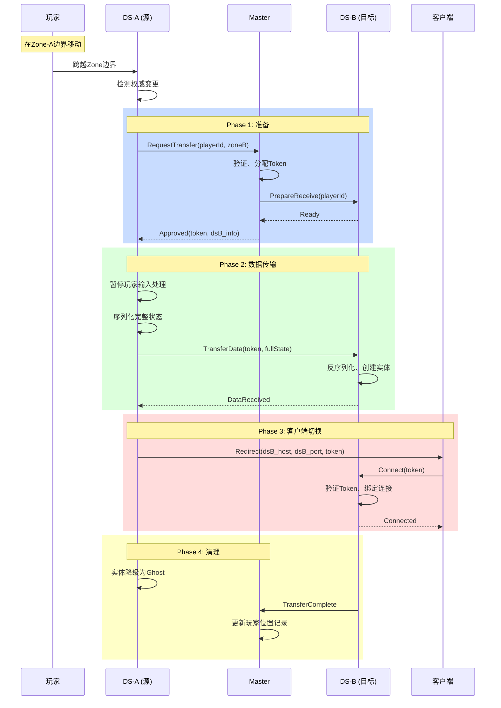

# 08 - 权威转移机制

## 📋 里程碑追踪

| # | 里程碑 | 状态 | 验收标准 |
|---|--------|:----:|----------|
| M1 | 文档理解 | ⬜ | 理解转移流程 |
| M2 | Go-Master转移协调 | ⬜ | 审批转移请求 |
| M3 | UE5-TransferManager | ⬜ | 发起/接收转移 |
| M4 | UE5-状态序列化 | ⬜ | 玩家状态完整打包 |
| M5 | UE5-客户端切换 | ⬜ | 客户端重连新DS |
| M6 | 端到端测试 | ⬜ | 完整转移流程<500ms |

> **进度**: 0/6 = 0%

---

### M1: 文档理解

- [ ] 理解转移触发条件 (跨越Zone中线)
- [ ] 理解3阶段流程 (申请→数据传输→确认)
- [ ] 理解状态快照内容
- [ ] 理解客户端切换机制

**完成日期**: ____

---

### M2: Go-Master转移协调

**目标**: `ServerGo/internal/master/transfer.go`

- [ ] 实现 `HandleTransferRequest()`
- [ ] 验证玩家当前Zone
- [ ] 生成TransferToken
- [ ] 通知目标DS准备接收
- [ ] 返回审批结果

**验收**: 发送转移请求，Master返回Token和目标DS

**完成日期**: ____

---

### M3: UE5-TransferManager

**目标**: `Source/DJ01/Network/Distributed/DJ01TransferManager.h/cpp`

- [ ] 创建 `UDJ01TransferManager` WorldSubsystem
- [ ] 实现 `RequestTransfer(PC, TargetZone)`
- [ ] 实现 `OnTransferApproved(Token, TargetDS)`
- [ ] 实现 `ReceiveTransferData(Token, Data)`
- [ ] 实现 `CompleteTransfer()`

**验收**: 调用RequestTransfer，收到Master回复

**完成日期**: ____

---

### M4: UE5-状态序列化

**目标**: 玩家完整状态打包

- [ ] 实现 `SerializePlayerState(PC)` → bytes
- [ ] 序列化位置/旋转/速度
- [ ] 序列化GAS AttributeSet
- [ ] 序列化ActiveGameplayEffects
- [ ] 序列化GrantedAbilities
- [ ] 实现 `DeserializePlayerState(PC, bytes)`

**验收**:
| 测试 | 验收标准 |
|------|---------|
| HP=80 | 转移后HP=80 |
| 有3个Buff | 转移后Buff=3 |
| 技能CD中 | 转移后CD继续 |

**完成日期**: ____

---

### M5: UE5-客户端切换

**目标**: 客户端无缝切换DS

- [ ] DS-A 通知客户端 Redirect
- [ ] 客户端断开DS-A
- [ ] 客户端连接DS-B (带Token)
- [ ] DS-B 验证Token，同步状态
- [ ] 无Loading画面

**验收**: 客户端跨Zone，画面无中断

**完成日期**: ____

---

### M6: 端到端测试

**测试环境**:
```
Gateway + Master + Switcher
DS-1 (Zone 0,0) + DS-2 (Zone 1,0)
1个客户端
```

**测试用例**:
- [ ] TC-1: 玩家从Zone(0,0)中心开始
- [ ] TC-2: 玩家移动到边界，Ghost创建
- [ ] TC-3: 玩家跨越中线，触发转移
- [ ] TC-4: 状态完整迁移到DS-2
- [ ] TC-5: 客户端切换到DS-2
- [ ] TC-6: 玩家在Zone(1,0)继续游戏
- [ ] TC-7: 全程耗时<500ms

**完成日期**: ____

## 概述

当实体跨越Zone边界时，需要将其控制权从一个DS转移到另一个DS，确保游戏状态无缝衔接。

---

## 转移类型

| 类型 | 触发条件 | 复杂度 |
|------|---------|-------|
| **玩家转移** | 玩家跨越Zone | 高 |
| **NPC转移** | NPC跨越Zone | 中 |
| **弹道转移** | 技能弹道跨Zone | 低 |

---

## 玩家转移流程



---

## 状态同步要点

### 必须同步的数据

| 类别 | 数据 | 说明 |
|------|------|------|
| **Transform** | Position, Rotation, Velocity | 位置状态 |
| **Movement** | MovementMode, bIsCrouched | 移动状态 |
| **GAS** | Attributes, ActiveEffects | 属性和效果 |
| **Abilities** | GrantedAbilities, Cooldowns | 技能状态 |
| **Animation** | CurrentMontage, MontagePosition | 动画状态 |
| **Custom** | Inventory, Buffs, Quests | 业务数据 |

### 序列化格式

```protobuf
message PlayerTransferState {
    // 基础
    Vector3 position = 1;
    Rotator rotation = 2;
    Vector3 velocity = 3;
    
    // 移动
    int32 movement_mode = 4;
    bool is_crouched = 5;
    
    // GAS (序列化后的字节)
    bytes attribute_set = 10;
    bytes active_effects = 11;
    bytes granted_abilities = 12;
    bytes cooldown_data = 13;
    
    // 动画
    int32 current_montage_id = 20;
    float montage_position = 21;
    float montage_play_rate = 22;
    
    // 业务数据
    bytes inventory_data = 30;
    bytes buff_data = 31;
    bytes quest_data = 32;
}
```

---

## 异常处理

| 场景 | 处理方式 |
|------|---------|
| 目标DS不可用 | 取消转移，玩家留在原DS |
| 数据传输超时 | 重试3次，失败则回滚 |
| 客户端断开 | 保存状态到数据库，等待重连 |
| Token过期 | 拒绝连接，客户端重新请求 |

---

## 待实现

### UE5侧

```cpp
// 权威转移管理器 (待实现)
UCLASS()
class UDJ01AuthorityTransferManager : public UWorldSubsystem
{
    // 发起转移请求
    void RequestTransfer(APlayerController* Player, const FDJ01ZoneId& TargetZone);
    
    // 处理转移批准
    void OnTransferApproved(const FString& Token, const FDJ01ServiceAddress& TargetDS);
    
    // 序列化玩家状态
    TArray<uint8> SerializePlayerState(APlayerController* Player);
    
    // 反序列化玩家状态
    void DeserializePlayerState(APlayerController* Player, const TArray<uint8>& Data);
    
    // 接收转移数据
    void OnReceiveTransferData(const FString& Token, const TArray<uint8>& PlayerData);
};
```

### Go侧

```go
// 转移协调器 (待实现)
type TransferCoordinator struct {
    pendingTransfers map[string]*TransferSession
}

func (c *TransferCoordinator) RequestTransfer(playerId uint64, targetZone ZoneId) (*TransferToken, error)
func (c *TransferCoordinator) OnTransferComplete(token string) error
func (c *TransferCoordinator) CleanupExpired()
```

---

## 配置项

| 配置 | 默认值 | 说明 |
|------|--------|------|
| TransferTimeout | 10s | 转移超时时间 |
| TokenExpiry | 30s | Token有效期 |
| MaxRetries | 3 | 最大重试次数 |
| InputFreezeTime | 500ms | 输入冻结时间 |

---

## 下一步

- `09_DS_Integration.md` - UE5 DS与Go服务集成
- `10_TestPlan.md` - 测试计划