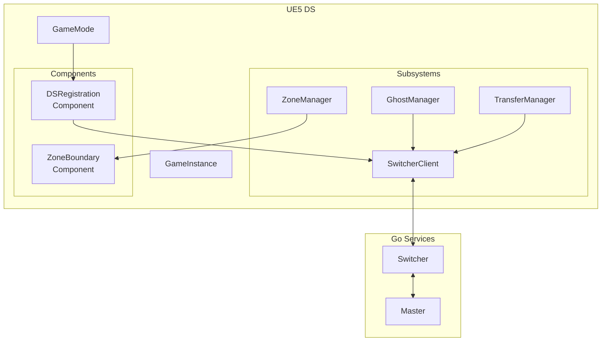
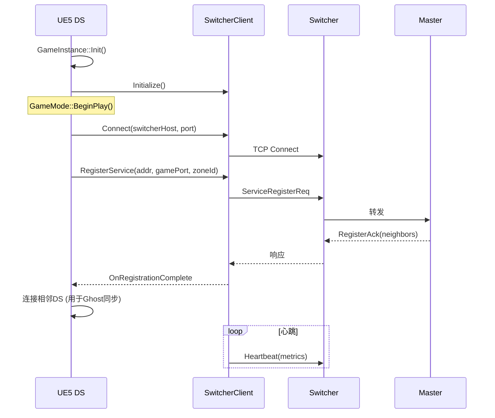

# 09 - UE5 DS 集成

## 📋 里程碑追踪

| # | 里程碑 | 状态 | 验收标准 |
|---|--------|:----:|----------|
| M1 | 文档理解 | ⬜ | 理解DS启动流程 |
| M2 | UE5-SwitcherClient | ⬜ | DS连接Switcher成功 |
| M3 | UE5-DS注册 | ⬜ | DS向Master注册成功 |
| M4 | UE5-心跳 | ⬜ | 心跳正常，断开检测 |

> **进度**: 0/4 = 0%

---

### M1: 文档理解

- [ ] 理解DS启动参数
- [ ] 理解SwitcherClient职责
- [ ] 理解注册流程
- [ ] 理解消息分发架构

**完成日期**: ____

---

### M2: UE5-SwitcherClient

**目标**: `Source/DJ01/Network/Distributed/DJ01SwitcherClient.h/cpp`

- [ ] 创建 `UDJ01SwitcherClient` GameInstanceSubsystem
- [ ] 实现 TCP Socket连接
- [ ] 实现消息发送 (32字节Header + Payload)
- [ ] 实现消息接收 (后台线程)
- [ ] 实现消息分发 (回调/事件)
- [ ] 实现自动重连

**验收**:
```
DS启动 → 连接Switcher → 发送Ping → 收到Pong
```

**完成日期**: ____

---

### M3: UE5-DS注册

**目标**: `Source/DJ01/Network/Distributed/DJ01DSRegistrationComponent.h/cpp`

- [ ] 创建 `UDJ01DSRegistrationComponent`
- [ ] 读取启动参数 (ZoneX, ZoneY, Port)
- [ ] BeginPlay时发送 `ServiceRegisterReq`
- [ ] 处理 `ServiceRegisterAck`
- [ ] 存储分配的ServiceAddress

**验收**:
```
DS启动 → 注册消息发送 → Master记录DS → Ack返回
```

**完成日期**: ____

---

### M4: UE5-心跳

**目标**: 心跳保活

- [ ] 定时发送Heartbeat (5秒)
- [ ] 携带负载指标 (玩家数, CPU等)
- [ ] 处理心跳响应
- [ ] 日志记录

**验收**:
```
DS运行 → 每5秒心跳 → Master更新时间戳
停止DS → 30秒后Master剔除
```

**完成日期**: ____

## 概述

描述UE5 Dedicated Server如何与Go服务端（Switcher/Master）集成，实现分布式架构。

---

## 集成架构



---

## 核心模块

### 1. SwitcherClient (Subsystem)

**职责**: 与Switcher的TCP通信

| 功能 | 说明 |
|------|------|
| 连接管理 | 连接/断开/重连Switcher |
| 消息收发 | 发送消息、接收分发 |
| 心跳 | 定时发送心跳 |
| 服务注册 | DS启动时注册 |

**接口**:
```cpp
class UDJ01SwitcherClient : public UGameInstanceSubsystem
{
    bool Connect(const FString& Host, int32 Port);
    void Disconnect();
    bool IsConnected() const;
    
    void SendMessage(FDJ01ServiceAddress Target, int32 MsgType, const TArray<uint8>& Payload);
    void RegisterService(FDJ01ServiceAddress LocalAddr, int32 GamePort);
    
    FOnMessageReceived OnMessageReceived;  // 消息接收事件
};
```

### 2. DSRegistration (Component)

**职责**: DS启动时向Master注册

| 功能 | 说明 |
|------|------|
| 自动注册 | BeginPlay时注册 |
| Zone分配 | 接收分配的Zone |
| 邻居发现 | 获取相邻DS列表 |
| 状态上报 | 定时上报负载 |

**接口**:
```cpp
class UDJ01DSRegistrationComponent : public UActorComponent
{
    // 配置
    int32 ZoneX, ZoneY;           // 负责的Zone
    int32 MaxPlayers;
    
    // 回调
    FOnRegistrationComplete OnRegistrationComplete;
    FOnNeighborsReceived OnNeighborsReceived;
};
```

### 3. GhostManager (Subsystem)

**职责**: Ghost实体的创建、销毁、同步

| 功能 | 说明 |
|------|------|
| 创建Ghost | 接收创建请求 |
| 销毁Ghost | 接收销毁请求 |
| 位置同步 | 更新Ghost位置 |
| 状态同步 | 更新Ghost状态 |

**接口**:
```cpp
class UDJ01GhostManager : public UWorldSubsystem
{
    ADJ01GhostActor* CreateGhost(uint64 EntityId, int32 EntityType, const FDJ01GhostInitData& Data);
    void DestroyGhost(uint64 EntityId);
    void UpdateGhostPosition(uint64 EntityId, const FVector& Pos, const FVector& Vel, float Time);
    void UpdateGhostState(uint64 EntityId, const TArray<uint8>& StateData);
    
    // 本地实体管理
    void OnLocalEntityEnterBoundary(AActor* Entity, const TArray<FDJ01ZoneId>& Neighbors);
    void OnLocalEntityLeaveBoundary(AActor* Entity, const TArray<FDJ01ZoneId>& Neighbors);
};
```

### 4. ZoneManager (Actor/Subsystem)

**职责**: Zone边界检测与管理

| 功能 | 说明 |
|------|------|
| 坐标计算 | 世界坐标→Zone坐标 |
| 边界检测 | 检测实体是否在边界带 |
| 邻居查询 | 获取相邻Zone |

**接口**:
```cpp
class ADJ01ZoneManager : public AActor
{
    float ZoneSize = 200000.f;      // 2km
    float BoundaryWidth = 20000.f;  // 200m
    
    FDJ01ZoneId CalculateZone(const FVector& WorldPos) const;
    bool IsInBoundary(const FVector& WorldPos) const;
    TArray<FDJ01ZoneId> GetNeighborZones(const FVector& WorldPos) const;
};
```

### 5. TransferManager (Subsystem)

**职责**: 权威转移管理

| 功能 | 说明 |
|------|------|
| 发起转移 | 请求转移玩家 |
| 接收转移 | 接收玩家数据 |
| 状态序列化 | 玩家状态打包 |

**接口**:
```cpp
class UDJ01TransferManager : public UWorldSubsystem
{
    void RequestTransfer(APlayerController* PC, FDJ01ZoneId TargetZone);
    void OnTransferApproved(const FString& Token, FDJ01ServiceAddress TargetDS);
    void OnReceiveTransferData(const FString& Token, const TArray<uint8>& Data);
    
    TArray<uint8> SerializePlayerState(APlayerController* PC);
    void DeserializePlayerState(APlayerController* PC, const TArray<uint8>& Data);
};
```

---

## 启动流程



---

## 消息处理

### 消息分发架构

```cpp
// SwitcherClient收到消息后分发
void UDJ01SwitcherClient::ProcessMessage(const FDJ01Message& Msg)
{
    switch (Msg.Header.MsgType)
    {
        // 系统消息
        case MSG_SERVICE_REGISTER_ACK:
            OnRegistrationComplete.Broadcast(...);
            break;
            
        // Ghost消息 → 转发给GhostManager
        case MSG_GHOST_CREATE:
        case MSG_GHOST_DESTROY:
        case MSG_GHOST_POSITION:
        case MSG_GHOST_STATE:
            if (auto* GM = GetWorld()->GetSubsystem<UDJ01GhostManager>())
                GM->HandleMessage(Msg);
            break;
            
        // 转移消息 → 转发给TransferManager
        case MSG_TRANSFER_APPROVED:
        case MSG_TRANSFER_DATA:
            if (auto* TM = GetWorld()->GetSubsystem<UDJ01TransferManager>())
                TM->HandleMessage(Msg);
            break;
    }
}
```

---

## 配置

### DS启动参数

```bash
# 启动DS示例
DJ01Server.exe \
    -server \
    -log \
    -Port=7777 \
    -SwitcherHost=127.0.0.1 \
    -SwitcherPort=9000 \
    -ServerId=1 \
    -ZoneX=0 \
    -ZoneY=0
```

### 配置文件 (Config/DefaultGame.ini)

```ini
[/Script/DJ01.DJ01NetworkSettings]
SwitcherHost=127.0.0.1
SwitcherPort=9000
HeartbeatInterval=5.0
ReconnectInterval=3.0
MaxReconnectAttempts=10

[/Script/DJ01.DJ01ZoneSettings]
ZoneSizeMeters=2000
BoundaryWidthMeters=200
```

---

## 待实现类清单

| 类 | 类型 | 优先级 |
|----|------|-------|
| `UDJ01SwitcherClient` | GameInstanceSubsystem | P0 |
| `FDJ01ServiceAddress` | USTRUCT | P0 |
| `FDJ01Message` | USTRUCT | P0 |
| `UDJ01DSRegistrationComponent` | ActorComponent | P0 |
| `UDJ01GhostManager` | WorldSubsystem | P1 |
| `ADJ01GhostActor` | Actor | P1 |
| `ADJ01ZoneManager` | Actor | P1 |
| `UDJ01ZoneBoundaryComponent` | ActorComponent | P1 |
| `UDJ01TransferManager` | WorldSubsystem | P2 |

---

## GAS集成

### 状态序列化

需要序列化的GAS数据：

```cpp
struct FDJ01GASTransferData
{
    // AttributeSet
    TMap<FGameplayAttribute, float> Attributes;
    
    // Active GameplayEffects
    TArray<FActiveGameplayEffectHandle> ActiveEffects;
    
    // Granted Abilities
    TArray<FGameplayAbilitySpec> GrantedAbilities;
    
    // Cooldowns
    TMap<FGameplayAbilitySpecHandle, float> Cooldowns;
};
```

### 序列化方法

```cpp
// 待实现
TArray<uint8> UDJ01TransferManager::SerializeGASState(UAbilitySystemComponent* ASC);
void UDJ01TransferManager::DeserializeGASState(UAbilitySystemComponent* ASC, const TArray<uint8>& Data);
```

---

## 下一步

- `10_TestPlan.md` - 测试计划与演示场景