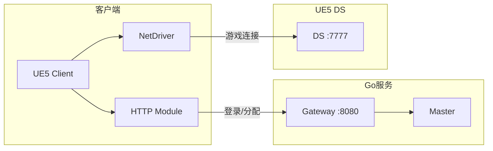

# 11 - 客户端连接流程

## 📋 里程碑追踪

| # | 里程碑 | 状态 | 验收标准 |
|---|--------|:----:|----------|
| M1 | 文档理解 | ⬜ | 理解登录→DS连接流程 |
| M2 | Go-JWT验证 | ⬜ | Token生成与验证 |
| M3 | UE5-ConnectionManager | ⬜ | HTTP登录成功 |
| M4 | 端到端测试 | ⬜ | 登录→进入世界→连接DS |

> **进度**: 0/4 = 0%

---

### M1: 文档理解

- [ ] 理解3阶段流程 (登录→分配→连接)
- [ ] 理解Token机制
- [ ] 理解与04_Gateway的关系
- [ ] 理解DS Token验证

**完成日期**: ____

---

### M2: Go-JWT验证

**目标**: `ServerGo/internal/auth/jwt.go`

- [ ] 实现 `GenerateToken(playerID)` → JWT
- [ ] 实现 `ValidateToken(token)` → playerID
- [ ] 配置密钥管理
- [ ] 设置过期时间 (1小时)

**验收**:
```go
token := GenerateToken(1001)
id, err := ValidateToken(token)
// id == 1001, err == nil
```

**完成日期**: ____

---

### M3: UE5-ConnectionManager

**目标**: `Source/DJ01/Network/Distributed/DJ01ConnectionManager.h/cpp`

- [ ] 创建 `UDJ01ConnectionManager` Subsystem
- [ ] 实现 `Login()` HTTP请求
- [ ] 实现 `EnterWorld()` HTTP请求
- [ ] 存储Token, PlayerID
- [ ] 实现 `ConnectToDS()`

**验收**: UE5中调用Login+EnterWorld，获取DS地址

**完成日期**: ____

---

### M4: 端到端测试

**测试环境**:
```
Gateway + Master + Switcher + DS-1
1个UE5客户端
```

**测试流程**:
- [ ] TC-1: 客户端调用 `/api/login`
- [ ] TC-2: 收到Token
- [ ] TC-3: 客户端调用 `/api/enter_world`
- [ ] TC-4: 收到DS地址
- [ ] TC-5: 客户端连接DS
- [ ] TC-6: DS验证Token成功
- [ ] TC-7: 玩家进入游戏世界

**验收**: 完整流程跑通

**完成日期**: ____

## 概述

描述客户端如何通过Gateway进入游戏世界，实现真正的多人游戏。

---

## 连接架构



---

## 完整流程

### 阶段1：登录

```
Client                    Gateway                   
   |                         |                      
   |  POST /api/login        |                      
   |  {username, password}   |                      
   |------------------------>|                      
   |                         |                      
   |  {token, player_id}     |                      
   |<------------------------|                      
   |                         |                      
```

**Gateway API**:
```go
// POST /api/login
type LoginRequest struct {
    Username string `json:"username"`
    Password string `json:"password"`
}

type LoginResponse struct {
    Success  bool   `json:"success"`
    Token    string `json:"token"`      // JWT或自定义Token
    PlayerID uint64 `json:"player_id"`
    Error    string `json:"error,omitempty"`
}
```

### 阶段2：请求进入世界

```
Client                    Gateway                   Master
   |                         |                         |
   |  POST /api/enter_world  |                         |
   |  {token, zone_hint}     |                         |
   |------------------------>|                         |
   |                         |  查询最佳DS              |
   |                         |------------------------>|
   |                         |  返回DS信息              |
   |                         |<------------------------|
   |  {ds_ip, ds_port,       |                         |
   |   entry_token}          |                         |
   |<------------------------|                         |
   |                         |                         |
```

**Gateway API**:
```go
// POST /api/enter_world
type EnterWorldRequest struct {
    Token    string `json:"token"`
    ZoneHint *int32 `json:"zone_hint,omitempty"` // 可选，指定Zone
}

type EnterWorldResponse struct {
    Success    bool   `json:"success"`
    DSIP       string `json:"ds_ip"`
    DSPort     int32  `json:"ds_port"`
    EntryToken string `json:"entry_token"` // DS验证用
    ZoneID     int32  `json:"zone_id"`
    Error      string `json:"error,omitempty"`
}
```

### 阶段3：连接DS

```
Client                                DS
   |                                   |
   |  UE NetDriver Connect             |
   |  open 192.168.1.100:7777?         |
   |       Token=xxx&PlayerID=123      |
   |---------------------------------->|
   |                                   |
   |  验证Token (向Gateway确认)         |
   |                                   |
   |  Welcome, PlayerID=123            |
   |<----------------------------------|
   |                                   |
   |  正常UE多人游戏同步                 |
   |<=================================>|
   |                                   |
```

---

## UE5客户端实现

### 模块结构

```cpp
// 客户端连接管理器
UCLASS()
class UDJ01ClientConnectionManager : public UGameInstanceSubsystem
{
    GENERATED_BODY()
    
public:
    // 登录
    void Login(const FString& Username, const FString& Password, 
               FOnLoginComplete OnComplete);
    
    // 进入世界
    void EnterWorld(FOnEnterWorldComplete OnComplete);
    
    // 获取当前状态
    bool IsLoggedIn() const;
    FString GetToken() const;
    uint64 GetPlayerID() const;
    
private:
    FString GatewayURL;
    FString AuthToken;
    uint64 PlayerID;
    
    void HandleLoginResponse(FHttpResponsePtr Response);
    void HandleEnterWorldResponse(FHttpResponsePtr Response);
    void ConnectToDS(const FString& IP, int32 Port, const FString& EntryToken);
};
```

### 登录实现

```cpp
void UDJ01ClientConnectionManager::Login(const FString& Username, 
    const FString& Password, FOnLoginComplete OnComplete)
{
    // 构建HTTP请求
    TSharedRef<IHttpRequest> Request = FHttpModule::Get().CreateRequest();
    Request->SetURL(GatewayURL + TEXT("/api/login"));
    Request->SetVerb(TEXT("POST"));
    Request->SetHeader(TEXT("Content-Type"), TEXT("application/json"));
    
    // 构建JSON
    TSharedPtr<FJsonObject> JsonObject = MakeShared<FJsonObject>();
    JsonObject->SetStringField(TEXT("username"), Username);
    JsonObject->SetStringField(TEXT("password"), Password);
    
    FString JsonString;
    TSharedRef<TJsonWriter<>> Writer = TJsonWriterFactory<>::Create(&JsonString);
    FJsonSerializer::Serialize(JsonObject.ToSharedRef(), Writer);
    
    Request->SetContentAsString(JsonString);
    Request->OnProcessRequestComplete().BindUObject(
        this, &UDJ01ClientConnectionManager::HandleLoginResponse, OnComplete);
    
    Request->ProcessRequest();
}

void UDJ01ClientConnectionManager::HandleLoginResponse(
    FHttpRequestPtr Request, FHttpResponsePtr Response, bool bSuccess,
    FOnLoginComplete OnComplete)
{
    if (bSuccess && Response->GetResponseCode() == 200)
    {
        // 解析JSON
        TSharedPtr<FJsonObject> JsonObject;
        TSharedRef<TJsonReader<>> Reader = TJsonReaderFactory<>::Create(
            Response->GetContentAsString());
        
        if (FJsonSerializer::Deserialize(Reader, JsonObject))
        {
            AuthToken = JsonObject->GetStringField(TEXT("token"));
            PlayerID = JsonObject->GetNumberField(TEXT("player_id"));
            
            OnComplete.ExecuteIfBound(true, TEXT(""));
            return;
        }
    }
    
    OnComplete.ExecuteIfBound(false, TEXT("Login failed"));
}
```

### 连接DS实现

```cpp
void UDJ01ClientConnectionManager::ConnectToDS(
    const FString& IP, int32 Port, const FString& EntryToken)
{
    // 构建连接URL
    FString URL = FString::Printf(
        TEXT("%s:%d?Token=%s&PlayerID=%llu"),
        *IP, Port, *EntryToken, PlayerID);
    
    // 获取PlayerController
    if (APlayerController* PC = GetWorld()->GetFirstPlayerController())
    {
        // 使用ClientTravel连接到DS
        // 注意：这里是初次连接，不是Zone转移
        PC->ClientTravel(URL, TRAVEL_Absolute);
    }
}
```

---

## DS验证Token

### DS侧实现

```cpp
// GameMode中验证
void ADJ01GameMode::PreLogin(
    const FString& Options, 
    const FString& Address, 
    const FUniqueNetIdRepl& UniqueId,
    FString& ErrorMessage)
{
    Super::PreLogin(Options, Address, UniqueId, ErrorMessage);
    
    // 提取Token
    FString Token = UGameplayStatics::ParseOption(Options, TEXT("Token"));
    FString PlayerIDStr = UGameplayStatics::ParseOption(Options, TEXT("PlayerID"));
    
    if (Token.IsEmpty() || PlayerIDStr.IsEmpty())
    {
        ErrorMessage = TEXT("Missing credentials");
        return;
    }
    
    // 验证Token（向Gateway确认）
    if (!VerifyTokenWithGateway(Token, FCString::Atoi64(*PlayerIDStr)))
    {
        ErrorMessage = TEXT("Invalid token");
        return;
    }
}

bool ADJ01GameMode::VerifyTokenWithGateway(const FString& Token, uint64 PlayerID)
{
    // 方案1: 同步HTTP请求（简单但阻塞）
    // 方案2: Token自包含验证（JWT签名）
    // 方案3: Redis缓存验证
    
    // Demo阶段可以用JWT自验证
    return UDJ01TokenValidator::ValidateJWT(Token, PlayerID);
}
```

---

## 测试配置

### 单机多进程测试

```batch
@echo off
REM test_multiplayer.bat

REM 1. 启动Go服务
start "Gateway" cmd /k "cd ServerGo && go run cmd/gateway/main.go"
start "Master" cmd /k "cd ServerGo && go run cmd/master/main.go"
start "Switcher" cmd /k "cd ServerGo && go run cmd/switcher/main.go"

timeout /t 2

REM 2. 启动DS
start "DS-1" DJ01Server.exe -server -log -Port=7777 -ZoneX=0 -ZoneY=0
start "DS-2" DJ01Server.exe -server -log -Port=7778 -ZoneX=1 -ZoneY=0

timeout /t 3

REM 3. 启动多个客户端
start "Client-1" DJ01.exe -game -ResX=800 -ResY=600 -WinX=0 -WinY=0
start "Client-2" DJ01.exe -game -ResX=800 -ResY=600 -WinX=820 -WinY=0

echo All started! Two clients should connect to the world.
```

### 多机测试

```
机器A (服务器):
  - 运行 Gateway, Master, Switcher
  - 运行 DS-1, DS-2
  - 防火墙开放端口: 8080, 7777, 7778

机器B (客户端1):
  - 修改 GatewayURL = "http://机器A的IP:8080"
  - 运行 DJ01.exe

机器C (客户端2):
  - 同上
```

---

## 配置

### DefaultGame.ini

```ini
[/Script/DJ01.DJ01ConnectionSettings]
; Gateway地址
GatewayURL=http://127.0.0.1:8080

; 本地开发
bUseLocalGateway=true

; 超时设置
LoginTimeout=10.0
ConnectTimeout=15.0
```

---

## 与Zone转移的区别

| 场景 | 初次进入 | Zone转移 |
|------|---------|---------|
| 触发 | 玩家点击"进入游戏" | 玩家跨越Zone边界 |
| 流程 | Gateway分配DS | Master协调转移 |
| 客户端 | `ClientTravel` 到DS | 自定义Redirect |
| 加载 | 需要加载地图 | 不需要，已在同地图 |

---

## 下一步

1. 实现Gateway的HTTP API
2. 实现客户端ConnectionManager
3. 实现DS的Token验证