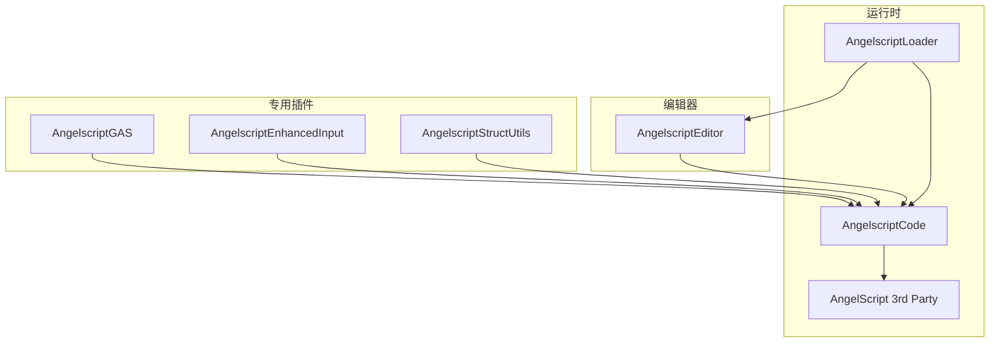
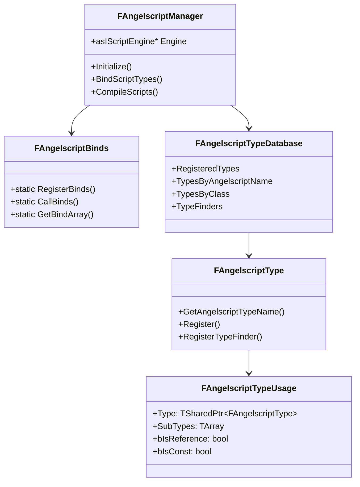
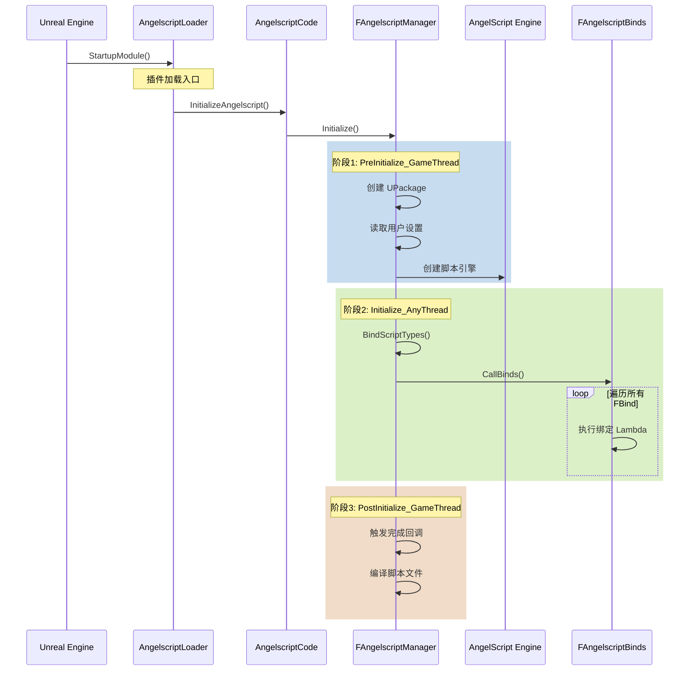
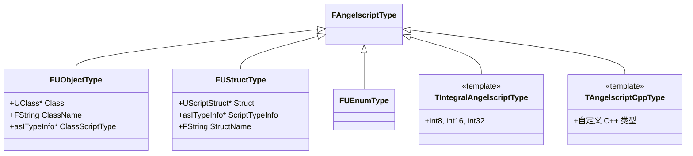
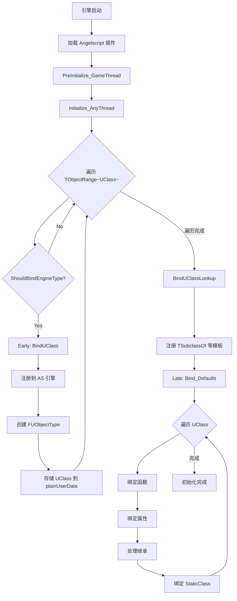

# UE-Angelscript 深度解析：从引擎启动到类型绑定

> 本文档深入剖析 UE-Angelscript 插件的核心架构、绑定机制和运行原理。
> 适合想要深入理解 UE + AngelScript 集成的开发者。

## 目录

1. [概述](#概述)
2. [AngelScript 语言基础](#angelscript-语言基础)
3. [插件架构详解](#插件架构详解)
4. [引擎启动与初始化流程](#引擎启动与初始化流程)
5. [类型系统深度解析](#类型系统深度解析)
6. [FBind 绑定机制](#fbind-绑定机制)
7. [UObject 绑定流程](#uobject-绑定流程)
8. [UScriptStruct 绑定流程](#uscriptstruct-绑定流程)
9. [手工绑定详解](#手工绑定详解)
10. [泛型与模板绑定](#泛型与模板绑定)
11. [内存模型与生命周期](#内存模型与生命周期)
12. [实战案例](#实战案例)
13. [附录：源码导航](#附录源码导航)

---

## 概述

### 什么是 UE-Angelscript？

UE-Angelscript 是 Unreal Engine 的一个特殊分支，由 Hazelight Studios（《双人成行》开发商）维护。它将 AngelScript 脚本语言深度集成到虚幻引擎中，提供了一种介于 C++ 和蓝图之间的开发方式。

```
性能对比（相对值）：
┌─────────────────────────────────────────────────┐
│ C++ Native    ████████████████████████████ 100% │
│ AngelScript   ██████████████████████       80%  │
│ Blueprint     ████████                     30%  │
└─────────────────────────────────────────────────┘
```

### 核心组成

UE-Angelscript 的实现包含两大部分：

1. **对 UE 源码的修改** - 分散在引擎各处，通过 `// HAZE FIX` 注释标记
2. **Angelscript 插件本身** - 位于 `Engine/Plugins/Angelscript/`

### 为什么选择 AngelScript？

| 特性 | AngelScript | Lua | Python |
|------|-------------|-----|--------|
| **性能** | 接近 C++ | 中等 | 较低 |
| **类型系统** | 强类型、静态 | 动态 | 动态 |
| **语法** | 类似 C++ | 独特 | 独特 |
| **UE 集成** | 原生级别 | 需要桥接 | 需要桥接 |
| **热重载** | ✅ 支持 | ✅ 支持 | ✅ 支持 |
| **调试** | IDE 集成 | 有限 | 有限 |

---

## AngelScript 语言基础

> 在深入 UE 集成之前，需要先理解 AngelScript 的核心概念。

### 基本语法

AngelScript 的语法与 C++ 非常相似：

```angelscript
// 类定义
class MyClass
{
    // 成员变量
    int Value;
    FString Name;
    
    // 构造函数
    MyClass()
    {
        Value = 0;
        Name = "Default";
    }
    
    // 成员函数
    void SetValue(int NewValue)
    {
        Value = NewValue;
    }
    
    // 带返回值的函数
    int GetValue() const
    {
        return Value;
    }
}
```

### 句柄（Handle）与值类型

AngelScript 中最重要的概念之一是**句柄**（Handle），用 `@` 符号表示：

```angelscript
// 值类型 - 栈上分配，自动管理生命周期
FVector Position;
Position.X = 100.0f;

// 句柄类型 - 类似 C++ 指针，指向堆上对象
AActor@ ActorRef = nullptr;
ActorRef = SpawnActor(SomeClass);

// 句柄赋值 vs 值赋值
AActor@ Actor1 = GetActor();
AActor@ Actor2 = Actor1;      // Actor2 和 Actor1 指向同一对象
AActor@ Actor3;
@Actor3 = @Actor1;            // 显式句柄赋值（等同上一行）
```

### 类型分类

```
AngelScript 类型
├── 基础类型 (Primitive Types)
│   ├── bool
│   ├── int8, int16, int32, int64
│   ├── uint8, uint16, uint32, uint64
│   ├── float32 (float)
│   └── float64 (double)
│
├── 值类型 (Value Types)
│   ├── 结构体 (struct)
│   └── 用户定义的值类
│
└── 引用类型 (Reference Types)
    ├── 类 (class)
    └── 接口 (interface)
```

### 与 C++ 的类型映射

| C++ 类型 | AngelScript 类型 | 说明 |
|----------|-----------------|------|
| `bool` | `bool` | 直接对应 |
| `int32` | `int` / `int32` | 默认整数 |
| `float` | `float32` | 注意不是 `float` |
| `double` | `float64` | 双精度 |
| `FString` | `FString` | 值类型 |
| `FVector` | `FVector` | 值类型 |
| `UObject*` | `UObject` | 隐式句柄 |
| `AActor*` | `AActor` | 隐式句柄 |
| `TSubclassOf<T>` | `TSubclassOf<T>` | 类引用 |

---

## 插件架构详解

### 目录结构

```
Engine/Plugins/Angelscript/
├── Source/
│   ├── AngelscriptCode/          # 核心模块 - 运行时逻辑
│   │   ├── Public/
│   │   │   ├── AngelscriptManager.h
│   │   │   ├── AngelscriptBinds.h
│   │   │   ├── AngelscriptType.h
│   │   │   └── ...
│   │   └── Private/
│   │       ├── Binds/            # 各种类型的绑定实现
│   │       │   ├── Bind_AActor.cpp
│   │       │   ├── Bind_UObject.cpp
│   │       │   ├── Bind_FVector.cpp
│   │       │   └── ...
│   │       └── ...
│   │
│   ├── AngelscriptEditor/        # 编辑器扩展模块
│   │   └── ...
│   │
│   └── AngelscriptLoader/        # 加载器模块
│       └── ...
│
├── ThirdParty/                   # AngelScript 引擎源码
│   └── angelscript/
│       ├── include/
│       │   └── angelscript.h     # 核心头文件
│       └── source/
│           └── ...
│
└── Angelscript.uplugin
```

### 模块依赖关系



### 核心类关系



---

## 引擎启动与初始化流程

### 完整初始化序列



### PreInitialize_GameThread 详解

```cpp
void FAngelscriptManager::PreInitialize_GameThread()
{
    // 1. 创建两个核心 UPackage
    //    这些包用于存储脚本生成的类型
    ScriptPackage = CreatePackage(TEXT("/Script/Angelscript"));
    AssetsPackage = CreatePackage(TEXT("/Script/AngelscriptAssets"));
    
    // 2. 读取用户设置
    const UAngelscriptSettings* Settings = GetDefault<UAngelscriptSettings>();
    
    // 3. 创建 AngelScript 引擎实例
    Engine = asCreateScriptEngine();
    
    // 4. 配置引擎
    Engine->SetMessageCallback(...);
    Engine->SetEngineProperty(asEP_ALLOW_UNSAFE_REFERENCES, true);
    // ... 更多配置
}
```

**UPackage 的作用：**

```
/Script/Angelscript
├── UASClass_GA_CastStone        # AS 定义的类
├── UASClass_BP_MyCharacter      # AS 定义的类
└── ...

/Script/AngelscriptAssets  
├── 资产相关的脚本类型
└── ...
```

### Initialize_AnyThread 详解

这是最核心的初始化阶段，**可以在非主线程运行**：

```cpp
void FAngelscriptManager::Initialize_AnyThread()
{
    // 核心：绑定所有类型到 AngelScript
    BindScriptTypes();
}

void FAngelscriptManager::BindScriptTypes()
{
    // 调用所有注册的绑定
    FAngelscriptBinds::CallBinds();
}

void FAngelscriptBinds::CallBinds()
{
    // 1. 按顺序排序所有绑定
    GetBindArray().Sort();
    
    // 2. 依次执行每个绑定的 Lambda
    for (auto& Bind : GetBindArray())
    {
        Bind.Function();  // 执行绑定逻辑
    }
}
```

---

## 类型系统深度解析

### 核心数据结构

#### 1. FAngelscriptType - 类型描述

```cpp
/**
 * FAngelscriptType 是连接 UE 类型系统和 AS 类型系统的桥梁
 * 它是一个抽象基类，不同类型有不同的子类实现
 */
struct FAngelscriptType : TSharedFromThis<FAngelscriptType>
{
    // 获取在 AS 中显示的类型名
    virtual FString GetAngelscriptTypeName() const = 0;
    
    // 获取 C++ 形式（用于预编译）
    virtual bool GetCppForm(const FAngelscriptTypeUsage& Usage, FCppForm& OutCppForm) const;
    
    // 检查是否匹配某个 UProperty
    virtual bool MatchesProperty(const FAngelscriptTypeUsage& Usage, 
                                  const FProperty* Property, 
                                  EPropertyMatchType MatchType) const;
    
    // 是否可以作为模板子类型
    virtual bool CanBeTemplateSubType() const { return true; }
    
    // 是否是对象指针类型
    virtual bool IsObjectPointer() const { return false; }
};
```

#### 2. 常见的 FAngelscriptType 子类



#### 3. FAngelscriptTypeUsage - 类型使用上下文

```cpp
/**
 * 描述一个类型的具体使用方式
 * 包括 const、引用、模板参数等修饰符
 */
struct FAngelscriptTypeUsage
{
    // 基础类型信息
    TSharedPtr<FAngelscriptType> Type;
    
    // 子类型（用于模板/容器）
    TArray<FAngelscriptTypeUsage> SubTypes;
    
    // 修饰符
    bool bIsReference = false;
    bool bIsConst = false;
    
    // 关联的脚本/UE 类型信息（三选一）
    union
    {
        asITypeInfo* ScriptClass;     // AS 类型信息
        FProperty* UnrealProperty;    // UE 属性
        int32 TypeIndex;              // 类型索引
    };
    
    // 常用构造方法
    static FAngelscriptTypeUsage FromTypeId(int32 TypeId);
    static FAngelscriptTypeUsage FromProperty(FProperty* Property);
    static FAngelscriptTypeUsage FromClass(UClass* Class);
    static FAngelscriptTypeUsage FromStruct(UScriptStruct* Struct);
};
```

#### 4. FAngelscriptTypeDatabase - 类型数据库

```cpp
/**
 * 全局单例，存储所有已注册的类型信息
 */
struct FAngelscriptTypeDatabase
{
    static FAngelscriptTypeDatabase& Get();
    
    // 所有注册的类型
    TArray<TSharedRef<FAngelscriptType>> RegisteredTypes;
    
    // 按 AS 类型名索引
    TMap<FString, TSharedRef<FAngelscriptType>> TypesByAngelscriptName;
    
    // 按 UClass 索引
    TMap<UClass*, TSharedRef<FAngelscriptType>> TypesByClass;
    
    // 按自定义数据索引
    TMap<void*, TSharedRef<FAngelscriptType>> TypesByData;
    
    // 支持属性匹配的类型
    TArray<TSharedRef<FAngelscriptType>> TypesImplementingProperties;
    
    // 类型查找器（用于复杂类型如 TSubclassOf）
    TArray<FTypeFinder> TypeFinders;
};
```

### 类型 ID 系统

AngelScript 使用整数 TypeId 来唯一标识每个类型：

```cpp
// 基础类型有固定的 TypeId
enum asETypeIdFlags
{
    asTYPEID_VOID           = 0,
    asTYPEID_BOOL           = 1,
    asTYPEID_INT8           = 2,
    asTYPEID_INT16          = 3,
    asTYPEID_INT32          = 4,
    asTYPEID_INT64          = 5,
    asTYPEID_UINT8          = 6,
    asTYPEID_UINT16         = 7,
    asTYPEID_UINT32         = 8,
    asTYPEID_UINT64         = 9,
    asTYPEID_FLOAT32        = 10,
    asTYPEID_FLOAT64        = 11,
    
    asTYPEID_LAST_PRIMITIVE = asTYPEID_FLOAT64,
    
    // 非基础类型的 TypeId > 11，动态分配
};

// 获取类型信息的方式
asITypeInfo* TypeInfo = Engine->GetTypeInfoById(TypeId);
FString TypeName = ANSI_TO_TCHAR(TypeInfo->GetName());
```

### 类型存储位置总结

```
┌─────────────────────────────────────────────────────────────┐
│                        类型信息存储                          │
├─────────────────────────────────────────────────────────────┤
│                                                             │
│  AngelScript 引擎层                                          │
│  ┌─────────────────────────────────────────────────────┐   │
│  │ asIScriptEngine                                      │   │
│  │  └── asCTypeInfo (每个注册的类型)                     │   │
│  │       ├── name: 类型名                               │   │
│  │       ├── typeId: 类型 ID                            │   │
│  │       ├── size: 类型大小                             │   │
│  │       ├── flags: 类型标志                            │   │
│  │       └── plainUserData: 自定义数据 ──┐              │   │
│  └───────────────────────────────────────│──────────────┘   │
│                                          │                   │
│  UE 桥接层                               ▼                   │
│  ┌─────────────────────────────────────────────────────┐   │
│  │ FAngelscriptTypeDatabase (全局单例)                  │   │
│  │  ├── TypesByAngelscriptName["FVector"] ──► FUStructType│ │
│  │  ├── TypesByClass[AActor::StaticClass()] ──► FUObjectType│
│  │  └── TypeFinders[] ──► Lambda 查找器                 │   │
│  └─────────────────────────────────────────────────────┘   │
│                                                             │
│  UE 原生层                                                   │
│  ┌─────────────────────────────────────────────────────┐   │
│  │ UClass / UScriptStruct / UEnum                       │   │
│  │  └── (通过 plainUserData 反向引用)                    │   │
│  └─────────────────────────────────────────────────────┘   │
│                                                             │
└─────────────────────────────────────────────────────────────┘
```

---

## FBind 绑定机制

### 核心概念

FBind 是 UE-Angelscript 的绑定注册机制，它利用 **全局变量构造函数** 在程序启动时自动收集所有绑定：

```cpp
// FBind 结构体定义
struct FBind
{
    // 构造函数 - 注册绑定
    FBind(int32 BindOrder, TFunction<void()> Function)
    {
        FAngelscriptBinds::RegisterBinds(BindOrder, Function);
    }
    
    FBind(EOrder BindOrder, TFunction<void()> Function)
    {
        FAngelscriptBinds::RegisterBinds((int32)BindOrder, Function);
    }
    
    FBind(TFunction<void()> Function)
    {
        FAngelscriptBinds::RegisterBinds(0, Function);
    }
};

// 绑定顺序枚举
enum class EOrder : int32
{
    Early  = -100,  // 早期：声明类型
    Normal = 0,     // 普通：一般绑定
    Late   = 100,   // 晚期：绑定成员/函数
};
```

### 绑定存储与执行

```cpp
// 绑定函数信息
struct FBindFunction
{
    int32 BindOrder;           // 执行顺序
    TFunction<void()> Function; // 绑定逻辑
    
    bool operator<(const FBindFunction& Other) const
    {
        return BindOrder < Other.BindOrder;
    }
};

// 全局绑定数组（单例）
static TArray<FBindFunction>& GetBindArray()
{
    static TArray<FBindFunction> BindArray;
    return BindArray;
}

// 注册绑定
void FAngelscriptBinds::RegisterBinds(int32 BindOrder, TFunction<void()> Function)
{
    GetBindArray().Add({BindOrder, Function});
}

// 执行所有绑定
void FAngelscriptBinds::CallBinds()
{
    // 1. 排序
    GetBindArray().Sort();
    
    // 2. 按顺序执行
    for (auto& Bind : GetBindArray())
    {
        Bind.Function();
    }
}
```

### 绑定顺序详解

```
时间线 ────────────────────────────────────────────────────►

Early (-100)          Normal (0)           Late (100)
    │                     │                     │
    │ 声明类型            │ 一般绑定           │ 成员/函数
    │                     │                     │
    ▼                     ▼                     ▼
┌─────────┐         ┌─────────┐         ┌─────────┐
│ UObject │         │  工具   │         │ 方法    │
│ UStruct │         │  函数   │         │ 属性    │
│ UEnum   │         │         │         │ 继承    │
└─────────┘         └─────────┘         └─────────┘

为什么需要分阶段？
- Early: 必须先声明类型，AS 才能识别
- Late: 成员函数可能依赖其他类型（参数、返回值）
         必须等那些类型先声明
```

### 绑定示例

```cpp
// 示例 1: 早期声明类型
AS_FORCE_LINK const FAngelscriptBinds::FBind Bind_FVector_Declaration(
    FAngelscriptBinds::EOrder::Early, 
    []
{
    FBindFlags Flags;
    auto FVector_ = FAngelscriptBinds::ValueClass<FVector>("FVector", Flags);
    
    // 注册类型信息
    auto VectorType = MakeShared<FVectorType>();
    FAngelscriptType::Register(VectorType);
});

// 示例 2: 晚期绑定成员
AS_FORCE_LINK const FAngelscriptBinds::FBind Bind_FVector(
    FAngelscriptBinds::EOrder::Late, 
    []
{
    auto FVector_ = FAngelscriptBinds::ExistingClass("FVector");
    
    // 绑定属性
    FVector_.Property("float64 X", &FVector::X);
    FVector_.Property("float64 Y", &FVector::Y);
    FVector_.Property("float64 Z", &FVector::Z);
    
    // 绑定方法
    FVector_.Method("float64 Size() const", METHOD_TRIVIAL(FVector, Size));
    FVector_.Method("FVector GetSafeNormal() const", 
                    METHOD_TRIVIAL(FVector, GetSafeNormal));
});
```

---

## UObject 绑定流程

### Early 阶段：类型声明

```cpp
AS_FORCE_LINK const FAngelscriptBinds::FBind Bind_BlueprintType_Declarations(
    FAngelscriptBinds::EOrder::Early, 
    []
{
    // 遍历所有 UClass
    for (UClass* Class : TObjectRange<UClass>())
    {
        // 检查是否应该绑定
        if (!ShouldBindEngineType(Class))
            continue;
        
        // 获取绑定名称
        FString ClassName = FAngelscriptType::GetBoundClassName(Class);
        
        // 执行绑定
        BindUClass(Class, ClassName);
    }
    
    // 绑定特殊类型查找器
    BindUClassLookup();
});
```

#### ShouldBindEngineType 判断逻辑

```cpp
bool ShouldBindEngineType(UClass* Class)
{
    // 1. 检查 BlueprintType 元数据
    if (Class->HasMetaData(TEXT("BlueprintType")))
        return true;
    
    // 2. 检查是否是蓝图类
    if (Class->HasAnyClassFlags(CLASS_CompiledFromBlueprint))
        return true;
    
    // 3. 检查 ForceAngelscriptBind 元数据
    if (Class->HasMetaData(TEXT("ForceAngelscriptBind")))
        return true;
    
    // 4. 检查是否有蓝图可调用函数
    for (TFieldIterator<UFunction> It(Class); It; ++It)
    {
        if (It->HasAnyFunctionFlags(FUNC_BlueprintCallable))
            return true;
    }
    
    return false;
}
```

#### BindUClass 核心实现

```cpp
static void BindUClass(UClass* Class, const FString& TypeName)
{
    // 1. 注册到 AS 引擎
    //    asOBJ_REF: 引用类型
    //    asOBJ_NOCOUNT: 不使用 AS 引用计数（UE 管理生命周期）
    //    asOBJ_IMPLICIT_HANDLE: 允许省略 @ 符号
    auto Class_ = FAngelscriptBinds::ReferenceClass(TypeName, Class);
    
    // 2. 创建 UE 端类型描述
    auto Type = MakeShared<FUObjectType>(Class, TypeName, Class_.GetTypeInfo());
    FAngelscriptType::Register(Type);
    
    // 3. 在 AS 类型信息中存储 UClass 指针
    //    这样可以从 AS 侧反查 UE 类型
    auto* TypeInfo = (asCTypeInfo*)Class_.GetTypeInfo();
    if (TypeInfo != nullptr)
    {
        // plainUserData 是 AS 提供的自定义数据字段
        TypeInfo->plainUserData = (SIZE_T)Class;
        
#if WITH_EDITOR
        // 编辑器专用：添加文档
        const FString& Tooltip = Class->GetMetaData(NAME_Func_Tooltip);
        if (Tooltip.Len() != 0)
            FAngelscriptDocs::AddUnrealDocumentationForType(
                TypeInfo->GetTypeId(), Tooltip);
#endif
    }
}
```

#### ReferenceClass 详解

```cpp
FAngelscriptBinds FAngelscriptBinds::ReferenceClass(FBindString Name, UClass* UnrealClass)
{
    // 注册对象类型
    auto Binds = FAngelscriptBinds(
        Name,
        asOBJ_REF |              // 引用类型（堆分配）
        asOBJ_NOCOUNT |          // 不使用 AS 引用计数
        asOBJ_IMPLICIT_HANDLE,   // 隐式句柄（可省略 @）
        0                        // 初始大小（稍后设置）
    );
    
    // 设置类型大小和对齐
    ((asCObjectType*)Binds.ScriptType)->size = UnrealClass->GetStructureSize();
    Binds.ScriptType->alignment = UnrealClass->GetMinAlignment();
    
    return Binds;
}
```

### Late 阶段：成员绑定

```cpp
AS_FORCE_LINK const FAngelscriptBinds::FBind Bind_Defaults(
    (int32)FAngelscriptBinds::EOrder::Late + 100,
    []
{
    // 处理所有已声明的 UClass
    for (UClass* Class : TObjectRange<UClass>())
    {
        if (!ShouldBindEngineType(Class))
            continue;
            
        FString ClassName = FAngelscriptType::GetBoundClassName(Class);
        auto Class_ = FAngelscriptBinds::ExistingClass(ClassName);
        
        // 1. 绑定函数
        BindClassFunctions(Class, Class_);
        
        // 2. 绑定属性
        BindClassProperties(Class, Class_);
        
        // 3. 处理继承
        BindClassInheritance(Class, Class_);
        
        // 4. 绑定静态方法
        BindStaticClass(Class, Class_);
    }
});
```

### 绑定流程图



---

## UScriptStruct 绑定流程

### 与 UObject 的关键区别

| 特性 | UObject | UScriptStruct |
|------|---------|---------------|
| 内存分配 | 堆（GC 管理） | 栈或内嵌 |
| AS 类型 | 引用类型 | **值类型** |
| AS 标志 | `asOBJ_REF` | `asOBJ_VALUE` |
| 句柄语法 | `AActor@` | 无（直接使用） |
| 生命周期 | UE GC | 作用域自动管理 |

### 绑定实现

```cpp
AS_FORCE_LINK const FAngelscriptBinds::FBind Bind_StructDeclarations(
    (int32)FAngelscriptBinds::EOrder::Early + 1, 
    []
{
    for (UScriptStruct* Struct : TObjectRange<UScriptStruct>())
    {
        if (!ShouldBindEngineType(Struct))
            continue;
        
        FString TypeName = Struct->GetStructCPPName();
        
        // 设置绑定标志
        FBindFlags BindFlags;
        if (Struct->StructFlags & STRUCT_IsPlainOldData)
            BindFlags.ExtraFlags |= asOBJ_POD;  // POD 类型优化
        
        BindStructType(TypeName, Struct, BindFlags);
    }
    
    BindStructTypeLookups();
});

static void BindStructType(const FString& TypeName, UScriptStruct* Struct, 
                           FBindFlags& BindFlags)
{
    // 关键：使用 ValueClass 而非 ReferenceClass
    auto Binds = FAngelscriptBinds::ValueClass(TypeName, Struct, BindFlags);
    
    // 注册类型信息
    auto Type = MakeShared<FUStructType>(Struct, TypeName);
    Type->ScriptTypeInfo = Binds.GetTypeInfo();
    Type->ScriptTypeInfo->SetUserData(Struct);
    FAngelscriptType::Register(Type);
}
```

### ValueClass vs ReferenceClass

```cpp
// 值类型绑定
static FAngelscriptBinds ValueClass(FBindString Name, UScriptStruct* StructType, 
                                    FBindFlags Flags)
{
    int Size;
    auto* Ops = StructType->GetCppStructOps();
    if (Ops != nullptr)
        Size = Ops->GetSize();
    else
        Size = StructType->GetPropertiesSize();
    
    if (Flags.Alignment == -1)
        Flags.Alignment = StructType->GetMinAlignment();
    
    return ValueClass(Name, Flags, Size);
}

static FAngelscriptBinds ValueClass(FBindString Name, FBindFlags Flags, int Size)
{
    int32 ASFlags = asOBJ_VALUE |       // 值类型
                    asOBJ_APP_CLASS;    // C++ 定义的类
    
    if (Flags.ExtraFlags & asOBJ_POD)
    {
        // POD 类型可以简单复制
        ASFlags |= asOBJ_POD;
    }
    
    return FAngelscriptBinds(Name, ASFlags | Flags.ExtraFlags, Size);
}
```

### 值类型 vs 引用类型在 AS 中的使用

```angelscript
// 值类型（FVector）
FVector Position;           // 栈上分配，无需 @
Position.X = 100.0f;
Position = FVector(1, 2, 3); // 直接赋值（复制）

FVector Other = Position;   // 复制语义
Other.X = 200.0f;           // 不影响 Position

// 引用类型（AActor）
AActor Actor;               // 实际上是 AActor@，初始为 nullptr
Actor = SpawnActor(...);    // 赋值为实际对象

AActor Other = Actor;       // 引用同一对象
Other.SetActorLocation(...); // 影响 Actor
```

---

## 手工绑定详解

### 绑定声明

```cpp
// 模板方式（推荐）
auto FBox_ = FAngelscriptBinds::ValueClass<FBox>("FBox", Flags);

// 手动指定大小
auto FBox_ = FAngelscriptBinds::ValueClass("FBox", Flags, sizeof(FBox));

// 引用类型
auto MyClass_ = FAngelscriptBinds::ReferenceClass("MyClass", MyClass::StaticClass());
```

### 构造函数绑定

```cpp
// 默认构造函数
FVector_.Constructor("void f()", [](FVector* Address)
{
    new(Address) FVector();  // placement new
});
SCRIPT_TRIVIAL_NATIVE_CONSTRUCTOR(FVector_, "FVector");

// 带参数的构造函数
FVector_.Constructor("void f(float64 X, float64 Y, float64 Z)", 
    [](FVector* Address, double X, double Y, double Z)
{
    new(Address) FVector(X, Y, Z);
});

// 拷贝构造函数
FVector_.Constructor("void f(const FVector& Other)",
    [](FVector* Address, const FVector& Other)
{
    new(Address) FVector(Other);
});
```

**placement new 解释：**

```cpp
// 普通 new：分配内存 + 调用构造函数
FVector* ptr = new FVector(1, 2, 3);

// placement new：只调用构造函数，使用已有内存
void* memory = AllocateMemory(sizeof(FVector));
FVector* ptr = new(memory) FVector(1, 2, 3);  // 在 memory 地址构造

// 在 AS 绑定中，Address 是 AS 引擎分配的内存
// 我们只需要在这个地址上构造 C++ 对象
```

### 属性绑定

```cpp
// 简单属性
FVector_.Property("float64 X", &FVector::X);
FVector_.Property("float64 Y", &FVector::Y);
FVector_.Property("float64 Z", &FVector::Z);

// 注意类型映射：
// C++ float  -> AS float32
// C++ double -> AS float64

// 位域（BitField）不能直接绑定，需要 Getter/Setter
// C++: uint32 bIsEnabled : 1;
// 必须写成：
MyClass_.Method("bool GetIsEnabled() const", ...);
MyClass_.Method("void SetIsEnabled(bool Value)", ...);
```

### 方法绑定

```cpp
// 使用宏（推荐）
FVector_.Method("float64 Size() const", METHOD_TRIVIAL(FVector, Size));
FVector_.Method("FVector GetSafeNormal() const", 
                METHOD_TRIVIAL(FVector, GetSafeNormal));

// 重载函数需要 METHODPR_TRIVIAL 指定签名
FVector_.Method("FVector opAdd(const FVector& Other) const",
    METHODPR_TRIVIAL(FVector, FVector, operator+, (const FVector&) const));

// Lambda 方式
FVector_.Method("FString ToString() const", [](const FVector& Self) -> FString
{
    return Self.ToString();
});

// 外部函数作为成员方法
FVector_.Method("void Normalize()", &MyVectorHelpers::Normalize);
```

### 运算符绑定

AngelScript 支持运算符重载，使用特定的方法名：

| 运算符 | AS 方法名 | 签名示例 |
|--------|----------|----------|
| `=` | `opAssign` | `T& opAssign(const T&)` |
| `==` | `opEquals` | `bool opEquals(const T&) const` |
| `!=` | 自动由 opEquals 推导 | - |
| `<` `>` `<=` `>=` | `opCmp` | `int opCmp(const T&) const` |
| `+` | `opAdd` | `T opAdd(const T&) const` |
| `-` | `opSub` | `T opSub(const T&) const` |
| `*` | `opMul` | `T opMul(const T&) const` |
| `/` | `opDiv` | `T opDiv(const T&) const` |
| `+=` | `opAddAssign` | `T& opAddAssign(const T&)` |
| `[]` | `opIndex` | `T& opIndex(int)` |

```cpp
// 比较运算符
FVector_.Method("bool opEquals(const FVector& Other) const",
    [](const FVector& Self, const FVector& Other) -> bool
{
    return Self == Other;
});

// opCmp 返回值：
// < 0: Self < Other
// = 0: Self == Other
// > 0: Self > Other
FVector_.Method("int opCmp(const FVector& Other) const",
    [](const FVector& Self, const FVector& Other) -> int
{
    if (Self.X < Other.X) return -1;
    if (Self.X > Other.X) return 1;
    // ... 比较 Y, Z
    return 0;
});

// 算术运算符
FVector_.Method("FVector opAdd(const FVector& Other) const",
    METHODPR_TRIVIAL(FVector, FVector, operator+, (const FVector&) const));

FVector_.Method("FVector& opAddAssign(const FVector& Other)",
    METHODPR_TRIVIAL(FVector&, FVector, operator+=, (const FVector&)));
```

### 全局函数和变量

```cpp
// 全局函数
FAngelscriptBinds::BindGlobalFunction(
    "AActor SpawnActor(UClass Class, FTransform Transform)",
    &MyHelpers::SpawnActor
);

// 带命名空间
{
    FAngelscriptBinds::FNamespace ns("Math");
    
    FAngelscriptBinds::BindGlobalFunction(
        "float32 Sin(float32 Value)",
        &FMath::Sin
    );
}
// AS 中使用: Math::Sin(1.0f)

// 全局变量
{
    FAngelscriptBinds::FNamespace ns("FVector");
    
    FAngelscriptBinds::BindGlobalVariable(
        "const FVector ZeroVector",
        &FVector::ZeroVector
    );
}
// AS 中使用: FVector::ZeroVector
```

### 枚举绑定

```cpp
AS_FORCE_LINK const FAngelscriptBinds::FBind Bind_ENetMode(
    FAngelscriptBinds::EOrder::Early, 
    []
{
    auto NetMode_ = FAngelscriptBinds::Enum("ENetMode");
    
    NetMode_["NM_Client"]          = ENetMode::NM_Client;
    NetMode_["NM_DedicatedServer"] = ENetMode::NM_DedicatedServer;
    NetMode_["NM_ListenServer"]    = ENetMode::NM_ListenServer;
    NetMode_["NM_Standalone"]      = ENetMode::NM_Standalone;
    NetMode_["NM_MAX"]             = ENetMode::NM_MAX;
});
```

### 强制绑定未标记的类型

```cpp
// 强制绑定 USTRUCT
#define FORCE_BIND_USTRUCT(TypeToBind) \
AS_FORCE_LINK const FAngelscriptBinds::FBind ForceBoundUStruct_##TypeToBind( \
    (int32)FAngelscriptBinds::EOrder::Early - 1, \
    [] \
{ \
    UField* Field = TypeToBind::StaticStruct(); \
    Field->SetMetaData(TEXT("ForceAngelscriptBind"), TEXT("")); \
});

// 使用
FORCE_BIND_USTRUCT(FMyPrivateStruct)

// 强制绑定 UCLASS
#define FORCE_BIND_UCLASS(TypeToBind) \
AS_FORCE_LINK const FAngelscriptBinds::FBind ForceBoundUClass_##TypeToBind( \
    (int32)FAngelscriptBinds::EOrder::Early - 1, \
    [] \
{ \
    UField* Field = TypeToBind::StaticClass(); \
    Field->SetMetaData(TEXT("BlueprintType"), TEXT("true")); \
});
```

---

## 泛型与模板绑定

### 模板类型声明

```cpp
// TOptional<T> 绑定示例
FBindFlags Flags;
Flags.bTemplate = true;
Flags.TemplateType = "<class T>";
Flags.ExtraFlags |= asOBJ_TEMPLATE_SUBTYPE_DETERMINES_SIZE;  // 大小由 T 决定
Flags.Alignment = 1;

auto TOptional_ = FAngelscriptBinds::ValueClass("TOptional<class T>", sizeof(bool), Flags);
```

### 模板回调（TemplateCallback）

当 AS 代码中使用具体类型（如 `TOptional<int>`）时，会触发回调：

```cpp
TOptional_.TemplateCallback(
    "bool f(int&in Type, int&out ErrorMessage)",
    [](asITypeInfo* TemplateType, asCString* ErrorMessage) -> bool
{
    // 验证模板参数是否有效
    return FOptionalOperations::ValidateOptionalOperations(
        TemplateType, ErrorMessage) != nullptr;
});

// 验证函数实现
FOptionalOperations* FOptionalOperations::ValidateOptionalOperations(
    asITypeInfo* TemplateType, asCString* ErrorMessage)
{
    // 检查是否已有操作对象
    if (auto* Ops = static_cast<FOptionalOperations*>(TemplateType->GetUserData()))
    {
        return Ops->bValid ? Ops : nullptr;
    }
    
    // 获取子类型信息
    const FAngelscriptTypeUsage Type = 
        FAngelscriptTypeUsage::FromTypeId(TemplateType->GetSubTypeId(0));
    
    // 验证子类型
    if (!Type.CanBeTemplateSubType())
    {
        if (ErrorMessage != nullptr)
            *ErrorMessage = "Containers cannot be nested in other containers";
        return nullptr;
    }
    
    // 创建并存储操作对象
    FOptionalOperations* Ops = new FOptionalOperations(Type);
    TemplateType->SetUserData(Ops);
    
    return Ops->bValid ? Ops : nullptr;
}
```

### 动态大小计算

```cpp
// 注册大小计算器
FAngelscriptManager::Get().Engine->TemplateSizeCalculatorFunctions.Add(
    (asCObjectType*)TOptional_.GetTypeInfo(), 
    &CalculateOptionalSize
);

static int CalculateOptionalSize(asITypeInfo* TemplateType)
{
    // 获取子类型
    int SubTypeId = TemplateType->GetSubTypeId(0);
    FAngelscriptTypeUsage SubType = FAngelscriptTypeUsage::FromTypeId(SubTypeId);
    
    // 计算实际大小
    int SubTypeSize = SubType.GetSize();
    return sizeof(bool) + SubTypeSize;  // isSet + value
}
```

### 泛型函数绑定

使用 `?` 作为泛型参数：

```cpp
// ? 在 C++ 端对应两个参数：void* 和 int TypeId
FAngelscriptBinds::BindGlobalFunction(
    "FName GetTypeName(const ?&in Anything)",
    &UReflectLibrary::GetTypeName
);

// C++ 实现
FName UReflectLibrary::GetTypeName(void* Data, int TypeId)
{
    if (TypeId < 0) return NAME_None;
    
    const asCScriptEngine* Engine = FAngelscriptManager::Get().Engine;
    
    if (TypeId > asTYPEID_LAST_PRIMITIVE)
    {
        // 非基础类型：从 TypeInfo 获取名称
        asCTypeInfo* Info = (asCTypeInfo*)Engine->GetTypeInfoById(TypeId);
        if (!Info) return NAME_None;
        return Info->GetName();
    }
    
    // 基础类型：使用 TypeUsage
    const FAngelscriptTypeUsage Usage = FAngelscriptTypeUsage::FromTypeId(TypeId);
    return FName(Usage.Type->GetAngelscriptTypeName(Usage));
}
```

**泛型参数修饰符：**

| 修饰符 | 说明 | 适用场景 |
|--------|------|----------|
| `?&in` | 可接受任何输入（不含 const） | 读取参数 |
| `const ?&in` | 可接受任何输入（含 const） | 只读参数 |
| `?&out` | 只接受引用，不接受临时值 | 输出参数 |

### GenericMethod 绑定

用于批量绑定多种函数签名到同一 C++ 函数：

```cpp
// 所有委托的 Broadcast 都用同一个 C++ 函数处理
Delegate_.GenericMethod(
    FAngelscriptType::BuildFunctionDeclaration(
        ReturnType, TEXT("Broadcast"), ArgumentTypes, 
        ArgumentNames, ArgumentDefaults, true),
    &CallSparseDelegate, 
    Sig  // 用户数据，包含函数签名信息
);

// C++ 处理函数
void CallSparseDelegate(asIScriptGeneric* InGeneric)
{
    asCGeneric* Generic = static_cast<asCGeneric*>(InGeneric);
    
    // 获取函数签名信息
    auto* Function = Generic->GetFunction();
    auto* Sig = (FBlueprintEventSignature*)Function->GetUserData();
    
    // 获取 this 指针
    void* Object = Generic->GetObject();
    
    // 获取参数
    for (int32 Arg = 0; Arg < Sig->ArgCount; ++Arg)
    {
        void* ArgPtr = Generic->GetAddressOfArg(Arg);
        // 处理参数...
    }
    
    // 处理返回值
    if (Sig->ReturnType.IsValid())
    {
        void* ReturnPtr = Generic->GetAddressOfReturnLocation();
        // 设置返回值...
    }
}
```

---

## 内存模型与生命周期

### UObject 的内存管理

```
┌─────────────────────────────────────────────────────────────┐
│                    UObject 内存管理                          │
├─────────────────────────────────────────────────────────────┤
│                                                             │
│   C++ 层                        AS 层                       │
│   ┌─────────┐                   ┌─────────┐                │
│   │ UObject │◄──────────────────│ UObject │                │
│   │  实例   │    指针传递       │   句柄  │                │
│   └────┬────┘                   └─────────┘                │
│        │                                                    │
│        │ GC 管理                                            │
│        ▼                                                    │
│   ┌──────────────────────────────────────────────────────┐ │
│   │               UE 垃圾回收器 (GC)                      │ │
│   │  - 标记-清除算法                                      │ │
│   │  - 自动追踪 UPROPERTY 引用                           │ │
│   │  - 定期清理无引用对象                                │ │
│   └──────────────────────────────────────────────────────┘ │
│                                                             │
│   AS 端不参与引用计数（asOBJ_NOCOUNT）                      │
│   UObject 的生命周期完全由 UE 管理                          │
│                                                             │
└─────────────────────────────────────────────────────────────┘
```

### UScriptStruct 的内存管理

```
┌─────────────────────────────────────────────────────────────┐
│                 UScriptStruct 内存管理                       │
├─────────────────────────────────────────────────────────────┤
│                                                             │
│   AS 代码                           内存布局                 │
│   ┌─────────────────┐               ┌─────────────────┐    │
│   │ void MyFunc()   │               │   AS 栈帧       │    │
│   │ {               │               │ ┌─────────────┐ │    │
│   │   FVector v;    │ ─────────────►│ │ FVector v   │ │    │
│   │   v.X = 1.0;    │               │ │ X: 1.0      │ │    │
│   │ }               │               │ │ Y: 0.0      │ │    │
│   └─────────────────┘               │ │ Z: 0.0      │ │    │
│                                     │ └─────────────┘ │    │
│   函数退出时自动调用析构函数         │   ▲ 自动销毁   │    │
│                                     └───┼─────────────┘    │
│                                         │                   │
│   值语义：赋值 = 复制                    │                   │
│   FVector v2 = v; ──► 创建新的 FVector   │                   │
│                       独立内存           │                   │
│                                                             │
└─────────────────────────────────────────────────────────────┘
```

### asOBJ 标志详解

| 标志 | 值 | 说明 |
|------|-----|------|
| `asOBJ_REF` | 0x01 | 引用类型（堆分配） |
| `asOBJ_VALUE` | 0x02 | 值类型（栈分配） |
| `asOBJ_GC` | 0x04 | 参与 AS 垃圾回收 |
| `asOBJ_POD` | 0x08 | 简单数据类型（可 memcpy） |
| `asOBJ_NOCOUNT` | 0x10 | 不使用 AS 引用计数 |
| `asOBJ_APP_CLASS` | 0x100 | C++ 定义的类 |
| `asOBJ_IMPLICIT_HANDLE` | 0x400 | 隐式句柄（省略 @） |
| `asOBJ_TEMPLATE` | 0x800 | 模板类型 |

---

## 实战案例

### 案例 1：绑定自定义 Plain Struct

```cpp
// 1. 定义类型描述
struct FAngelscriptType_FObjectKey : TAngelscriptCppType<FObjectKey>
{
    FString GetAngelscriptTypeName() const override 
    { 
        return TEXT("FObjectKey"); 
    }
    
    bool GetCppForm(const FAngelscriptTypeUsage& Usage, FCppForm& OutCppForm) const override
    {
        OutCppForm.CppType = GetAngelscriptTypeName();
        return true;
    }
};

// 2. 声明绑定
AS_FORCE_LINK FAngelscriptBinds::FBind Bind_FObjectKey_Declaration(
    (int32)FAngelscriptBinds::EOrder::Early + 1,
    []
{
    FBindFlags Flags;
    Flags.bPOD = false;
    
    auto ThisBind = FAngelscriptBinds::ValueClass<FObjectKey>("FObjectKey", Flags);
    
    auto Type = MakeShared<FAngelscriptType_FObjectKey>();
    FAngelscriptType::Register(Type);
});

// 3. 成员绑定
AS_FORCE_LINK FAngelscriptBinds::FBind Bind_FObjectKey(
    (int32)FAngelscriptBinds::EOrder::Late + 100,
    []
{
    auto ThisBind = FAngelscriptBinds::ExistingClass("FObjectKey");
    
    // 默认构造
    ThisBind.Constructor("void f()", [](FObjectKey* Address)
    {
        new(Address) FObjectKey();
    });
    SCRIPT_TRIVIAL_NATIVE_CONSTRUCTOR(ThisBind, "FObjectKey");
    
    // 从 UObject 构造
    ThisBind.Constructor("void f(const UObject Object)", 
        [](FObjectKey* Address, const UObject* Object)
    {
        new(Address) FObjectKey(Object);
    });
    
    // 运算符
    ThisBind.Method("bool opEquals(const FObjectKey& Other) const",
        [](const FObjectKey& Self, const FObjectKey& Other) -> bool
    {
        return Self == Other;
    });
    
    ThisBind.Method("int opCmp(const FObjectKey& Other) const",
        [](const FObjectKey& Self, const FObjectKey& Other) -> int
    {
        if (Self < Other) return -1;
        if (Other < Self) return 1;
        return 0;
    });
    
    // 方法
    ThisBind.Method("UObject ResolveObjectPtr() const", 
        METHOD_TRIVIAL(FObjectKey, ResolveObjectPtr));
});
```

### 案例 2：使用 Mixin 扩展现有类型

```cpp
// Mixin 类定义 - 为已绑定类型添加方法
UCLASS(Meta = (ScriptMixin = "FUIExtensionHandle"))
class UUIExtensionHandle_MixinLibrary : public UObject
{
    GENERATED_BODY()
    
public:
    // 运算符也可以通过 Mixin 添加
    UFUNCTION(ScriptCallable)
    static bool opEquals(const FUIExtensionHandle& Self, 
                         const FUIExtensionHandle& Other)
    {
        return Self == Other;
    }
    
    UFUNCTION(ScriptCallable)
    static bool opNotEquals(const FUIExtensionHandle& Self, 
                            const FUIExtensionHandle& Other)
    {
        return Self != Other;
    }
    
    // 普通方法
    UFUNCTION(ScriptCallable)
    static bool IsValid(const FUIExtensionHandle& Self)
    {
        return Self.IsValid();
    }
};
```

### 案例 3：自定义 AS 能力基类集成

这就是我们在 GAS 集成中遇到的问题的解决方案：

```cpp
// DJ01GameplayAbility.cpp
#include "ClassGenerator/ASClass.h"

UDJ01GameplayAbility::UDJ01GameplayAbility(const FObjectInitializer& ObjectInitializer)
    : Super(ObjectInitializer)
{
    // ... 其他初始化 ...
    
    // AngelScript 集成：检测 AS 类覆盖
    auto ImplementedInAS = [](const UFunction* Func) -> bool {
        return Func && 
               ensure(Func->GetOuter()) && 
               Func->GetOuter()->IsA(UASClass::StaticClass());
    };
    
    // 检测各个 Blueprint 事件是否被 AS 覆盖
    if (!bHasBlueprintActivate)
    {
        static FName FuncName(TEXT("K2_ActivateAbility"));
        UFunction* Func = GetClass()->FindFunctionByName(FuncName);
        if (Func && (HasAnyFlags(RF_ClassDefaultObject) || Func->IsValidLowLevelFast()))
        {
            bHasBlueprintActivate = ImplementedInAS(Func);
        }
    }
    
    // 类似地检测其他事件...
}
```

---

## 附录：源码导航

### 核心文件位置

| 文件 | 路径 | 说明 |
|------|------|------|
| AngelscriptManager | `AngelscriptCode/Public/AngelscriptManager.h` | 全局管理器 |
| AngelscriptBinds | `AngelscriptCode/Public/AngelscriptBinds.h` | 绑定 API |
| AngelscriptType | `AngelscriptCode/Public/AngelscriptType.h` | 类型系统 |
| ASClass | `AngelscriptCode/Public/ClassGenerator/ASClass.h` | AS 类定义 |
| Bind_AActor | `AngelscriptCode/Private/Binds/Bind_AActor.cpp` | AActor 绑定 |
| Bind_UStruct | `AngelscriptCode/Private/Binds/Bind_UStruct.cpp` | 结构体绑定 |
| Bind_FVector | `AngelscriptCode/Private/Binds/Bind_FVector.cpp` | FVector 绑定 |

### AngelScript 官方文档

- 主页：https://www.angelcode.com/angelscript/
- API 文档：https://www.angelcode.com/angelscript/sdk/docs/manual/index.html
- 运算符重载：https://www.angelcode.com/angelscript/sdk/docs/manual/doc_script_class_ops.html

### 调试技巧

```cpp
// 打印类型信息
void DebugPrintTypeInfo(int TypeId)
{
    auto* Engine = FAngelscriptManager::Get().Engine;
    
    if (TypeId <= asTYPEID_LAST_PRIMITIVE)
    {
        UE_LOG(LogAngelscript, Log, TEXT("Primitive Type: %d"), TypeId);
        return;
    }
    
    asCTypeInfo* Info = (asCTypeInfo*)Engine->GetTypeInfoById(TypeId);
    if (Info)
    {
        UE_LOG(LogAngelscript, Log, TEXT("Type: %s, Size: %d, Flags: 0x%X"),
            ANSI_TO_TCHAR(Info->GetName()),
            Info->GetSize(),
            Info->GetFlags());
        
        // 检查是否有 UClass 关联
        if (void* UserData = Info->GetUserData())
        {
            if (UClass* Class = static_cast<UClass*>(UserData))
            {
                UE_LOG(LogAngelscript, Log, TEXT("  Associated UClass: %s"),
                    *Class->GetName());
            }
        }
    }
}

// 打印所有已注册类型
void DebugPrintAllTypes()
{
    auto& Database = FAngelscriptTypeDatabase::Get();
    
    for (auto& Pair : Database.TypesByAngelscriptName)
    {
        UE_LOG(LogAngelscript, Log, TEXT("Registered: %s"), *Pair.Key);
    }
}
```

---

*文档版本: 1.0*
*最后更新: 2024年12月*
*适用引擎: UnrealEngine-Angelscript 5.4.x*