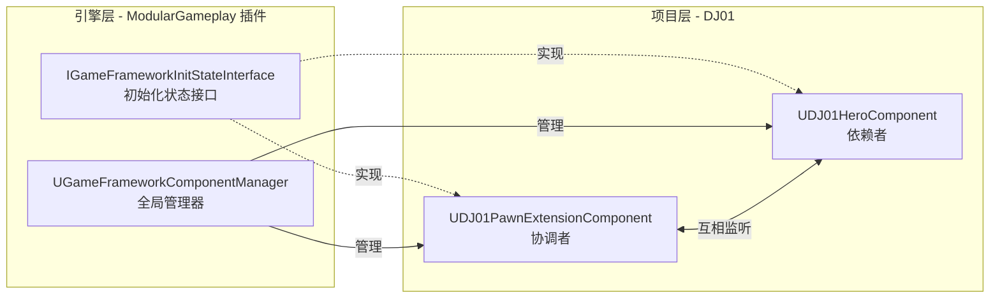
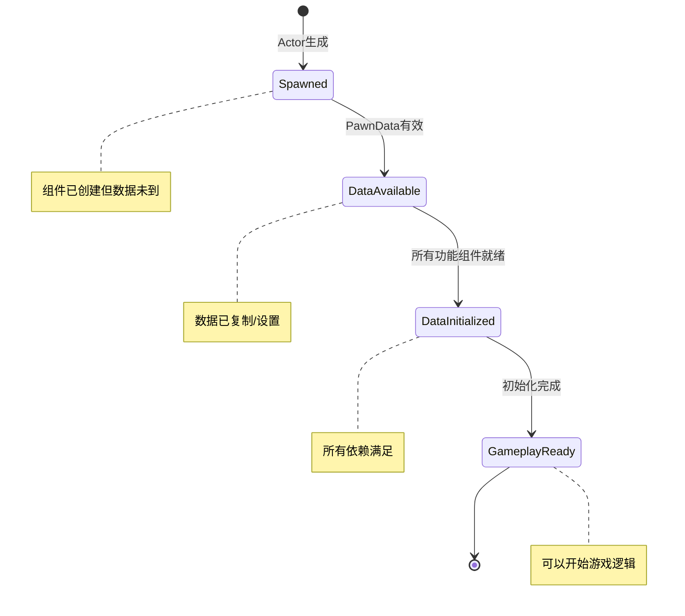
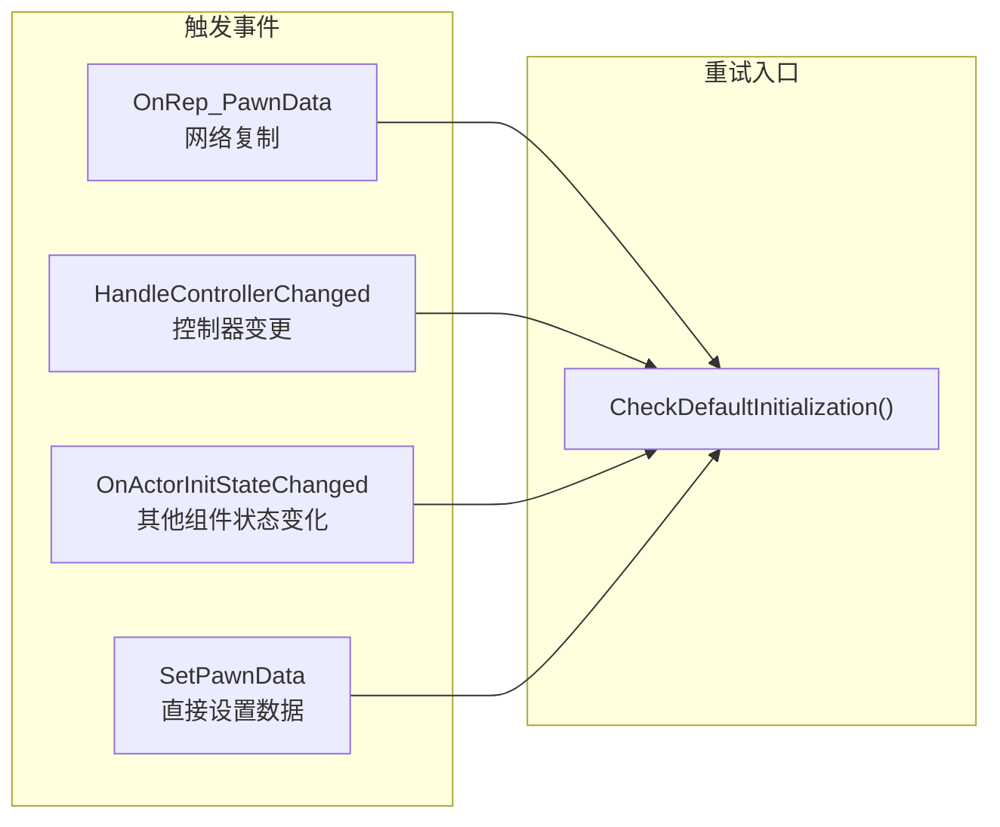
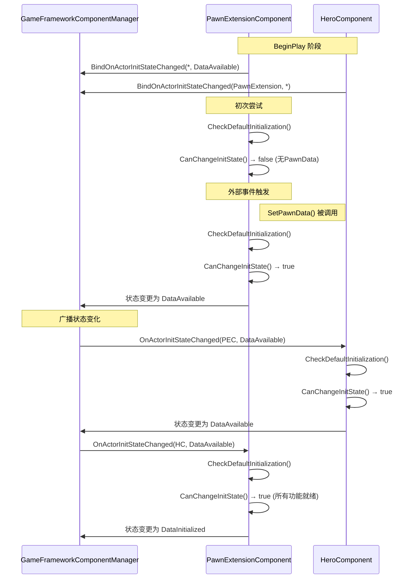
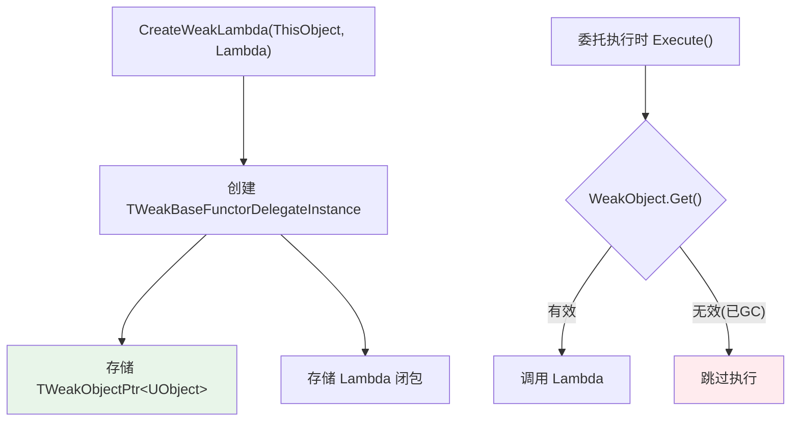
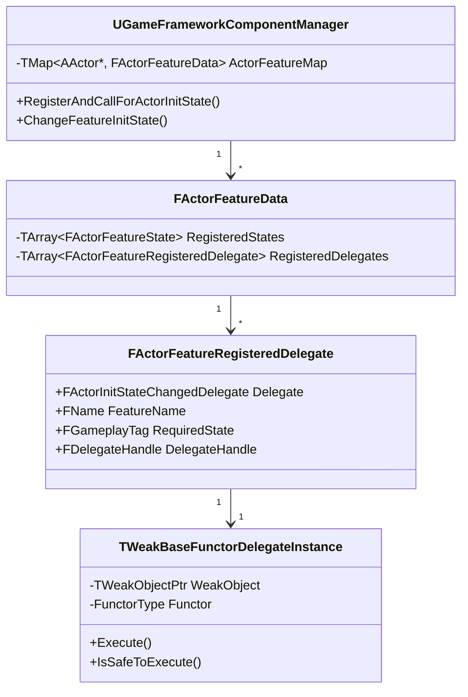

# UE 初始化状态机与委托绑定机制解析

> 本文档记录了对 `IGameFrameworkInitStateInterface` 初始化状态机及其委托绑定机制的深度分析。

## 目录
- [1. 系统架构概述](#1-系统架构概述)
- [2. 初始化状态链](#2-初始化状态链)
- [3. 状态转换核心函数](#3-状态转换核心函数)
- [4. 事件驱动的重试机制](#4-事件驱动的重试机制)
- [5. 组件间状态监听](#5-组件间状态监听)
- [6. 委托绑定机制深度解析](#6-委托绑定机制深度解析)
- [7. 学习要点总结](#7-学习要点总结)

---

## 1. 系统架构概述

### 1.1 核心组件关系



### 1.2 设计模式

| 模式 | 应用 |
|-----|------|
| **观察者模式** | 组件监听其他组件的状态变化 |
| **协调者模式** | PawnExtensionComponent 协调所有功能组件的初始化 |
| **状态机模式** | 通过 GameplayTag 定义状态链，按序推进 |

---

## 2. 初始化状态链

### 2.1 状态定义

```cpp
// 在 DJ01GameplayTags.h 中定义
namespace DJ01GameplayTags
{
    UE_DECLARE_GAMEPLAY_TAG_EXTERN(InitState_Spawned);        // 已生成
    UE_DECLARE_GAMEPLAY_TAG_EXTERN(InitState_DataAvailable);  // 数据就绪
    UE_DECLARE_GAMEPLAY_TAG_EXTERN(InitState_DataInitialized);// 数据已初始化
    UE_DECLARE_GAMEPLAY_TAG_EXTERN(InitState_GameplayReady);  // 游戏就绪
}
```

### 2.2 状态流转图



---

## 3. 状态转换核心函数

### 3.1 CanChangeInitState - 状态转换条件判断

```cpp
// DJ01PawnExtensionComponent.cpp
bool UDJ01PawnExtensionComponent::CanChangeInitState(
    UGameFrameworkComponentManager* Manager, 
    FGameplayTag CurrentState, 
    FGameplayTag DesiredState) const
{
    APawn* Pawn = GetPawn<APawn>();
    
    // Spawned → DataAvailable: 需要 PawnData 有效
    if (CurrentState == DJ01GameplayTags::InitState_Spawned && 
        DesiredState == DJ01GameplayTags::InitState_DataAvailable)
    {
        if (!PawnData)
        {
            return false;  // 💡 条件不满足，返回 false
        }
    }
    
    // DataAvailable → DataInitialized: 需要所有功能组件都到达 DataAvailable
    if (CurrentState == DJ01GameplayTags::InitState_DataAvailable && 
        DesiredState == DJ01GameplayTags::InitState_DataInitialized)
    {
        // 检查是否所有其他功能都已到达 DataAvailable
        if (!Manager->HaveAllFeaturesReachedInitState(
            Pawn, DJ01GameplayTags::InitState_DataAvailable, NAME_ActorFeatureName))
        {
            return false;  // 💡 等待其他组件
        }
    }
    
    return true;
}
```

### 3.2 HandleChangeInitState - 状态转换处理

```cpp
void UDJ01PawnExtensionComponent::HandleChangeInitState(
    UGameFrameworkComponentManager* Manager, 
    FGameplayTag CurrentState, 
    FGameplayTag DesiredState)
{
    // 进入 DataInitialized 状态时执行初始化逻辑
    if (DesiredState == DJ01GameplayTags::InitState_DataInitialized)
    {
        // 初始化能力系统等
        InitializeAbilitySystem(...);
    }
}
```

### 3.3 CheckDefaultInitialization - 尝试推进状态

```cpp
void UDJ01PawnExtensionComponent::CheckDefaultInitialization()
{
    // 定义状态链
    static const TArray<FGameplayTag> StateChain = {
        DJ01GameplayTags::InitState_Spawned,
        DJ01GameplayTags::InitState_DataAvailable,
        DJ01GameplayTags::InitState_DataInitialized,
        DJ01GameplayTags::InitState_GameplayReady
    };

    // 💡 尝试沿着状态链向前推进
    // 内部会调用 CanChangeInitState 检查条件
    // 如果条件不满足，就停在当前状态，等待下次调用
    ContinueInitStateChain(StateChain);
}
```

---

## 4. 事件驱动的重试机制

### 4.1 核心思想

**没有定时器轮询，完全依靠事件触发！**

当 `CanChangeInitState` 返回 `false` 时，系统不会主动重试。而是等待某个事件发生后，再次调用 `CheckDefaultInitialization()` 来重新尝试。

### 4.2 触发重试的事件



### 4.3 代码示例

```cpp
// 网络复制完成时触发
void UDJ01PawnExtensionComponent::OnRep_PawnData()
{
    CheckDefaultInitialization();  // 💡 重试
}

// 控制器变更时触发
void UDJ01PawnExtensionComponent::HandleControllerChanged()
{
    CheckDefaultInitialization();  // 💡 重试
}

// 其他组件状态变化时触发
void UDJ01PawnExtensionComponent::OnActorInitStateChanged(
    const FActorInitStateChangedParams& Params)
{
    if (Params.FeatureName != NAME_ActorFeatureName)
    {
        if (Params.FeatureState == DJ01GameplayTags::InitState_DataAvailable)
        {
            CheckDefaultInitialization();  // 💡 重试
        }
    }
}
```

---

## 5. 组件间状态监听

### 5.1 监听注册

```cpp
// PawnExtensionComponent: 监听所有其他功能组件
void UDJ01PawnExtensionComponent::BeginPlay()
{
    Super::BeginPlay();
    
    // 监听除自己以外的所有功能组件的状态变化
    BindOnActorInitStateChanged(
        FName(),                                    // 空 = 所有功能
        DJ01GameplayTags::InitState_DataAvailable,  // 关注的状态
        false                                       // 不立即调用
    );
    
    CheckDefaultInitialization();
}

// HeroComponent: 专门监听 PawnExtensionComponent
void UDJ01HeroComponent::BeginPlay()
{
    Super::BeginPlay();
    
    // 只监听 PawnExtensionComponent 的状态变化
    BindOnActorInitStateChanged(
        UDJ01PawnExtensionComponent::NAME_ActorFeatureName,  // 指定功能
        FGameplayTag(),                                       // 空 = 所有状态
        false
    );
    
    CheckDefaultInitialization();
}
```

### 5.2 交互流程



---

## 6. 委托绑定机制深度解析

### 6.1 BindOnActorInitStateChanged 实现

```cpp
void IGameFrameworkInitStateInterface::BindOnActorInitStateChanged(
    FName FeatureName, 
    FGameplayTag RequiredState, 
    bool bCallIfReached)
{
    UObject* ThisObject = Cast<UObject>(this);
    AActor* MyActor = GetOwningActor();
    UGameFrameworkComponentManager* Manager = 
        UGameFrameworkComponentManager::GetForActor(MyActor);

    if (ensure(MyActor && Manager))
    {
        // 创建弱引用 Lambda 委托
        FActorInitStateChangedDelegate Delegate = 
            FActorInitStateChangedDelegate::CreateWeakLambda(
                ThisObject,
                [this](const FActorInitStateChangedParams& Params)
                {
                    this->OnActorInitStateChanged(Params);
                });

        // 注册到管理器
        ActorInitStateChangedHandle = Manager->RegisterAndCallForActorInitState(
            MyActor, FeatureName, RequiredState, MoveTemp(Delegate), bCallIfReached);
    }
}
```

### 6.2 CreateWeakLambda 解析



### 6.3 TWeakBaseFunctorDelegateInstance 核心逻辑

```cpp
template<typename UserClass, typename FuncType, ...>
class TWeakBaseFunctorDelegateInstance : public IBaseDelegateInstance<FuncType>
{
private:
    TWeakObjectPtr<UserClass> WeakObject;  // 弱引用
    FunctorType Functor;                    // Lambda 存储

public:
    virtual RetValType Execute(ParamTypes... Params) const override
    {
        // 💡 安全检查：对象是否还活着
        if (UserClass* Object = WeakObject.Get())
        {
            return Functor(Params...);  // 安全调用
        }
        return RetValType();  // 对象已销毁，跳过
    }
    
    virtual bool IsSafeToExecute() const override
    {
        return WeakObject.IsValid();
    }
};
```

### 6.4 RegisterAndCallForActorInitState 实现

```cpp
FDelegateHandle UGameFrameworkComponentManager::RegisterAndCallForActorInitState(
    AActor* Actor, 
    FName FeatureName, 
    FGameplayTag RequiredState, 
    FActorInitStateChangedDelegate Delegate, 
    bool bCallImmediately)
{
    if (ensure(Actor && Delegate.IsBound()))
    {
        // 获取该 Actor 的数据结构
        FActorFeatureData& ActorStruct = FindOrAddActorData(Actor);

        // 添加到委托列表
        FActorFeatureRegisteredDelegate& RegisteredDelegate = 
            ActorStruct.RegisteredDelegates.Emplace_GetRef(
                MoveTemp(Delegate), 
                FeatureName, 
                RequiredState);

        FDelegateHandle ReturnHandle = RegisteredDelegate.DelegateHandle;

        // 如果需要立即调用
        if (bCallImmediately)
        {
            FActorFeatureRegisteredDelegate DelegateCopy = RegisteredDelegate;
            CallDelegateForMatchingFeatures(Actor, DelegateCopy);
        }        
        
        return ReturnHandle;
    }

    return FDelegateHandle();
}
```

### 6.5 数据结构总览



---

## 7. 学习要点总结

### 7.1 设计原则

| 原则 | 体现 |
|-----|------|
| **事件驱动** | 不使用轮询，通过事件触发状态检查 |
| **松耦合** | 组件通过管理器间接通信，不直接依赖 |
| **生命周期安全** | 使用弱引用防止悬挂指针 |
| **可扩展性** | 新组件只需实现接口即可加入状态系统 |

### 7.2 核心技术点

1. **GameplayTag 状态链**
   - 使用 `TArray<FGameplayTag>` 定义状态序列
   - `ContinueInitStateChain` 自动推进

2. **弱引用委托**
   - `CreateWeakLambda` 创建安全的回调
   - `TWeakObjectPtr` 自动追踪 UObject 生命周期

3. **集中式管理**
   - `GameFrameworkComponentManager` 管理所有 Actor 的状态
   - 避免组件间直接引用

### 7.3 适用场景

- 复杂的初始化依赖链
- 需要等待网络复制的组件
- 模块化游戏功能（GAS、输入、相机等）
- 需要解耦的组件间通信

---

## 相关文件

- [DJ01PawnExtensionComponent.h](../../Source/DJ01/Character/Public/DJ01PawnExtensionComponent.h)
- [DJ01PawnExtensionComponent.cpp](../../Source/DJ01/Character/Private/DJ01PawnExtensionComponent.cpp)
- [DJ01HeroComponent.h](../../Source/DJ01/Character/Public/DJ01HeroComponent.h)
- [DJ01HeroComponent.cpp](../../Source/DJ01/Character/Private/DJ01HeroComponent.cpp)
- [DJ01GameplayTags.h](../../Source/DJ01/System/Public/DJ01GameplayTags.h)

---

*文档创建日期: 2024-12-02*