# UE 游戏框架概述

## 1. 框架架构总览

Unreal Engine 的游戏框架采用分层架构，从底层引擎到上层游戏逻辑，核心类之间形成清晰的职责划分。

```mermaid
graph TB
    subgraph 引擎层
        FEngineLoop[FEngineLoop<br>引擎主循环]
        UEngine[UEngine<br>引擎基类]
        UGameEngine[UGameEngine<br>游戏引擎]
    end
    
    subgraph 游戏实例层
        UGameInstance[UGameInstance<br>游戏实例]
        FWorldContext[FWorldContext<br>世界上下文]
    end
    
    subgraph 世界层
        UWorld[UWorld<br>世界]
        ULevel[ULevel<br>关卡]
        AWorldSettings[AWorldSettings<br>世界设置]
    end
    
    subgraph 游戏规则层
        AGameModeBase[AGameModeBase<br>游戏模式]
        AGameStateBase[AGameStateBase<br>游戏状态]
        AGameSession[AGameSession<br>游戏会话]
    end
    
    subgraph 玩家层
        APlayerController[APlayerController<br>玩家控制器]
        APlayerState[APlayerState<br>玩家状态]
        APawn[APawn/ACharacter<br>玩家角色]
        ULocalPlayer[ULocalPlayer<br>本地玩家]
    end
    
    FEngineLoop --> UEngine
    UEngine --> UGameEngine
    UGameEngine --> UGameInstance
    UGameInstance --> FWorldContext
    FWorldContext --> UWorld
    UWorld --> ULevel
    UWorld --> AGameModeBase
    AGameModeBase --> AGameStateBase
    AGameModeBase --> APlayerController
    APlayerController --> APlayerState
    APlayerController --> APawn
    UGameInstance --> ULocalPlayer
    ULocalPlayer --> APlayerController
```



## 2. 核心类职责

### 2.1 引擎层

| 类名 | 职责 | 生命周期 |
|------|------|----------|
| **FEngineLoop** | 引擎主循环，负责 PreInit/Init/Tick/Exit | 整个应用程序生命周期 |
| **UEngine** | 引擎基类，管理世界列表和核心子系统 | 整个应用程序生命周期 |
| **UGameEngine** | 游戏引擎，管理 GameInstance 和 Viewport | 运行时游戏会话 |

### 2.2 游戏实例层

| 类名 | 职责 | 生命周期 |
|------|------|----------|
| **UGameInstance** | 游戏实例，跨关卡持久化的游戏逻辑容器 | 游戏会话期间（可跨Map） |
| **FWorldContext** | 世界上下文，关联 GameInstance 与 World | 与 UWorld 绑定 |

### 2.3 世界层

| 类名 | 职责 | 生命周期 |
|------|------|----------|
| **UWorld** | 世界容器，包含所有关卡和Actor | 单个 Map 加载期间 |
| **ULevel** | 关卡，Actor 的直接容器 | 随关卡加载/卸载 |
| **AWorldSettings** | 世界设置，定义默认 GameMode 等 | 与 Level 绑定 |

### 2.4 游戏规则层（仅服务器/单机）

| 类名 | 职责 | 生命周期 |
|------|------|----------|
| **AGameModeBase** | 游戏规则，控制玩家登录、Spawn 规则 | 单个 Map 期间（仅Authority） |
| **AGameStateBase** | 游戏状态，Replicated 的比赛信息 | 单个 Map 期间 |
| **AGameSession** | 游戏会话，管理网络会话 | 与 GameMode 绑定 |

### 2.5 玩家层

| 类名 | 职责 | 生命周期 |
|------|------|----------|
| **ULocalPlayer** | 本地玩家，代表本地输入源 | 游戏会话期间 |
| **APlayerController** | 玩家控制器，连接玩家与 Pawn | 玩家在线期间 |
| **APlayerState** | 玩家状态，Replicated 的玩家信息 | 玩家在线期间 |
| **APawn/ACharacter** | 玩家角色，世界中的物理表示 | 可多次 Spawn/Destroy |

## 3. 网络架构模型


**关键点：**
- `AGameModeBase` **仅存在于服务器**，客户端为 `nullptr`
- `AGameStateBase` 和 `APlayerState` 会自动 **Replicate** 到所有客户端
- `APlayerController` 每个客户端有一个，服务器拥有所有玩家的 Controller
- 通过 `GetWorld()->GetAuthGameMode()` 获取 GameMode（客户端返回 nullptr）

## 4. 两阶段初始化：PreInit 与 Init

UE 引擎将启动流程分为两个主要阶段：

### PreInit 阶段（Map 加载前）


### Init 阶段（创建引擎和加载 Map）


## 5. 源码关键入口

| 源文件 | 关键函数 | 职责 |
|--------|----------|------|
| `LaunchEngineLoop.cpp` | `FEngineLoop::PreInit()` | 引擎预初始化 |
| `LaunchEngineLoop.cpp` | `FEngineLoop::Init()` | 引擎初始化，创建 GEngine |
| `GameEngine.cpp` | `UGameEngine::Init()` | 创建 GameInstance 和 Viewport |
| `GameEngine.cpp` | `UGameEngine::Start()` | 调用 StartGameInstance |
| `GameInstance.cpp` | `UGameInstance::StartGameInstance()` | 调用 Browse 加载默认 Map |
| `UnrealEngine.cpp` | `UEngine::LoadMap()` | 加载 Map 并初始化 World |
| `World.cpp` | `UWorld::SetGameMode()` | 创建 GameMode |
| `GameModeBase.cpp` | `AGameModeBase::PreInitializeComponents()` | 创建 GameState |
| `GameModeBase.cpp` | `AGameModeBase::InitGame()` | 初始化 GameSession |

## 6. 类的获取方式

```cpp
// 获取 GameInstance（跨关卡持久）
UGameInstance* GI = GetGameInstance();

// 获取 World
UWorld* World = GetWorld();

// 获取 GameMode（仅服务器有效）
AGameModeBase* GM = GetWorld()->GetAuthGameMode();

// 获取 GameState（所有端都有）
AGameStateBase* GS = GetWorld()->GetGameState();

// 获取 PlayerController
APlayerController* PC = GetWorld()->GetFirstPlayerController();

// 获取 LocalPlayer
ULocalPlayer* LP = GetWorld()->GetFirstLocalPlayerFromController();
```