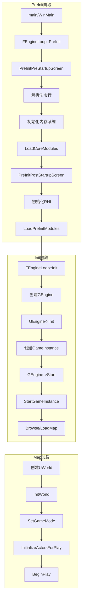
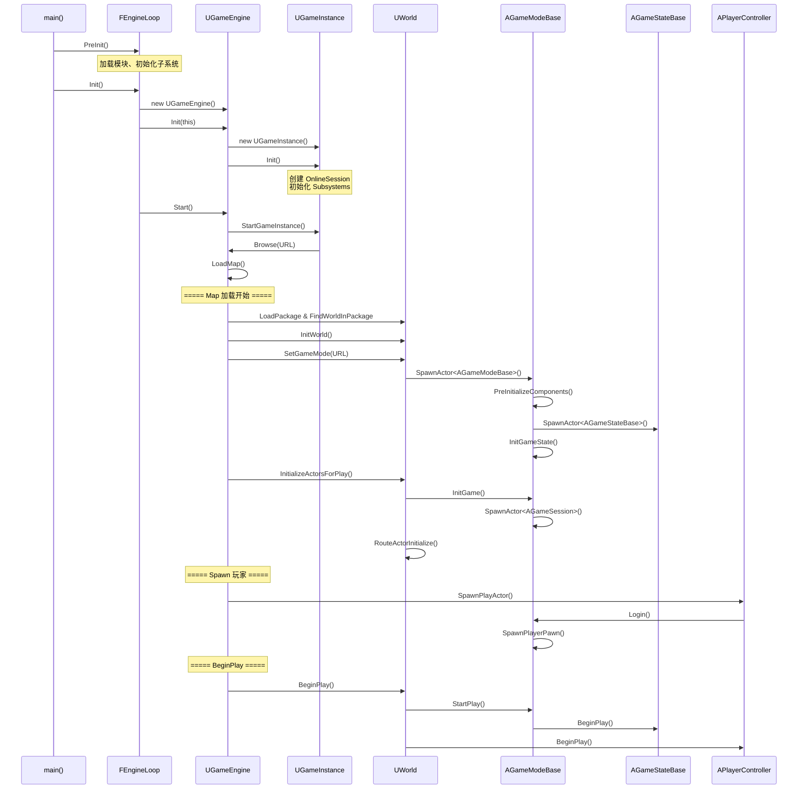

# UE 引擎启动流程

## 1. 总体流程图



## 2. PreInit 阶段详解

### 2.1 PreInit 入口

这是引擎启动的最早阶段，分为两个子阶段。

```cpp
// LaunchEngineLoop.cpp - 第 4466 行
int32 FEngineLoop::PreInit(const TCHAR* CmdLine)
{
    const int32 rv1 = PreInitPreStartupScreen(CmdLine);
    if (rv1 != 0)
    {
        PreInitContext.Cleanup();
        return rv1;
    }
    const int32 rv2 = PreInitPostStartupScreen(CmdLine);
    // ...
    return 0;
}
```

### 2.2 PreInitPreStartupScreen

**主要任务：**
1. 解析命令行参数
2. 初始化内存分配器（FMalloc）
3. 初始化日志系统
4. 加载 Config 配置文件
5. 初始化平台相关功能

### 2.3 LoadCoreModules

加载核心对象系统模块：

```cpp
// LaunchEngineLoop.cpp - 第 4494 行
bool FEngineLoop::LoadCoreModules()
{
#if WITH_COREUOBJECT
    FModuleManager::Get().OnProcessLoadedObjectsCallback().AddStatic(ProcessNewlyLoadedUObjects);
    return FModuleManager::Get().LoadModule(TEXT("CoreUObject")) != nullptr;
#else
    return true;
#endif
}
```

### 2.4 LoadPreInitModules

加载引擎核心模块：

```cpp
// LaunchEngineLoop.cpp - 第 4513 行
void FEngineLoop::LoadPreInitModules()
{
#if WITH_ENGINE
    FModuleManager::Get().LoadModule(TEXT("Engine"));
    FModuleManager::Get().LoadModule(TEXT("Renderer"));
    FModuleManager::Get().LoadModule(TEXT("AnimGraphRuntime"));
    FPlatformApplicationMisc::LoadPreInitModules();
    
    // 加载 Slate 渲染器
    if (!GUsingNullRHI)
    {
        FModuleManager::Get().LoadModuleChecked<ISlateRHIRendererModule>("SlateRHIRenderer");
    }
    
    FModuleManager::Get().LoadModule(TEXT("Landscape"));
    FModuleManager::Get().LoadModule(TEXT("RenderCore"));
#endif
}
```

## 3. Init 阶段详解

### 3.1 创建 GEngine

根据是否为编辑器模式，创建不同的引擎实例：

```cpp
// LaunchEngineLoop.cpp - 第 4804 行
int32 FEngineLoop::Init()
{
    // 确定使用哪个 UEngine 子类
    UClass* EngineClass = nullptr;
    if (!GIsEditor)
    {
        // 游戏模式：使用 UGameEngine
        FString GameEngineClassName;
        GConfig->GetString(TEXT("/Script/Engine.Engine"), TEXT("GameEngine"), 
                           GameEngineClassName, GEngineIni);
        EngineClass = StaticLoadClass(UGameEngine::StaticClass(), nullptr, *GameEngineClassName);
        GEngine = NewObject<UEngine>(GetTransientPackage(), EngineClass);
    }
    else
    {
        // 编辑器模式：使用 UUnrealEdEngine
        // ...
        GEngine = GEditor = GUnrealEd = NewObject<UUnrealEdEngine>(GetTransientPackage(), EngineClass);
    }
    
    // 初始化引擎
    GEngine->Init(this);
    
    // 触发回调
    FCoreDelegates::OnPostEngineInit.Broadcast();
    
    // 启动游戏
    GEngine->Start();
    // ...
}
```

### 3.2 UEngine::Init

引擎基类初始化：

```cpp
// UnrealEngine.cpp - 第 1950 行
void UEngine::Init(IEngineLoop* InEngineLoop)
{
    UE_LOG(LogEngine, Log, TEXT("Initializing Engine..."));
    
    EngineLoop = InEngineLoop;
    
    // 初始化子系统
    FURL::StaticInit();
    EngineSubsystemCollection.Initialize(this);
    
    // 初始化 HMD 设备
    if (!FApp::IsProjectNameEmpty())
    {
        InitializeHMDDevice();
        InitializeEyeTrackingDevice();
    }
    
    // 游戏模式下禁用屏保
    if (GIsClient && !GIsEditor)
    {
        EnableScreenSaver(false);
    }
}
```

### 3.3 UGameInstance::Init

游戏实例初始化：

```cpp
// GameInstance.cpp - 第 96 行
void UGameInstance::Init()
{
    ReceiveInit();  // 蓝图回调
    
    if (!IsRunningCommandlet())
    {
        // 创建 OnlineSession
        UClass* SpawnClass = GetOnlineSessionClass();
        OnlineSession = NewObject<UOnlineSession>(this, SpawnClass);
        if (OnlineSession)
        {
            OnlineSession->RegisterOnlineDelegates();
        }
        
        // 注册网络加密代理
        FNetDelegates::OnReceivedNetworkEncryptionToken.BindUObject(...);
        FNetDelegates::OnReceivedNetworkEncryptionAck.BindUObject(...);
        
        // 注册输入设备回调
        IPlatformInputDeviceMapper& PlatformInputMapper = IPlatformInputDeviceMapper::Get();
        PlatformInputMapper.GetOnInputDeviceConnectionChange().AddUObject(...);
    }
    
    // 初始化子系统
    SubsystemCollection.Initialize(this);
}
```

## 4. GEngine->Start 与 Map 加载

### 4.1 StartGameInstance

```cpp
// GameEngine.cpp - 第 1218 行
void UGameEngine::Start()
{
    UE_LOG(LogInit, Display, TEXT("Starting Game."));
    GameInstance->StartGameInstance();
}
```

```cpp
// GameInstance.cpp - 第 599 行
void UGameInstance::StartGameInstance()
{
    UEngine* const Engine = GetEngine();
    
    // 创建默认 URL
    FURL DefaultURL;
    DefaultURL.LoadURLConfig(TEXT("DefaultPlayer"), GGameIni);
    
    // 获取默认地图
    const UGameMapsSettings* GameMapsSettings = GetDefault<UGameMapsSettings>();
    const FString& DefaultMap = GameMapsSettings->GetGameDefaultMap();
    
    FString PackageName;
    if (!GetMapOverrideName(Tmp, PackageName))
    {
        PackageName = DefaultMap + GameMapsSettings->LocalMapOptions;
    }
    
    // 加载地图
    FURL URL(&DefaultURL, *PackageName, TRAVEL_Partial);
    if (URL.Valid)
    {
        BrowseRet = Engine->Browse(*WorldContext, URL, Error);
    }
}
```

### 4.2 LoadMap 核心流程

```cpp
// UnrealEngine.cpp - 第 14956 行
bool UEngine::LoadMap(FWorldContext& WorldContext, FURL URL, 
                      UPendingNetGame* Pending, FString& Error)
{
    // 1. 清理旧世界
    if (WorldContext.World())
    {
        WorldContext.World()->BeginTearingDown();
        ShutdownWorldNetDriver(WorldContext.World());
        WorldContext.World()->CleanupWorld();
    }
    
    // 2. 加载新世界包
    UPackage* WorldPackage = LoadPackage(nullptr, *URL.Map, LOAD_None);
    UWorld* NewWorld = UWorld::FindWorldInPackage(WorldPackage);
    
    // 3. 设置世界
    NewWorld->SetGameInstance(WorldContext.OwningGameInstance);
    GWorld = NewWorld;
    WorldContext.SetCurrentWorld(NewWorld);
    
    // 4. 初始化世界
    WorldContext.World()->InitWorld();
    
    // 5. 设置 GameMode（关键！）
    WorldContext.World()->SetGameMode(URL);
    
    // 6. 初始化所有 Actor
    WorldContext.World()->InitializeActorsForPlay(URL, true);
    
    // 7. Spawn 玩家
    for (auto It = WorldContext.OwningGameInstance->GetLocalPlayerIterator(); It; ++It)
    {
        (*It)->SpawnPlayActor(URL.ToString(1), Error2, WorldContext.World());
    }
    
    // 8. BeginPlay
    WorldContext.World()->BeginPlay();
}
```

## 5. 时序图：完整启动流程



## 6. 关键代理/委托

| 委托 | 触发时机 | 用途 |
|------|----------|------|
| `FCoreDelegates::OnPostEngineInit` | GEngine->Init() 完成后 | 引擎初始化完成回调 |
| `FCoreUObjectDelegates::PreLoadMap` | LoadMap 开始时 | Map 加载前准备 |
| `FCoreUObjectDelegates::PostLoadMapWithWorld` | LoadMap 完成后 | Map 加载完成处理 |
| `FWorldDelegates::OnWorldInitializedActors` | InitializeActorsForPlay 完成后 | Actor 初始化完成 |
| `FGameModeEvents::GameModeInitializedEvent` | InitGame 中 | GameMode 初始化完成 |

## 7. 源码文件位置

| 文件 | 路径 | 关键行号 |
|------|------|----------|
| LaunchEngineLoop.cpp | Engine/Source/Runtime/Launch/Private/ | PreInit:4466, Init:4804 |
| UnrealEngine.cpp | Engine/Source/Runtime/Engine/Private/ | Init:1950, LoadMap:14956 |
| GameEngine.cpp | Engine/Source/Runtime/Engine/Private/ | Start:1218 |
| GameInstance.cpp | Engine/Source/Runtime/Engine/Private/ | Init:96, StartGameInstance:599 |
| World.cpp | Engine/Source/Runtime/Engine/Private/ | SetGameMode:5101, InitializeActorsForPlay:5120 |