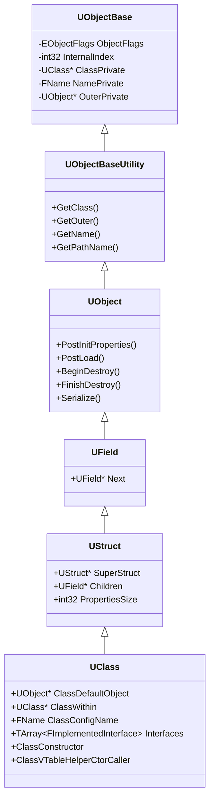
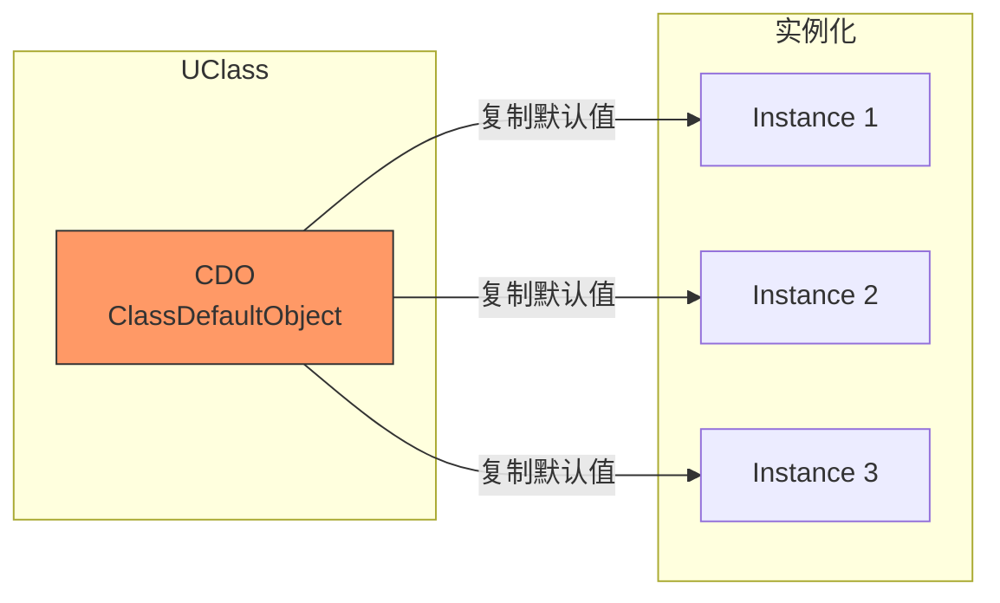
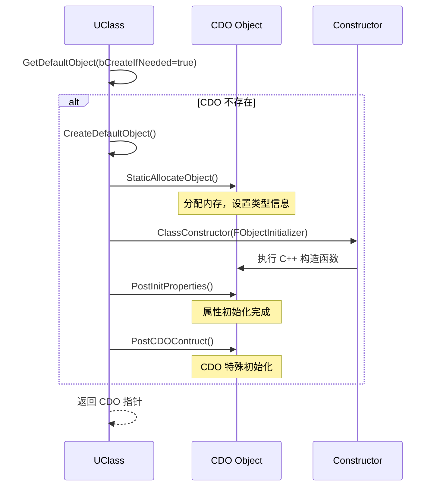
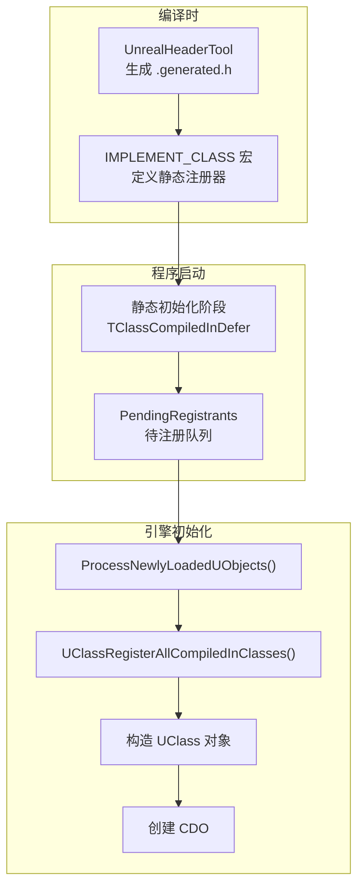
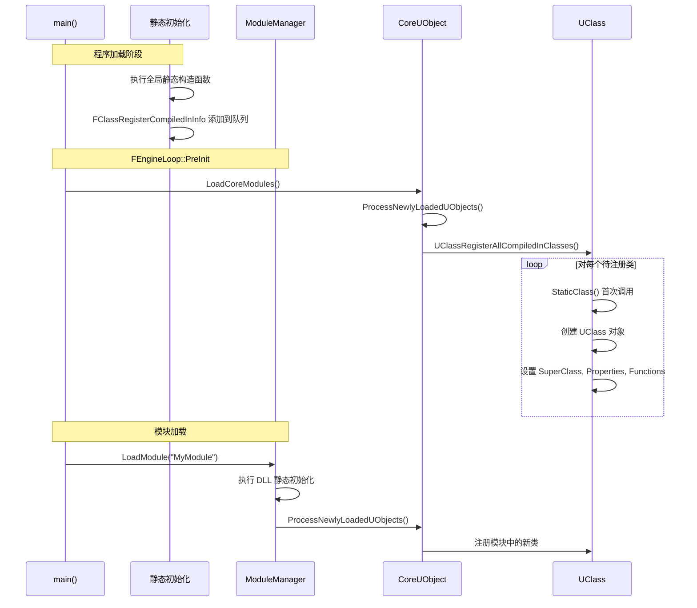
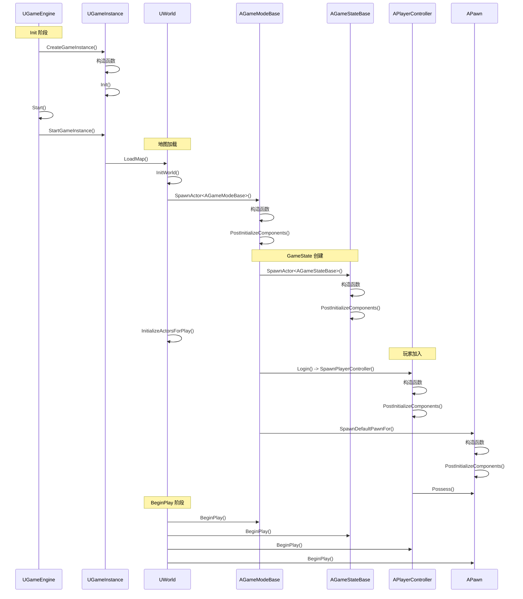
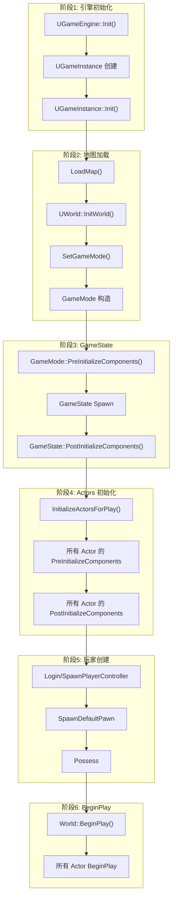
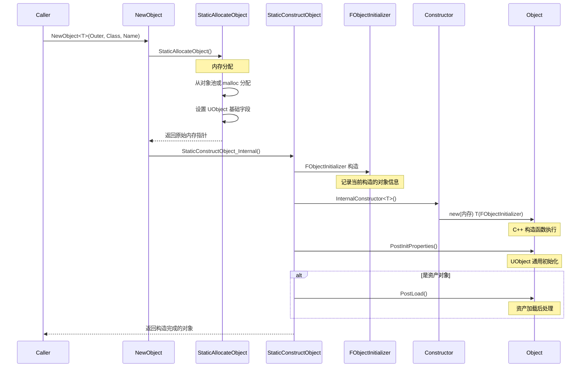
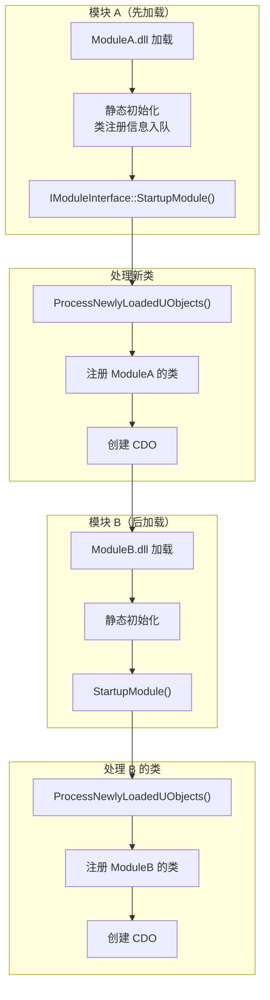

# 03 - 类加载与初始化顺序

## 概述

Unreal Engine 的对象系统是整个引擎的核心基础。理解 UClass、CDO（Class Default Object）、以及各类对象的初始化顺序，对于深入掌握 UE 开发至关重要。

本文档将深入分析：
- UObject 反射系统的基础
- CDO 的创建和作用
- UClass 的注册流程
- 核心游戏类的初始化时序

---

## 1. UObject 反射系统基础

### 1.1 反射系统架构



### 1.2 关键宏定义

UE 通过一系列宏来实现反射系统的自动注册：

```cpp
// 声明类的反射信息
UCLASS()
class MYMODULE_API UMyClass : public UObject
{
    GENERATED_BODY()  // 展开为反射相关的声明
    
    UPROPERTY()
    int32 MyProperty;
    
    UFUNCTION()
    void MyFunction();
};
```

**GENERATED_BODY() 宏展开后包含：**

```cpp
// 简化展示核心内容
public:
    // 静态类获取函数
    static UClass* StaticClass();
    
    // 类型信息
    typedef UMyClass ThisClass;
    typedef UObject Super;
    
    // 构造函数相关
    static void __DefaultConstructor(const FObjectInitializer& X);
    
private:
    // 禁用拷贝
    UMyClass(const UMyClass&) = delete;
    UMyClass& operator=(const UMyClass&) = delete;
```

---

## 2. CDO（Class Default Object）

### 2.1 CDO 的概念与作用

**CDO** 是每个 UClass 的"原型对象"，用于：

1. **存储类的默认属性值** - 新实例复制 CDO 的属性作为初始值
2. **支持属性编辑器** - 蓝图和编辑器读取 CDO 来显示默认值
3. **序列化优化** - 只序列化与 CDO 不同的属性值
4. **反射查询** - 运行时查询类的默认行为



### 2.2 CDO 创建流程



### 2.3 CDO 在代码中的体现

```cpp
// UClass 中 CDO 的定义
// Engine/Source/Runtime/CoreUObject/Public/UObject/Class.h

class UClass : public UStruct
{
    // ...
    
    /** 类的默认对象 */
    UObject* ClassDefaultObject;
    
public:
    /**
     * 获取此类的默认对象
     * @param bCreateIfNeeded - 如果 CDO 不存在是否创建
     */
    UObject* GetDefaultObject(bool bCreateIfNeeded = true) const
    {
        if (ClassDefaultObject == nullptr && bCreateIfNeeded)
        {
            const_cast<UClass*>(this)->CreateDefaultObject();
        }
        return ClassDefaultObject;
    }
    
    // 模板版本，自动转型
    template<class T>
    T* GetDefaultObject() const
    {
        return (T*)GetDefaultObject(true);
    }
};
```

### 2.4 CDO 与普通实例的区别

| 特性 | CDO | 普通实例 |
|-----|-----|---------|
| 创建时机 | 类注册时（或首次访问时） | 运行时按需创建 |
| 数量 | 每个 UClass 仅一个 | 无限制 |
| 生命周期 | 与 UClass 相同 | 由 GC 管理 |
| 序列化 | 通常不序列化 | 正常序列化 |
| 标志位 | RF_ClassDefaultObject | 无此标志 |
| Outer | 通常是 GetTransientPackage() | 根据创建上下文 |

---

## 3. UClass 注册流程

### 3.1 静态注册架构



### 3.2 关键注册结构

```cpp
// 简化的注册信息结构
struct FClassRegisterCompiledInInfo
{
    // 类名（用于查找）
    const TCHAR* Name;
    
    // 类的外部对象（通常是 Package）
    UClass* (*OuterRegister)();
    
    // 获取静态类的函数指针
    UClass* (*InnerRegister)();
    
    // 包名
    const TCHAR* PackageName;
};

// IMPLEMENT_CLASS 宏展开（简化）
#define IMPLEMENT_CLASS(TClass, TPackage) \
    static FClassRegisterCompiledInInfo AutoInitialize##TClass( \
        TEXT(#TClass), \
        &TClass::StaticPackage, \
        &TClass::StaticClass, \
        TEXT(#TPackage) \
    );
```

### 3.3 延迟注册机制

```cpp
// Engine/Source/Runtime/CoreUObject/Private/UObject/UObjectGlobals.cpp

/** 待注册的类列表 */
static TArray<FClassRegisterCompiledInInfo>& GetDeferredClassRegistration()
{
    static TArray<FClassRegisterCompiledInInfo> DeferredClassRegistration;
    return DeferredClassRegistration;
}

/** 处理待注册的类 */
void UClassRegisterAllCompiledInClasses()
{
    TArray<FClassRegisterCompiledInInfo>& DeferredClassRegistration = 
        GetDeferredClassRegistration();
    
    for (const FClassRegisterCompiledInInfo& Info : DeferredClassRegistration)
    {
        // 调用 InnerRegister 创建 UClass
        UClass* Class = Info.InnerRegister();
        // ...
    }
    
    DeferredClassRegistration.Empty();
}
```

### 3.4 注册时序图



---

## 4. 核心游戏类初始化顺序

### 4.1 完整初始化时序



### 4.2 各类初始化详解

#### UGameInstance 初始化

```cpp
// Engine/Source/Runtime/Engine/Private/GameInstance.cpp

void UGameInstance::Init()
{
    // 获取子系统集合
    SubsystemCollection.Initialize(this);
    
    // 接收引擎启动完成通知
    ReceiveInit();  // 蓝图事件
}

void UGameInstance::StartGameInstance()
{
    // 获取启动地图
    FURL DefaultURL;
    DefaultURL.Map = GetDefaultMap();
    
    // 浏览到默认地图
    FString Error;
    if (GetEngine()->Browse(*WorldContext, DefaultURL, Error) == EBrowseReturnVal::Pending)
    {
        // 地图加载中...
    }
}
```

**初始化时机：**
| 函数 | 调用时机 | 用途 |
|-----|---------|-----|
| 构造函数 | CreateGameInstance() 内 | 基础成员初始化 |
| Init() | 构造后立即 | 初始化子系统 |
| StartGameInstance() | UGameEngine::Start() | 开始加载地图 |
| OnStart() | 地图加载完成后 | 游戏正式开始 |

#### AGameModeBase 初始化

```cpp
// Engine/Source/Runtime/Engine/Private/GameModeBase.cpp

void AGameModeBase::PreInitializeComponents()
{
    Super::PreInitializeComponents();
    
    // 创建 GameState - 这是最早的时机
    FActorSpawnParameters SpawnInfo;
    SpawnInfo.Instigator = GetInstigator();
    SpawnInfo.ObjectFlags |= RF_Transient;
    
    GameState = GetWorld()->SpawnActor<AGameStateBase>(
        GameStateClass, 
        SpawnInfo
    );
    
    // 关联
    GetWorld()->SetGameState(GameState);
}

void AGameModeBase::InitGame(const FString& MapName, 
                              const FString& Options, 
                              FString& ErrorMessage)
{
    // 解析游戏选项
    // 此时 GameState 已存在
}
```

#### AGameStateBase 初始化

```cpp
// GameState 的关键初始化点

void AGameStateBase::PostInitializeComponents()
{
    Super::PostInitializeComponents();
    
    // 设置 GameMode 引用（服务器端）
    SetReplicates(true);
    
    // 初始化玩家数组
    PlayerArray.Reset();
}

void AGameStateBase::BeginPlay()
{
    Super::BeginPlay();
    
    // 此时所有玩家控制器已创建
    // 可以安全地进行游戏逻辑初始化
}
```

### 4.3 初始化顺序保证



---

## 5. 对象构造流程

### 5.1 NewObject 流程

```cpp
// 使用示例
UMyObject* Obj = NewObject<UMyObject>(Outer, UMyObject::StaticClass(), NAME_None);
```



### 5.2 SpawnActor 流程

```cpp
// Actor 生成示例
FActorSpawnParameters Params;
Params.Owner = this;
AMyActor* Actor = GetWorld()->SpawnActor<AMyActor>(ActorClass, Location, Rotation, Params);
```

```mermaid
sequenceDiagram
    participant World as UWorld
    participant SpawnActor
    participant NewObject
    participant Actor as AActor
    participant Components
    
    World->>SpawnActor: SpawnActor<T>()
    
    SpawnActor->>SpawnActor: SpawnActorDeferred()
    Note over SpawnActor: 检查碰撞、验证类型
    
    SpawnActor->>NewObject: NewObject<AActor>()
    NewObject-->>SpawnActor: 返回 Actor 指针
    
    Note over Actor: 此时 Actor 已构造<br/>但组件未初始化
    
    SpawnActor->>Actor: PostSpawnInitialize()
    Actor->>Actor: PostActorCreated()
    Actor->>Actor: ExecuteConstruction()
    Note over Actor: 运行构造脚本
    
    Actor->>Components: RegisterAllComponents()
    loop 每个组件
        Components->>Components: RegisterComponent()
        Components->>Components: OnRegister()
    end
    
    Actor->>Actor: PreInitializeComponents()
    Actor->>Actor: InitializeComponents()
    Actor->>Actor: PostInitializeComponents()
    
    alt 世界已开始
        Actor->>Actor: BeginPlay()
    end
    
    SpawnActor-->>World: 返回生成的 Actor
```

### 5.3 构造函数 vs PostInitProperties

| 特性 | C++ 构造函数 | PostInitProperties |
|-----|------------|-------------------|
| 调用时机 | 内存分配后立即 | 构造函数完成后 |
| 可用信息 | 仅 C++ 成员 | UObject 系统已就绪 |
| CDO 访问 | ❌ 不安全 | ✅ 可以访问 |
| Outer 访问 | ❌ 不安全 | ✅ 可以访问 |
| 推荐用途 | 简单成员初始化 | 需要 UObject 功能的初始化 |

```cpp
// 正确使用示例
UMyComponent::UMyComponent()
{
    // ✅ 简单值初始化
    bAutoActivate = true;
    PrimaryComponentTick.bCanEverTick = true;
}

void UMyComponent::PostInitProperties()
{
    Super::PostInitProperties();
    
    // ✅ 需要 Outer 的操作
    if (AActor* Owner = GetOwner())
    {
        // 可以安全访问 Owner
    }
    
    // ✅ 需要 CDO 的操作
    if (!HasAnyFlags(RF_ClassDefaultObject))
    {
        // 仅对实例执行，跳过 CDO
    }
}
```

---

## 6. 模块加载时的类注册

### 6.1 模块加载与类注册的关系



### 6.2 跨模块类依赖

```cpp
// 如果 ModuleB 的类继承自 ModuleA 的类
// ModuleA 必须先加载

// ModuleB.Build.cs
public class ModuleB : ModuleRules
{
    public ModuleB(ReadOnlyTargetRules Target) : base(Target)
    {
        // 声明依赖，确保加载顺序
        PublicDependencyModuleNames.AddRange(new string[] {
            "ModuleA"  // ModuleA 会先加载
        });
    }
}
```

---

## 7. 调试技巧

### 7.1 常用调试命令

```cpp
// 控制台命令
Obj List Class=MyClass     // 列出某类的所有实例
Obj Classes                 // 列出所有已注册的类
Obj Refs Class=MyClass     // 查看对象引用关系

// 代码中
UE_LOG(LogTemp, Log, TEXT("CDO: %s"), *MyClass::StaticClass()->GetDefaultObject()->GetName());
```

### 7.2 初始化断点建议

调试初始化流程时，建议在以下位置设置断点：

| 断点位置 | 用途 |
|---------|-----|
| `UGameInstance::Init()` | GameInstance 初始化开始 |
| `UWorld::SetGameMode()` | GameMode 创建时机 |
| `AGameModeBase::PreInitializeComponents()` | GameState 创建时机 |
| `AActor::PostInitializeComponents()` | Actor 初始化完成 |
| `AActor::BeginPlay()` | 游戏逻辑开始 |

---

## 总结

### 关键要点

1. **CDO 是类的原型** - 每个 UClass 有且仅有一个 CDO，用于存储默认值
2. **延迟注册机制** - 类在模块加载时注册，而非程序启动时立即注册
3. **严格的初始化顺序** - GameInstance → GameMode → GameState → PlayerController → Pawn
4. **构造函数限制** - C++ 构造函数中不要访问 UObject 系统功能，应使用 PostInitProperties

### 核心初始化函数调用顺序

```
[对象创建]
1. 内存分配
2. C++ 构造函数
3. PostInitProperties()

[Actor 特有]
4. PostActorCreated() 或 PostLoad()
5. RegisterAllComponents()
6. PreInitializeComponents()
7. InitializeComponents()
8. PostInitializeComponents()

[游戏开始]
9. BeginPlay()
```

---

> 下一篇：[04 - Actor生命周期](./04_Actor生命周期.md)