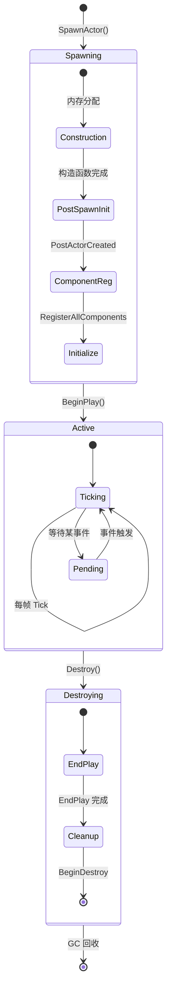
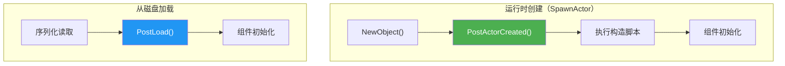
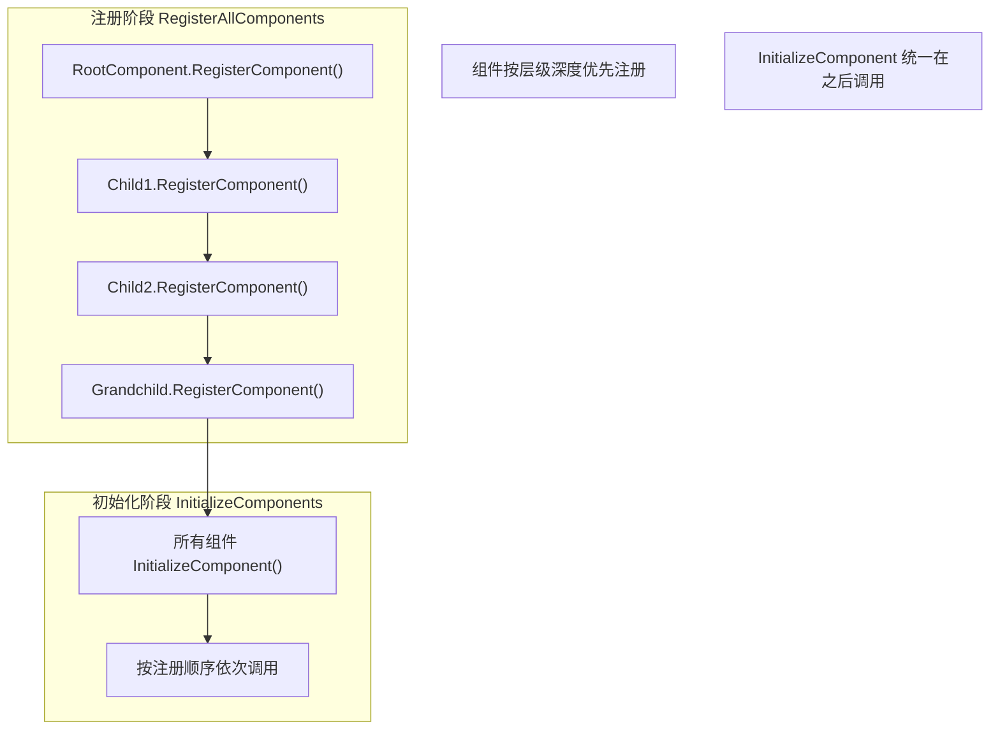
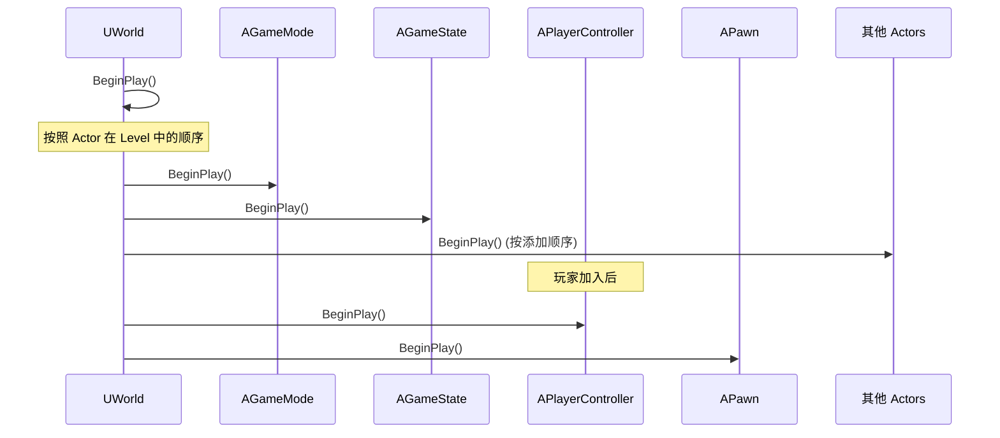
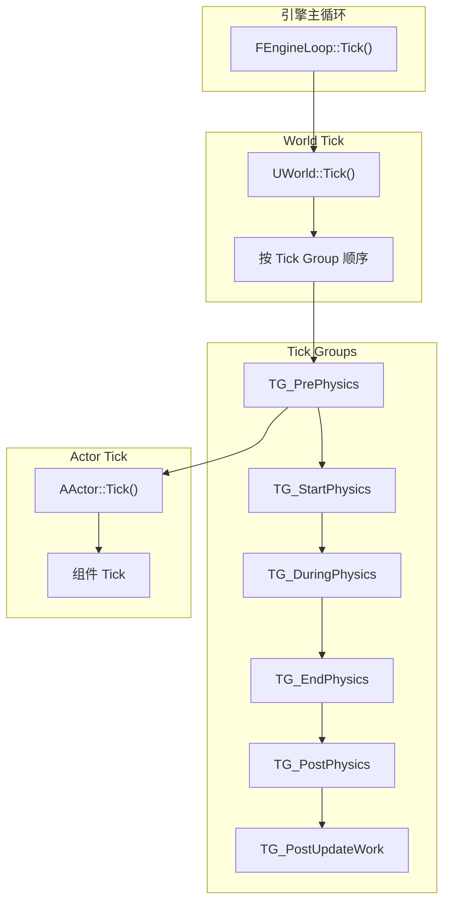
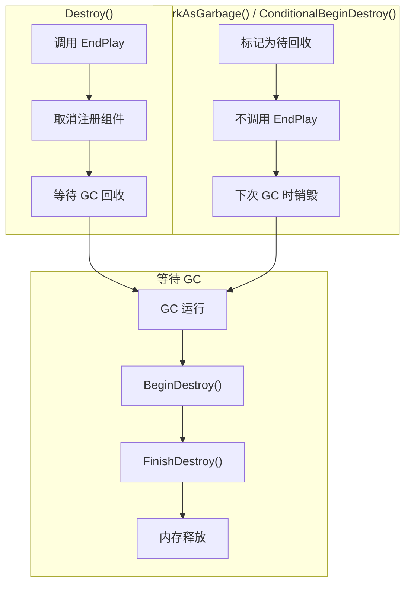
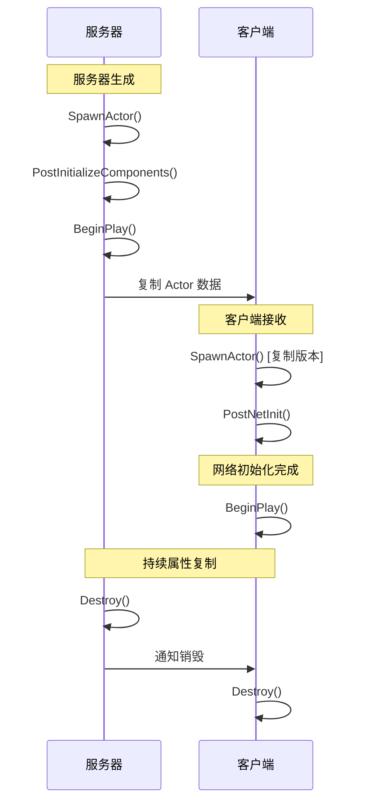

# 04 - Actor 生命周期

## 概述

Actor 是 Unreal Engine 中可放置在关卡中的所有对象的基类。理解 Actor 的生命周期对于正确实现游戏逻辑、避免空指针和内存问题至关重要。

本文档将详细分析：
- Actor 的完整生命周期阶段
- 各生命周期函数的调用时机和用途
- 组件的初始化流程
- Tick 机制
- 销毁流程

---

## 1. Actor 生命周期总览

### 1.1 生命周期阶段



### 1.2 关键生命周期函数

| 阶段 | 函数 | 调用时机 | 主要用途 |
|-----|------|---------|---------|
| 构造 | Constructor | 对象创建时 | 设置默认值，创建组件 |
| 构造 | PostInitProperties | 构造后 | UObject 初始化完成 |
| 构造 | PostActorCreated | 首次创建时 | 初始化（非加载） |
| 构造 | PostLoad | 从磁盘加载时 | 加载后处理 |
| 初始化 | PreInitializeComponents | 组件初始化前 | 组件依赖设置 |
| 初始化 | PostInitializeComponents | 组件初始化后 | 需要组件的初始化 |
| 运行 | BeginPlay | 游戏开始时 | 游戏逻辑初始化 |
| 运行 | Tick | 每帧 | 持续更新逻辑 |
| 销毁 | EndPlay | 销毁开始 | 清理游戏逻辑 |
| 销毁 | BeginDestroy | GC 回收时 | 释放资源 |
| 销毁 | FinishDestroy | 最终销毁 | 最后的清理 |

---

## 2. Spawn 阶段详解

### 2.1 SpawnActor 完整流程

```mermaid
sequenceDiagram
    participant Caller as 调用者
    participant World as UWorld
    participant Level as ULevel
    participant Actor as AActor
    participant Components as UComponents
    
    Caller->>World: SpawnActor<T>(Class, Transform, Params)
    
    World->>World: SpawnActorDeferred()
    Note over World: 验证类、检查网络权限
    
    alt 碰撞检测失败
        World-->>Caller: return nullptr
    end
    
    World->>Actor: NewObject<AActor>()
    Note over Actor: 执行 C++ 构造函数
    
    World->>Level: Actors.Add(Actor)
    Note over Level: 添加到关卡 Actor 列表
    
    World->>Actor: PostSpawnInitialize()
    
    Actor->>Actor: PostActorCreated()
    Note over Actor: 仅在首次创建时调用<br/>（非 PostLoad）
    
    Actor->>Actor: ExecuteConstruction()
    Note over Actor: 执行构造脚本（蓝图）
    
    Actor->>Components: RegisterAllComponents()
    
    loop 每个组件
        Components->>Components: RegisterComponent()
        Components->>Components: OnRegister()
        Components->>Components: CreateRenderState()
        Components->>Components: CreatePhysicsState()
    end
    
    Actor->>Actor: PreInitializeComponents()
    Actor->>Actor: InitializeComponents()
    
    loop 每个组件
        Components->>Components: InitializeComponent()
    end
    
    Actor->>Actor: PostInitializeComponents()
    
    alt World 已经 BeginPlay
        Actor->>Actor: BeginPlay()
    end
    
    World-->>Caller: return Actor
```

### 2.2 构造函数最佳实践

```cpp
// Actor 构造函数示例
AMyActor::AMyActor()
{
    // ✅ 设置默认属性值
    Health = 100.0f;
    bCanBeDamaged = true;
    
    // ✅ 创建默认组件
    SceneRoot = CreateDefaultSubobject<USceneComponent>(TEXT("SceneRoot"));
    RootComponent = SceneRoot;
    
    MeshComponent = CreateDefaultSubobject<UStaticMeshComponent>(TEXT("Mesh"));
    MeshComponent->SetupAttachment(RootComponent);
    
    // ✅ 设置 Tick
    PrimaryActorTick.bCanEverTick = true;
    PrimaryActorTick.bStartWithTickEnabled = true;
    
    // ✅ 设置复制
    bReplicates = true;
    
    // ❌ 不要在构造函数中
    // - 访问 GetWorld()（可能为空）
    // - 生成其他 Actor
    // - 访问 GameMode/GameState
    // - 播放声音/特效
}
```

### 2.3 PostActorCreated vs PostLoad



```cpp
void AMyActor::PostActorCreated()
{
    Super::PostActorCreated();
    
    // 仅在运行时 Spawn 时调用
    // 用于非序列化的初始化逻辑
    UE_LOG(LogTemp, Log, TEXT("Actor %s 被创建"), *GetName());
}

void AMyActor::PostLoad()
{
    Super::PostLoad();
    
    // 仅在从磁盘加载时调用
    // 用于版本兼容、数据迁移等
}
```

---

## 3. 组件初始化

### 3.1 组件注册流程

```mermaid
sequenceDiagram
    participant Actor as AActor
    participant Comp as UActorComponent
    participant Scene as USceneComponent
    participant Primitive as UPrimitiveComponent
    
    Actor->>Comp: RegisterComponent()
    
    Comp->>Comp: ExecuteRegisterEvents()
    Comp->>Comp: OnRegister()
    Note over Comp: 基础注册逻辑
    
    alt 是 SceneComponent
        Scene->>Scene: UpdateComponentToWorld()
        Note over Scene: 计算世界变换
    end
    
    alt 是 PrimitiveComponent
        Primitive->>Primitive: CreateRenderState_Concurrent()
        Note over Primitive: 创建渲染代理
        
        Primitive->>Primitive: CreatePhysicsState()
        Note over Primitive: 创建物理体
    end
    
    Comp->>Comp: RegisterComponentTickFunctions()
    Note over Comp: 注册 Tick 函数
```

### 3.2 组件层级初始化顺序



### 3.3 CreateDefaultSubobject vs NewObject

| 特性 | CreateDefaultSubobject | NewObject |
|-----|----------------------|-----------|
| 调用位置 | 仅构造函数内 | 任何地方 |
| 自动注册 | ✅ 自动 | ❌ 需手动 |
| CDO 支持 | ✅ 创建在 CDO 中 | ❌ 不在 CDO 中 |
| 蓝图可见 | ✅ 可编辑默认值 | ❌ 不可见 |
| 适用场景 | 默认组件 | 动态组件 |

```cpp
// 构造函数中 - 使用 CreateDefaultSubobject
AMyActor::AMyActor()
{
    // ✅ 正确：在 CDO 中创建，蓝图可编辑
    MyComponent = CreateDefaultSubobject<UMyComponent>(TEXT("MyComponent"));
}

// 运行时 - 使用 NewObject + RegisterComponent
void AMyActor::AddDynamicComponent()
{
    // ✅ 正确：运行时动态添加
    UMyComponent* DynamicComp = NewObject<UMyComponent>(this, TEXT("DynamicComp"));
    DynamicComp->RegisterComponent();
    DynamicComp->AttachToComponent(RootComponent, FAttachmentTransformRules::KeepRelativeTransform);
}
```

---

## 4. BeginPlay 详解

### 4.1 BeginPlay 调用时机

```mermaid
flowchart TB
    subgraph "地图加载流程"
        L1["LoadMap()"]
        L2["InitWorld()"]
        L3["InitializeActorsForPlay()"]
        L4["所有 Actor 的<br/>PreInitializeComponents"]
        L5["所有 Actor 的<br/>PostInitializeComponents"]
        L6["RouteActorInitialize()"]
        L7["World.BeginPlay()"]
        L8["所有 Actor 的 BeginPlay"]
        
        L1 --> L2 --> L3 --> L4 --> L5 --> L6 --> L7 --> L8
    end
    
    subgraph "运行时 Spawn"
        S1["SpawnActor()"]
        S2["PostInitializeComponents()"]
        S3["立即调用 BeginPlay()"]
        
        S1 --> S2 --> S3
    end
    
    Note1["地图中的 Actor：统一 BeginPlay"]
    Note2["运行时 Spawn：立即 BeginPlay"]
```



### 4.2 BeginPlay 最佳实践

```cpp
void AMyActor::BeginPlay()
{
    Super::BeginPlay();  // 必须调用！
    
    // ✅ 获取其他 Actor/系统的引用
    GameMode = Cast<AMyGameMode>(GetWorld()->GetAuthGameMode());
    GameState = GetWorld()->GetGameState<AMyGameState>();
    
    // ✅ 注册事件/委托
    if (UMySubsystem* Subsystem = GetWorld()->GetSubsystem<UMySubsystem>())
    {
        Subsystem->OnGameEvent.AddDynamic(this, &AMyActor::HandleGameEvent);
    }
    
    // ✅ 启动 Timer
    GetWorldTimerManager().SetTimer(
        MyTimerHandle,
        this,
        &AMyActor::OnTimerFired,
        1.0f,
        true  // 循环
    );
    
    // ✅ 播放初始效果
    PlayStartupEffects();
}
```

### 4.3 BeginPlay 调用顺序



> ⚠️ **注意**：不要依赖特定的 BeginPlay 调用顺序。如果需要确保某个 Actor 先初始化，应使用显式依赖或延迟初始化。

---

## 5. Tick 机制

### 5.1 Tick 系统架构



### 5.2 Tick Group 说明

| Tick Group | 时机 | 典型用途 |
|-----------|-----|---------|
| TG_PrePhysics | 物理模拟前 | 输入处理、AI 决策、移动预处理 |
| TG_StartPhysics | 物理开始 | 物理状态设置 |
| TG_DuringPhysics | 物理模拟中 | 并行处理（需注意线程安全） |
| TG_EndPhysics | 物理结束 | 物理结果读取 |
| TG_PostPhysics | 物理后 | 基于物理结果的逻辑、动画 |
| TG_PostUpdateWork | 最后 | 相机更新、最终位置调整 |

### 5.3 Tick 配置

```cpp
AMyActor::AMyActor()
{
    // 基础 Tick 设置
    PrimaryActorTick.bCanEverTick = true;           // 允许 Tick
    PrimaryActorTick.bStartWithTickEnabled = true;  // 初始启用
    PrimaryActorTick.TickGroup = TG_PrePhysics;     // Tick 组
    PrimaryActorTick.TickInterval = 0.0f;           // 每帧（0 = 每帧）
    
    // 可选：设置 Tick 依赖
    // 确保 OtherActor 在本 Actor 之前 Tick
    // PrimaryActorTick.AddPrerequisite(OtherActor, OtherActor->PrimaryActorTick);
}

void AMyActor::Tick(float DeltaTime)
{
    Super::Tick(DeltaTime);
    
    // 每帧逻辑
    UpdateMovement(DeltaTime);
    CheckCollisions();
}

// 运行时控制 Tick
void AMyActor::DisableTick()
{
    SetActorTickEnabled(false);
}

void AMyActor::EnableTick()
{
    SetActorTickEnabled(true);
}
```

### 5.4 性能优化：条件 Tick

```cpp
// 方法1：动态开关 Tick
void AMyActor::OnBecomeRelevant()
{
    SetActorTickEnabled(true);
}

void AMyActor::OnBecomeIrrelevant()
{
    SetActorTickEnabled(false);
}

// 方法2：降低 Tick 频率
AMyActor::AMyActor()
{
    // 每 0.1 秒 Tick 一次（而不是每帧）
    PrimaryActorTick.TickInterval = 0.1f;
}

// 方法3：使用 Timer 替代 Tick
void AMyActor::BeginPlay()
{
    Super::BeginPlay();
    
    // 完全禁用 Tick，使用 Timer
    SetActorTickEnabled(false);
    
    GetWorldTimerManager().SetTimer(
        UpdateTimerHandle,
        this,
        &AMyActor::PeriodicUpdate,
        0.5f,  // 每 0.5 秒
        true
    );
}
```

---

## 6. 销毁流程

### 6.1 销毁时序图

```mermaid
sequenceDiagram
    participant Caller as 调用者
    participant Actor as AActor
    participant World as UWorld
    participant Components as UComponents
    participant GC as 垃圾回收
    
    Caller->>Actor: Destroy() / DestroyActor()
    
    Actor->>Actor: SetLifeSpan(0) 设置
    Note over Actor: 标记为待销毁
    
    Actor->>Actor: EndPlay(EEndPlayReason::Destroyed)
    Note over Actor: 清理游戏逻辑
    
    Actor->>Components: UnregisterAllComponents()
    
    loop 每个组件
        Components->>Components: OnUnregister()
        Components->>Components: DestroyPhysicsState()
        Components->>Components: DestroyRenderState()
    end
    
    World->>World: DestroyActor(Actor)
    World->>World: 从 Actors 列表移除
    
    Note over Actor: 等待 GC
    
    GC->>Actor: BeginDestroy()
    Note over Actor: 开始异步销毁
    
    GC->>Actor: IsReadyForFinishDestroy()
    
    GC->>Actor: FinishDestroy()
    Note over Actor: 最终清理，释放内存
```

### 6.2 EndPlay 原因

```cpp
// EEndPlayReason::Type 枚举
namespace EEndPlayReason
{
    enum Type
    {
        Destroyed,        // 调用 Destroy()
        LevelTransition,  // 关卡切换
        EndPlayInEditor,  // 编辑器中停止 PIE
        RemovedFromWorld, // 从世界移除
        Quit,             // 游戏退出
    };
}

void AMyActor::EndPlay(const EEndPlayReason::Type EndPlayReason)
{
    // 根据原因执行不同清理
    switch (EndPlayReason)
    {
    case EEndPlayReason::Destroyed:
        // 正常销毁
        SavePlayerProgress();
        break;
        
    case EEndPlayReason::LevelTransition:
        // 关卡切换，可能需要持久化数据
        SaveToGameInstance();
        break;
        
    case EEndPlayReason::Quit:
        // 游戏退出
        SaveToFile();
        break;
    }
    
    // 清理委托绑定
    if (UMySubsystem* Subsystem = GetWorld()->GetSubsystem<UMySubsystem>())
    {
        Subsystem->OnGameEvent.RemoveDynamic(this, &AMyActor::HandleGameEvent);
    }
    
    // 清理 Timer
    GetWorldTimerManager().ClearAllTimersForObject(this);
    
    Super::EndPlay(EndPlayReason);  // 必须调用！
}
```

### 6.3 Destroy vs MarkPendingKill vs GC



| 方法 | 何时使用 | EndPlay | 立即生效 |
|-----|---------|---------|---------|
| `Destroy()` | 正常销毁 Actor | ✅ 调用 | 标记为待销毁 |
| `K2_DestroyActor()` | 蓝图中销毁 | ✅ 调用 | 同上 |
| `MarkAsGarbage()` | 底层标记 | ❌ 不调用 | 标记为垃圾 |
| `ConditionalBeginDestroy()` | 条件销毁 | ❌ 不调用 | 尝试销毁 |

### 6.4 安全销毁检查

```cpp
// 检查 Actor 是否有效
if (IsValid(MyActor))
{
    // Actor 存在且未被标记销毁
    MyActor->DoSomething();
}

// 检查指针是否有效
if (MyActor && !MyActor->IsPendingKillPending())
{
    // Actor 指针有效且未在销毁过程中
}

// 弱指针自动处理
TWeakObjectPtr<AActor> WeakActor = MyActor;
if (WeakActor.IsValid())
{
    WeakActor->DoSomething();
}
```

---

## 7. 特殊场景

### 7.1 网络复制 Actor 的生命周期



### 7.2 延迟 Spawn（Deferred Spawn）

```cpp
// 延迟 Spawn - 分步控制
FActorSpawnParameters Params;
Params.bDeferConstruction = true;  // 延迟构造

AMyActor* Actor = GetWorld()->SpawnActor<AMyActor>(
    ActorClass,
    Location,
    Rotation,
    Params
);

// 此时 Actor 已创建但未初始化
// 可以设置属性
Actor->CustomProperty = CustomValue;
Actor->SetOwner(this);

// 完成构造
Actor->FinishSpawning(FTransform(Rotation, Location));
// 现在才会调用 PostInitializeComponents 和 BeginPlay
```

### 7.3 Actor 池化

```cpp
// Actor 池化示例
class FActorPool
{
public:
    AActor* GetOrSpawnActor(UWorld* World, TSubclassOf<AActor> Class)
    {
        // 尝试从池中获取
        if (InactiveActors.Num() > 0)
        {
            AActor* Actor = InactiveActors.Pop();
            Actor->SetActorHiddenInGame(false);
            Actor->SetActorEnableCollision(true);
            Actor->SetActorTickEnabled(true);
            // 调用自定义重置函数
            if (IPoolableActor* Poolable = Cast<IPoolableActor>(Actor))
            {
                Poolable->OnReactivate();
            }
            return Actor;
        }
        
        // 池中没有，新建
        return World->SpawnActor<AActor>(Class);
    }
    
    void ReturnToPool(AActor* Actor)
    {
        // 不销毁，而是禁用并放入池中
        Actor->SetActorHiddenInGame(true);
        Actor->SetActorEnableCollision(false);
        Actor->SetActorTickEnabled(false);
        
        if (IPoolableActor* Poolable = Cast<IPoolableActor>(Actor))
        {
            Poolable->OnDeactivate();
        }
        
        InactiveActors.Add(Actor);
    }
    
private:
    TArray<AActor*> InactiveActors;
};
```

---

## 8. 生命周期调试

### 8.1 常用日志

```cpp
// 在各生命周期函数中添加日志
void AMyActor::PostInitializeComponents()
{
    Super::PostInitializeComponents();
    UE_LOG(LogTemp, Log, TEXT("[%s] PostInitializeComponents"), *GetName());
}

void AMyActor::BeginPlay()
{
    Super::BeginPlay();
    UE_LOG(LogTemp, Log, TEXT("[%s] BeginPlay - World Time: %f"), 
           *GetName(), GetWorld()->GetTimeSeconds());
}

void AMyActor::EndPlay(const EEndPlayReason::Type EndPlayReason)
{
    UE_LOG(LogTemp, Log, TEXT("[%s] EndPlay - Reason: %d"), 
           *GetName(), (int32)EndPlayReason);
    Super::EndPlay(EndPlayReason);
}
```

### 8.2 可视化调试

```cpp
// 在编辑器中显示生命周期状态
void AMyActor::Tick(float DeltaTime)
{
    Super::Tick(DeltaTime);
    
#if WITH_EDITOR
    if (GEngine)
    {
        FString DebugInfo = FString::Printf(
            TEXT("Actor: %s\nState: %s\nLifeSpan: %.1f"),
            *GetName(),
            HasActorBegunPlay() ? TEXT("Playing") : TEXT("Not Started"),
            GetLifeSpan()
        );
        
        DrawDebugString(GetWorld(), GetActorLocation(), DebugInfo, 
                       nullptr, FColor::Green, 0.0f);
    }
#endif
}
```

---

## 总结

### 生命周期速查表

```
[创建阶段]
├── Constructor()                 - 设置默认值，创建组件
├── PostInitProperties()          - UObject 初始化完成
├── PostActorCreated() / PostLoad() - 创建/加载后处理
├── ExecuteConstruction()         - 构造脚本（蓝图）
├── RegisterAllComponents()       - 组件注册
├── PreInitializeComponents()     - 组件初始化前
├── InitializeComponents()        - 组件初始化
└── PostInitializeComponents()    - 组件初始化后

[运行阶段]
├── BeginPlay()                   - 游戏开始
└── Tick()                        - 每帧更新

[销毁阶段]
├── EndPlay()                     - 游戏结束/销毁
├── UnregisterAllComponents()     - 组件取消注册
├── BeginDestroy()                - 开始销毁
└── FinishDestroy()               - 最终销毁
```

### 关键要点

1. **构造函数仅设置默认值** - 不要访问 World 或其他 Actor
2. **BeginPlay 是游戏逻辑起点** - 此时所有系统都已就绪
3. **EndPlay 必须清理** - 移除委托、Timer、外部引用
4. **Tick 有性能成本** - 不需要每帧更新的逻辑使用 Timer
5. **Destroy 是异步的** - 实际内存释放由 GC 完成

---

> 下一篇：[05 - 世界与关卡管理](./05_世界与关卡管理.md)