# 05 - 世界与关卡管理

## 概述

Unreal Engine 的世界（World）和关卡（Level）系统是游戏场景管理的核心。理解这些概念对于实现复杂的游戏世界、关卡流送（Level Streaming）和无缝地图切换至关重要。

本文档将详细分析：
- UWorld 和 ULevel 的架构
- 关卡加载与卸载机制
- Level Streaming 系统
- 无缝旅行（Seamless Travel）
- World Partition（UE5）

---

## 1. 核心概念

### 1.1 层级架构

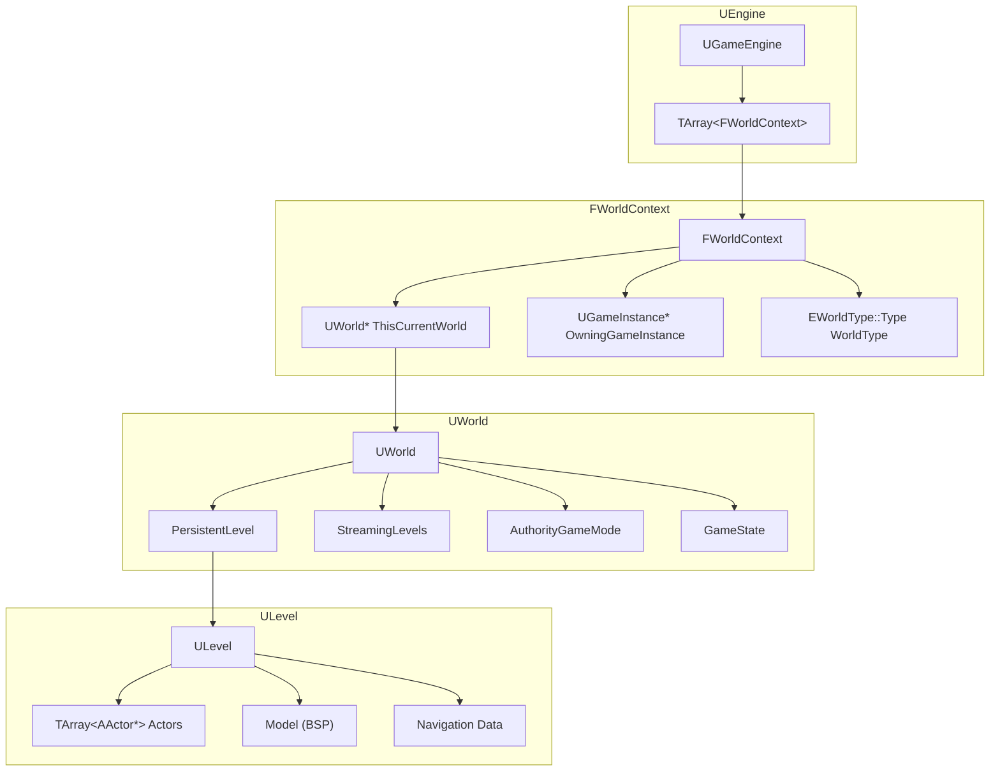

### 1.2 关键类说明

| 类 | 职责 | 生命周期 |
|---|------|---------|
| **UWorld** | 包含所有关卡和 Actor 的容器 | 地图生命周期 |
| **ULevel** | 单个关卡的数据，包含 Actor 列表 | 关卡加载/卸载 |
| **FWorldContext** | 桥接 Engine 和 World | 与 World 相同 |
| **ULevelStreaming** | 管理流送关卡的加载状态 | 流送期间 |
| **AWorldSettings** | World 的配置 Actor | 与 World 相同 |

### 1.3 World 类型

```cpp
// EWorldType::Type 枚举
namespace EWorldType
{
    enum Type
    {
        None,           // 无类型
        Game,           // 游戏世界（运行时）
        Editor,         // 编辑器世界
        PIE,            // Play In Editor
        EditorPreview,  // 资产预览
        GamePreview,    // 游戏预览
        GameRPC,        // RPC 用
        Inactive        // 非活跃世界
    };
}
```

---

## 2. UWorld 详解

### 2.1 UWorld 结构

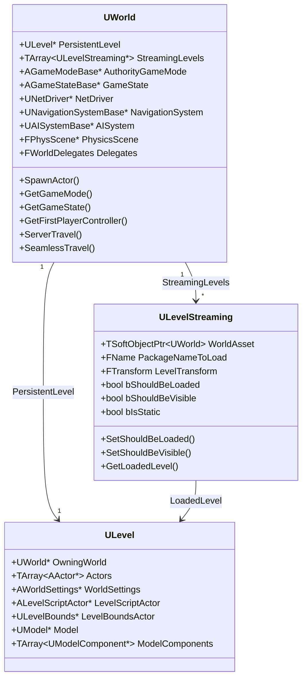

### 2.2 World 初始化流程

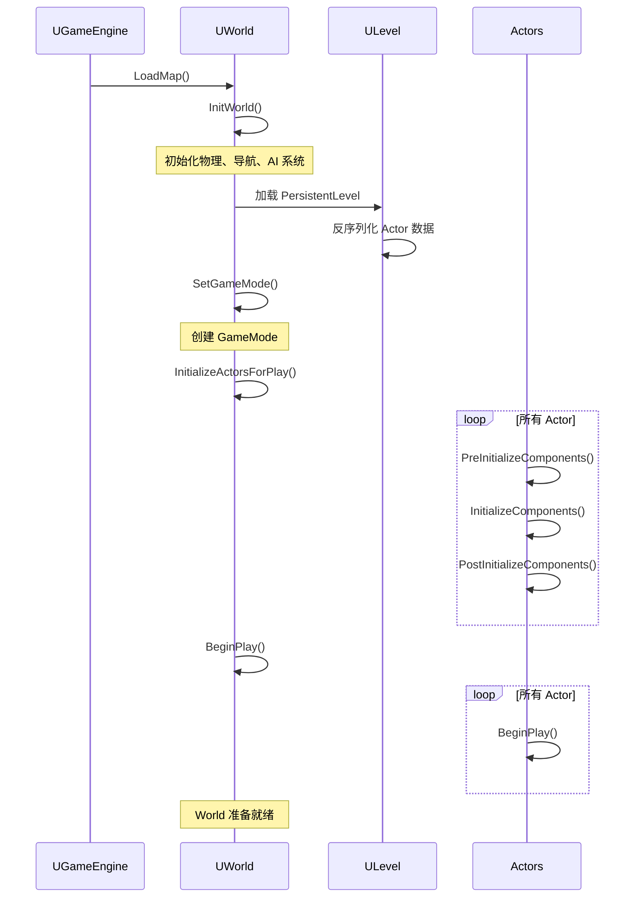

### 2.3 获取 World 的方法

```cpp
// 方法1：从 Actor 获取
UWorld* World = GetWorld();

// 方法2：从 UObject 获取（需要有 Outer）
UWorld* World = GEngine->GetWorldFromContextObject(this, EGetWorldErrorMode::LogAndReturnNull);

// 方法3：从 GameInstance 获取
UWorld* World = GetGameInstance()->GetWorld();

// 方法4：全局获取（编辑器/PIE）
#if WITH_EDITOR
UWorld* World = GEditor->GetEditorWorldContext().World();
#endif

// 方法5：遍历所有 World
for (TObjectIterator<UWorld> It; It; ++It)
{
    UWorld* World = *It;
    if (World->WorldType == EWorldType::Game)
    {
        // 找到游戏世界
    }
}
```

---

## 3. 关卡加载

### 3.1 加载方式对比

```mermaid
flowchart TB
    subgraph "硬切换 (Hard Travel)"
        H1["OpenLevel / ServerTravel"]
        H2["完全卸载当前世界"]
        H3["加载新世界"]
        H4["所有 Actor 销毁重建"]
        H1 --> H2 --> H3 --> H4
    end
    
    subgraph "无缝旅行 (Seamless Travel)"
        S1["SeamlessTravel"]
        S2["保留 GameInstance"]
        S3["可选保留某些 Actor"]
        S4["平滑过渡"]
        S1 --> S2 --> S3 --> S4
    end
    
    subgraph "关卡流送 (Level Streaming)"
        L1["LoadStreamLevel"]
        L2["保持当前世界"]
        L3["动态加载/卸载子关卡"]
        L4["异步无缝"]
        L1 --> L2 --> L3 --> L4
    end
```

### 3.2 OpenLevel / ServerTravel

```cpp
// 客户端：打开新关卡
UGameplayStatics::OpenLevel(this, FName("NewMapName"));

// 服务器：所有客户端切换
GetWorld()->ServerTravel("/Game/Maps/NewMap?game=MyGameMode");

// 带选项的切换
FString Options = "?game=MyGameMode?listen";
GetWorld()->ServerTravel("/Game/Maps/NewMap" + Options);
```

### 3.3 加载流程详解

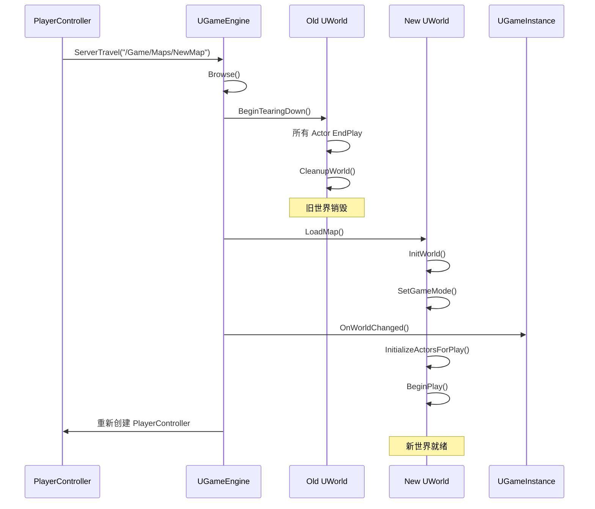

---

## 4. Level Streaming

### 4.1 流送架构

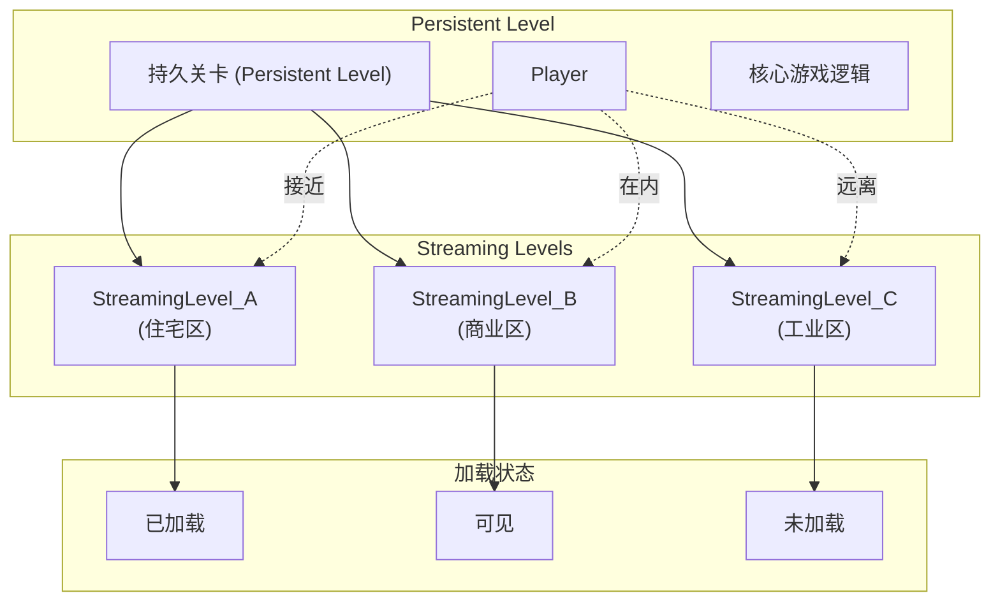

### 4.2 ULevelStreaming 状态

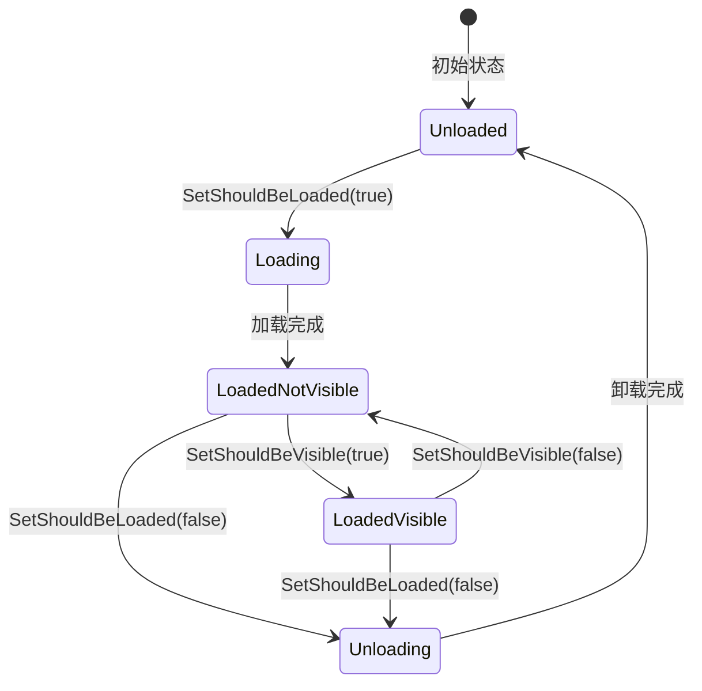

### 4.3 流送关卡操作

```cpp
// 蓝图节点对应的 C++ 代码

// 加载流送关卡
void LoadStreamingLevel(FName LevelName)
{
    FLatentActionInfo LatentInfo;
    LatentInfo.CallbackTarget = this;
    LatentInfo.ExecutionFunction = "OnLevelLoaded";
    LatentInfo.Linkage = 0;
    LatentInfo.UUID = GetUniqueID();
    
    UGameplayStatics::LoadStreamLevel(
        this,
        LevelName,
        true,   // bMakeVisibleAfterLoad
        false,  // bShouldBlockOnLoad
        LatentInfo
    );
}

// 卸载流送关卡
void UnloadStreamingLevel(FName LevelName)
{
    FLatentActionInfo LatentInfo;
    // ... 设置回调
    
    UGameplayStatics::UnloadStreamLevel(
        this,
        LevelName,
        LatentInfo,
        false  // bShouldBlockOnUnload
    );
}

// 直接操作 ULevelStreaming
void ManualStreamingControl()
{
    ULevelStreaming* StreamingLevel = UGameplayStatics::GetStreamingLevel(
        this, 
        FName("/Game/Maps/SubLevel")
    );
    
    if (StreamingLevel)
    {
        // 设置加载状态
        StreamingLevel->SetShouldBeLoaded(true);
        StreamingLevel->SetShouldBeVisible(true);
        
        // 设置 LOD
        StreamingLevel->SetLevelLODIndex(0);
        
        // 检查状态
        bool bIsLoaded = StreamingLevel->IsLevelLoaded();
        bool bIsVisible = StreamingLevel->IsLevelVisible();
    }
}
```

### 4.4 流送触发方式

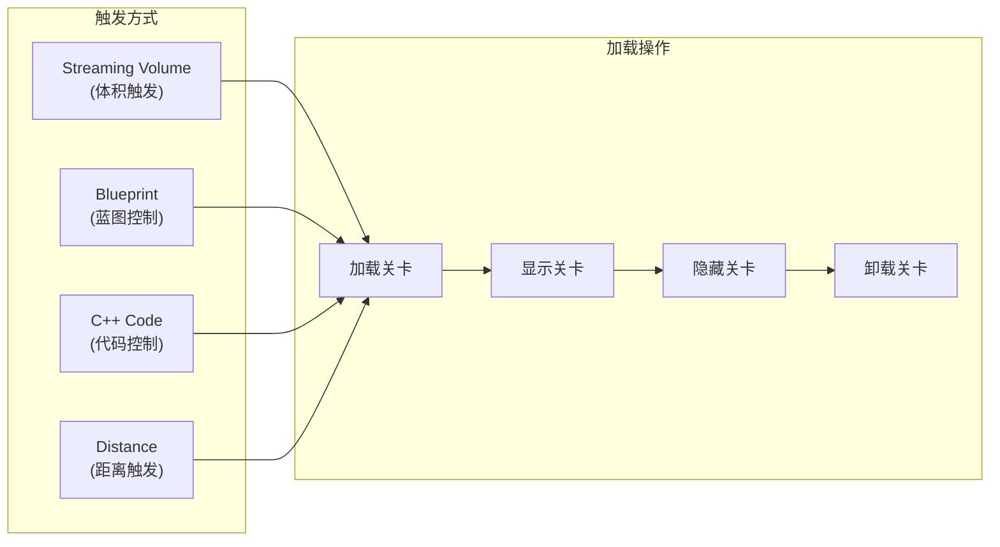

### 4.5 Streaming Volume 设置

```cpp
// 在代码中创建 Streaming Volume
ALevelStreamingVolume* CreateStreamingVolume(
    UWorld* World,
    const FVector& Location,
    const FVector& BoxExtent,
    ULevelStreaming* StreamingLevel)
{
    FActorSpawnParameters SpawnParams;
    ALevelStreamingVolume* Volume = World->SpawnActor<ALevelStreamingVolume>(
        ALevelStreamingVolume::StaticClass(),
        Location,
        FRotator::ZeroRotator,
        SpawnParams
    );
    
    // 设置碰撞体积大小
    if (UBrushComponent* Brush = Volume->GetBrushComponent())
    {
        // 配置 Brush 形状
    }
    
    // 关联流送关卡
    Volume->StreamingLevelNames.Add(StreamingLevel->GetWorldAssetPackageFName());
    
    return Volume;
}
```

---

## 5. 无缝旅行（Seamless Travel）

### 5.1 无缝旅行 vs 普通旅行

| 特性 | 普通旅行 | 无缝旅行 |
|-----|---------|---------|
| 加载画面 | 通常需要 | 可避免 |
| GameInstance | 保留 | 保留 |
| PlayerController | 销毁重建 | 可选保留 |
| Pawn | 销毁 | 可选保留 |
| 其他 Actor | 全部销毁 | 可选保留 |
| 网络连接 | 断开重连 | 保持 |

### 5.2 无缝旅行流程

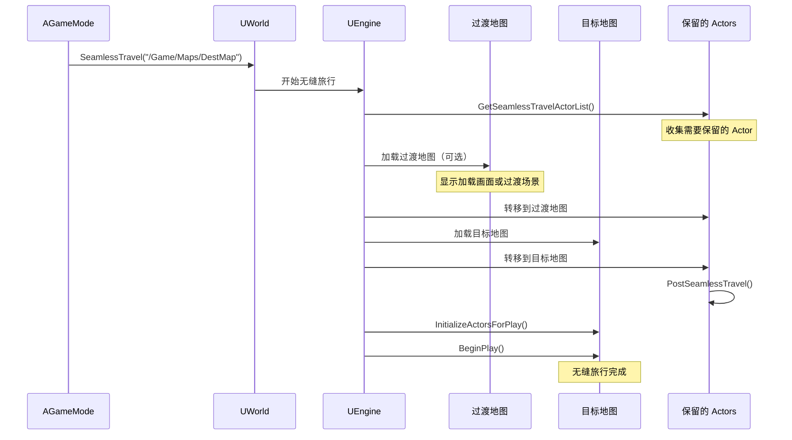

### 5.3 配置无缝旅行

```cpp
// GameMode 中启用无缝旅行
AMyGameMode::AMyGameMode()
{
    bUseSeamlessTravel = true;
}

// 指定过渡地图（Project Settings 或代码）
void AMyGameMode::InitGame(const FString& MapName, 
                            const FString& Options, 
                            FString& ErrorMessage)
{
    Super::InitGame(MapName, Options, ErrorMessage);
    
    // 可以动态设置过渡地图
    // UGameMapsSettings::SetGameDefaultMap(...);
}
```

### 5.4 保留 Actor 到新地图

```cpp
// 方法1：重写 GameMode 的 GetSeamlessTravelActorList
void AMyGameMode::GetSeamlessTravelActorList(bool bToTransition, 
                                              TArray<AActor*>& ActorList)
{
    Super::GetSeamlessTravelActorList(bToTransition, ActorList);
    
    // 保留特定 Actor
    for (TActorIterator<AMyPersistentActor> It(GetWorld()); It; ++It)
    {
        ActorList.Add(*It);
    }
}

// 方法2：PlayerController 保留自己的 Pawn
void AMyPlayerController::GetSeamlessTravelActorList(bool bToTransition,
                                                      TArray<AActor*>& ActorList)
{
    Super::GetSeamlessTravelActorList(bToTransition, ActorList);
    
    if (GetPawn())
    {
        ActorList.Add(GetPawn());
    }
}

// 方法3：Actor 自己声明要保留
// 在 Actor 类中
bool AMyActor::CanBeInCluster() const
{
    return false;  // 不被 GC 回收
}

void AMyActor::GetLifetimeReplicatedProps(...) const
{
    // 确保网络复制
}
```

### 5.5 无缝旅行回调

```cpp
// 在 GameMode 中处理
void AMyGameMode::PostSeamlessTravel()
{
    Super::PostSeamlessTravel();
    
    // 新地图加载完成后调用
    UE_LOG(LogTemp, Log, TEXT("无缝旅行完成，当前地图: %s"), 
           *GetWorld()->GetMapName());
    
    // 重新初始化需要的系统
    InitializeGameSystems();
}

// 在 PlayerController 中处理
void AMyPlayerController::PostSeamlessTravel()
{
    Super::PostSeamlessTravel();
    
    // 恢复玩家状态
    RestorePlayerState();
}

// 在普通 Actor 中处理
void AMyActor::PostSeamlessTravel()
{
    // 注意：普通 Actor 没有这个函数
    // 需要监听委托或在 BeginPlay 中检查
}
```

---

## 6. World Partition（UE5）

### 6.1 World Partition 概述

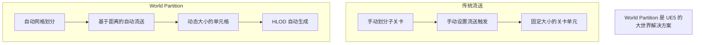

### 6.2 World Partition 架构

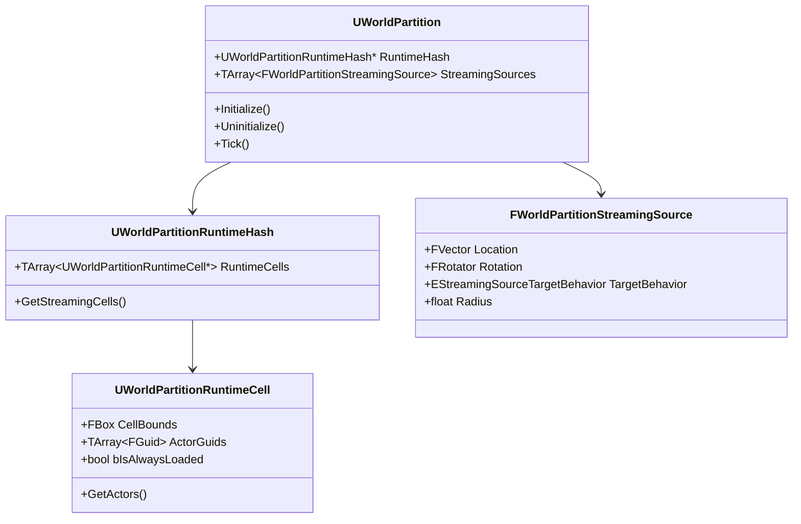

### 6.3 启用 World Partition

```cpp
// 在 World Settings 中启用
// 或通过代码检查

void CheckWorldPartition()
{
    UWorld* World = GetWorld();
    
    if (UWorldPartition* WorldPartition = World->GetWorldPartition())
    {
        // World Partition 已启用
        UE_LOG(LogTemp, Log, TEXT("World Partition 已启用"));
        
        // 获取运行时单元格
        if (UWorldPartitionRuntimeHash* RuntimeHash = WorldPartition->RuntimeHash)
        {
            // 访问运行时数据
        }
    }
}
```

### 6.4 Data Layers

```cpp
// Data Layer 用于按游戏逻辑分组 Actor
// 可以整体控制加载/卸载

void ManageDataLayers()
{
    UDataLayerManager* DataLayerManager = UDataLayerManager::GetDataLayerManager(GetWorld());
    
    if (DataLayerManager)
    {
        // 获取 Data Layer
        UDataLayerInstance* DayLayer = DataLayerManager->GetDataLayerInstance(
            FName("DayTimeActors")
        );
        
        UDataLayerInstance* NightLayer = DataLayerManager->GetDataLayerInstance(
            FName("NightTimeActors")
        );
        
        // 根据游戏时间切换
        if (IsNightTime())
        {
            DataLayerManager->SetDataLayerInstanceRuntimeState(
                DayLayer, 
                EDataLayerRuntimeState::Unloaded
            );
            DataLayerManager->SetDataLayerInstanceRuntimeState(
                NightLayer, 
                EDataLayerRuntimeState::Activated
            );
        }
    }
}
```

---

## 7. 实用代码示例

### 7.1 关卡管理器

```cpp
UCLASS()
class ULevelManager : public UObject
{
    GENERATED_BODY()
    
public:
    // 异步加载关卡
    void LoadLevelAsync(const FString& LevelName, 
                        FOnLevelLoaded OnLoaded)
    {
        FLatentActionInfo LatentInfo;
        LatentInfo.CallbackTarget = this;
        LatentInfo.UUID = FMath::Rand();
        
        // 存储回调
        PendingCallbacks.Add(LatentInfo.UUID, OnLoaded);
        
        UGameplayStatics::LoadStreamLevel(
            GetWorld(),
            FName(*LevelName),
            true,   // bMakeVisibleAfterLoad
            false,  // bShouldBlockOnLoad
            LatentInfo
        );
    }
    
    // 获取所有已加载的流送关卡
    TArray<ULevel*> GetLoadedStreamingLevels()
    {
        TArray<ULevel*> LoadedLevels;
        
        UWorld* World = GetWorld();
        for (ULevelStreaming* StreamingLevel : World->GetStreamingLevels())
        {
            if (StreamingLevel && StreamingLevel->IsLevelLoaded())
            {
                LoadedLevels.Add(StreamingLevel->GetLoadedLevel());
            }
        }
        
        return LoadedLevels;
    }
    
    // 检查关卡加载状态
    ELevelStreamingState GetLevelState(const FString& LevelName)
    {
        ULevelStreaming* StreamingLevel = UGameplayStatics::GetStreamingLevel(
            GetWorld(), 
            FName(*LevelName)
        );
        
        if (!StreamingLevel)
        {
            return ELevelStreamingState::Unknown;
        }
        
        if (StreamingLevel->IsLevelLoaded())
        {
            return StreamingLevel->IsLevelVisible() 
                ? ELevelStreamingState::LoadedVisible 
                : ELevelStreamingState::LoadedNotVisible;
        }
        
        return ELevelStreamingState::Unloaded;
    }
    
private:
    TMap<int32, FOnLevelLoaded> PendingCallbacks;
};
```

### 7.2 World 切换管理器

```cpp
UCLASS()
class UWorldTransitionManager : public UGameInstanceSubsystem
{
    GENERATED_BODY()
    
public:
    // 带过渡效果的地图切换
    void TransitionToMap(const FString& MapPath, 
                         TSubclassOf<UUserWidget> TransitionWidgetClass)
    {
        // 显示过渡 UI
        if (TransitionWidgetClass)
        {
            TransitionWidget = CreateWidget<UUserWidget>(
                GetWorld()->GetFirstPlayerController(),
                TransitionWidgetClass
            );
            TransitionWidget->AddToViewport(100);
        }
        
        // 延迟执行地图切换
        FTimerHandle TimerHandle;
        GetWorld()->GetTimerManager().SetTimer(
            TimerHandle,
            [this, MapPath]()
            {
                PerformTravel(MapPath);
            },
            0.5f,  // 过渡动画时间
            false
        );
    }
    
    // 保存/恢复玩家数据
    void SavePlayerData()
    {
        if (APlayerController* PC = GetWorld()->GetFirstPlayerController())
        {
            if (APawn* Pawn = PC->GetPawn())
            {
                SavedPlayerTransform = Pawn->GetActorTransform();
                SavedPlayerHealth = Cast<AMyCharacter>(Pawn)->GetHealth();
                // ... 保存更多数据
            }
        }
    }
    
    void RestorePlayerData()
    {
        if (APlayerController* PC = GetWorld()->GetFirstPlayerController())
        {
            if (APawn* Pawn = PC->GetPawn())
            {
                Pawn->SetActorTransform(SavedPlayerTransform);
                Cast<AMyCharacter>(Pawn)->SetHealth(SavedPlayerHealth);
            }
        }
    }
    
private:
    void PerformTravel(const FString& MapPath)
    {
        SavePlayerData();
        
        UGameplayStatics::OpenLevel(GetWorld(), FName(*MapPath));
        
        // 注意：OpenLevel 后，当前代码将被销毁
        // RestorePlayerData 需要在新 World 的 BeginPlay 中调用
    }
    
    UPROPERTY()
    UUserWidget* TransitionWidget;
    
    FTransform SavedPlayerTransform;
    float SavedPlayerHealth;
};
```

### 7.3 动态关卡加载示例

```cpp
// 基于玩家位置的动态加载
UCLASS()
class AStreamingManager : public AActor
{
    GENERATED_BODY()
    
public:
    virtual void Tick(float DeltaTime) override
    {
        Super::Tick(DeltaTime);
        
        UpdateStreamingBasedOnPlayerLocation();
    }
    
private:
    void UpdateStreamingBasedOnPlayerLocation()
    {
        APawn* PlayerPawn = UGameplayStatics::GetPlayerPawn(this, 0);
        if (!PlayerPawn) return;
        
        FVector PlayerLocation = PlayerPawn->GetActorLocation();
        
        for (const FStreamingZone& Zone : StreamingZones)
        {
            float Distance = FVector::Dist(PlayerLocation, Zone.Center);
            
            ULevelStreaming* StreamingLevel = UGameplayStatics::GetStreamingLevel(
                this, 
                Zone.LevelName
            );
            
            if (!StreamingLevel) continue;
            
            if (Distance < Zone.LoadRadius)
            {
                // 进入加载范围
                if (!StreamingLevel->IsLevelLoaded())
                {
                    StreamingLevel->SetShouldBeLoaded(true);
                }
                
                if (Distance < Zone.VisibleRadius)
                {
                    // 进入可见范围
                    StreamingLevel->SetShouldBeVisible(true);
                }
                else
                {
                    StreamingLevel->SetShouldBeVisible(false);
                }
            }
            else if (Distance > Zone.UnloadRadius)
            {
                // 离开卸载范围
                StreamingLevel->SetShouldBeLoaded(false);
            }
        }
    }
    
    UPROPERTY(EditAnywhere)
    TArray<FStreamingZone> StreamingZones;
};

USTRUCT(BlueprintType)
struct FStreamingZone
{
    GENERATED_BODY()
    
    UPROPERTY(EditAnywhere)
    FName LevelName;
    
    UPROPERTY(EditAnywhere)
    FVector Center;
    
    UPROPERTY(EditAnywhere)
    float LoadRadius = 5000.0f;
    
    UPROPERTY(EditAnywhere)
    float VisibleRadius = 3000.0f;
    
    UPROPERTY(EditAnywhere)
    float UnloadRadius = 7000.0f;
};
```

---

## 8. 调试与优化

### 8.1 调试命令

```
// 控制台命令
stat levels              // 显示关卡加载状态
stat streaming           // 流送统计
ShowFlag.LevelStreaming  // 可视化流送区域

// 在代码中
UE_LOG(LogStreaming, Log, TEXT("Level %s State: %d"), 
       *StreamingLevel->GetWorldAssetPackageFName().ToString(),
       (int32)StreamingLevel->GetLevelStreamingState());
```

### 8.2 常见问题排查

| 问题 | 可能原因 | 解决方案 |
|-----|---------|---------|
| 关卡加载卡顿 | 同步加载 | 使用异步加载 + 加载画面 |
| 流送关卡不显示 | bShouldBeVisible 为 false | 检查流送设置 |
| Actor 丢失引用 | 跨关卡引用 | 使用软引用或 GameInstance 存储 |
| 内存占用过高 | 未卸载不需要的关卡 | 正确设置卸载距离 |

### 8.3 性能优化建议

```cpp
// 1. 使用异步加载
FLatentActionInfo LatentInfo;
UGameplayStatics::LoadStreamLevel(
    this, 
    LevelName, 
    true,   // bMakeVisibleAfterLoad
    false,  // bShouldBlockOnLoad - 关键！设为 false
    LatentInfo
);

// 2. 预加载常用关卡
void PreloadFrequentLevels()
{
    for (const FName& LevelName : FrequentLevels)
    {
        ULevelStreaming* StreamingLevel = UGameplayStatics::GetStreamingLevel(
            this, LevelName
        );
        if (StreamingLevel)
        {
            // 加载但不显示
            StreamingLevel->SetShouldBeLoaded(true);
            StreamingLevel->SetShouldBeVisible(false);
        }
    }
}

// 3. 使用 Level LOD
void SetLevelLOD(const FName& LevelName, int32 LODIndex)
{
    ULevelStreaming* StreamingLevel = UGameplayStatics::GetStreamingLevel(
        this, LevelName
    );
    if (StreamingLevel)
    {
        StreamingLevel->SetLevelLODIndex(LODIndex);
    }
}
```

---

## 总结

### 关卡管理速查表

```
[地图切换方式]
├── OpenLevel()           - 简单关卡切换
├── ServerTravel()        - 服务器主导切换
├── SeamlessTravel()      - 无缝切换（保留数据）
└── LoadStreamLevel()     - 流送子关卡

[流送关卡状态]
├── Unloaded             - 未加载
├── Loading              - 加载中
├── LoadedNotVisible     - 已加载不可见
├── LoadedVisible        - 已加载可见
└── Unloading            - 卸载中

[World Partition (UE5)]
├── 自动网格划分
├── 基于距离的流送
├── Data Layers 分组
└── HLOD 自动生成
```

### 关键要点

1. **选择合适的加载方式** - 根据需求选择硬切换、无缝旅行或流送
2. **异步加载** - 避免使用同步加载造成卡顿
3. **正确管理引用** - 跨关卡引用使用软引用或 GameInstance
4. **内存管理** - 及时卸载不需要的关卡
5. **UE5 优先使用 World Partition** - 大世界场景的最佳方案

---

> 系列完结。回顾：
> - [01 - 游戏框架概述](./01_游戏框架概述.md)
> - [02 - 引擎启动流程](./02_引擎启动流程.md)
> - [03 - 类加载与初始化顺序](./03_类加载与初始化顺序.md)
> - [04 - Actor生命周期](./04_Actor生命周期.md)
> - [05 - 世界与关卡管理](./05_世界与关卡管理.md)