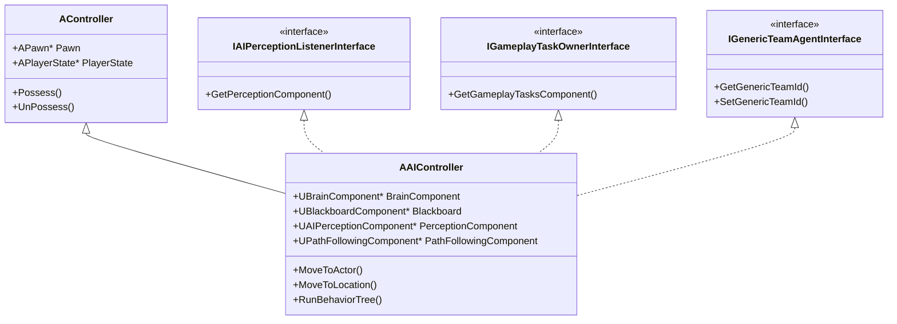
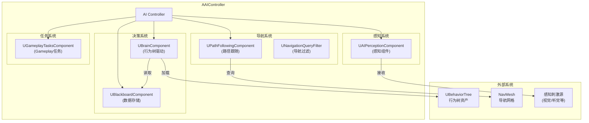
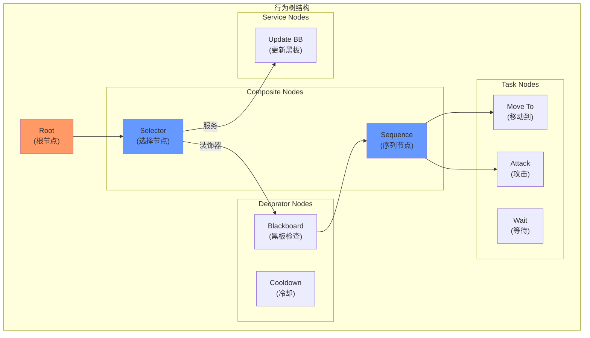
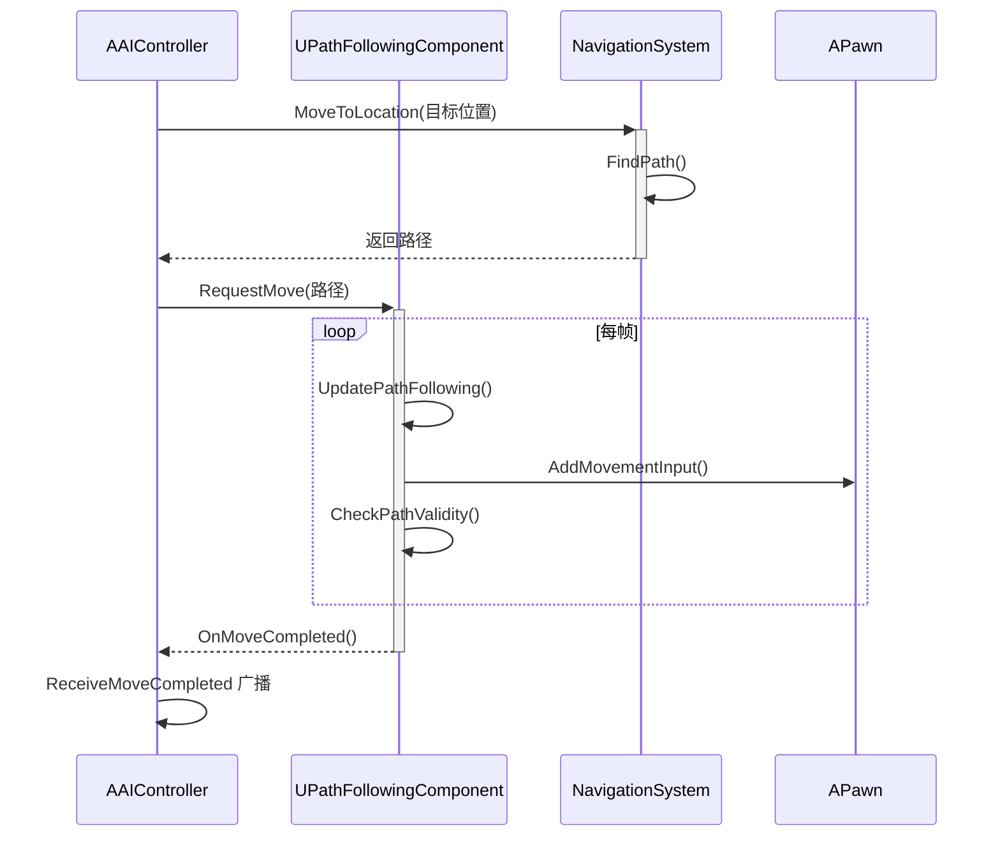
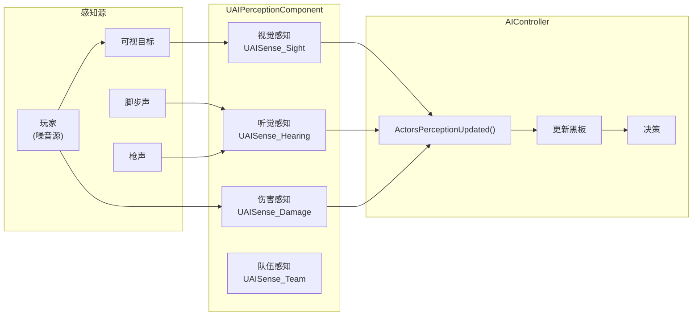
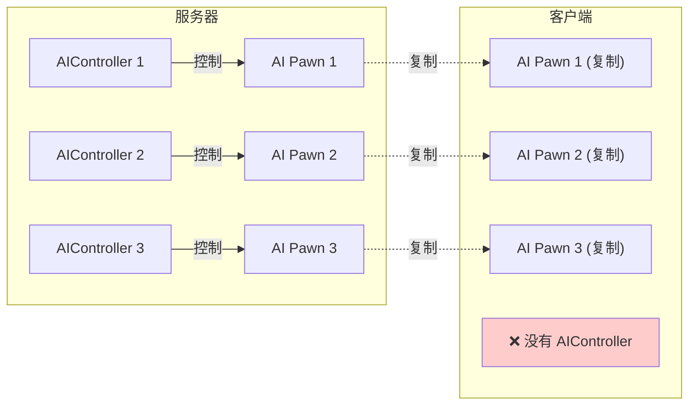
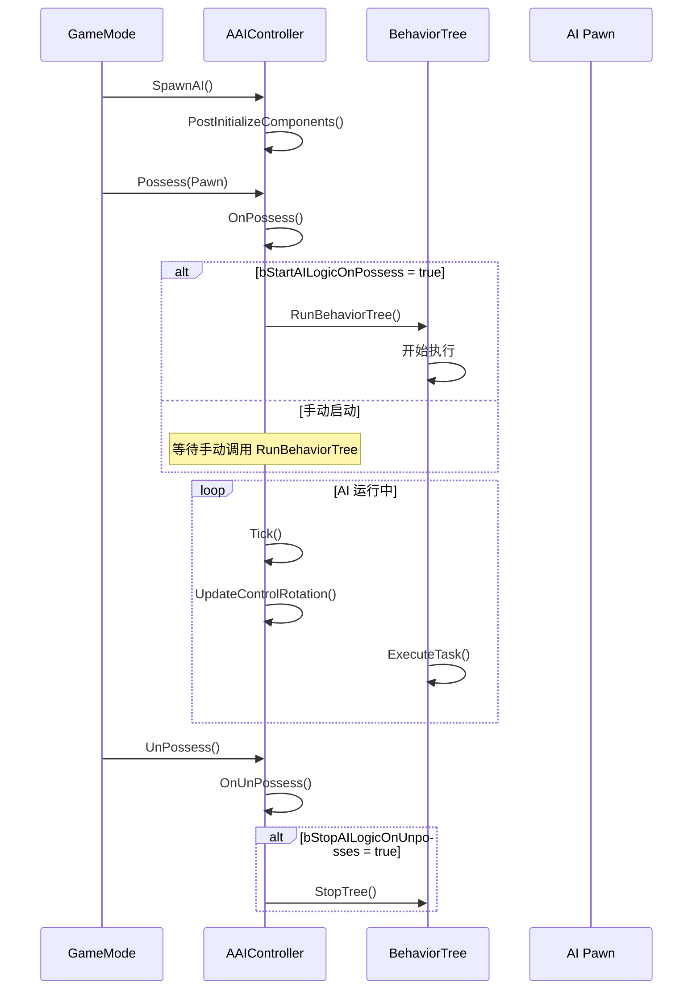
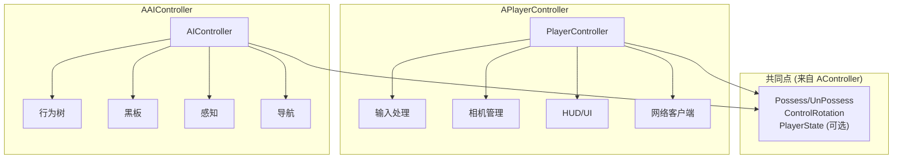

# AAIController - AI 控制器

## 概述

`AAIController` 是用于 **AI 控制的 Pawn** 的控制器类。它是 UE 游戏框架中实现 NPC、敌人、队友等非玩家角色行为的核心类，负责：

- **行为决策** - 通过行为树（Behavior Tree）做出决策
- **导航移动** - 使用导航系统进行寻路和移动
- **感知系统** - 通过 AI 感知组件感知周围环境
- **黑板数据** - 通过黑板（Blackboard）存储和共享 AI 状态

```
源码位置：Engine/Source/Runtime/AIModule/Classes/AIController.h
```

**关键特性：在网络游戏中，AIController 只存在于服务器端**

---

## 1. 类层级与接口

### 1.1 继承关系与实现接口



### 1.2 核心组件架构



---

## 2. 行为树系统

### 2.1 行为树架构

行为树是 AI 决策的核心，由 `UBrainComponent`（具体为 `UBehaviorTreeComponent`）驱动。



### 2.2 启动行为树

```cpp
// 在 AIController 中启动行为树
UFUNCTION(BlueprintCallable, Category = "AI")
virtual bool RunBehaviorTree(UBehaviorTree* BTAsset);

// 使用示例
void AMyAIController::BeginPlay()
{
    Super::BeginPlay();
    
    // 启动行为树
    if (BehaviorTreeAsset)
    {
        RunBehaviorTree(BehaviorTreeAsset);
    }
}
```

### 2.3 黑板（Blackboard）

黑板是行为树和 AI 系统共享数据的地方：

```cpp
// 使用黑板
UFUNCTION(BlueprintCallable, Category = "AI")
bool UseBlackboard(UBlackboardData* BlackboardAsset, UBlackboardComponent*& BlackboardComponent);

// 获取黑板组件
UBlackboardComponent* GetBlackboardComponent() { return Blackboard; }

// 设置黑板值
void AMyAIController::SetTargetEnemy(AActor* Enemy)
{
    if (UBlackboardComponent* BB = GetBlackboardComponent())
    {
        BB->SetValueAsObject(FName("TargetEnemy"), Enemy);
        BB->SetValueAsVector(FName("LastKnownLocation"), Enemy->GetActorLocation());
        BB->SetValueAsBool(FName("HasTarget"), true);
    }
}

// 获取黑板值
AActor* AMyAIController::GetTargetEnemy() const
{
    if (UBlackboardComponent* BB = GetBlackboardComponent())
    {
        return Cast<AActor>(BB->GetValueAsObject(FName("TargetEnemy")));
    }
    return nullptr;
}
```

---

## 3. 导航与移动

### 3.1 移动 API

AIController 提供了便捷的移动接口：

```cpp
// 移动到 Actor（目标会持续更新）
UFUNCTION(BlueprintCallable, Category = "AI|Navigation")
EPathFollowingRequestResult::Type MoveToActor(
    AActor* Goal,                                    // 目标 Actor
    float AcceptanceRadius = -1,                     // 到达半径
    bool bStopOnOverlap = true,                      // 重叠时停止
    bool bUsePathfinding = true,                     // 使用寻路
    bool bCanStrafe = true,                          // 允许侧移
    TSubclassOf<UNavigationQueryFilter> FilterClass = NULL,
    bool bAllowPartialPath = true                    // 允许部分路径
);

// 移动到位置
UFUNCTION(BlueprintCallable, Category = "AI|Navigation")
EPathFollowingRequestResult::Type MoveToLocation(
    const FVector& Dest,                             // 目标位置
    float AcceptanceRadius = -1,
    bool bStopOnOverlap = true,
    bool bUsePathfinding = true,
    bool bProjectDestinationToNavigation = false,    // 投射到导航网格
    bool bCanStrafe = true,
    TSubclassOf<UNavigationQueryFilter> FilterClass = NULL,
    bool bAllowPartialPath = true
);

// 停止移动
virtual void StopMovement() override;
```

### 3.2 移动流程



### 3.3 移动完成回调

```cpp
// 委托：移动完成时广播
UPROPERTY(BlueprintAssignable)
FAIMoveCompletedSignature ReceiveMoveCompleted;

// 虚函数重写
virtual void OnMoveCompleted(FAIRequestID RequestID, const FPathFollowingResult& Result);

// 使用示例
void AMyAIController::BeginPlay()
{
    Super::BeginPlay();
    
    // 绑定委托
    ReceiveMoveCompleted.AddDynamic(this, &AMyAIController::HandleMoveCompleted);
}

void AMyAIController::HandleMoveCompleted(FAIRequestID RequestID, EPathFollowingResult::Type Result)
{
    switch (Result)
    {
        case EPathFollowingResult::Success:
            UE_LOG(LogAI, Log, TEXT("到达目标"));
            break;
        case EPathFollowingResult::Blocked:
            UE_LOG(LogAI, Warning, TEXT("路径被阻挡"));
            break;
        case EPathFollowingResult::OffPath:
            UE_LOG(LogAI, Warning, TEXT("偏离路径"));
            break;
        case EPathFollowingResult::Aborted:
            UE_LOG(LogAI, Log, TEXT("移动被中止"));
            break;
    }
}
```

---

## 4. 感知系统

### 4.1 感知组件架构



### 4.2 配置感知

```cpp
// 在构造函数中创建感知组件
AMyAIController::AMyAIController()
{
    // 创建感知组件
    PerceptionComponent = CreateDefaultSubobject<UAIPerceptionComponent>(TEXT("PerceptionComp"));
    
    // 配置视觉
    UAISenseConfig_Sight* SightConfig = CreateDefaultSubobject<UAISenseConfig_Sight>(TEXT("Sight Config"));
    SightConfig->SightRadius = 3000.0f;
    SightConfig->LoseSightRadius = 3500.0f;
    SightConfig->PeripheralVisionAngleDegrees = 90.0f;
    SightConfig->DetectionByAffiliation.bDetectEnemies = true;
    SightConfig->DetectionByAffiliation.bDetectNeutrals = true;
    SightConfig->DetectionByAffiliation.bDetectFriendlies = false;
    
    PerceptionComponent->ConfigureSense(*SightConfig);
    PerceptionComponent->SetDominantSense(SightConfig->GetSenseImplementation());
    
    // 配置听觉
    UAISenseConfig_Hearing* HearingConfig = CreateDefaultSubobject<UAISenseConfig_Hearing>(TEXT("Hearing Config"));
    HearingConfig->HearingRange = 2000.0f;
    HearingConfig->DetectionByAffiliation.bDetectEnemies = true;
    
    PerceptionComponent->ConfigureSense(*HearingConfig);
}

// 感知更新回调
virtual void ActorsPerceptionUpdated(const TArray<AActor*>& UpdatedActors);

void AMyAIController::ActorsPerceptionUpdated(const TArray<AActor*>& UpdatedActors)
{
    for (AActor* Actor : UpdatedActors)
    {
        FActorPerceptionBlueprintInfo Info;
        PerceptionComponent->GetActorsPerception(Actor, Info);
        
        for (const FAIStimulus& Stimulus : Info.LastSensedStimuli)
        {
            if (Stimulus.WasSuccessfullySensed())
            {
                // 检测到目标
                OnTargetDetected(Actor, Stimulus);
            }
            else
            {
                // 失去目标
                OnTargetLost(Actor);
            }
        }
    }
}
```

---

## 5. Focus 系统（注视系统）

### 5.1 Focus 优先级

AIController 有一个分优先级的 Focus 系统，用于控制 AI 朝向：

```cpp
namespace EAIFocusPriority
{
    typedef uint8 Type;
    
    inline const Type Default = 0;    // 默认
    inline const Type Move = 1;       // 移动时
    inline const Type Gameplay = 2;   // 游戏逻辑
    
    inline const Type LastFocusPriority = Gameplay;
}

// 设置注视点（位置）
virtual void SetFocalPoint(FVector NewFocus, EAIFocusPriority::Type InPriority = EAIFocusPriority::Gameplay);

// 设置注视目标（Actor）
virtual void SetFocus(AActor* NewFocus, EAIFocusPriority::Type InPriority = EAIFocusPriority::Gameplay);

// 清除注视
virtual void ClearFocus(EAIFocusPriority::Type InPriority);

// 获取当前注视点
FVector GetFocalPoint() const;

// 获取当前注视 Actor
AActor* GetFocusActor() const;
```

### 5.2 Focus 与 ControlRotation

```cpp
// 每帧更新：根据 FocalPoint 更新 ControlRotation
virtual void UpdateControlRotation(float DeltaTime, bool bUpdatePawn = true);

// 使用示例
void AMyAIController::UpdateAimAtTarget()
{
    if (AActor* Target = GetTargetEnemy())
    {
        // 设置注视目标 - AI 会自动朝向目标
        SetFocus(Target, EAIFocusPriority::Gameplay);
    }
}
```

---

## 6. 队伍系统

AIController 实现了 `IGenericTeamAgentInterface`，支持队伍判定：

```cpp
// 设置队伍 ID
virtual void SetGenericTeamId(const FGenericTeamId& NewTeamID) override;

// 获取队伍 ID
virtual FGenericTeamId GetGenericTeamId() const override { return TeamID; }

// 使用示例
void AMyAIController::BeginPlay()
{
    Super::BeginPlay();
    
    // 设置为敌对队伍
    SetGenericTeamId(FGenericTeamId(1));  // 0 通常是玩家队伍
}

// 自定义敌对判定
ETeamAttitude::Type AMyAIController::GetTeamAttitudeTowards(const AActor& Other) const
{
    if (const IGenericTeamAgentInterface* OtherTeamAgent = Cast<IGenericTeamAgentInterface>(&Other))
    {
        FGenericTeamId OtherTeamId = OtherTeamAgent->GetGenericTeamId();
        
        if (OtherTeamId == GetGenericTeamId())
            return ETeamAttitude::Friendly;
        else
            return ETeamAttitude::Hostile;
    }
    return ETeamAttitude::Neutral;
}
```

---

## 7. 网络与生命周期

### 7.1 网络特性



**关键点**：AIController 只在服务器存在，客户端只看到 Pawn 的行为结果。

### 7.2 AI 逻辑生命周期

```cpp
// 控制 AI 逻辑何时启动/停止
UPROPERTY(EditAnywhere, BlueprintReadWrite, Category = AI)
uint32 bStartAILogicOnPossess : 1;  // Possess 时启动 AI（默认 false）

UPROPERTY(EditAnywhere, BlueprintReadWrite, Category = AI)
uint32 bStopAILogicOnUnposses : 1;  // UnPossess 时停止 AI（默认 true）
```



---

## 8. 与 PlayerController 对比

### 8.1 功能对比表

| 特性 | AAIController | APlayerController |
|-----|---------------|-------------------|
| **控制来源** | AI 决策（行为树） | 人类输入 |
| **网络存在** | 仅服务器 | 服务器 + 拥有者客户端 |
| **行为树** | ✅ UBrainComponent | ❌ |
| **黑板** | ✅ UBlackboardComponent | ❌ |
| **感知系统** | ✅ UAIPerceptionComponent | ❌ |
| **导航组件** | ✅ UPathFollowingComponent | ❌（通过 Pawn） |
| **输入处理** | ❌ | ✅ UPlayerInput |
| **相机管理** | ❌ | ✅ APlayerCameraManager |
| **HUD** | ❌ | ✅ AHUD |
| **队伍系统** | ✅ IGenericTeamAgentInterface | ⚠️ 需手动实现 |
| **PlayerState** | ⚠️ 可选（bWantsPlayerState） | ✅ 必有 |

### 8.2 架构对比图



---

## 9. 实用代码示例

### 9.1 完整的 AIController 示例

```cpp
// MyAIController.h
UCLASS()
class AMyAIController : public AAIController
{
    GENERATED_BODY()
    
public:
    AMyAIController();
    
    virtual void BeginPlay() override;
    virtual void OnPossess(APawn* InPawn) override;
    virtual void Tick(float DeltaTime) override;
    
protected:
    // 行为树资产
    UPROPERTY(EditDefaultsOnly, Category = "AI")
    UBehaviorTree* BehaviorTreeAsset;
    
    // 感知更新
    virtual void ActorsPerceptionUpdated(const TArray<AActor*>& UpdatedActors) override;
    
    // 移动完成
    UFUNCTION()
    void HandleMoveCompleted(FAIRequestID RequestID, EPathFollowingResult::Type Result);
    
private:
    void SetupPerception();
};

// MyAIController.cpp
AMyAIController::AMyAIController()
{
    // 启用 Possess 时自动启动 AI
    bStartAILogicOnPossess = true;
    
    // 创建感知组件
    PerceptionComponent = CreateDefaultSubobject<UAIPerceptionComponent>(TEXT("AIPerception"));
    SetPerceptionComponent(*PerceptionComponent);
    
    // 设置队伍
    SetGenericTeamId(FGenericTeamId(1));  // 敌对队伍
}

void AMyAIController::BeginPlay()
{
    Super::BeginPlay();
    
    SetupPerception();
    ReceiveMoveCompleted.AddDynamic(this, &AMyAIController::HandleMoveCompleted);
}

void AMyAIController::OnPossess(APawn* InPawn)
{
    Super::OnPossess(InPawn);
    
    // 如果没有自动启动，手动启动行为树
    if (BehaviorTreeAsset && !bStartAILogicOnPossess)
    {
        RunBehaviorTree(BehaviorTreeAsset);
    }
}

void AMyAIController::SetupPerception()
{
    if (PerceptionComponent)
    {
        // 绑定感知更新事件
        PerceptionComponent->OnTargetPerceptionUpdated.AddDynamic(
            this, &AMyAIController::OnTargetPerceptionUpdated);
    }
}

void AMyAIController::ActorsPerceptionUpdated(const TArray<AActor*>& UpdatedActors)
{
    for (AActor* Actor : UpdatedActors)
    {
        // 更新黑板
        if (UBlackboardComponent* BB = GetBlackboardComponent())
        {
            BB->SetValueAsObject(FName("PerceivedTarget"), Actor);
        }
    }
}
```

### 9.2 在行为树中使用

```cpp
// 自定义行为树 Task
UCLASS()
class UBTTask_FindPatrolPoint : public UBTTaskNode
{
    GENERATED_BODY()
    
    virtual EBTNodeResult::Type ExecuteTask(UBehaviorTreeComponent& OwnerComp, uint8* NodeMemory) override
    {
        AAIController* AIC = OwnerComp.GetAIOwner();
        if (!AIC) return EBTNodeResult::Failed;
        
        // 获取巡逻点并写入黑板
        FVector PatrolPoint = GetNextPatrolPoint();
        
        UBlackboardComponent* BB = AIC->GetBlackboardComponent();
        BB->SetValueAsVector(FName("PatrolDestination"), PatrolPoint);
        
        return EBTNodeResult::Succeeded;
    }
};
```

---

## 10. 常见问题

### Q1: 为什么 AIController 只在服务器存在？
**性能和安全考虑**：
- AI 决策逻辑消耗 CPU，只在服务器运行避免客户端负担
- 防止客户端作弊修改 AI 行为
- Pawn 的移动结果会复制给客户端，玩家能看到 AI 行为

### Q2: bWantsPlayerState 什么时候设为 true？
当你的 AI 需要记分板、击杀统计等 PlayerState 功能时。例如 PvE 游戏中显示 AI 击杀数。

### Q3: 感知系统和 LineOfSight 有什么区别？
- **LineOfSight** - 简单的射线检测，只返回 bool
- **感知系统** - 完整的感知框架，支持多种感知类型、记忆、衰减等

### Q4: 如何让 AI 暂停行为？

```cpp
// 暂停行为树
if (UBehaviorTreeComponent* BTC = Cast<UBehaviorTreeComponent>(BrainComponent))
{
    BTC->PauseLogic(TEXT("Cutscene"));
}

// 恢复
BTC->ResumeLogic(TEXT("Cutscene"));
```

---

## 总结

| 要点 | 说明 |
|-----|------|
| **本质** | AI 角色的决策中心 |
| **行为树** | 通过 UBrainComponent 执行决策 |
| **黑板** | AI 状态数据的共享存储 |
| **感知** | 通过 UAIPerceptionComponent 感知环境 |
| **导航** | 内置路径跟随和寻路支持 |
| **网络** | 仅服务器存在 |
| **队伍** | 支持 IGenericTeamAgentInterface |

---

> 相关文档：
> - [AController](./AController.md) - 控制器基类
> - [APlayerController](./APlayerController.md) - 玩家控制器
> - [APawn](./APawn.md) - 可控制角色基类
> - [ACharacter](./ACharacter.md) - 角色类