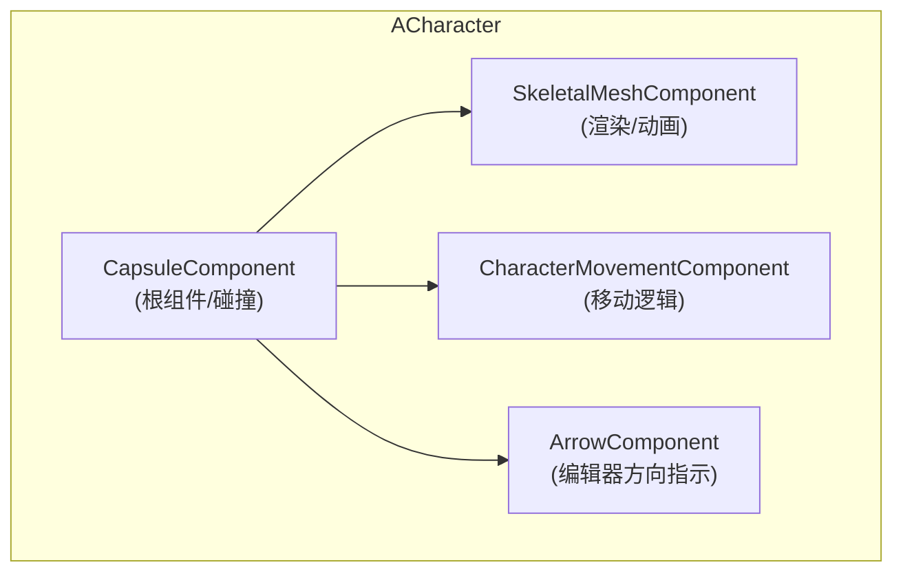
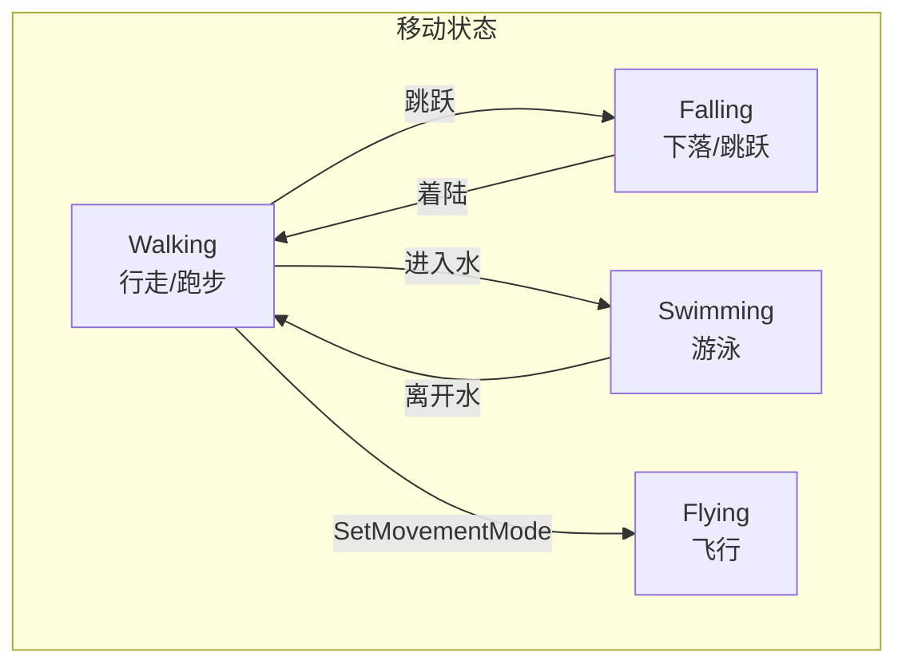

# ACharacter - 角色

## 概述

`ACharacter` 是 APawn 的子类，专为人形角色设计，内置移动、跳跃、碰撞。

- **角色移动** - CharacterMovementComponent 提供行走、跑步、跳跃、游泳、飞行
- **碰撞胶囊** - CapsuleComponent 处理碰撞
- **骨骼网格** - SkeletalMeshComponent 渲染角色
- **动画支持** - 与动画蓝图无缝集成

```
源码位置：Engine/Source/Runtime/Engine/Classes/GameFramework/Character.h
```

**核心定位**：可移动的人形实体，游戏中最常见的玩家代表。

---

## 1. 组件结构



---

## 2. 核心组件

### 2.1 CapsuleComponent

```cpp
// 碰撞胶囊（根组件）
UPROPERTY(Category=Character, VisibleAnywhere, BlueprintReadOnly)
TObjectPtr<UCapsuleComponent> CapsuleComponent;

// 获取胶囊
UCapsuleComponent* GetCapsuleComponent() const { return CapsuleComponent; }

// 常用设置
CapsuleComponent->InitCapsuleSize(34.0f, 88.0f);  // 半径, 半高
CapsuleComponent->SetCollisionProfileName(TEXT("Pawn"));
```

### 2.2 CharacterMovementComponent

```cpp
// 移动组件
UPROPERTY(Category=Character, VisibleAnywhere, BlueprintReadOnly)
TObjectPtr<UCharacterMovementComponent> CharacterMovement;

// 移动模式
enum EMovementMode
{
    MOVE_None,
    MOVE_Walking,
    MOVE_NavWalking,
    MOVE_Falling,
    MOVE_Swimming,
    MOVE_Flying,
    MOVE_Custom
};
```

### 2.3 SkeletalMeshComponent

```cpp
// 骨骼网格组件
UPROPERTY(Category=Character, VisibleAnywhere, BlueprintReadOnly)
TObjectPtr<USkeletalMeshComponent> Mesh;

// 获取动画实例
UAnimInstance* GetAnimInstance() const;
```

---

## 3. 移动系统



### 3.1 移动属性

```cpp
// 通过 CharacterMovement 组件设置
CharacterMovement->MaxWalkSpeed = 600.f;
CharacterMovement->MaxWalkSpeedCrouched = 300.f;
CharacterMovement->JumpZVelocity = 420.f;
CharacterMovement->AirControl = 0.2f;
CharacterMovement->GravityScale = 1.0f;
CharacterMovement->GroundFriction = 8.0f;
CharacterMovement->BrakingDecelerationWalking = 2048.f;
```

---

## 4. 跳跃系统

```cpp
// 跳跃（按下）
virtual void Jump();

// 停止跳跃（释放）
virtual void StopJumping();

// 能否跳跃
virtual bool CanJump() const;
virtual bool CanJumpInternal() const;

// 跳跃事件
virtual void OnJumped();

// 着陆事件
virtual void Landed(const FHitResult& Hit);

// 跳跃属性
UPROPERTY(Category=Character, EditAnywhere, BlueprintReadWrite)
int32 JumpMaxCount;  // 最大跳跃次数（多段跳）

UPROPERTY(Category=Character, VisibleAnywhere, BlueprintReadOnly)
int32 JumpCurrentCount;  // 当前跳跃次数
```

---

## 5. 蹲伏系统

```cpp
// 开始蹲伏
virtual void Crouch(bool bClientSimulation = false);

// 停止蹲伏
virtual void UnCrouch(bool bClientSimulation = false);

// 能否蹲伏
virtual bool CanCrouch() const;

// 蹲伏状态
UPROPERTY(BlueprintReadOnly, ReplicatedUsing=OnRep_IsCrouched)
uint8 bIsCrouched : 1;

// 蹲伏事件
virtual void OnStartCrouch(float HalfHeightAdjust, float ScaledHalfHeightAdjust);
virtual void OnEndCrouch(float HalfHeightAdjust, float ScaledHalfHeightAdjust);
```

---

## 6. 自定义角色示例

```cpp
// MyCharacter.h
UCLASS()
class AMyCharacter : public ACharacter
{
    GENERATED_BODY()
    
public:
    AMyCharacter();
    
    virtual void BeginPlay() override;
    virtual void Tick(float DeltaTime) override;
    virtual void SetupPlayerInputComponent(UInputComponent* Input) override;
    
    // 冲刺
    UFUNCTION(BlueprintCallable)
    void StartSprint();
    
    UFUNCTION(BlueprintCallable)
    void StopSprint();
    
protected:
    UPROPERTY(EditDefaultsOnly, Category="Movement")
    float SprintSpeedMultiplier = 1.5f;
    
    float DefaultMaxWalkSpeed;
    bool bIsSprinting = false;
};

// MyCharacter.cpp
AMyCharacter::AMyCharacter()
{
    // 移动设置
    GetCharacterMovement()->MaxWalkSpeed = 400.f;
    GetCharacterMovement()->JumpZVelocity = 500.f;
    GetCharacterMovement()->AirControl = 0.35f;
    
    // 多段跳
    JumpMaxCount = 2;
}

void AMyCharacter::BeginPlay()
{
    Super::BeginPlay();
    DefaultMaxWalkSpeed = GetCharacterMovement()->MaxWalkSpeed;
}

void AMyCharacter::SetupPlayerInputComponent(UInputComponent* Input)
{
    Super::SetupPlayerInputComponent(Input);
    
    Input->BindAction("Jump", IE_Pressed, this, &ACharacter::Jump);
    Input->BindAction("Jump", IE_Released, this, &ACharacter::StopJumping);
    Input->BindAction("Sprint", IE_Pressed, this, &AMyCharacter::StartSprint);
    Input->BindAction("Sprint", IE_Released, this, &AMyCharacter::StopSprint);
}

void AMyCharacter::StartSprint()
{
    bIsSprinting = true;
    GetCharacterMovement()->MaxWalkSpeed = DefaultMaxWalkSpeed * SprintSpeedMultiplier;
}

void AMyCharacter::StopSprint()
{
    bIsSprinting = false;
    GetCharacterMovement()->MaxWalkSpeed = DefaultMaxWalkSpeed;
}
```

---

## 7. 根骨骼运动 (Root Motion)

```cpp
// 是否使用根骨骼运动
bool HasRootMotion() const;

// 获取根骨骼运动信息
FRootMotionMovementParams GetRootMotionMovementParams() const;

// 在动画蓝图中设置根骨骼运动
CharacterMovement->bAllowPhysicsRotationDuringAnimRootMotion = false;
```

---

## 8. 总结

| 要点 | 说明 |
|-----|------|
| **本质** | 人形 Pawn |
| **核心组件** | Capsule + Movement + Mesh |
| **移动模式** | Walking, Falling, Swimming, Flying |
| **内置功能** | 跳跃、蹲伏、根骨骼运动 |
| **适用场景** | 玩家角色、NPC |

---

> 相关文档：
> - [APawn](./APawn.md) - Pawn 基类
> - [AController](./AController.md) - 控制器
> - [APlayerController](./APlayerController.md) - 玩家控制器