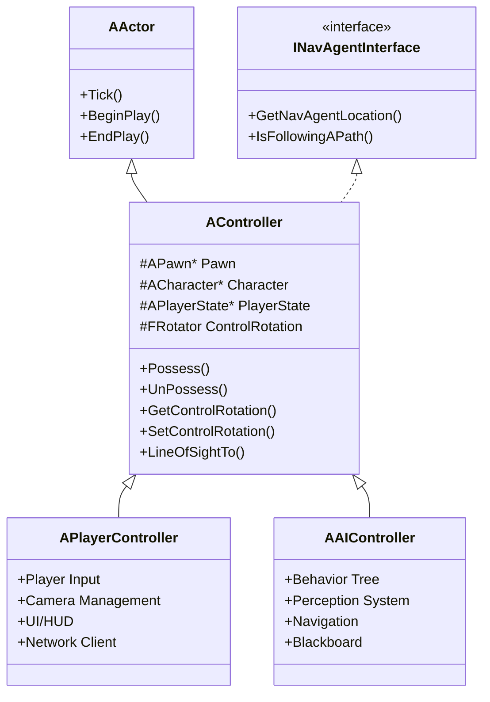
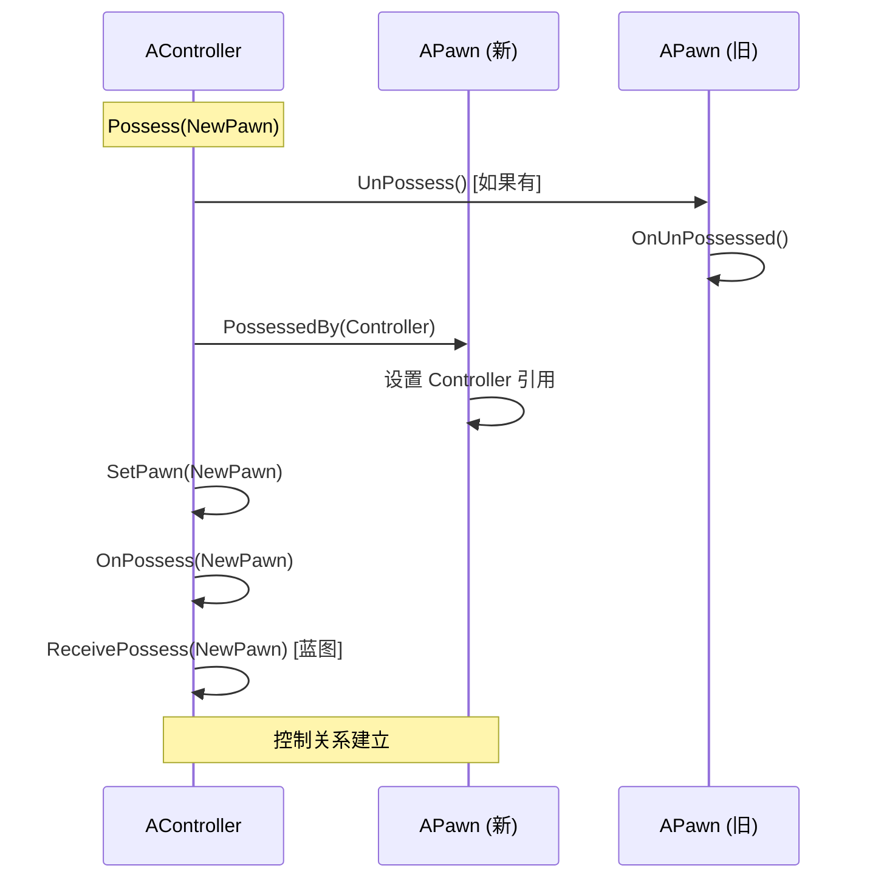
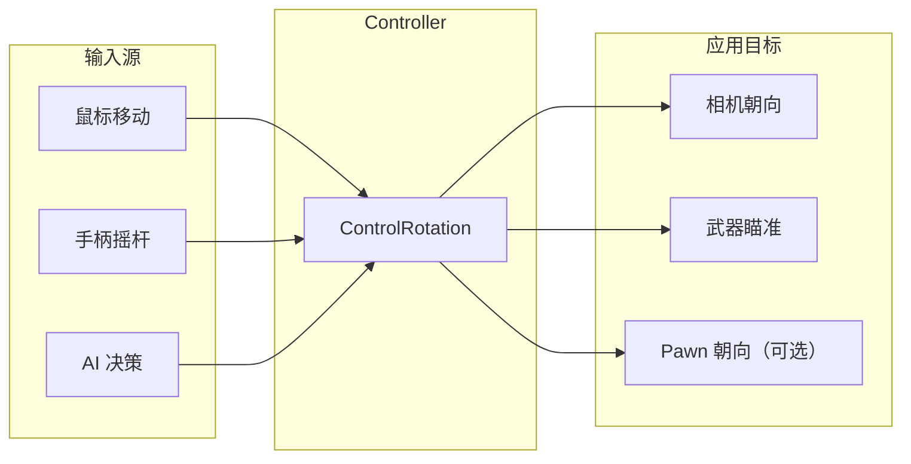
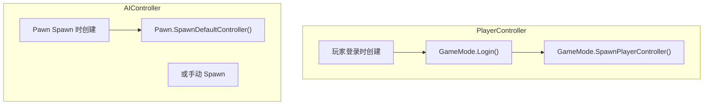
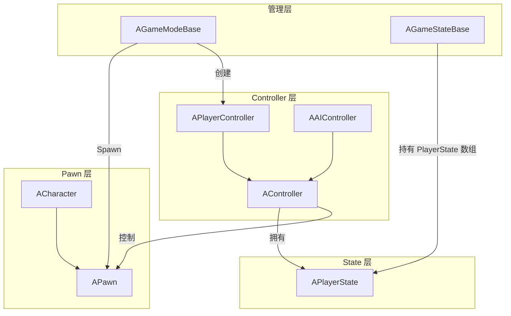

# AController - 控制器基类

## 概述

`AController` 是 Unreal Engine 中所有控制器的抽象基类。控制器是**非物理的 Actor**，用于"控制"一个 Pawn，决定其行为和动作。

**核心设计理念：**
- **分离控制逻辑与表现** - Pawn 负责物理表现，Controller 负责决策逻辑
- **统一玩家和 AI** - PlayerController 和 AIController 共享相同的 Possess/UnPossess 机制
- **支持控制权转移** - 一个 Controller 可以控制不同的 Pawn，一个 Pawn 也可以被不同 Controller 控制

```
源码位置：Engine/Source/Runtime/Engine/Classes/GameFramework/Controller.h
```

---

## 1. 类层级结构



---

## 2. 核心职责

### 2.1 Possess/UnPossess 机制

Controller 通过 `Possess()` 和 `UnPossess()` 来获取或释放对 Pawn 的控制权。



### 2.2 控制权限模型

```cpp
// 只有网络权威端可以执行 Possess
// Controller.h 第 278-279 行
UFUNCTION(BlueprintCallable, BlueprintAuthorityOnly, Category=Pawn)
virtual void Possess(APawn* InPawn) final;
```

| 端 | 可以 Possess | 说明 |
|---|--------------|------|
| 服务器 | ✅ | 服务器具有权威性 |
| 客户端 | ❌ | 客户端只能请求，服务器执行 |
| 单机 | ✅ | 本地具有权威性 |

### 2.3 ControlRotation（控制旋转）

`ControlRotation` 是 Controller 的核心概念之一，表示**瞄准/观看方向**。



```cpp
// 获取控制旋转
FRotator AController::GetControlRotation() const
{
    return ControlRotation;
}

// 设置控制旋转
void AController::SetControlRotation(const FRotator& NewRotation)
{
    if (!IsValidControlRotation(NewRotation))
    {
        return;
    }
    ControlRotation = NewRotation;
    // 如果 RootComponent 是绝对旋转，也更新它
    if (RootComponent && RootComponent->IsUsingAbsoluteRotation())
    {
        RootComponent->SetWorldRotation(ControlRotation);
    }
}
```

**ControlRotation vs Pawn Rotation 的区别：**

| 属性 | ControlRotation | Pawn.GetActorRotation() |
|-----|-----------------|-------------------------|
| 所属 | Controller | Pawn |
| 用途 | 瞄准/视角方向 | 角色实际朝向 |
| Pitch | 可以任意值（向上看/向下看） | 通常为 0（角色不会倾斜） |
| Roll | 可以任意值 | 通常为 0 |
| 更新来源 | 输入系统 | 移动组件 |

---

## 3. 关键属性

### 3.1 Pawn 和 Character

```cpp
// Controller.h 第 68-80 行
private:
    /** 当前被此控制器控制的 Pawn */
    UPROPERTY(replicatedUsing=OnRep_Pawn)
    TObjectPtr<APawn> Pawn;

    /** 如果被控制的 Pawn 是 Character，则此指针也指向它，否则为 nullptr */
    UPROPERTY()
    TObjectPtr<ACharacter> Character;
```

**为什么同时有 Pawn 和 Character？**
- `Pawn` 是通用指针，所有可控制的对象都是 Pawn
- `Character` 是便捷缓存，避免频繁 Cast
- Character 继承自 Pawn，拥有 CharacterMovementComponent

### 3.2 PlayerState

```cpp
// Controller.h 第 48-50 行
/** 包含玩家复制信息的 PlayerState（仅玩家有，NPC 没有）*/
UPROPERTY(replicatedUsing = OnRep_PlayerState, BlueprintReadOnly, Category=Controller)
TObjectPtr<APlayerState> PlayerState;
```

> ⚠️ **注意**：虽然 PlayerState 定义在 AController 基类中，但通常只有 PlayerController 会使用它。AIController 一般不会有 PlayerState。

### 3.3 输入忽略标志

```cpp
// Controller.h 第 112-116 行
/** 忽略移动输入。使用 SetIgnoreMoveInput() 访问 */
uint8 IgnoreMoveInput;

/** 忽略视角输入。使用 SetIgnoreLookInput() 访问 */
uint8 IgnoreLookInput;
```

这些是**堆栈式**的标志：
- 多次调用 `SetIgnoreMoveInput(true)` 会累加
- 需要相同次数的 `SetIgnoreMoveInput(false)` 才能解除
- 或使用 `ResetIgnoreMoveInput()` 一次性重置

---

## 4. 生命周期

### 4.1 创建时机



### 4.2 PostInitializeComponents

```cpp
void AController::PostInitializeComponents()
{
    Super::PostInitializeComponents();
    
    // 只有玩家控制器需要 PlayerState
    if (!IsPendingKill())
    {
        // 在这里初始化 PlayerState
        // 注意：实际创建在 InitPlayerState() 中
    }
}
```

### 4.3 销毁

```cpp
void AController::Destroyed()
{
    // 如果正在控制 Pawn，先 UnPossess
    if (GetPawn() != nullptr)
    {
        UnPossess();
    }
    
    // 清理 PlayerState
    CleanupPlayerState();
    
    Super::Destroyed();
}
```

---

## 5. 导航代理接口

AController 实现了 `INavAgentInterface`，使其可以参与导航系统：

```cpp
// Controller.h 第 337-344 行
//~ Begin INavAgentInterface Interface
virtual const struct FNavAgentProperties& GetNavAgentPropertiesRef() const override;
virtual FVector GetNavAgentLocation() const override;
virtual void GetMoveGoalReachTest(...) const override;
virtual bool ShouldPostponePathUpdates() const override;
virtual bool IsFollowingAPath() const override;
virtual IPathFollowingAgentInterface* GetPathFollowingAgent() const override;
//~ End INavAgentInterface Interface
```

这使得 Controller 可以：
- 请求导航路径
- 接收路径更新通知
- 参与寻路计算

---

## 6. 使用示例

### 6.1 基本的 Possess/UnPossess

```cpp
// 让控制器控制一个新的 Pawn
void AMyController::SwitchToPawn(APawn* NewPawn)
{
    if (NewPawn && NewPawn != GetPawn())
    {
        Possess(NewPawn);
    }
}

// 释放控制
void AMyController::ReleaseControl()
{
    UnPossess();
}
```

### 6.2 重写 OnPossess

```cpp
void AMyController::OnPossess(APawn* InPawn)
{
    Super::OnPossess(InPawn);
    
    // 自定义初始化
    if (AMyCharacter* MyChar = Cast<AMyCharacter>(InPawn))
    {
        MyChar->InitializeForController(this);
    }
    
    UE_LOG(LogTemp, Log, TEXT("Controller %s possessed %s"), 
           *GetName(), *InPawn->GetName());
}
```

### 6.3 控制旋转应用

```cpp
void AMyController::UpdateAiming(float DeltaTime)
{
    // 获取输入
    FRotator DeltaRotation = GetInputRotation();
    
    // 更新控制旋转
    FRotator NewRotation = GetControlRotation() + DeltaRotation;
    NewRotation.Pitch = FMath::ClampAngle(NewRotation.Pitch, -89.f, 89.f);
    SetControlRotation(NewRotation);
    
    // Pawn 可以选择性地跟随
    if (APawn* MyPawn = GetPawn())
    {
        // 只跟随 Yaw，不跟随 Pitch
        FRotator PawnRotation = MyPawn->GetActorRotation();
        PawnRotation.Yaw = NewRotation.Yaw;
        MyPawn->SetActorRotation(PawnRotation);
    }
}
```

---

## 7. 与其他类的关系



---

## 8. 常见问题

### Q1: Controller 是 Actor 但看不见？
Controller 继承自 AActor，但：
- 没有可视组件
- 不参与物理模拟
- 位置通常跟随 Pawn（如果 `bAttachToPawn` 为 true）
- 主要用于逻辑处理

### Q2: 为什么需要 Controller，直接在 Pawn 里写逻辑不行吗？
分离的好处：
- **复用** - 同一 Controller 可以控制不同 Pawn
- **切换** - 玩家可以在不同角色间切换，保持相同控制逻辑
- **网络** - Controller 负责输入处理，Pawn 负责表现，便于网络同步
- **AI/玩家统一** - Pawn 不需要知道是谁在控制它

### Q3: Controller 在客户端存在吗？
- **PlayerController** - 只在拥有该玩家的客户端和服务器存在
- **其他玩家的 Controller** - 客户端上不存在
- **AIController** - 只在服务器存在

---

## 总结

| 要点 | 说明 |
|-----|------|
| **本质** | 非物理 Actor，用于控制 Pawn 的行为决策 |
| **核心机制** | Possess/UnPossess 获取/释放控制权 |
| **控制旋转** | ControlRotation 独立于 Pawn 旋转，用于视角/瞄准 |
| **子类** | PlayerController（玩家）、AIController（AI） |
| **网络** | Possess 只能在权威端执行 |

---

> 相关文档：
> - [APlayerController](./APlayerController.md) - 玩家控制器
> - [AAIController](./AAIController.md) - AI 控制器
> - [APawn](./APawn.md) - 可控制的 Actor 基类
> - [APlayerState](./APlayerState.md) - 玩家状态