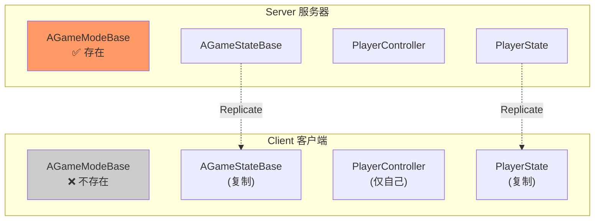
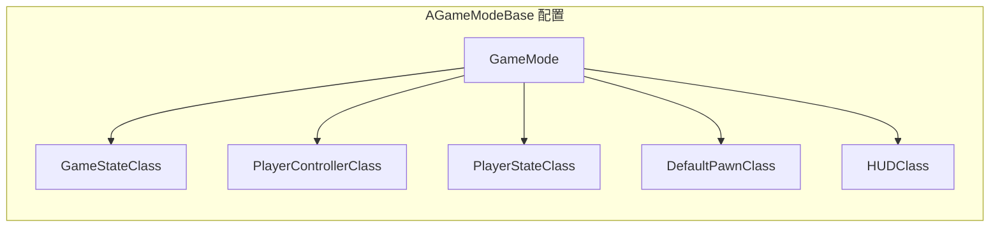
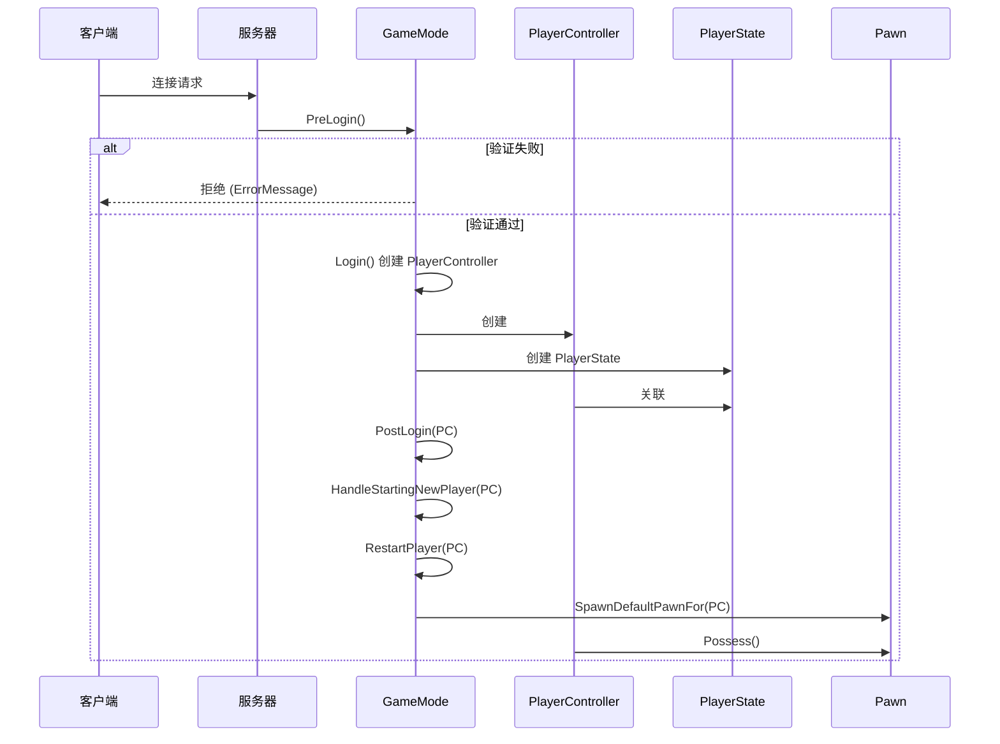
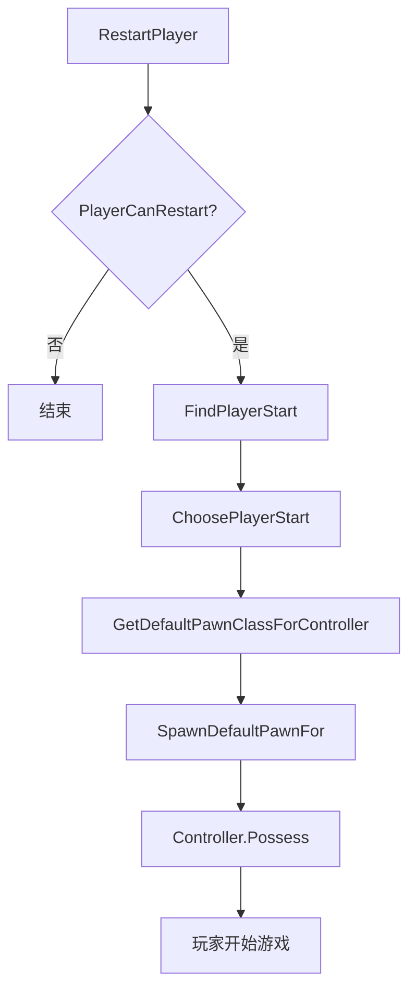
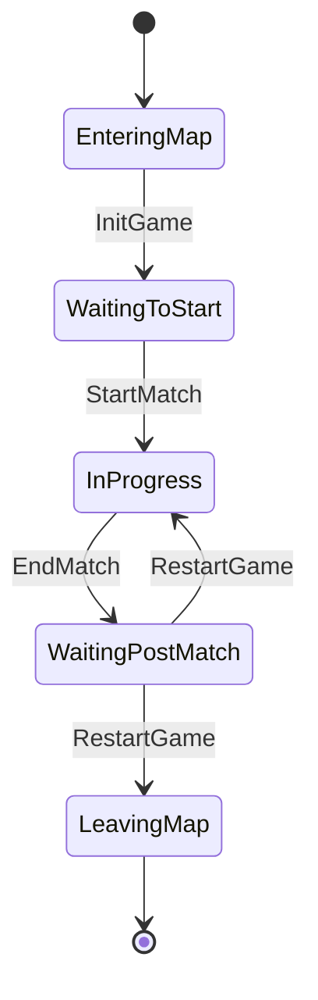
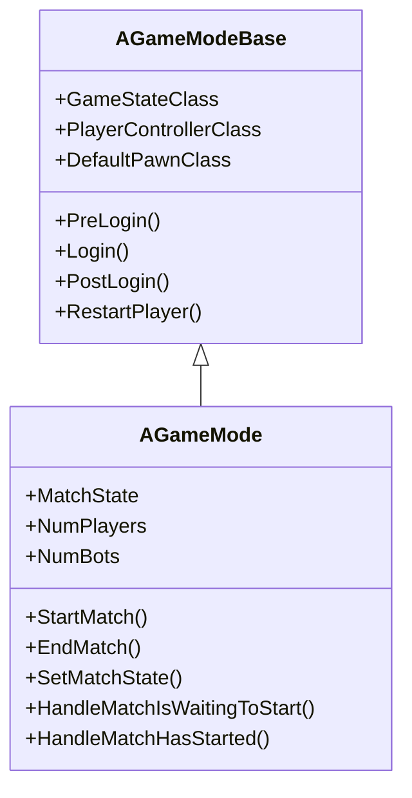

# AGameModeBase - 游戏模式

## 概述

`AGameModeBase` 是定义游戏规则的核心类，**仅存在于服务器端**。

- **游戏规则** - 定义胜负条件、游戏流程
- **玩家登录** - 管理玩家加入和离开
- **Pawn 生成** - 决定玩家使用什么 Pawn
- **匹配控制** - 控制比赛开始/结束

```
源码位置：Engine/Source/Runtime/Engine/Classes/GameFramework/GameModeBase.h
```

**核心定位**：游戏的"裁判"，制定规则并执行。

---

## 1. 网络架构



**关键点**：GameMode 仅在服务器存在，客户端无法直接访问。

---

## 2. 核心职责

### 2.1 默认类配置

```cpp
// GameModeBase.h 中的默认类
UPROPERTY(EditAnywhere, BlueprintReadWrite, Category=Classes)
TSubclassOf<AGameStateBase> GameStateClass;

UPROPERTY(EditAnywhere, BlueprintReadWrite, Category=Classes)
TSubclassOf<APlayerController> PlayerControllerClass;

UPROPERTY(EditAnywhere, BlueprintReadWrite, Category=Classes)
TSubclassOf<APlayerState> PlayerStateClass;

UPROPERTY(EditAnywhere, BlueprintReadWrite, Category=Classes)
TSubclassOf<AHUD> HUDClass;

UPROPERTY(EditAnywhere, BlueprintReadWrite, Category=Classes)
TSubclassOf<APawn> DefaultPawnClass;

UPROPERTY(EditAnywhere, BlueprintReadWrite, Category=Classes)
TSubclassOf<ASpectatorPawn> SpectatorClass;
```

### 2.2 类配置示意



---

## 3. 玩家登录流程

### 3.1 完整登录流程



### 3.2 关键登录函数

```cpp
// 预登录验证（可拒绝连接）
virtual void PreLogin(
    const FString& Options,
    const FString& Address,
    const FUniqueNetIdRepl& UniqueId,
    FString& ErrorMessage
);

// 创建 PlayerController（登录核心）
virtual APlayerController* Login(
    UPlayer* NewPlayer,
    ENetRole InRemoteRole,
    const FString& Portal,
    const FString& Options,
    const FUniqueNetIdRepl& UniqueId,
    FString& ErrorMessage
);

// 登录后处理
virtual void PostLogin(APlayerController* NewPlayer);

// 处理新玩家
virtual void HandleStartingNewPlayer(APlayerController* NewPlayer);

// 重新生成玩家
virtual void RestartPlayer(AController* NewPlayer);

// 生成 Pawn
virtual APawn* SpawnDefaultPawnFor(AController* NewPlayer, AActor* StartSpot);
```

---

## 4. 玩家出生点

### 4.1 出生点选择

```cpp
// 选择玩家出生点
virtual AActor* ChoosePlayerStart(AController* Player);

// 查找玩家出生点
virtual AActor* FindPlayerStart(
    AController* Player,
    const FString& IncomingName = TEXT("")
);

// 判断出生点是否可用
virtual bool PlayerCanRestart(APlayerController* Player);

// 获取默认 Pawn 类
virtual UClass* GetDefaultPawnClassForController(AController* InController);
```

### 4.2 出生流程



---

## 5. 游戏流程控制

### 5.1 比赛状态

```cpp
// 比赛是否可以开始
virtual bool ReadyToStartMatch();

// 是否有足够玩家开始
virtual bool HasMatchStarted() const;

// 开始比赛
virtual void StartMatch();

// 结束比赛
virtual void EndMatch();

// 重启游戏
virtual void RestartGame();

// 返回主菜单
virtual void ReturnToMainMenuHost();
```

### 5.2 游戏状态流程（AGameMode 扩展）



---

## 6. GameModeBase vs GameMode

### 6.1 继承关系



### 6.2 对比

| 特性 | AGameModeBase | AGameMode |
|-----|---------------|-----------|
| **用途** | 基础游戏模式 | 带比赛状态的模式 |
| **比赛状态** | ❌ | ✅ (MatchState) |
| **玩家计数** | 手动实现 | ✅ NumPlayers/NumBots |
| **适用场景** | 简单游戏、自定义流程 | 竞技、回合制 |

---

## 7. 自定义示例

```cpp
// MyGameMode.h
UCLASS()
class AMyGameMode : public AGameModeBase
{
    GENERATED_BODY()
    
public:
    AMyGameMode();
    
    // 预登录验证
    virtual void PreLogin(
        const FString& Options,
        const FString& Address,
        const FUniqueNetIdRepl& UniqueId,
        FString& ErrorMessage
    ) override;
    
    // 登录后处理
    virtual void PostLogin(APlayerController* NewPlayer) override;
    
    // 玩家退出
    virtual void Logout(AController* Exiting) override;
    
    // 选择 Pawn 类
    virtual UClass* GetDefaultPawnClassForController(AController* InController) override;
    
    // 选择出生点
    virtual AActor* ChoosePlayerStart(AController* Player) override;
};

// MyGameMode.cpp
AMyGameMode::AMyGameMode()
{
    // 设置默认类
    GameStateClass = AMyGameState::StaticClass();
    PlayerControllerClass = AMyPlayerController::StaticClass();
    PlayerStateClass = AMyPlayerState::StaticClass();
    DefaultPawnClass = AMyCharacter::StaticClass();
    HUDClass = AMyHUD::StaticClass();
}

void AMyGameMode::PreLogin(
    const FString& Options,
    const FString& Address,
    const FUniqueNetIdRepl& UniqueId,
    FString& ErrorMessage)
{
    Super::PreLogin(Options, Address, UniqueId, ErrorMessage);
    
    // 服务器已满
    if (GetNumPlayers() >= MaxPlayers)
    {
        ErrorMessage = TEXT("Server is full");
        return;
    }
    
    // 检查封禁
    if (IsPlayerBanned(UniqueId))
    {
        ErrorMessage = TEXT("You are banned");
        return;
    }
}

void AMyGameMode::PostLogin(APlayerController* NewPlayer)
{
    Super::PostLogin(NewPlayer);
    
    // 玩家加入通知
    if (AMyGameState* GS = GetGameState<AMyGameState>())
    {
        GS->BroadcastPlayerJoined(NewPlayer);
    }
}

UClass* AMyGameMode::GetDefaultPawnClassForController(AController* InController)
{
    // 根据玩家选择返回不同 Pawn
    if (AMyPlayerController* PC = Cast<AMyPlayerController>(InController))
    {
        switch (PC->SelectedCharacterType)
        {
            case ECharacterType::Warrior: return AWarriorCharacter::StaticClass();
            case ECharacterType::Mage: return AMageCharacter::StaticClass();
            default: return DefaultPawnClass;
        }
    }
    return Super::GetDefaultPawnClassForController(InController);
}
```

---

## 8. 常用 API

```cpp
// 获取 GameState
template<class T>
T* GetGameState() const;

// 获取玩家数量
int32 GetNumPlayers();
int32 GetNumSpectators();

// 踢出玩家
virtual bool CanSpectate(APlayerController* Viewer, APlayerState* ViewTarget);

// 暂停
virtual bool SetPause(APlayerController* PC, FCanUnpause CanUnpauseDelegate = FCanUnpause());
virtual bool ClearPause();

// URL 选项解析
static FString ParseOption(const FString& Options, const FString& Key);
static bool HasOption(const FString& Options, const FString& Key);
static int32 GetIntOption(const FString& Options, const FString& Key, int32 DefaultValue);
```

---

## 9. 总结

| 要点 | 说明 |
|-----|------|
| **本质** | 游戏规则的定义者和执行者 |
| **网络** | **仅服务器存在** |
| **主要职责** | 玩家登录、Pawn 生成、比赛控制 |
| **配置** | 定义所有默认游戏类 |
| **子类** | AGameMode 添加比赛状态管理 |

---

> 相关文档：
> - [AGameStateBase](./AGameStateBase.md) - 游戏状态
> - [APlayerController](./APlayerController.md) - 玩家控制器
> - [AGameSession](./AGameSession.md) - 游戏会话