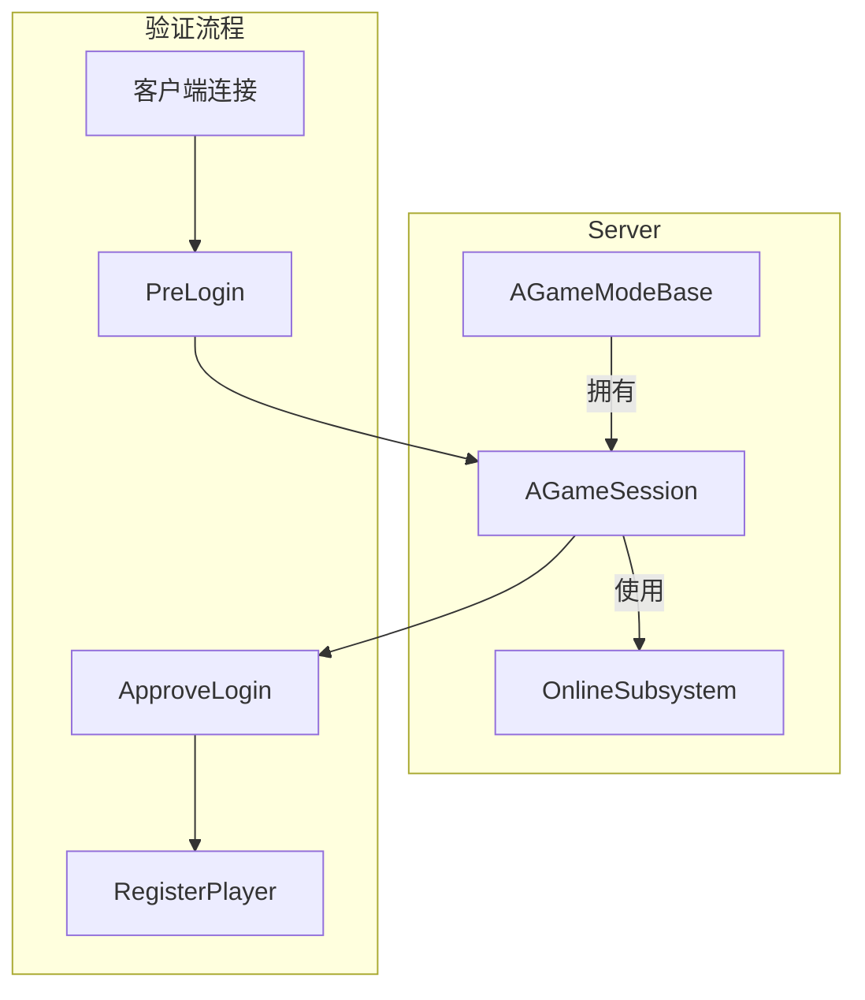
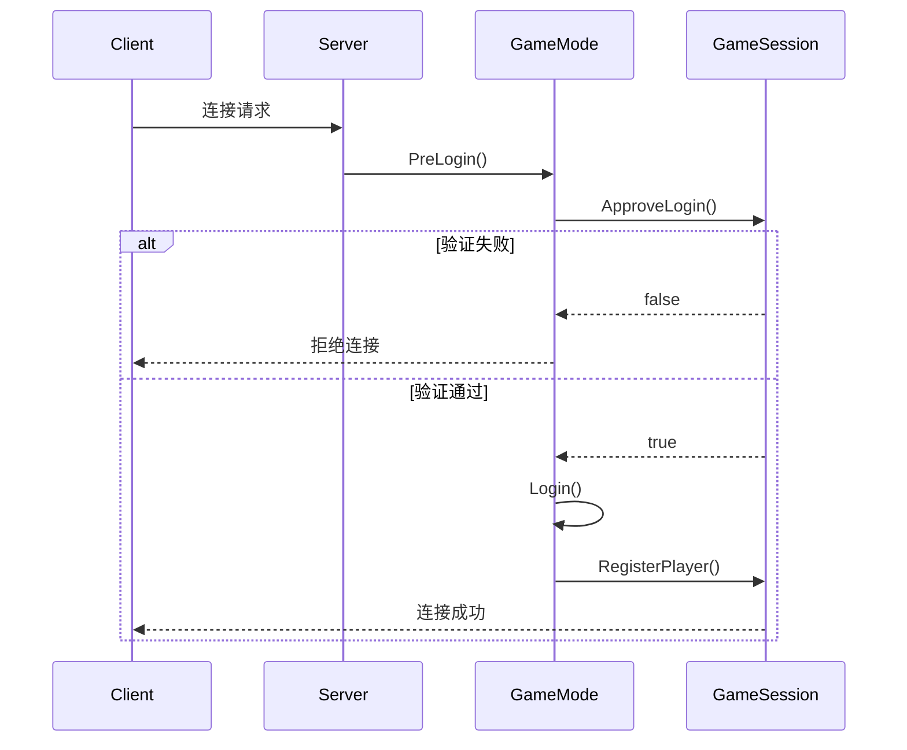

# AGameSession - 游戏会话

## 概述

`AGameSession` 管理多人游戏的网络会话和玩家连接许可。

- **会话管理** - 创建、销毁网络会话
- **玩家验证** - 验证玩家登录权限
- **在线服务** - 与平台在线系统集成
- **匹配管理** - 处理玩家匹配逻辑

```
源码位置：Engine/Source/Runtime/Engine/Classes/GameFramework/GameSession.h
```

**核心定位**：处理玩家"能否加入"游戏的网络层验证。

---

## 1. 架构位置



---

## 2. 核心功能

### 2.1 玩家登录验证

```cpp
// 批准玩家登录
virtual bool ApproveLogin(const FString& Options);

// 注册玩家
virtual void RegisterPlayer(
    APlayerController* NewPlayer, 
    const FUniqueNetIdRepl& UniqueId, 
    bool bWasFromInvite
);

// 注销玩家
virtual void UnregisterPlayer(FName InSessionName, const FUniqueNetIdRepl& UniqueId);

// 玩家退出通知
virtual void NotifyLogout(FName InSessionName, const FUniqueNetIdRepl& UniqueId);
```

### 2.2 会话管理

```cpp
// 获取会话名称
FName SessionName;

// 最大玩家数
int32 MaxPlayers;

// 最大观察者数
int32 MaxSpectators;

// 需要密码
bool bRequiresPassword;

// 服务器密码
FString ServerPassword;
```

### 2.3 连接验证流程



---

## 3. 在线会话集成

```cpp
// 处理玩家加入匹配
virtual bool HandleStartMatchRequest();

// 开始在线会话
virtual void HandleMatchHasStarted();

// 结束在线会话
virtual void HandleMatchHasEnded();

// 更新会话设置
virtual bool UpdateSessionSettings(FName InSessionName, FOnlineSessionSettings& Settings);
```

---

## 4. 自定义示例

```cpp
UCLASS()
class AMyGameSession : public AGameSession
{
    GENERATED_BODY()
    
public:
    virtual bool ApproveLogin(const FString& Options) override
    {
        // 检查密码
        FString Password = UGameplayStatics::ParseOption(Options, TEXT("Password"));
        if (bRequiresPassword && Password != ServerPassword)
        {
            return false;
        }
        
        // 检查当前玩家数
        if (GetWorld()->GetAuthGameMode())
        {
            AGameModeBase* GM = GetWorld()->GetAuthGameMode();
            if (GM->GetNumPlayers() >= MaxPlayers)
            {
                return false;
            }
        }
        
        return Super::ApproveLogin(Options);
    }
    
    virtual void RegisterPlayer(
        APlayerController* NewPlayer,
        const FUniqueNetIdRepl& UniqueId,
        bool bWasFromInvite) override
    {
        Super::RegisterPlayer(NewPlayer, UniqueId, bWasFromInvite);
        
        // 记录玩家加入
        UE_LOG(LogGame, Log, TEXT("Player registered: %s"), 
            *UniqueId.ToString());
    }
};
```

---

## 5. 总结

| 要点 | 说明 |
|-----|------|
| **本质** | 网络会话管理 |
| **位置** | 服务器端，由 GameMode 创建 |
| **职责** | 玩家验证、会话创建/销毁 |
| **集成** | 与 OnlineSubsystem 配合 |

---

> 相关文档：
> - [AGameModeBase](./AGameModeBase.md) - 游戏模式
> - [APlayerController](./APlayerController.md) - 玩家控制器