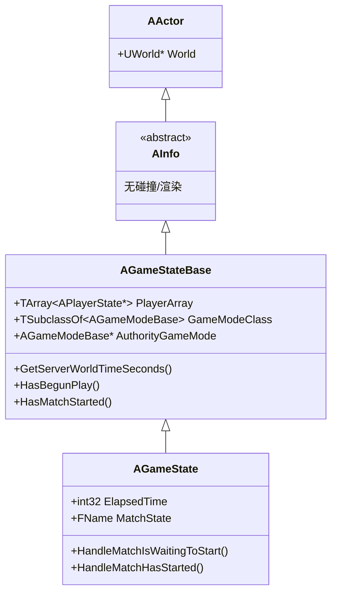
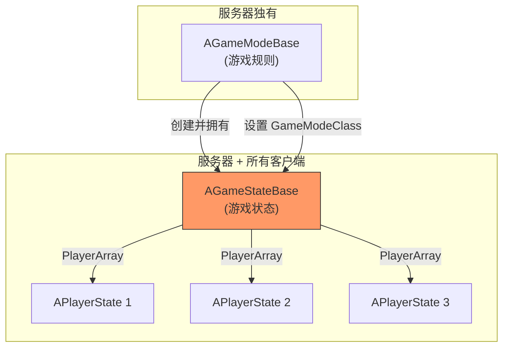
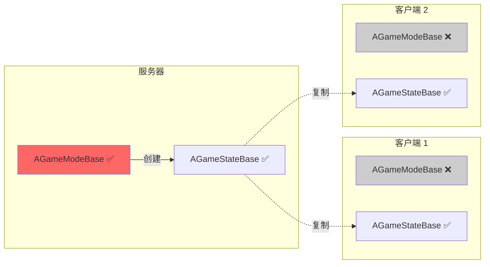
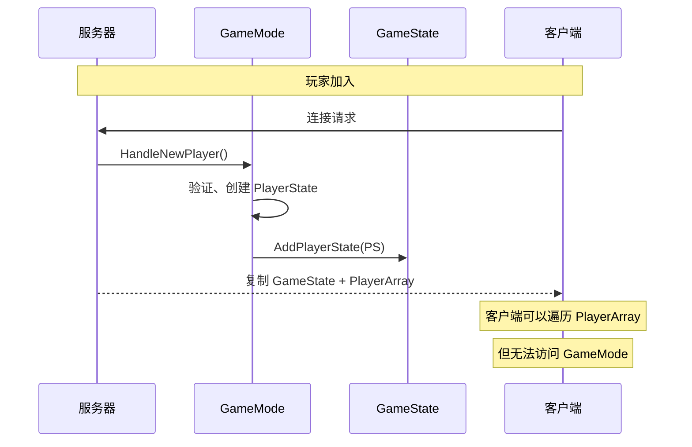
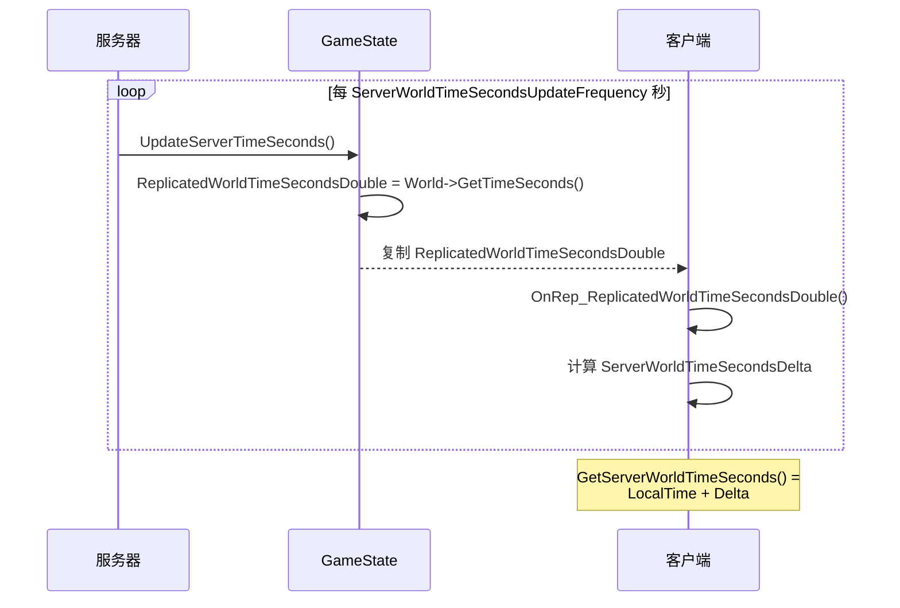
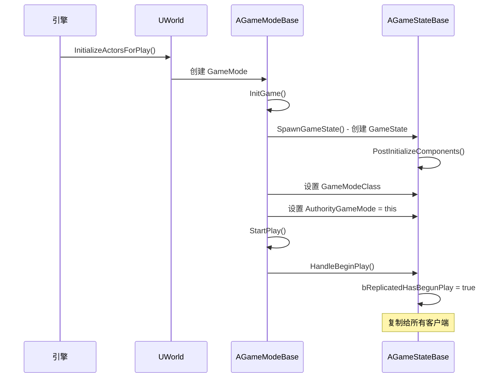
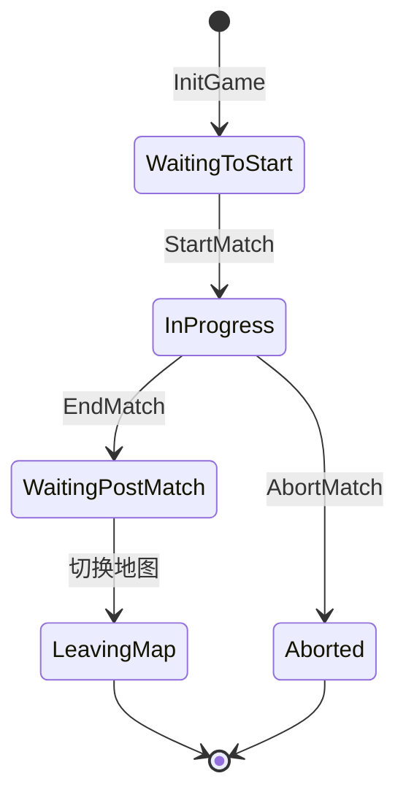

# AGameStateBase - 游戏状态

## 概述

`AGameStateBase` 是管理**游戏全局状态**的类。它是 UE 网络游戏框架中的核心组件，特点是：

- **复制到所有客户端** - 服务器和所有客户端都拥有相同的游戏状态
- **存储所有玩家的 PlayerState** - 通过 PlayerArray 管理
- **同步服务器时间** - 提供 GetServerWorldTimeSeconds() 实现时间同步
- **由 GameMode 创建和管理** - 但在客户端也存在

```
源码位置：Engine/Source/Runtime/Engine/Classes/GameFramework/GameStateBase.h
```

**核心定位**：游戏的"公告板"，存储所有客户端都需要知道的全局信息。

---

## 1. 类层级与关系

### 1.1 继承关系



### 1.2 与其他核心类的关系



---

## 2. 核心属性

### 2.1 游戏模式信息

```cpp
// GameMode 的类（复制给客户端）
// 客户端可以用这个创建 CDO 来读取默认配置
UPROPERTY(Transient, BlueprintReadOnly, ReplicatedUsing=OnRep_GameModeClass)
TSubclassOf<AGameModeBase> GameModeClass;

// GameMode 实例（仅服务器有效）
// 客户端上为 NULL
UPROPERTY(Transient, BlueprintReadOnly)
TObjectPtr<AGameModeBase> AuthorityGameMode;

// 观战者 Pawn 类
UPROPERTY(Transient, BlueprintReadOnly, ReplicatedUsing=OnRep_SpectatorClass)
TSubclassOf<ASpectatorPawn> SpectatorClass;
```

### 2.2 玩家状态数组

```cpp
// 所有玩家的 PlayerState 数组
// 服务器和客户端都维护这个列表
UPROPERTY(Transient, BlueprintReadOnly)
TArray<TObjectPtr<APlayerState>> PlayerArray;

// 添加玩家
virtual void AddPlayerState(APlayerState* PlayerState);

// 移除玩家
virtual void RemovePlayerState(APlayerState* PlayerState);
```

### 2.3 时间同步

```cpp
// 服务器世界时间（已复制）
UPROPERTY(Transient, ReplicatedUsing = OnRep_ReplicatedWorldTimeSecondsDouble)
double ReplicatedWorldTimeSecondsDouble;

// 本地与服务器的时间差
UPROPERTY(Transient)
float ServerWorldTimeSecondsDelta;

// 时间同步更新频率
UPROPERTY(EditDefaultsOnly)
float ServerWorldTimeSecondsUpdateFrequency;

// 获取同步后的服务器时间
UFUNCTION(BlueprintCallable)
virtual double GetServerWorldTimeSeconds() const;
```

### 2.4 游戏状态标志

```cpp
// 是否已经开始 Play（BeginPlay 已调用）
UPROPERTY(Transient, ReplicatedUsing = OnRep_ReplicatedHasBegunPlay)
bool bReplicatedHasBegunPlay;

// 游戏是否已开始
UFUNCTION(BlueprintCallable)
virtual bool HasBegunPlay() const;

// 比赛是否已开始
UFUNCTION(BlueprintCallable)
virtual bool HasMatchStarted() const;

// 比赛是否已结束
UFUNCTION(BlueprintCallable)
virtual bool HasMatchEnded() const;
```

---

## 3. GameState vs GameMode

这是最重要的区别之一：

### 3.1 网络存在对比



### 3.2 职责对比表

| 特性 | AGameModeBase | AGameStateBase |
|-----|---------------|----------------|
| **网络存在** | 仅服务器 | 服务器 + 所有客户端 |
| **主要职责** | 游戏规则、逻辑 | 游戏状态数据 |
| **玩家管理** | 登录/登出逻辑 | PlayerState 列表 |
| **典型存储** | 规则配置、类引用 | 分数、时间、状态 |
| **可修改性** | 只在服务器修改 | 服务器修改，客户端只读 |

### 3.3 为什么需要分开？



**设计理由**：
1. **安全性** - 游戏规则逻辑不应暴露给客户端（防作弊）
2. **带宽优化** - 只复制状态数据，不复制逻辑
3. **关注点分离** - 规则归规则，状态归状态

---

## 4. 时间同步机制

### 4.1 服务器时间同步流程



### 4.2 使用服务器时间

```cpp
// 获取同步的服务器时间
double ServerTime = GetWorld()->GetGameState<AGameStateBase>()->GetServerWorldTimeSeconds();

// 常见用途：
// 1. 技能冷却同步
bool AMyAbility::IsCooldownReady() const
{
    double ServerTime = GetWorld()->GetGameState<AGameStateBase>()->GetServerWorldTimeSeconds();
    return ServerTime >= CooldownEndTime;
}

// 2. 倒计时显示
void AMyHUD::DisplayCountdown()
{
    double ServerTime = GetGameState<AMyGameState>()->GetServerWorldTimeSeconds();
    double RemainingTime = MatchEndTime - ServerTime;
    DisplayTime(RemainingTime);
}

// 3. 动画同步
void AMyActor::PlayNetworkSyncedAnimation()
{
    double ServerTime = GetWorld()->GetGameState<AGameStateBase>()->GetServerWorldTimeSeconds();
    float AnimStartOffset = ServerTime - AnimationStartServerTime;
    PlayAnimation(AnimStartOffset);
}
```

---

## 5. 玩家管理

### 5.1 PlayerArray 操作

```cpp
// 添加玩家（GameMode 调用）
virtual void AddPlayerState(APlayerState* PlayerState)
{
    if (!PlayerArray.Contains(PlayerState))
    {
        PlayerArray.Add(PlayerState);
    }
}

// 移除玩家
virtual void RemovePlayerState(APlayerState* PlayerState)
{
    PlayerArray.Remove(PlayerState);
}

// 根据 UniqueNetId 查找玩家
APlayerState* GetPlayerStateFromUniqueNetId(const FUniqueNetIdWrapper& InPlayerId) const;
```

### 5.2 遍历所有玩家

```cpp
// 在任何地方获取 GameState
AGameStateBase* GS = GetWorld()->GetGameState<AGameStateBase>();

// 遍历所有玩家
for (APlayerState* PS : GS->PlayerArray)
{
    UE_LOG(LogGame, Log, TEXT("Player: %s, Score: %.0f"), 
        *PS->GetPlayerName(), PS->GetScore());
}

// 查找特定玩家
APlayerState* FindPlayerByName(const FString& Name)
{
    for (APlayerState* PS : GS->PlayerArray)
    {
        if (PS->GetPlayerName() == Name)
        {
            return PS;
        }
    }
    return nullptr;
}

// 按分数排序
TArray<APlayerState*> GetSortedPlayers()
{
    TArray<APlayerState*> SortedArray = GS->PlayerArray;
    SortedArray.Sort([](const APlayerState& A, const APlayerState& B)
    {
        return A.GetScore() > B.GetScore();
    });
    return SortedArray;
}
```

---

## 6. 生命周期

### 6.1 创建流程



### 6.2 关键生命周期函数

| 函数 | 调用时机 | 用途 |
|-----|---------|-----|
| `PostInitializeComponents()` | 组件初始化后 | 设置定时器等 |
| `ReceivedGameModeClass()` | 收到 GameModeClass 后 | 客户端响应 |
| `HandleBeginPlay()` | GameMode.StartPlay 时 | 标记游戏开始 |
| `AddPlayerState()` | 玩家加入时 | 更新 PlayerArray |
| `RemovePlayerState()` | 玩家离开时 | 更新 PlayerArray |
| `SeamlessTravelTransitionCheckpoint()` | 无缝旅行时 | 关卡切换处理 |

---

## 7. AGameState（扩展版）

UE 提供了更完整的 `AGameState` 类（继承自 AGameStateBase），增加了比赛状态管理：

### 7.1 AGameState 额外功能

```cpp
// AGameState 额外属性
UPROPERTY(Replicated)
FName MatchState;           // 比赛状态名

UPROPERTY(Replicated)
int32 ElapsedTime;          // 已过时间

UPROPERTY(Replicated)
bool bReplicatedHasBegunPlay;

// 比赛状态回调
virtual void HandleMatchIsWaitingToStart();   // 等待开始
virtual void HandleMatchHasStarted();         // 比赛开始
virtual void HandleMatchHasEnded();           // 比赛结束
virtual void HandleLeavingMap();              // 离开地图
```

### 7.2 比赛状态流程



---

## 8. 自定义 GameState

### 8.1 常见扩展示例

```cpp
// MyGameState.h
UCLASS()
class MYGAME_API AMyGameState : public AGameStateBase
{
    GENERATED_BODY()
    
public:
    AMyGameState();
    
    // 比赛时间
    UPROPERTY(ReplicatedUsing=OnRep_MatchTime, BlueprintReadOnly)
    float MatchTimeRemaining;
    
    // 队伍分数
    UPROPERTY(ReplicatedUsing=OnRep_TeamScores, BlueprintReadOnly)
    TArray<int32> TeamScores;
    
    // 当前回合
    UPROPERTY(Replicated, BlueprintReadOnly)
    int32 CurrentRound;
    
    // 比赛状态
    UPROPERTY(ReplicatedUsing=OnRep_MatchPhase, BlueprintReadOnly)
    EMatchPhase MatchPhase;
    
    // 事件广播
    UPROPERTY(BlueprintAssignable)
    FOnMatchPhaseChanged OnMatchPhaseChanged;
    
    UPROPERTY(BlueprintAssignable)
    FOnTeamScored OnTeamScored;
    
    // 服务器调用
    void SetMatchPhase(EMatchPhase NewPhase);
    void AddTeamScore(int32 TeamId, int32 Points);
    
protected:
    UFUNCTION()
    void OnRep_MatchTime();
    
    UFUNCTION()
    void OnRep_TeamScores();
    
    UFUNCTION()
    void OnRep_MatchPhase();
    
    virtual void GetLifetimeReplicatedProps(TArray<FLifetimeProperty>& OutLifetimeProps) const override;
};

// MyGameState.cpp
AMyGameState::AMyGameState()
{
    PrimaryActorTick.bCanEverTick = true;
    TeamScores.Init(0, 2);  // 两个队伍
}

void AMyGameState::GetLifetimeReplicatedProps(TArray<FLifetimeProperty>& OutLifetimeProps) const
{
    Super::GetLifetimeReplicatedProps(OutLifetimeProps);
    
    DOREPLIFETIME(AMyGameState, MatchTimeRemaining);
    DOREPLIFETIME(AMyGameState, TeamScores);
    DOREPLIFETIME(AMyGameState, CurrentRound);
    DOREPLIFETIME(AMyGameState, MatchPhase);
}

void AMyGameState::SetMatchPhase(EMatchPhase NewPhase)
{
    if (HasAuthority())
    {
        MatchPhase = NewPhase;
        OnMatchPhaseChanged.Broadcast(NewPhase);
    }
}

void AMyGameState::AddTeamScore(int32 TeamId, int32 Points)
{
    if (HasAuthority() && TeamScores.IsValidIndex(TeamId))
    {
        TeamScores[TeamId] += Points;
        OnTeamScored.Broadcast(TeamId, TeamScores[TeamId]);
    }
}

void AMyGameState::OnRep_MatchPhase()
{
    // 客户端收到新的比赛阶段
    OnMatchPhaseChanged.Broadcast(MatchPhase);
}

void AMyGameState::OnRep_TeamScores()
{
    // 更新 UI
    for (int32 i = 0; i < TeamScores.Num(); i++)
    {
        OnTeamScored.Broadcast(i, TeamScores[i]);
    }
}
```

### 8.2 在 GameMode 中配置

```cpp
// MyGameMode.cpp
AMyGameMode::AMyGameMode()
{
    GameStateClass = AMyGameState::StaticClass();
}

void AMyGameMode::HandleMatchHasStarted()
{
    Super::HandleMatchHasStarted();
    
    if (AMyGameState* MyGS = GetGameState<AMyGameState>())
    {
        MyGS->SetMatchPhase(EMatchPhase::InProgress);
    }
}
```

---

## 9. 常用 API

### 9.1 获取 GameState

```cpp
// 方式 1：从 World 获取
AGameStateBase* GS = GetWorld()->GetGameState<AGameStateBase>();

// 方式 2：模板版本（自动转换）
AMyGameState* MyGS = GetWorld()->GetGameState<AMyGameState>();

// 方式 3：从 GameMode 获取（仅服务器）
if (AGameModeBase* GM = GetWorld()->GetAuthGameMode())
{
    AGameStateBase* GS = GM->GameState;
}
```

### 9.2 状态查询

```cpp
// 游戏是否已开始
bool bStarted = GS->HasBegunPlay();

// 比赛是否已开始
bool bMatchStarted = GS->HasMatchStarted();

// 比赛是否已结束
bool bMatchEnded = GS->HasMatchEnded();

// 获取服务器时间
double ServerTime = GS->GetServerWorldTimeSeconds();

// 获取玩家重生延迟
float RespawnDelay = GS->GetPlayerRespawnDelay(Controller);
```

### 9.3 获取 GameMode 信息（客户端安全）

```cpp
// 获取 GameMode 的 CDO（客户端也能用）
const AGameModeBase* DefaultGM = GS->GetDefaultGameMode();

// 转换为具体类型
const AMyGameMode* DefaultMyGM = GS->GetDefaultGameMode<AMyGameMode>();

// 读取默认配置
if (DefaultMyGM)
{
    float DefaultRespawnTime = DefaultMyGM->RespawnDelay;
}
```

---

## 10. 常见问题

### Q1: 为什么客户端的 AuthorityGameMode 是 NULL？
因为 GameMode 只存在于服务器。客户端使用 `GameModeClass` 和 `GetDefaultGameMode()` 来获取 GameMode 的配置信息。

### Q2: GameState 和 PlayerState 存储的数据有什么区别？
| 数据类型 | GameState | PlayerState |
|---------|-----------|-------------|
| 作用域 | 全局（所有玩家共享） | 单个玩家 |
| 示例 | 队伍总分、比赛时间、天气 | 个人分数、击杀数、名字 |

### Q3: 如何在 GameState 中存储大量数据？
对于大量数据（如排行榜、玩家列表），考虑：
1. **条件复制** - 只在需要时复制
2. **RPC** - 按需请求数据
3. **子对象** - 使用单独的 Actor 管理

```cpp
// 条件复制示例
DOREPLIFETIME_CONDITION(AMyGameState, DetailedStats, COND_OwnerOnly);
```

---

## 11. 总结

| 要点 | 说明 |
|-----|------|
| **本质** | 游戏的"公告板" |
| **复制范围** | 服务器 → 所有客户端 |
| **PlayerArray** | 存储所有玩家的 PlayerState |
| **时间同步** | GetServerWorldTimeSeconds() |
| **vs GameMode** | GM 管规则，GS 管状态 |
| **创建者** | 由 GameMode 在服务器创建 |

---

> 相关文档：
> - [AGameModeBase](./AGameModeBase.md) - 游戏模式
> - [APlayerState](./APlayerState.md) - 玩家状态
> - [UGameInstance](./UGameInstance.md) - 游戏实例