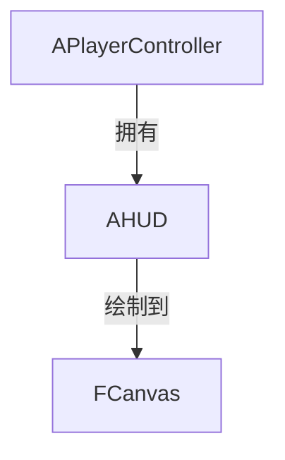

# AHUD - 抬头显示器

## 概述

`AHUD` 是传统的屏幕绘制系统，用于绘制 2D UI 元素。

- **Canvas 绘制** - 直接在屏幕上绘制
- **调试信息** - 显示调试数据
- **准星/血条** - 传统 UI 元素

```
源码位置：Engine/Source/Runtime/Engine/Classes/GameFramework/HUD.h
```

**注意**：现代 UE 项目推荐使用 UMG (Unreal Motion Graphics)，AHUD 主要用于调试和简单绘制。

---

## 1. 架构位置



---

## 2. 核心函数

```cpp
// 主绘制函数（每帧调用）
virtual void DrawHUD();

// 绘制文本
void DrawText(const FString& Text, FLinearColor Color, float X, float Y, UFont* Font = nullptr, float Scale = 1.f);

// 绘制线条
void DrawLine(float StartX, float StartY, float EndX, float EndY, FLinearColor Color, float Thickness = 0.f);

// 绘制矩形
void DrawRect(FLinearColor Color, float X, float Y, float Width, float Height);

// 绘制纹理
void DrawTexture(UTexture* Texture, float X, float Y, float Width, float Height, float U, float V, float UWidth, float VHeight, FLinearColor Color = FLinearColor::White);

// 绘制材质
void DrawMaterial(UMaterialInterface* Material, float X, float Y, float Width, float Height, float U, float V, float UWidth, float VHeight);
```

---

## 3. 示例

```cpp
// MyHUD.h
UCLASS()
class AMyHUD : public AHUD
{
    GENERATED_BODY()
    
public:
    virtual void DrawHUD() override;
    
protected:
    UPROPERTY(EditDefaultsOnly)
    UTexture2D* CrosshairTexture;
    
    UPROPERTY(EditDefaultsOnly)
    UFont* DebugFont;
};

// MyHUD.cpp
void AMyHUD::DrawHUD()
{
    Super::DrawHUD();
    
    // 绘制准星
    if (CrosshairTexture)
    {
        float CenterX = Canvas->SizeX / 2.f;
        float CenterY = Canvas->SizeY / 2.f;
        float TextureWidth = CrosshairTexture->GetSizeX();
        float TextureHeight = CrosshairTexture->GetSizeY();
        
        DrawTexture(
            CrosshairTexture,
            CenterX - TextureWidth / 2.f,
            CenterY - TextureHeight / 2.f,
            TextureWidth, TextureHeight,
            0.f, 0.f, 1.f, 1.f,
            FLinearColor::White
        );
    }
    
    // 绘制调试信息
    if (bShowDebugInfo)
    {
        DrawText(
            FString::Printf(TEXT("FPS: %d"), FMath::RoundToInt(1.f / GetWorld()->DeltaTimeSeconds)),
            FLinearColor::Green,
            10.f, 10.f,
            DebugFont
        );
    }
}
```

---

## 4. 配置 HUD

```cpp
// 在 GameMode 中设置
AMyGameMode::AMyGameMode()
{
    HUDClass = AMyHUD::StaticClass();
}
```

---

## 5. 总结

| 要点 | 说明 |
|-----|------|
| **本质** | 屏幕绘制系统 |
| **所有者** | PlayerController |
| **主要用途** | 调试信息、简单 UI |
| **现代替代** | UMG Widget |

---

> 相关文档：
> - [APlayerController](./APlayerController.md) - 玩家控制器
> - [AGameModeBase](./AGameModeBase.md) - 游戏模式