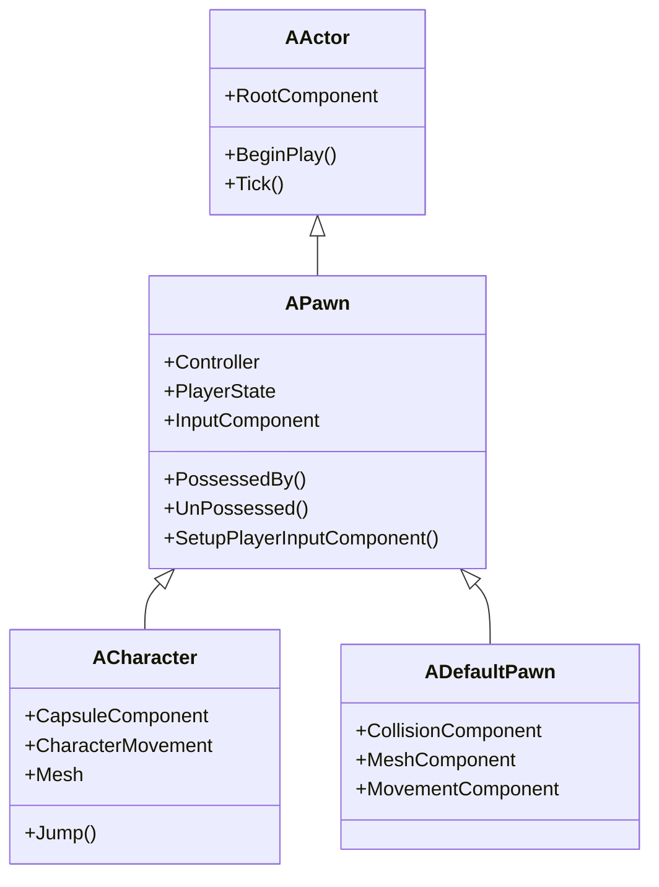
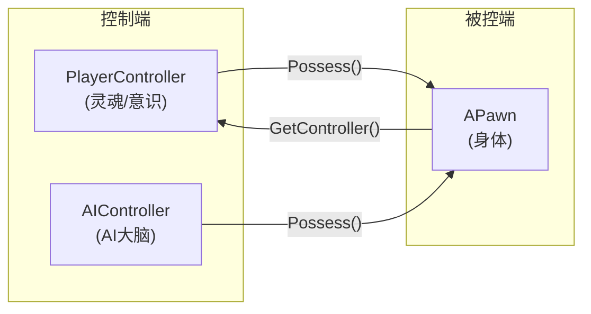
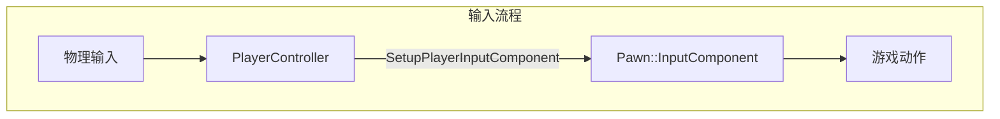

# APawn - 可控制实体

## 概述

`APawn` 是可以被 Controller "附身"(Possess) 的 Actor 基类。

- **可控制** - 可被 PlayerController 或 AIController 控制
- **移动能力** - 基础移动接口
- **输入绑定** - 可接收输入事件
- **物理代表** - 玩家在游戏世界中的"化身"

```
源码位置：Engine/Source/Runtime/Engine/Classes/GameFramework/Pawn.h
```

**核心定位**：Controller 的"身体"，世界中的可控制实体。

---

## 1. 继承关系



---

## 2. Controller-Pawn 关系



### 附身机制

```cpp
// Controller 附身 Pawn
Controller->Possess(Pawn);

// Pawn 被附身时回调
virtual void PossessedBy(AController* NewController);

// Pawn 被放弃时回调
virtual void UnPossessed();

// 获取控制器
AController* GetController() const;

// 模板版本
template<class T>
T* GetController() const;
```

---

## 3. 核心属性

```cpp
// 当前控制器
UPROPERTY(ReplicatedUsing=OnRep_Controller)
TObjectPtr<AController> Controller;

// 玩家状态
UPROPERTY(ReplicatedUsing=OnRep_PlayerState)
TObjectPtr<APlayerState> PlayerState;

// 是否为玩家控制
UPROPERTY()
uint8 bIsLocallyControlled : 1;

// 自动附身设置
UPROPERTY(EditAnywhere, Category=Pawn)
TEnumAsByte<EAutoReceiveInput::Type> AutoPossessPlayer;

UPROPERTY(EditAnywhere, Category=Pawn)
EAutoPossessAI AutoPossessAI;

// AI 控制器类
UPROPERTY(EditAnywhere, Category=Pawn)
TSubclassOf<AController> AIControllerClass;
```

---

## 4. 输入处理



```cpp
// 设置玩家输入组件（在被附身时调用）
virtual void SetupPlayerInputComponent(UInputComponent* PlayerInputComponent);

// 使用示例
void AMyPawn::SetupPlayerInputComponent(UInputComponent* PlayerInputComponent)
{
    Super::SetupPlayerInputComponent(PlayerInputComponent);
    
    PlayerInputComponent->BindAction("Jump", IE_Pressed, this, &AMyPawn::Jump);
    PlayerInputComponent->BindAxis("MoveForward", this, &AMyPawn::MoveForward);
}
```

---

## 5. 移动接口

```cpp
// 添加移动输入
virtual void AddMovementInput(FVector WorldDirection, float ScaleValue = 1.0f, bool bForce = false);

// 添加旋转输入
virtual void AddControllerPitchInput(float Val);
virtual void AddControllerYawInput(float Val);
virtual void AddControllerRollInput(float Val);

// 获取移动组件
virtual UPawnMovementComponent* GetMovementComponent() const;

// 获取基础目标旋转
virtual FRotator GetBaseAimRotation() const;

// 获取视点位置
virtual void GetActorEyesViewPoint(FVector& OutLocation, FRotator& OutRotation) const;
```

---

## 6. 网络复制

```cpp
// 是否本地控制
UFUNCTION(BlueprintCallable)
virtual bool IsLocallyControlled() const;

// 是否玩家控制
UFUNCTION(BlueprintCallable)
virtual bool IsPlayerControlled() const;

// 是否 Bot 控制
UFUNCTION(BlueprintCallable)
virtual bool IsBotControlled() const;

// Controller 复制回调
UFUNCTION()
virtual void OnRep_Controller();

// PlayerState 复制回调
UFUNCTION()
virtual void OnRep_PlayerState();
```

---

## 7. 常用 API

```cpp
// 获取控制旋转
FRotator GetControlRotation() const;

// 获取玩家状态
template<class T>
T* GetPlayerState() const;

// 重启（重生）
virtual void Restart();

// 分离控制器
void DetachFromControllerPendingDestroy();

// 获取导航代理
virtual INavAgentInterface* GetAsNavAgent();

// 是否可以被某控制器控制
virtual bool CanBeBaseForCharacter(APawn* APawn) const;
```

---

## 8. Pawn vs Character

| 特性 | APawn | ACharacter |
|-----|-------|------------|
| **移动组件** | 无默认 | CharacterMovementComponent |
| **碰撞** | 需手动添加 | CapsuleComponent |
| **网格体** | 需手动添加 | SkeletalMeshComponent |
| **跳跃** | 需手动实现 | ✅ Jump() |
| **适用场景** | 载具、飞行物 | 人形角色 |

---

## 9. 总结

| 要点 | 说明 |
|-----|------|
| **本质** | 可被控制的 Actor |
| **关系** | Controller 的"身体" |
| **输入** | SetupPlayerInputComponent |
| **移动** | 通过 MovementComponent |
| **网络** | Controller/PlayerState 复制 |

---

> 相关文档：
> - [AController](./AController.md) - 控制器基类
> - [ACharacter](./ACharacter.md) - 角色类
> - [APlayerController](./APlayerController.md) - 玩家控制器