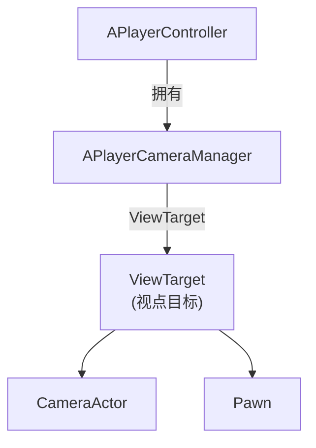
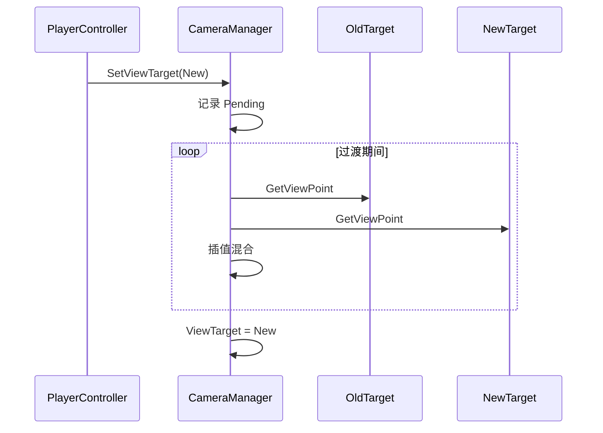

# APlayerCameraManager - 玩家相机管理器

## 概述

`APlayerCameraManager` 管理玩家的相机行为和视角。

- **相机控制** - 位置、旋转、FOV
- **视角切换** - 不同相机模式
- **后处理** - 相机效果
- **相机震动** - 反馈效果

```
源码位置：Engine/Source/Runtime/Engine/Classes/Camera/PlayerCameraManager.h
```

**核心定位**：玩家"眼睛"的管理者，决定玩家看到什么。

---

## 1. 架构位置



---

## 2. 核心概念

### 2.1 ViewTarget（视点目标）

```cpp
// 视点目标结构
USTRUCT()
struct FTViewTarget
{
    // 目标 Actor
    UPROPERTY()
    TObjectPtr<AActor> Target;
    
    // 视点信息
    UPROPERTY()
    FMinimalViewInfo POV;
};

// 当前和待定目标
UPROPERTY()
FTViewTarget ViewTarget;

UPROPERTY()
FTViewTarget PendingViewTarget;
```

### 2.2 视点信息

```cpp
USTRUCT()
struct FMinimalViewInfo
{
    FVector Location;
    FRotator Rotation;
    float FOV;
    float OrthoWidth;
    float OrthoNearClipPlane;
    float OrthoFarClipPlane;
    float AspectRatio;
    uint8 bConstrainAspectRatio : 1;
    uint8 bUseFieldOfViewForLOD : 1;
    TEnumAsByte<ECameraProjectionMode::Type> ProjectionMode;
    FPostProcessSettings PostProcessSettings;
    float PostProcessBlendWeight;
};
```

---

## 3. 相机模式

```cpp
// 相机风格
UENUM()
enum ECameraStyle
{
    Default,      // 默认跟随
    Fixed,        // 固定位置
    ThirdPerson,  // 第三人称
    FreeCam,      // 自由相机
    FirstPerson,  // 第一人称
};

// 设置视点目标
void SetViewTarget(AActor* NewTarget, FViewTargetTransitionParams Params = FViewTargetTransitionParams());

// 获取当前 POV
void GetCameraViewPoint(FVector& OutLocation, FRotator& OutRotation);
void GetPlayerViewPoint(FVector& OutLocation, FRotator& OutRotation);
```

---

## 4. 相机震动

```cpp
// 播放相机震动
UFUNCTION(BlueprintCallable)
virtual UCameraShakeBase* StartCameraShake(
    TSubclassOf<UCameraShakeBase> ShakeClass,
    float Scale = 1.0f,
    ECameraShakePlaySpace PlaySpace = ECameraShakePlaySpace::CameraLocal,
    FRotator UserPlaySpaceRot = FRotator::ZeroRotator
);

// 停止相机震动
UFUNCTION(BlueprintCallable)
virtual void StopCameraShake(UCameraShakeBase* ShakeInstance, bool bImmediately = true);

// 停止所有震动
UFUNCTION(BlueprintCallable)
virtual void StopAllCameraShakes(bool bImmediately = true);
```

---

## 5. 视角切换



```cpp
// 过渡参数
USTRUCT()
struct FViewTargetTransitionParams
{
    float BlendTime;           // 混合时间
    EViewTargetBlendFunction BlendFunction;  // 混合曲线
    float BlendExp;            // 指数（用于 EaseIn/Out）
    uint8 bLockOutgoing : 1;   // 锁定源视点
};
```

---

## 6. 自定义示例

```cpp
// 自定义相机管理器
UCLASS()
class AMyPlayerCameraManager : public APlayerCameraManager
{
    GENERATED_BODY()
    
public:
    virtual void UpdateViewTarget(FTViewTarget& OutVT, float DeltaTime) override
    {
        Super::UpdateViewTarget(OutVT, DeltaTime);
        
        // 自定义后处理
        OutVT.POV.PostProcessSettings.bOverride_BloomIntensity = true;
        OutVT.POV.PostProcessSettings.BloomIntensity = 1.5f;
    }
    
    // 自定义震动
    UFUNCTION(BlueprintCallable)
    void PlayHitCameraShake()
    {
        StartCameraShake(HitShakeClass, 1.0f);
    }
    
protected:
    UPROPERTY(EditDefaultsOnly)
    TSubclassOf<UCameraShakeBase> HitShakeClass;
};

// 在 GameMode 中配置
AMyGameMode::AMyGameMode()
{
    PlayerCameraManagerClass = AMyPlayerCameraManager::StaticClass();
}
```

---

## 7. 常用 API

```cpp
// 获取 FOV
float GetFOVAngle() const;

// 设置 FOV
void SetFOV(float NewFOV);

// 获取相机位置
FVector GetCameraLocation() const;

// 获取相机旋转
FRotator GetCameraRotation() const;

// 应用后处理混合
void AddCachedPPBlend(const FPostProcessSettings& PPSettings, float BlendWeight);

// 颜色淡入淡出
void StartCameraFade(float FromAlpha, float ToAlpha, float Duration, FLinearColor Color, bool bShouldFadeAudio = false, bool bHoldWhenFinished = false);
void StopCameraFade();
```

---

## 8. 总结

| 要点 | 说明 |
|-----|------|
| **本质** | 相机行为管理 |
| **所有者** | PlayerController |
| **核心概念** | ViewTarget + POV |
| **功能** | 视角切换、震动、后处理、淡入淡出 |

---

> 相关文档：
> - [APlayerController](./APlayerController.md) - 玩家控制器
> - [APawn](./APawn.md) - Pawn