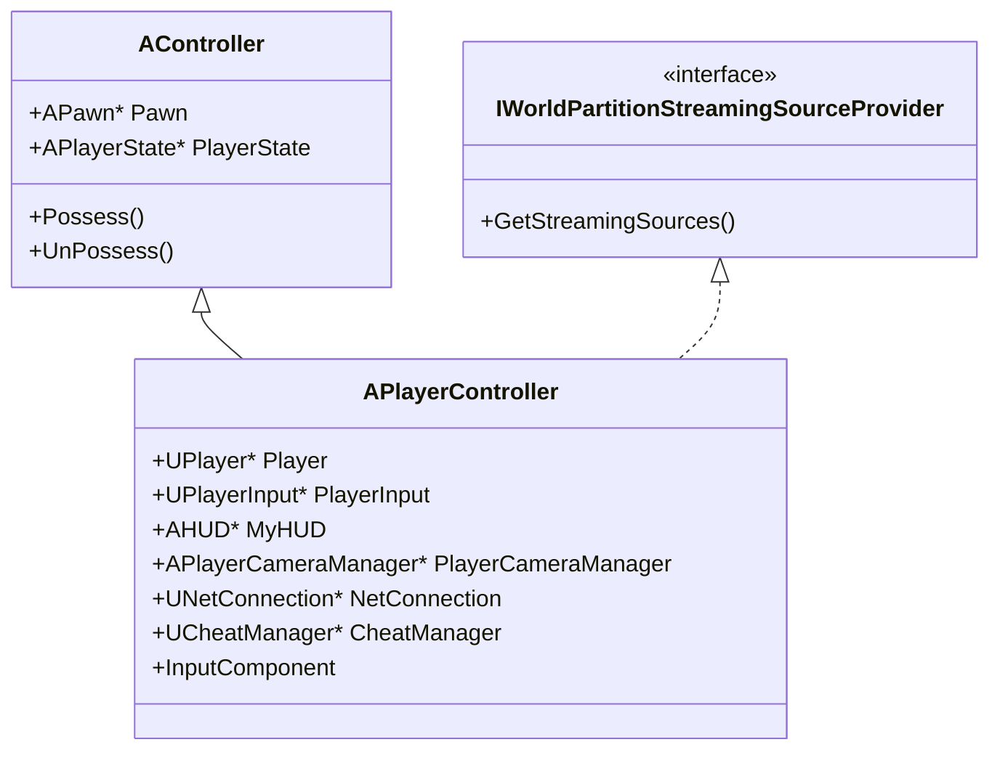
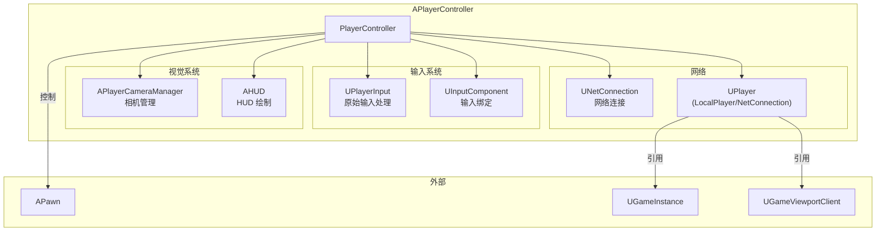
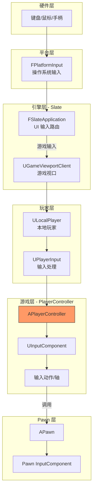
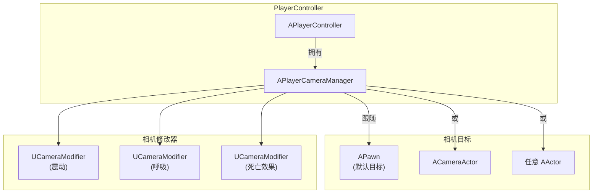
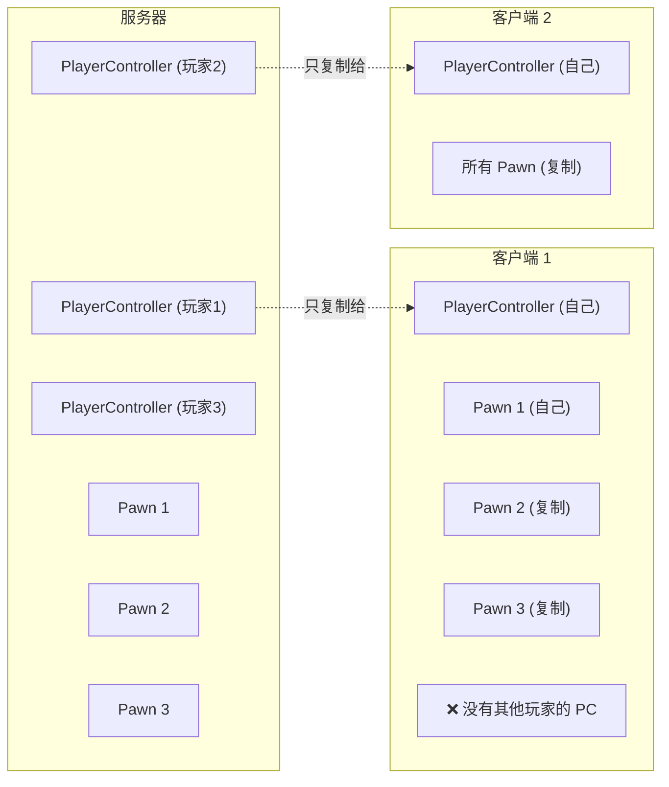
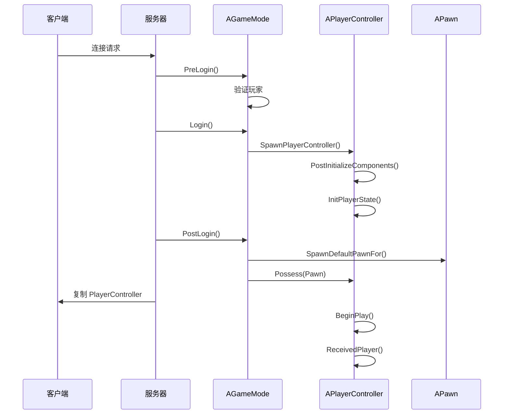
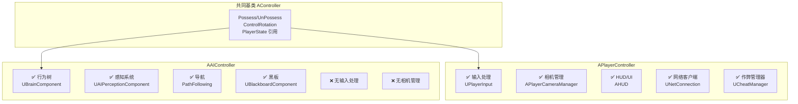

# APlayerController - 玩家控制器

## 概述

`APlayerController` 是用于**人类玩家**控制 Pawn 的控制器类。它是 UE 游戏框架中最重要的类之一，负责：

- **输入处理** - 接收和处理玩家的键盘、鼠标、手柄输入
- **相机管理** - 管理玩家视角和相机行为
- **UI 交互** - 处理 HUD、菜单和鼠标光标
- **网络通信** - 作为客户端与服务器的通信桥梁

```
源码位置：Engine/Source/Runtime/Engine/Classes/GameFramework/PlayerController.h
```

---

## 1. 类层级与关键组件

### 1.1 继承关系



### 1.2 核心组件关系



---

## 2. 输入系统

### 2.1 输入处理流程

这是您提到的核心问题：**为什么有 Input 模块还需要 PlayerController？**



### 2.2 Input 模块 vs PlayerController 的职责

| 层级 | 组件 | 职责 |
|-----|------|-----|
| **Input 模块** | FSlateApplication | 底层输入事件分发 |
| **Input 模块** | UPlayerInput | 原始输入转换为动作映射 |
| **PlayerController** | 自身 | 游戏逻辑级别的输入响应 |
| **PlayerController** | InputComponent | 绑定输入到具体函数 |
| **Pawn** | InputComponent | Pawn 特有的输入绑定 |

**为什么需要 PlayerController 处理输入：**
1. **多玩家支持** - 每个玩家有独立的 PlayerController 和输入
2. **网络同步** - PlayerController 知道如何将输入发送到服务器
3. **输入优先级** - Controller 输入优先于 Pawn 输入
4. **跨 Pawn 持久** - 切换 Pawn 时输入配置保持

### 2.3 Enhanced Input System（UE5）

```cpp
// UE5 推荐使用 Enhanced Input System
// 在 PlayerController 中设置
void AMyPlayerController::SetupInputComponent()
{
    Super::SetupInputComponent();
    
    // 获取 Enhanced Input 子系统
    if (UEnhancedInputLocalPlayerSubsystem* Subsystem = 
        ULocalPlayer::GetSubsystem<UEnhancedInputLocalPlayerSubsystem>(GetLocalPlayer()))
    {
        // 添加输入映射上下文
        Subsystem->AddMappingContext(DefaultMappingContext, 0);
    }
    
    // 绑定增强输入动作
    if (UEnhancedInputComponent* EnhancedInputComponent = 
        Cast<UEnhancedInputComponent>(InputComponent))
    {
        EnhancedInputComponent->BindAction(
            MoveAction, 
            ETriggerEvent::Triggered, 
            this, 
            &AMyPlayerController::HandleMove
        );
    }
}
```

### 2.4 输入模式

PlayerController 管理三种输入模式：

```cpp
// 仅游戏输入（隐藏鼠标，锁定视口）
SetInputMode(FInputModeGameOnly());

// 仅 UI 输入（显示鼠标，UI 接收输入）
SetInputMode(FInputModeUIOnly());

// 游戏和 UI 混合
SetInputMode(FInputModeGameAndUI()
    .SetWidgetToFocus(MyWidget)
    .SetLockMouseToViewportBehavior(EMouseLockMode::DoNotLock)
    .SetHideCursorDuringCapture(false)
);

// 控制鼠标光标
bShowMouseCursor = true;  // 显示鼠标
```

---

## 3. 相机管理

### 3.1 相机管理架构



### 3.2 相机控制代码

```cpp
// 获取相机管理器
APlayerCameraManager* CamManager = PlayerCameraManager;

// 设置视角目标
void AMyPlayerController::SetCameraTarget(AActor* NewTarget)
{
    SetViewTarget(NewTarget);  // 立即切换
    
    // 或带混合
    SetViewTargetWithBlend(
        NewTarget,
        0.5f,                           // 混合时间
        EViewTargetBlendFunction::VTBlend_Cubic,
        0.0f,                           // 混合指数
        false                           // 锁定传出目标
    );
}

// 相机震动
void AMyPlayerController::PlayCameraShake()
{
    ClientStartCameraShake(MyCameraShakeClass, 1.0f);
}

// 获取相机位置/旋转
FVector CameraLocation;
FRotator CameraRotation;
GetPlayerViewPoint(CameraLocation, CameraRotation);
```

---

## 4. 网络架构

### 4.1 PlayerController 的网络存在



**关键规则：**
- **服务器** - 拥有所有玩家的 PlayerController
- **客户端** - 只有自己的 PlayerController，看不到其他玩家的
- **Pawn** - 所有客户端都能看到所有 Pawn

### 4.2 RPC 调用

```cpp
// 客户端 -> 服务器（Server RPC）
UFUNCTION(Server, Reliable, WithValidation)
void ServerDoAction(FActionData Data);

// 服务器 -> 客户端（Client RPC）
UFUNCTION(Client, Reliable)
void ClientReceiveResult(FResultData Result);

// 使用示例
void AMyPlayerController::RequestAction()
{
    if (HasAuthority())
    {
        // 服务器上直接执行
        ExecuteAction();
    }
    else
    {
        // 客户端发送请求
        ServerDoAction(ActionData);
    }
}

void AMyPlayerController::ServerDoAction_Implementation(FActionData Data)
{
    // 服务器验证并执行
    if (ValidateAction(Data))
    {
        ExecuteAction();
        ClientReceiveResult(Result);  // 通知客户端
    }
}
```

---

## 5. 生命周期

### 5.1 创建流程



### 5.2 关键生命周期函数

| 函数 | 调用时机 | 用途 |
|-----|---------|-----|
| `PostInitializeComponents()` | 组件初始化后 | 初始化 PlayerState |
| `SetPlayer()` | 关联 UPlayer 时 | 设置本地玩家引用 |
| `ReceivedPlayer()` | 收到 UPlayer 后 | 初始化 PlayerInput |
| `BeginPlay()` | 游戏开始 | 游戏逻辑初始化 |
| `SetupInputComponent()` | 输入组件创建时 | 绑定输入 |
| `SpawnPlayerCameraManager()` | 需要时 | 创建相机管理器 |

---

## 6. 与 AIController 对比



| 特性 | PlayerController | AIController |
|-----|------------------|--------------|
| 控制来源 | 人类输入 | AI 决策 |
| 存在位置 | 服务器 + 拥有者客户端 | 仅服务器 |
| 相机管理 | ✅ | ❌ |
| 输入处理 | ✅ | ❌ |
| 行为树 | ❌ | ✅ |
| 感知系统 | ❌ | ✅ |
| HUD | ✅ | ❌ |

---

## 7. 常用功能

### 7.1 HUD 和 UI

```cpp
// 获取 HUD
AHUD* HUD = GetHUD();

// 获取 HUD（类型转换）
AMyHUD* MyHUD = GetHUD<AMyHUD>();

// 创建 Widget 并添加到视口
void AMyPlayerController::ShowPauseMenu()
{
    if (!PauseMenuWidget)
    {
        PauseMenuWidget = CreateWidget<UPauseMenuWidget>(this, PauseMenuClass);
    }
    PauseMenuWidget->AddToViewport();
    
    // 切换到 UI 模式
    SetInputMode(FInputModeUIOnly().SetWidgetToFocus(PauseMenuWidget->TakeWidget()));
    bShowMouseCursor = true;
    SetPause(true);
}
```

### 7.2 力反馈

```cpp
// 播放力反馈效果
void AMyPlayerController::PlayHitFeedback()
{
    ClientPlayForceFeedback(HitForceFeedbackEffect, false, false, NAME_None);
}

// 停止力反馈
StopForceFeedback(MyForceFeedbackEffect, NAME_None);

// 触觉反馈（VR/手柄）
SetHapticsByValue(0.5f, 0.3f, EControllerHand::Left);
```

### 7.3 关卡流送控制

```cpp
// PlayerController 作为流送源
bEnableStreamingSource = true;
bStreamingSourceShouldActivate = true;
StreamingSourcePriority = EStreamingSourcePriority::Normal;

// 获取流送源
virtual bool GetStreamingSourceLocationAndRotation(
    FVector& OutLocation, 
    FRotator& OutRotation) const override
{
    if (APawn* MyPawn = GetPawn())
    {
        OutLocation = MyPawn->GetActorLocation();
        OutRotation = GetControlRotation();
        return true;
    }
    return false;
}
```

---

## 8. 最佳实践

### 8.1 输入处理

```cpp
// ✅ 在 PlayerController 中处理 UI 相关输入
void AMyPlayerController::SetupInputComponent()
{
    Super::SetupInputComponent();
    
    InputComponent->BindAction("Pause", IE_Pressed, this, &AMyPlayerController::TogglePause);
    InputComponent->BindAction("Scoreboard", IE_Pressed, this, &AMyPlayerController::ShowScoreboard);
}

// ✅ 在 Pawn 中处理游戏操作输入
void AMyCharacter::SetupPlayerInputComponent(UInputComponent* PlayerInputComponent)
{
    PlayerInputComponent->BindAxis("MoveForward", this, &AMyCharacter::MoveForward);
    PlayerInputComponent->BindAction("Jump", IE_Pressed, this, &ACharacter::Jump);
}
```

### 8.2 网络安全

```cpp
// ✅ 总是验证 Server RPC
bool AMyPlayerController::ServerDoAction_Validate(FActionData Data)
{
    // 验证数据合法性
    return Data.IsValid() && CanPerformAction(Data);
}

// ✅ 检查权限
void AMyPlayerController::PerformImportantAction()
{
    if (!HasAuthority())
    {
        // 客户端不能直接执行，发送请求
        ServerPerformImportantAction();
        return;
    }
    
    // 服务器执行实际逻辑
    ExecuteAction();
}
```

### 8.3 相机管理

```cpp
// ✅ 使用 PlayerCameraManager 而不是直接操作相机
void AMyPlayerController::ApplyCameraEffect()
{
    if (PlayerCameraManager)
    {
        // 添加相机修改器
        PlayerCameraManager->AddCameraModifier(NewObject<UMyCameraModifier>(this));
    }
}

// ❌ 避免直接操作相机 Actor（除非有特殊需求）
```

---

## 9. 常见问题

### Q1: 为什么客户端看不到其他玩家的 PlayerController？
**安全考虑** - PlayerController 包含输入数据和敏感信息，不应复制给其他玩家。其他玩家只需看到 Pawn 的行为结果。

### Q2: PlayerController 和 LocalPlayer 有什么区别？
| 类 | 所属层级 | 职责 |
|---|---------|-----|
| ULocalPlayer | 引擎层 | 代表本地设备上的玩家，管理视口 |
| APlayerController | 游戏层 | 游戏中的玩家代理，处理游戏逻辑 |

一个 LocalPlayer 关联一个 PlayerController，但它们职责不同。

### Q3: 什么时候用 PlayerController 的输入，什么时候用 Pawn 的输入？
- **PlayerController** - 与当前控制的 Pawn 无关的输入（暂停、菜单、切换武器）
- **Pawn** - 与 Pawn 紧密相关的输入（移动、跳跃、攻击）

---

## 总结

| 要点 | 说明 |
|-----|------|
| **本质** | 人类玩家在游戏中的代理 |
| **输入处理** | 连接硬件输入和游戏逻辑 |
| **相机管理** | 通过 PlayerCameraManager |
| **网络角色** | 客户端与服务器的通信桥梁 |
| **UI 交互** | 管理 HUD、输入模式、鼠标光标 |
| **生命周期** | 由 GameMode 创建，Possess Pawn |

---

> 相关文档：
> - [AController](./AController.md) - 控制器基类
> - [AAIController](./AAIController.md) - AI 控制器
> - [ULocalPlayer](./ULocalPlayer.md) - 本地玩家
> - [APlayerCameraManager](./APlayerCameraManager.md) - 相机管理器