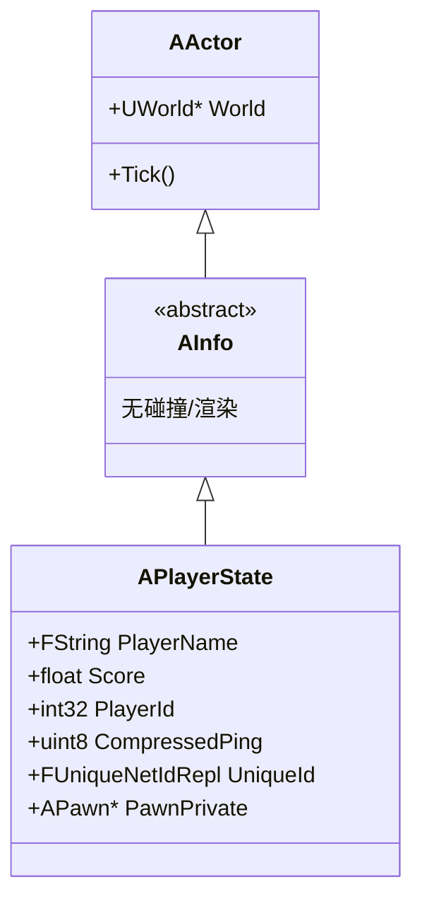
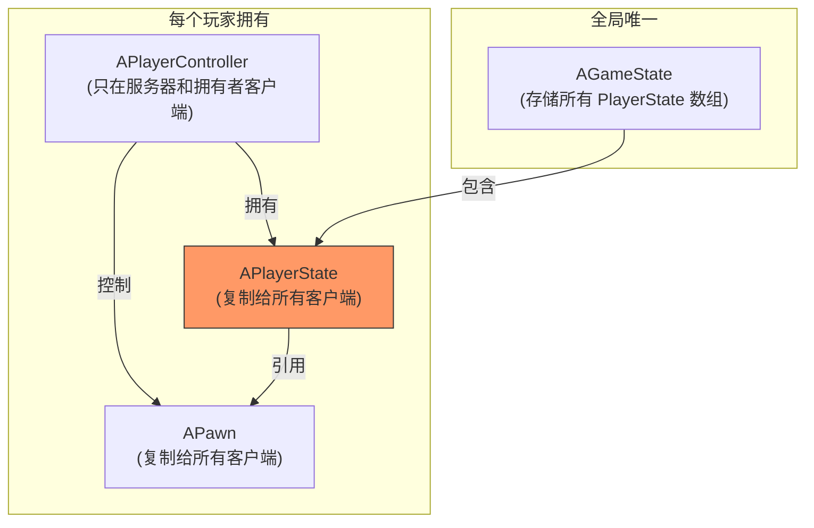
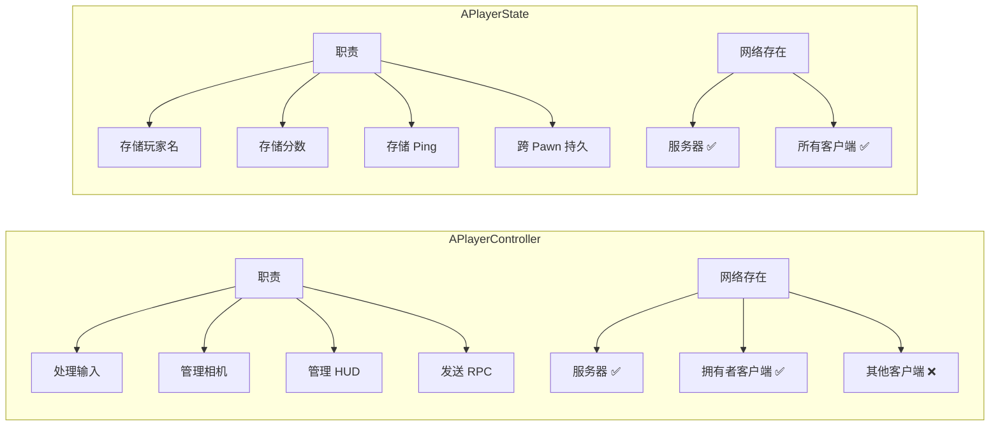
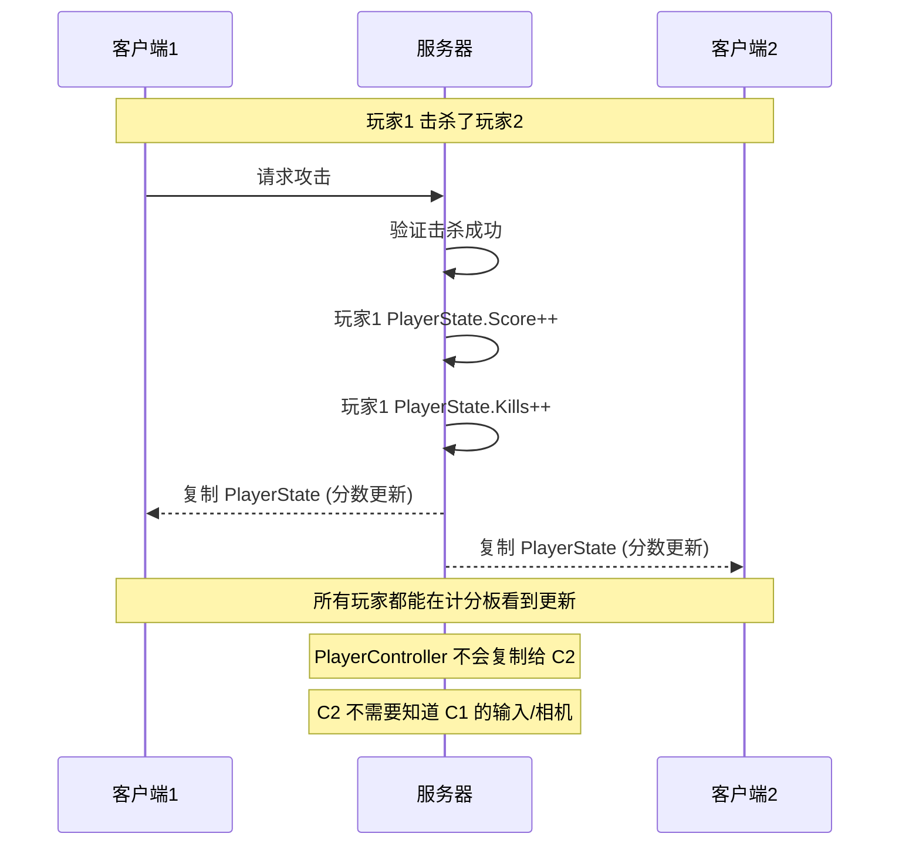
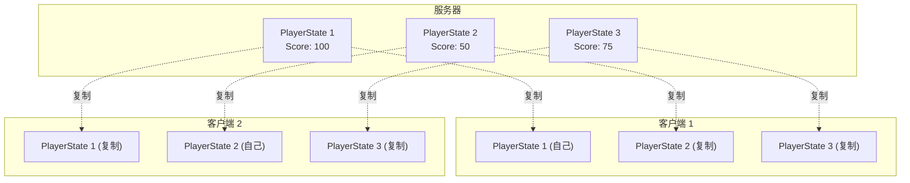
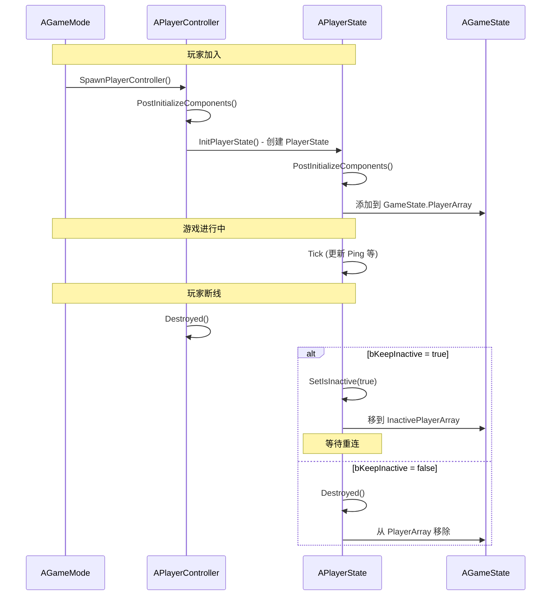

# APlayerState - 玩家状态

## 概述

`APlayerState` 是用于存储**玩家持久化数据**的类。它是 UE 网络游戏框架中的关键组件，特点是：

- **网络复制给所有客户端** - 每个玩家的 PlayerState 对所有客户端可见
- **跨 Pawn 持久存在** - 玩家死亡重生后，PlayerState 保持不变
- **存储公开信息** - 玩家名、分数、Ping、队伍等

```
源码位置：Engine/Source/Runtime/Engine/Classes/GameFramework/PlayerState.h
```

**核心定位**：存储所有玩家需要知道的、关于某个玩家的公开信息。

---

## 1. 类层级与关系

### 1.1 继承关系



### 1.2 与其他类的关系



---

## 2. 核心属性

### 2.1 玩家信息属性

```cpp
// 玩家名称（复制给所有客户端）
UPROPERTY(ReplicatedUsing = OnRep_PlayerName)
FString PlayerNamePrivate;

// 玩家分数
UPROPERTY(ReplicatedUsing=OnRep_Score)
float Score;

// 玩家唯一 ID（本局游戏内）
UPROPERTY(ReplicatedUsing=OnRep_PlayerId)
int32 PlayerId;

// 网络唯一 ID（跨局持久，Steam ID 等）
UPROPERTY(ReplicatedUsing=OnRep_UniqueId)
FUniqueNetIdRepl UniqueId;

// 压缩的 Ping 值（毫秒 / 4）
UPROPERTY(Replicated)
uint8 CompressedPing;

// 玩家加入游戏的时间
UPROPERTY(Replicated)
int32 StartTime;
```

### 2.2 状态标志

```cpp
// 是否是观战者
UPROPERTY(Replicated)
uint8 bIsSpectator:1;

// 是否只能观战（不能切换到游玩）
UPROPERTY(Replicated)
uint8 bOnlySpectator:1;

// 是否是 AI Bot
UPROPERTY(Replicated)
uint8 bIsABot:1;

// 是否处于非活跃状态（断线重连用）
UPROPERTY(ReplicatedUsing=OnRep_bIsInactive)
uint8 bIsInactive:1;

// 是否来自上一个关卡（Seamless Travel）
UPROPERTY(Replicated)
uint8 bFromPreviousLevel:1;
```

### 2.3 Pawn 引用

```cpp
// 当前控制的 Pawn（蓝图只读）
UPROPERTY(BlueprintReadOnly, Category=PlayerState)
TObjectPtr<APawn> PawnPrivate;

// 获取 Pawn
APawn* GetPawn() const { return PawnPrivate; }

// 模板版本，自动类型转换
template<class T>
T* GetPawn() const { return Cast<T>(PawnPrivate); }

// Pawn 设置时的广播
UPROPERTY(BlueprintAssignable, Category = "Events")
FOnPlayerStatePawnSet OnPawnSet;
```

---

## 3. PlayerState vs PlayerController

这是最容易混淆的概念，需要明确理解：

### 3.1 核心区别



### 3.2 对比表

| 特性 | APlayerController | APlayerState |
|-----|-------------------|--------------|
| **主要职责** | 输入处理、控制逻辑 | 存储公开的玩家数据 |
| **网络存在** | 服务器 + 拥有者 | 服务器 + 所有客户端 |
| **其他玩家能看到？** | ❌ 不能 | ✅ 能 |
| **Pawn 死亡后** | 继续存在 | 继续存在 |
| **换 Pawn 后** | 继续存在 | 继续存在 |
| **断线重连** | 重新创建 | 可以恢复（Inactive） |
| **典型存储内容** | 输入设置、相机偏好 | 分数、击杀数、队伍 |

### 3.3 为什么需要分开？



**设计理由**：
1. **隐私安全** - PlayerController 包含敏感信息（输入），不应暴露给其他玩家
2. **带宽优化** - 只复制必要的公开信息
3. **计分板需求** - 所有玩家需要看到其他玩家的分数、名字

---

## 4. 网络复制

### 4.1 复制架构



### 4.2 复制属性与回调

```cpp
// 复制属性定义
virtual void GetLifetimeReplicatedProps(TArray<FLifetimeProperty>& OutLifetimeProps) const override
{
    Super::GetLifetimeReplicatedProps(OutLifetimeProps);
    
    DOREPLIFETIME(APlayerState, Score);
    DOREPLIFETIME(APlayerState, PlayerId);
    DOREPLIFETIME(APlayerState, CompressedPing);
    DOREPLIFETIME(APlayerState, bIsSpectator);
    DOREPLIFETIME(APlayerState, bOnlySpectator);
    DOREPLIFETIME(APlayerState, bIsABot);
    DOREPLIFETIME(APlayerState, bIsInactive);
    DOREPLIFETIME(APlayerState, bFromPreviousLevel);
    DOREPLIFETIME(APlayerState, StartTime);
    DOREPLIFETIME(APlayerState, PlayerNamePrivate);
    DOREPLIFETIME(APlayerState, UniqueId);
}

// 复制回调（客户端收到新值时调用）
UFUNCTION()
virtual void OnRep_Score();

UFUNCTION()
virtual void OnRep_PlayerName();

UFUNCTION()
virtual void OnRep_PlayerId();

UFUNCTION()
virtual void OnRep_UniqueId();

UFUNCTION()
virtual void OnRep_bIsInactive();
```

### 4.3 自定义复制属性

```cpp
// MyPlayerState.h
UCLASS()
class AMyPlayerState : public APlayerState
{
    GENERATED_BODY()
    
public:
    // 击杀数
    UPROPERTY(ReplicatedUsing=OnRep_Kills)
    int32 Kills;
    
    // 死亡数
    UPROPERTY(Replicated)
    int32 Deaths;
    
    // 队伍 ID
    UPROPERTY(ReplicatedUsing=OnRep_TeamId)
    int32 TeamId;
    
    UFUNCTION()
    void OnRep_Kills();
    
    UFUNCTION()
    void OnRep_TeamId();
    
    virtual void GetLifetimeReplicatedProps(TArray<FLifetimeProperty>& OutLifetimeProps) const override;
};

// MyPlayerState.cpp
void AMyPlayerState::GetLifetimeReplicatedProps(TArray<FLifetimeProperty>& OutLifetimeProps) const
{
    Super::GetLifetimeReplicatedProps(OutLifetimeProps);
    
    DOREPLIFETIME(AMyPlayerState, Kills);
    DOREPLIFETIME(AMyPlayerState, Deaths);
    DOREPLIFETIME(AMyPlayerState, TeamId);
}

void AMyPlayerState::OnRep_Kills()
{
    // 更新 UI 显示
    if (AMyHUD* HUD = GetWorld()->GetFirstPlayerController()->GetHUD<AMyHUD>())
    {
        HUD->UpdateKillDisplay(Kills);
    }
}
```

---

## 5. 生命周期

### 5.1 创建与销毁流程



### 5.2 断线重连机制

```cpp
// GameMode 中配置
UPROPERTY(EditAnywhere, Category=GameMode)
uint32 bHandleDisconnect:1;  // 是否处理断线

// PlayerState 断线时
virtual void OnDeactivated()
{
    // 默认行为：销毁自己
    // 可以重写为保存状态
}

// PlayerState 重连时
virtual void OnReactivated()
{
    // 恢复玩家状态
}

// 复制属性到新 PlayerState（重连时）
virtual void OverrideWith(APlayerState* PlayerState)
{
    // 从旧的 PlayerState 复制属性
    SetScore(PlayerState->GetScore());
    SetPlayerId(PlayerState->GetPlayerId());
    // ... 复制其他需要保留的属性
}

// 蓝图扩展点
UFUNCTION(BlueprintImplementableEvent, meta = (DisplayName = "OverrideWith"))
void ReceiveOverrideWith(APlayerState* OldPlayerState);
```

---

## 6. Seamless Travel（无缝关卡切换）

### 6.1 旅行时的数据持久化

```cpp
// 无缝旅行时，将数据复制到新 PlayerState
virtual void SeamlessTravelTo(class APlayerState* NewPlayerState)
{
    // 调用 CopyProperties 复制属性
    DispatchCopyProperties(NewPlayerState);
}

// 具体复制逻辑
virtual void CopyProperties(APlayerState* PlayerState)
{
    PlayerState->SetScore(GetScore());
    PlayerState->SetPlayerId(GetPlayerId());
    PlayerState->SetUniqueId(GetUniqueId());
    PlayerState->SetPlayerName(GetPlayerName());
    // ... 复制其他属性
}

// 蓝图扩展点
UFUNCTION(BlueprintImplementableEvent, meta = (DisplayName = "CopyProperties"))
void ReceiveCopyProperties(APlayerState* NewPlayerState);
```

### 6.2 使用示例

```cpp
// MyPlayerState.cpp
void AMyPlayerState::CopyProperties(APlayerState* PlayerState)
{
    Super::CopyProperties(PlayerState);
    
    if (AMyPlayerState* MyNewPS = Cast<AMyPlayerState>(PlayerState))
    {
        // 复制自定义属性到新 PlayerState
        MyNewPS->Kills = Kills;
        MyNewPS->Deaths = Deaths;
        MyNewPS->TeamId = TeamId;
        MyNewPS->UnlockedWeapons = UnlockedWeapons;
    }
}
```

---

## 7. 常用 API

### 7.1 基本操作

```cpp
// 获取/设置分数
float GetScore() const;
void SetScore(float NewScore);

// 获取/设置玩家名
FString GetPlayerName() const;
void SetPlayerName(const FString& S);

// 获取玩家 ID
int32 GetPlayerId() const;

// 获取网络唯一 ID（Steam ID 等）
const FUniqueNetIdRepl& GetUniqueId() const;

// 获取 Ping（毫秒）
float GetPingInMilliseconds() const;

// 获取当前 Pawn
APawn* GetPawn() const;
template<class T> T* GetPawn() const;

// 获取 PlayerController（只在服务器或本地有效）
APlayerController* GetPlayerController() const;

// 获取 Controller（包括 AIController）
AController* GetOwningController() const;
```

### 7.2 状态检查

```cpp
// 是否是观战者
bool IsSpectator() const;
void SetIsSpectator(bool bNewSpectator);

// 是否只能观战
bool IsOnlyASpectator() const;
void SetIsOnlyASpectator(bool bNewSpectator);

// 是否是 AI Bot
bool IsABot() const;
void SetIsABot(bool bNewIsABot);

// 是否处于非活跃状态（断线）
bool IsInactive() const;
void SetIsInactive(bool bNewInactive);
```

---

## 8. 实用代码示例

### 8.1 自定义 PlayerState

```cpp
// MyPlayerState.h
UCLASS()
class MYGAME_API AMyPlayerState : public APlayerState
{
    GENERATED_BODY()
    
public:
    AMyPlayerState();
    
    // 击杀统计
    UPROPERTY(ReplicatedUsing=OnRep_Stats, BlueprintReadOnly)
    int32 Kills = 0;
    
    UPROPERTY(Replicated, BlueprintReadOnly)
    int32 Deaths = 0;
    
    UPROPERTY(Replicated, BlueprintReadOnly)
    int32 Assists = 0;
    
    // 队伍
    UPROPERTY(ReplicatedUsing=OnRep_TeamId, BlueprintReadOnly)
    int32 TeamId = 0;
    
    // 计算 KD 比
    UFUNCTION(BlueprintCallable)
    float GetKDRatio() const
    {
        return Deaths > 0 ? (float)Kills / (float)Deaths : (float)Kills;
    }
    
    // 增加击杀
    UFUNCTION(BlueprintCallable, Server, Reliable)
    void ServerAddKill();
    
protected:
    UFUNCTION()
    void OnRep_Stats();
    
    UFUNCTION()
    void OnRep_TeamId();
    
    virtual void GetLifetimeReplicatedProps(TArray<FLifetimeProperty>& OutLifetimeProps) const override;
    virtual void CopyProperties(APlayerState* PlayerState) override;
};

// MyPlayerState.cpp
AMyPlayerState::AMyPlayerState()
{
    // 设置网络属性
    bReplicates = true;
    bAlwaysRelevant = true;
}

void AMyPlayerState::GetLifetimeReplicatedProps(TArray<FLifetimeProperty>& OutLifetimeProps) const
{
    Super::GetLifetimeReplicatedProps(OutLifetimeProps);
    
    DOREPLIFETIME(AMyPlayerState, Kills);
    DOREPLIFETIME(AMyPlayerState, Deaths);
    DOREPLIFETIME(AMyPlayerState, Assists);
    DOREPLIFETIME(AMyPlayerState, TeamId);
}

void AMyPlayerState::ServerAddKill_Implementation()
{
    Kills++;
    SetScore(GetScore() + 100.0f);  // 击杀加 100 分
}

void AMyPlayerState::OnRep_Stats()
{
    // 通知 UI 更新
    OnStatsChanged.Broadcast(this);
}

void AMyPlayerState::OnRep_TeamId()
{
    // 更新队伍颜色等
    OnTeamChanged.Broadcast(this, TeamId);
}

void AMyPlayerState::CopyProperties(APlayerState* PlayerState)
{
    Super::CopyProperties(PlayerState);
    
    if (AMyPlayerState* MyPS = Cast<AMyPlayerState>(PlayerState))
    {
        MyPS->Kills = Kills;
        MyPS->Deaths = Deaths;
        MyPS->Assists = Assists;
        MyPS->TeamId = TeamId;
    }
}
```

### 8.2 在 GameMode 中配置

```cpp
// MyGameMode.cpp
AMyGameMode::AMyGameMode()
{
    // 使用自定义 PlayerState
    PlayerStateClass = AMyPlayerState::StaticClass();
}
```

### 8.3 从任何地方获取 PlayerState

```cpp
// 从 Pawn 获取
if (APawn* Pawn = GetPawn())
{
    if (AMyPlayerState* PS = Pawn->GetPlayerState<AMyPlayerState>())
    {
        int32 Score = PS->GetScore();
    }
}

// 从 Controller 获取
if (APlayerController* PC = GetWorld()->GetFirstPlayerController())
{
    if (AMyPlayerState* PS = PC->GetPlayerState<AMyPlayerState>())
    {
        PS->ServerAddKill();
    }
}

// 从 GameState 获取所有 PlayerState
if (AGameStateBase* GS = GetWorld()->GetGameState())
{
    for (APlayerState* PS : GS->PlayerArray)
    {
        UE_LOG(LogGame, Log, TEXT("Player: %s, Score: %.0f"), 
            *PS->GetPlayerName(), PS->GetScore());
    }
}
```

---

## 9. 常见问题

### Q1: PlayerState 存储在哪里比较合适？
| 数据类型 | 存储位置 | 原因 |
|---------|---------|-----|
| 玩家名、分数 | PlayerState | 所有玩家需要看到 |
| 输入设置 | PlayerController | 私有数据 |
| 背包物品 | PlayerState 或专用组件 | 取决于是否需要让其他玩家看到 |
| 相机偏好 | PlayerController | 纯本地数据 |
| 皮肤/外观 | PlayerState | 其他玩家需要看到 |

### Q2: 为什么 AIController 也可以有 PlayerState？
设置 `bWantsPlayerState = true` 后，AI 也可以有 PlayerState。用于：
- AI 需要出现在计分板上
- AI 有击杀/死亡统计
- AI 属于某个队伍

### Q3: PlayerState 和 SaveGame 有什么关系？
| 系统 | 作用域 | 持久性 |
|-----|-------|-------|
| PlayerState | 当前游戏会话 | 断线可恢复，退出游戏丢失 |
| SaveGame | 跨会话 | 保存到磁盘，永久存储 |

---

## 10. 总结

| 要点 | 说明 |
|-----|------|
| **本质** | 玩家的"公开名片" |
| **复制范围** | 服务器 → 所有客户端 |
| **生命周期** | 跨 Pawn 存在，可跨关卡 |
| **典型存储** | 分数、名字、Ping、队伍、击杀数 |
| **vs PlayerController** | PC 是私有控制，PS 是公开数据 |
| **断线处理** | 可设为 Inactive 等待重连 |

---

> 相关文档：
> - [APlayerController](./APlayerController.md) - 玩家控制器
> - [AGameStateBase](./AGameStateBase.md) - 游戏状态（存储所有 PlayerState）
> - [AGameModeBase](./AGameModeBase.md) - 游戏模式（配置 PlayerState 类）
> - [AController](./AController.md) - 控制器基类