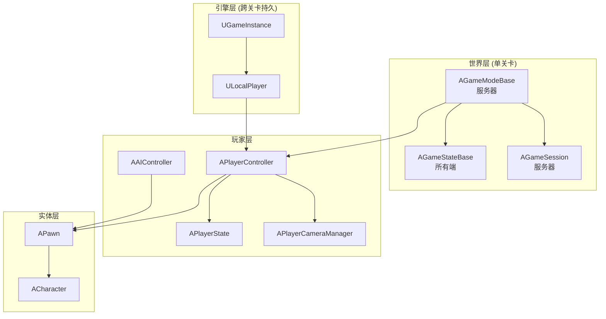
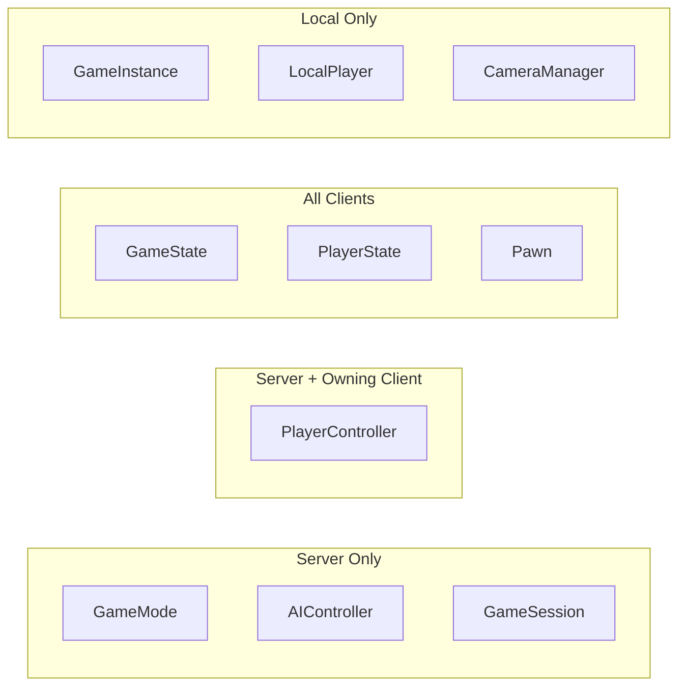
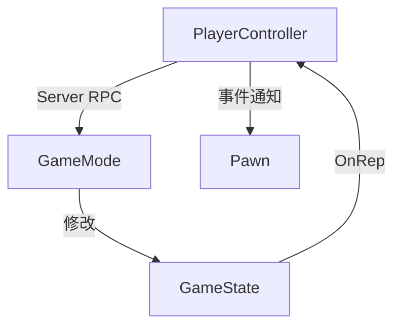

# UE 游戏框架核心类索引

本目录包含 Unreal Engine 游戏框架核心类的详细文档。

---

## 📁 类列表

### 🎮 游戏框架核心

| 类名 | 说明 | 网络 |
|-----|------|------|
| [AController](./AController.md) | 控制器基类 | Server + Owning Client |
| [APlayerController](./APlayerController.md) | 玩家控制器 | Server + Owning Client |
| [AAIController](./AAIController.md) | AI 控制器 | Server Only |
| [APlayerState](./APlayerState.md) | 玩家状态 | All Clients |
| [AGameStateBase](./AGameStateBase.md) | 游戏状态 | All Clients |
| [UGameInstance](./UGameInstance.md) | 游戏实例 | Local Only |
| [AGameModeBase](./AGameModeBase.md) | 游戏模式 | Server Only |
| [AGameSession](./AGameSession.md) | 游戏会话 | Server Only |
| [ULocalPlayer](./ULocalPlayer.md) | 本地玩家 | Local Only |
| [APawn](./APawn.md) | 可控实体 | Replicated |
| [ACharacter](./ACharacter.md) | 角色 | Replicated |
| [APlayerCameraManager](./APlayerCameraManager.md) | 相机管理器 | Local Only |
| [AHUD](./AHUD.md) | 抬头显示器 | Local Only |

### ⚔️ GAS 技能系统

| 类名 | 说明 |
|-----|------|
| [UAbilitySystemComponent](./UAbilitySystemComponent.md) | 技能系统组件 |
| [UGameplayAbility](./UGameplayAbility.md) | 游戏技能 |
| [UGameplayEffect](./UGameplayEffect.md) | 游戏效果 |
| [UAttributeSet](./UAttributeSet.md) | 属性集 |
| [UAbilityTask](./UAbilityTask.md) | 技能任务 |

### 🎹 增强输入系统

| 类名 | 说明 |
|-----|------|
| [UEnhancedInputComponent](./UEnhancedInputComponent.md) | 增强输入组件 |
| [UInputAction](./UInputAction.md) | 输入动作 |
| [UInputMappingContext](./UInputMappingContext.md) | 输入映射上下文 |

### 🤖 AI 系统

| 类名 | 说明 |
|-----|------|
| [UBehaviorTree](./UBehaviorTree.md) | 行为树 |
| [UBlackboardComponent](./UBlackboardComponent.md) | 黑板组件 |

### 🎬 动画系统

| 类名 | 说明 |
|-----|------|
| [UAnimInstance](./UAnimInstance.md) | 动画实例 |

---

## 架构总览



---

## 网络存在对比



---

## 生命周期对比

| 类 | 创建时机 | 销毁时机 | 持久性 |
|---|---------|---------|-------|
| UGameInstance | 游戏启动 | 游戏退出 | ⭐⭐⭐ |
| ULocalPlayer | 玩家加入 | 玩家退出/游戏退出 | ⭐⭐⭐ |
| AGameModeBase | 关卡加载 | 关卡卸载 | ⭐ |
| AGameStateBase | 关卡加载 | 关卡卸载 | ⭐ |
| APlayerController | Login | Logout/关卡卸载 | ⭐⭐ |
| APlayerState | Login | Logout | ⭐⭐ |
| APawn | Spawn | Destroy | ⭐ |

---

## 职责划分

| 类 | 核心职责 | 不应该做的事 |
|---|---------|-------------|
| **GameInstance** | 全局数据、子系统、关卡切换 | 游戏规则、网络同步 |
| **GameMode** | 游戏规则、玩家登录、Pawn 生成 | 存储玩家数据、客户端逻辑 |
| **GameState** | 全局游戏状态、服务器时间 | 玩家特定数据 |
| **PlayerController** | 输入处理、相机、UI | 持久数据存储 |
| **PlayerState** | 玩家持久数据、分数 | 输入处理、本地 UI |
| **Pawn** | 物理表现、移动 | 输入路由（应由 PC 处理） |

---

## 常见问题

### Q1: 数据应该放在哪个类？

| 数据类型 | 推荐存放 |
|---------|---------|
| 玩家设置（音量、键位） | GameInstance |
| 玩家分数 | PlayerState |
| 比赛时间 | GameState |
| 角色血量 | Pawn / PlayerState |
| 当前武器 | Pawn |
| 总击杀数（跨比赛） | GameInstance |

### Q2: 如何从任意位置获取这些类？

```cpp
// GameInstance
UGameInstance* GI = GetGameInstance();

// GameMode（仅服务器）
AGameModeBase* GM = GetWorld()->GetAuthGameMode();

// GameState
AGameStateBase* GS = GetWorld()->GetGameState<AGameStateBase>();

// PlayerController（本地）
APlayerController* PC = GetWorld()->GetFirstPlayerController();

// PlayerState
APlayerState* PS = PC->GetPlayerState<APlayerState>();

// Pawn
APawn* Pawn = PC->GetPawn();
```

### Q3: 类之间如何通信？



---

## 学习顺序建议

1. **APawn / ACharacter** - 理解"身体"
2. **AController / APlayerController** - 理解"控制"
3. **APlayerState** - 理解"玩家数据"
4. **AGameStateBase / AGameModeBase** - 理解"游戏规则"
5. **UGameInstance / ULocalPlayer** - 理解"持久层"

---

> 返回上级：[UE 框架文档](../README.md)