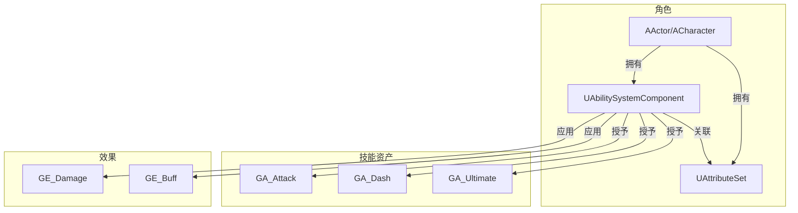
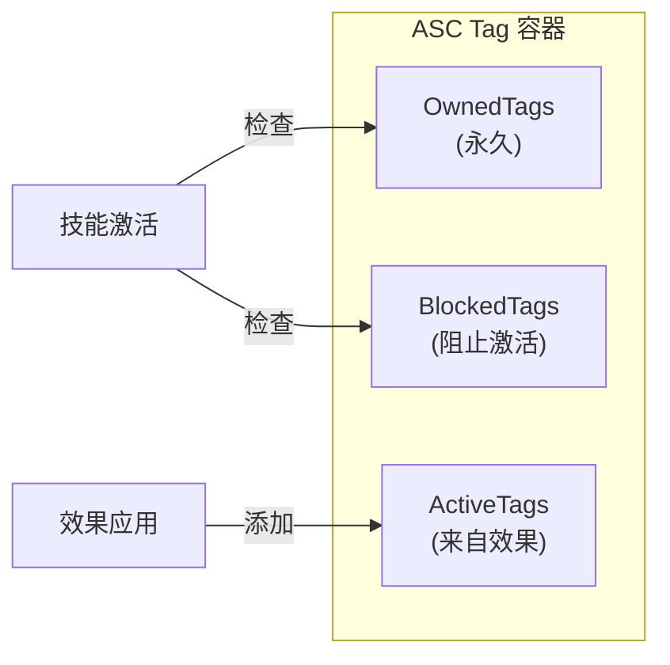
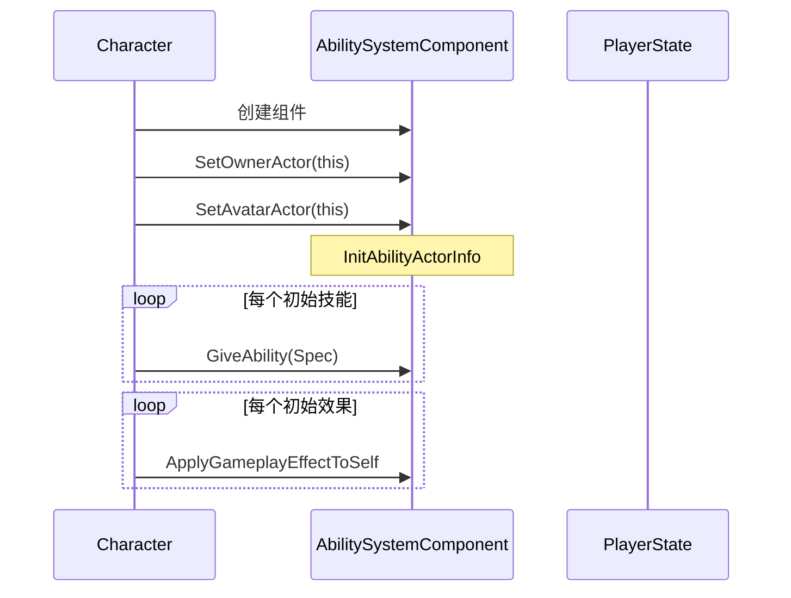

# UAbilitySystemComponent - 技能系统组件

## 概述

`UAbilitySystemComponent` (ASC) 是 GAS 的核心管理器，负责管理角色的所有技能和效果。

- **技能管理** - 授予、激活、移除技能
- **效果管理** - 应用、移除 GameplayEffect
- **属性管理** - 关联 AttributeSet
- **Tag 管理** - 维护当前 GameplayTag 状态

```
源码位置：Engine/Plugins/Runtime/GameplayAbilities/Source/GameplayAbilities/Public/AbilitySystemComponent.h
```

**核心定位**：角色技能系统的"大脑"。

---

## 1. 架构位置



---

## 2. 核心功能

### 2.1 授予技能

```cpp
// 授予技能（返回句柄）
FGameplayAbilitySpecHandle GiveAbility(const FGameplayAbilitySpec& AbilitySpec);

// 便捷授予
FGameplayAbilitySpecHandle GiveAbility(TSubclassOf<UGameplayAbility> AbilityClass);

// 移除技能
void ClearAbility(const FGameplayAbilitySpecHandle& Handle);

// 移除所有技能
void ClearAllAbilities();

// 示例
void AMyCharacter::SetupAbilities()
{
    if (AbilitySystemComponent)
    {
        // 授予技能
        FGameplayAbilitySpec Spec(AttackAbilityClass, 1, INDEX_NONE, this);
        AbilitySystemComponent->GiveAbility(Spec);
    }
}
```

### 2.2 激活技能

```cpp
// 通过类激活
bool TryActivateAbilityByClass(TSubclassOf<UGameplayAbility> AbilityClass, bool bAllowRemoteActivation = true);

// 通过句柄激活
bool TryActivateAbility(FGameplayAbilitySpecHandle Handle, bool bAllowRemoteActivation = true);

// 通过 Tag 激活
bool TryActivateAbilitiesByTag(const FGameplayTagContainer& Tags, bool bAllowRemoteActivation = true);

// 通过事件激活
void HandleGameplayEvent(FGameplayTag EventTag, const FGameplayEventData* Payload);

// 取消技能
void CancelAbility(UGameplayAbility* Ability);
void CancelAbilityHandle(const FGameplayAbilitySpecHandle& Handle);
void CancelAbilities(const FGameplayTagContainer* WithTags = nullptr, const FGameplayTagContainer* WithoutTags = nullptr);
```

### 2.3 应用效果

```cpp
// 应用效果（返回句柄）
FActiveGameplayEffectHandle ApplyGameplayEffectToSelf(
    const UGameplayEffect* GameplayEffect,
    float Level,
    FGameplayEffectContextHandle Context
);

// 应用效果到目标
FActiveGameplayEffectHandle ApplyGameplayEffectToTarget(
    const UGameplayEffect* GameplayEffect,
    UAbilitySystemComponent* Target,
    float Level = 1.f
);

// 通过类应用
FActiveGameplayEffectHandle ApplyGameplayEffectSpecToSelf(const FGameplayEffectSpec& Spec);

// 移除效果
bool RemoveActiveGameplayEffect(FActiveGameplayEffectHandle Handle, int32 StacksToRemove = -1);

// 移除所有效果
void RemoveActiveGameplayEffectBySourceEffect(TSubclassOf<UGameplayEffect> GameplayEffect, UAbilitySystemComponent* InstigatorASC);
```

---

## 3. Tag 系统



```cpp
// 添加/移除 Tag
void AddLooseGameplayTag(const FGameplayTag& Tag);
void RemoveLooseGameplayTag(const FGameplayTag& Tag);

// 检查 Tag
bool HasMatchingGameplayTag(FGameplayTag Tag) const;
bool HasAllMatchingGameplayTags(const FGameplayTagContainer& Tags) const;
bool HasAnyMatchingGameplayTags(const FGameplayTagContainer& Tags) const;

// Tag 变化回调
FOnGameplayTagCountChanged& RegisterGameplayTagEvent(FGameplayTag Tag, EGameplayTagEventType::Type EventType);
```

---

## 4. 属性系统

```cpp
// 获取属性集
const UAttributeSet* GetAttributeSet(TSubclassOf<UAttributeSet> AttributeClass) const;

// 获取属性值
float GetNumericAttribute(const FGameplayAttribute& Attribute) const;

// 设置属性值
void SetNumericAttributeBase(const FGameplayAttribute& Attribute, float NewValue);

// 属性变化回调
FOnGameplayAttributeValueChange& GetGameplayAttributeValueChangeDelegate(FGameplayAttribute Attribute);
```

---

## 5. 设置 ASC

### 5.1 在 Character 中添加

```cpp
// MyCharacter.h
UCLASS()
class AMyCharacter : public ACharacter, public IAbilitySystemInterface
{
    GENERATED_BODY()
    
public:
    // IAbilitySystemInterface
    virtual UAbilitySystemComponent* GetAbilitySystemComponent() const override;
    
protected:
    UPROPERTY(VisibleAnywhere, BlueprintReadOnly)
    TObjectPtr<UAbilitySystemComponent> AbilitySystemComponent;
    
    UPROPERTY(VisibleAnywhere, BlueprintReadOnly)
    TObjectPtr<UMyAttributeSet> AttributeSet;
};

// MyCharacter.cpp
AMyCharacter::AMyCharacter()
{
    AbilitySystemComponent = CreateDefaultSubobject<UAbilitySystemComponent>(TEXT("ASC"));
    AbilitySystemComponent->SetIsReplicated(true);
    AbilitySystemComponent->SetReplicationMode(EGameplayEffectReplicationMode::Minimal);
    
    AttributeSet = CreateDefaultSubobject<UMyAttributeSet>(TEXT("AttributeSet"));
}

UAbilitySystemComponent* AMyCharacter::GetAbilitySystemComponent() const
{
    return AbilitySystemComponent;
}
```

### 5.2 复制模式

```cpp
// 复制模式
enum class EGameplayEffectReplicationMode : uint8
{
    Minimal,  // 仅复制给所有者（推荐多人游戏）
    Mixed,    // 效果复制给所有者，Tag 复制给所有人
    Full      // 完全复制（适合单机或特殊需求）
};
```

---

## 6. 初始化流程



```cpp
void AMyCharacter::PossessedBy(AController* NewController)
{
    Super::PossessedBy(NewController);
    
    if (AbilitySystemComponent)
    {
        AbilitySystemComponent->InitAbilityActorInfo(this, this);
        InitializeAbilities();
        InitializeAttributes();
    }
}

void AMyCharacter::InitializeAbilities()
{
    for (TSubclassOf<UGameplayAbility>& Ability : DefaultAbilities)
    {
        AbilitySystemComponent->GiveAbility(
            FGameplayAbilitySpec(Ability, 1, INDEX_NONE, this)
        );
    }
}

void AMyCharacter::InitializeAttributes()
{
    if (DefaultAttributeEffect)
    {
        FGameplayEffectContextHandle Context = AbilitySystemComponent->MakeEffectContext();
        Context.AddSourceObject(this);
        
        FGameplayEffectSpecHandle Spec = AbilitySystemComponent->MakeOutgoingSpec(
            DefaultAttributeEffect, 1, Context
        );
        
        AbilitySystemComponent->ApplyGameplayEffectSpecToSelf(*Spec.Data.Get());
    }
}
```

---

## 7. 总结

| 要点 | 说明 |
|-----|------|
| **本质** | 技能系统的管理中心 |
| **职责** | 管理技能、效果、属性、Tag |
| **接口** | IAbilitySystemInterface |
| **网络** | 支持复制模式配置 |
| **初始化** | InitAbilityActorInfo |

---

> 相关文档：
> - [UGameplayAbility](./UGameplayAbility.md) - 游戏技能
> - [UGameplayEffect](./UGameplayEffect.md) - 游戏效果
> - [UAttributeSet](./UAttributeSet.md) - 属性集