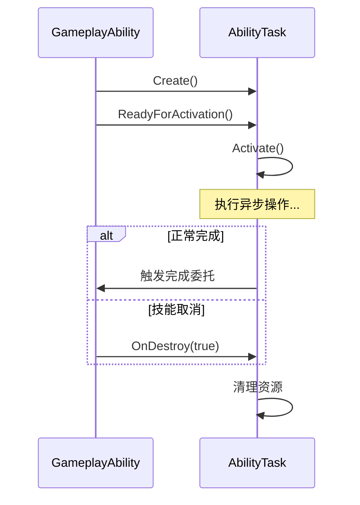

# UAbilityTask - 技能任务

## 概述

`UAbilityTask` 是技能中执行异步操作的工具类。

- **异步执行** - 等待动画、事件、时间
- **生命周期绑定** - 随技能结束自动清理
- **蓝图友好** - 可在蓝图中使用

```
源码位置：Engine/Plugins/Runtime/GameplayAbilities/Source/GameplayAbilities/Public/Abilities/Tasks/AbilityTask.h
```

**核心定位**：技能中的"异步节点"。

---

## 1. 常用内置任务

| 任务类 | 功能 |
|-------|------|
| `UAbilityTask_PlayMontageAndWait` | 播放蒙太奇并等待 |
| `UAbilityTask_WaitGameplayEvent` | 等待游戏事件 |
| `UAbilityTask_WaitInputPress` | 等待输入按下 |
| `UAbilityTask_WaitInputRelease` | 等待输入释放 |
| `UAbilityTask_WaitTargetData` | 等待目标数据 |
| `UAbilityTask_WaitDelay` | 等待延迟 |
| `UAbilityTask_WaitMovementModeChange` | 等待移动模式改变 |
| `UAbilityTask_ApplyRootMotionConstantForce` | 应用根骨骼运动 |

---

## 2. 使用方式

```cpp
void UGA_Attack::ActivateAbility(...)
{
    // 创建任务
    UAbilityTask_PlayMontageAndWait* MontageTask = 
        UAbilityTask_PlayMontageAndWait::CreatePlayMontageAndWaitProxy(
            this,                    // 所属技能
            NAME_None,               // 任务名称
            AttackMontage,           // 蒙太奇
            1.0f,                    // 播放速率
            NAME_None                // 起始段落
        );
    
    // 绑定回调
    MontageTask->OnCompleted.AddDynamic(this, &UGA_Attack::OnMontageCompleted);
    MontageTask->OnBlendOut.AddDynamic(this, &UGA_Attack::OnMontageBlendOut);
    MontageTask->OnInterrupted.AddDynamic(this, &UGA_Attack::OnMontageCancelled);
    MontageTask->OnCancelled.AddDynamic(this, &UGA_Attack::OnMontageCancelled);
    
    // 激活任务
    MontageTask->ReadyForActivation();
}
```

---

## 3. 自定义任务

```cpp
// AbilityTask_WaitForDamage.h
UCLASS()
class UAbilityTask_WaitForDamage : public UAbilityTask
{
    GENERATED_BODY()
    
public:
    // 创建任务的静态方法
    UFUNCTION(BlueprintCallable, Category="Ability|Tasks",
        meta=(HidePin="OwningAbility", DefaultToSelf="OwningAbility"))
    static UAbilityTask_WaitForDamage* WaitForDamage(
        UGameplayAbility* OwningAbility,
        float MinDamage
    );
    
    // 委托
    UPROPERTY(BlueprintAssignable)
    FOnDamageReceivedDelegate OnDamageReceived;
    
protected:
    virtual void Activate() override;
    virtual void OnDestroy(bool bInOwnerFinished) override;
    
    UFUNCTION()
    void OnDamageEvent(float Damage);
    
private:
    float MinDamageThreshold;
    FDelegateHandle DelegateHandle;
};

// AbilityTask_WaitForDamage.cpp
UAbilityTask_WaitForDamage* UAbilityTask_WaitForDamage::WaitForDamage(
    UGameplayAbility* OwningAbility, float MinDamage)
{
    UAbilityTask_WaitForDamage* Task = NewAbilityTask<UAbilityTask_WaitForDamage>(OwningAbility);
    Task->MinDamageThreshold = MinDamage;
    return Task;
}

void UAbilityTask_WaitForDamage::Activate()
{
    if (UAbilitySystemComponent* ASC = AbilitySystemComponent.Get())
    {
        // 注册伤害事件监听
        DelegateHandle = ASC->GetGameplayAttributeValueChangeDelegate(
            UMyAttributeSet::GetHealthAttribute()
        ).AddUObject(this, &UAbilityTask_WaitForDamage::OnDamageEvent);
    }
}

void UAbilityTask_WaitForDamage::OnDestroy(bool bInOwnerFinished)
{
    // 清理委托
    if (UAbilitySystemComponent* ASC = AbilitySystemComponent.Get())
    {
        ASC->GetGameplayAttributeValueChangeDelegate(
            UMyAttributeSet::GetHealthAttribute()
        ).Remove(DelegateHandle);
    }
    
    Super::OnDestroy(bInOwnerFinished);
}

void UAbilityTask_WaitForDamage::OnDamageEvent(float Damage)
{
    if (Damage >= MinDamageThreshold)
    {
        OnDamageReceived.Broadcast(Damage);
    }
}
```

---

## 4. 任务生命周期



---

## 5. 总结

| 要点 | 说明 |
|-----|------|
| **本质** | 技能中的异步操作 |
| **创建** | 静态工厂方法 |
| **激活** | ReadyForActivation() |
| **清理** | 自动随技能结束 |

---

> 相关文档：
> - [UGameplayAbility](./UGameplayAbility.md) - 游戏技能
> - [UAbilitySystemComponent](./UAbilitySystemComponent.md) - 技能系统组件