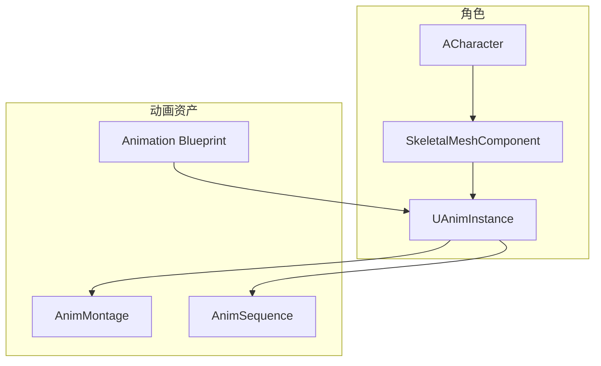

# UAnimInstance - 动画实例

## 概述

`UAnimInstance` 是动画蓝图的 C++ 基类，控制骨骼动画。

- **动画状态机** - 管理动画状态转换
- **变量驱动** - 通过变量控制动画
- **蒙太奇** - 播放动画蒙太奇
- **通知** - 处理动画通知

```
源码位置：Engine/Source/Runtime/Engine/Classes/Animation/AnimInstance.h
```

**核心定位**：角色动画的"控制器"。

---

## 1. 架构位置



---

## 2. 核心函数

```cpp
// 每帧更新（用于更新变量）
virtual void NativeUpdateAnimation(float DeltaSeconds);

// 初始化
virtual void NativeInitializeAnimation();

// 蓝图版本
UFUNCTION(BlueprintImplementableEvent)
void BlueprintUpdateAnimation(float DeltaSeconds);
```

---

## 3. 自定义动画实例

```cpp
// MyAnimInstance.h
UCLASS()
class UMyAnimInstance : public UAnimInstance
{
    GENERATED_BODY()
    
public:
    virtual void NativeInitializeAnimation() override;
    virtual void NativeUpdateAnimation(float DeltaSeconds) override;
    
    // 动画变量
    UPROPERTY(BlueprintReadOnly, Category="Movement")
    float Speed;
    
    UPROPERTY(BlueprintReadOnly, Category="Movement")
    bool bIsInAir;
    
    UPROPERTY(BlueprintReadOnly, Category="Movement")
    bool bIsCrouching;
    
    UPROPERTY(BlueprintReadOnly, Category="Combat")
    bool bIsAttacking;
    
protected:
    UPROPERTY()
    TObjectPtr<ACharacter> OwningCharacter;
    
    UPROPERTY()
    TObjectPtr<UCharacterMovementComponent> MovementComponent;
};

// MyAnimInstance.cpp
void UMyAnimInstance::NativeInitializeAnimation()
{
    Super::NativeInitializeAnimation();
    
    OwningCharacter = Cast<ACharacter>(TryGetPawnOwner());
    if (OwningCharacter)
    {
        MovementComponent = OwningCharacter->GetCharacterMovement();
    }
}

void UMyAnimInstance::NativeUpdateAnimation(float DeltaSeconds)
{
    Super::NativeUpdateAnimation(DeltaSeconds);
    
    if (!OwningCharacter || !MovementComponent) return;
    
    // 更新速度
    FVector Velocity = OwningCharacter->GetVelocity();
    Speed = Velocity.Size2D();
    
    // 更新状态
    bIsInAir = MovementComponent->IsFalling();
    bIsCrouching = MovementComponent->IsCrouching();
}
```

---

## 4. 蒙太奇操作

```cpp
// 播放蒙太奇
float Montage_Play(UAnimMontage* MontageToPlay, float InPlayRate = 1.f);

// 停止蒙太奇
void Montage_Stop(float InBlendOutTime, const UAnimMontage* Montage = nullptr);

// 暂停/恢复
void Montage_Pause(const UAnimMontage* Montage = nullptr);
void Montage_Resume(const UAnimMontage* Montage = nullptr);

// 跳转到段落
void Montage_JumpToSection(FName SectionName, const UAnimMontage* Montage = nullptr);

// 检查是否正在播放
bool Montage_IsPlaying(const UAnimMontage* Montage) const;

// 获取当前蒙太奇
UAnimMontage* GetCurrentActiveMontage() const;
```

---

## 5. 动画通知

```cpp
// 在动画蓝图中处理通知
UCLASS()
class UMyAnimInstance : public UAnimInstance
{
    // ...
    
    // 处理通知
    UFUNCTION()
    void AnimNotify_Attack();
    
    UFUNCTION()
    void AnimNotify_FootStep();
    
    // 处理通知状态
    UFUNCTION()
    void AnimNotifyState_Combo_Begin(UAnimNotifyState* Notify);
    
    UFUNCTION()
    void AnimNotifyState_Combo_End(UAnimNotifyState* Notify);
};

void UMyAnimInstance::AnimNotify_Attack()
{
    if (OwningCharacter)
    {
        // 触发攻击判定
        if (IAttackInterface* Attacker = Cast<IAttackInterface>(OwningCharacter))
        {
            Attacker->PerformAttackHitCheck();
        }
    }
}
```

---

## 6. 获取动画实例

```cpp
// 从角色获取
UAnimInstance* AnimInstance = Character->GetMesh()->GetAnimInstance();

// 转换为自定义类型
UMyAnimInstance* MyAnimInstance = Cast<UMyAnimInstance>(AnimInstance);

// 播放蒙太奇
if (MyAnimInstance)
{
    MyAnimInstance->Montage_Play(AttackMontage);
}
```

---

## 7. 总结

| 要点 | 说明 |
|-----|------|
| **本质** | 动画蓝图的基类 |
| **更新** | NativeUpdateAnimation |
| **蒙太奇** | Montage_Play/Stop |
| **通知** | AnimNotify_XXX |

---

> 相关文档：
> - [ACharacter](./ACharacter.md) - 角色
> - [APawn](./APawn.md) - Pawn