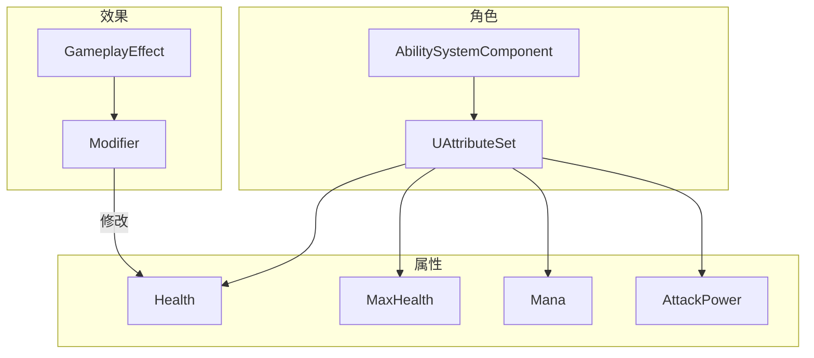
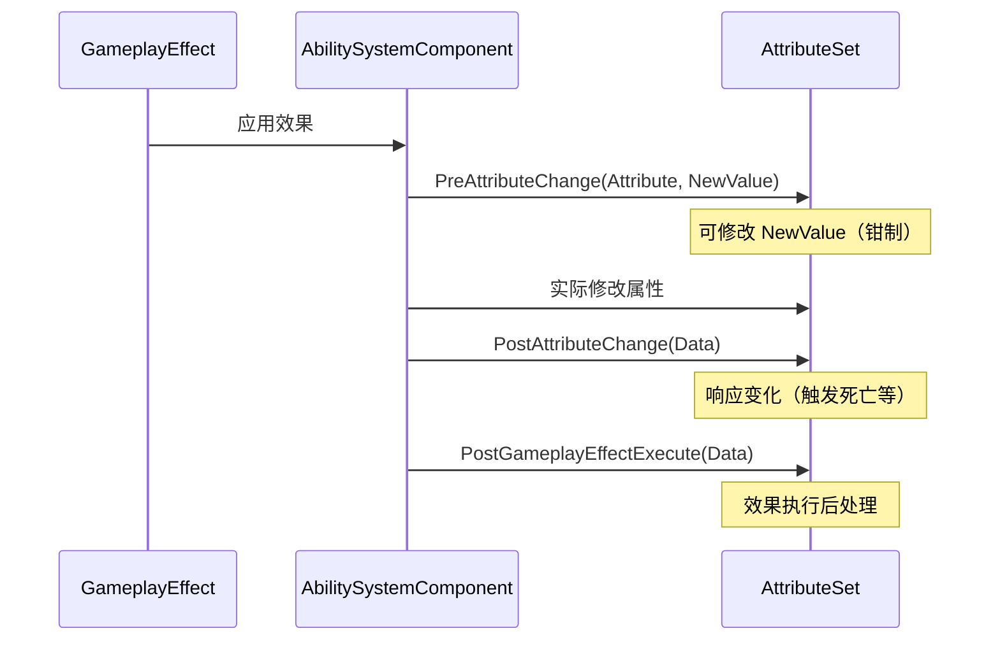

# UAttributeSet - 属性集

## 概述

`UAttributeSet` 定义角色的属性（如生命值、法力、攻击力等）。

- **属性定义** - FGameplayAttributeData 存储数值
- **属性修改** - 通过 GameplayEffect 修改
- **属性钳制** - 限制属性范围
- **属性变化回调** - 响应属性变化

```
源码位置：Engine/Plugins/Runtime/GameplayAbilities/Source/GameplayAbilities/Public/AttributeSet.h
```

**核心定位**：角色的"属性面板"。

---

## 1. 架构位置



---

## 2. 定义属性

### 2.1 基本属性定义

```cpp
// MyAttributeSet.h
UCLASS()
class UMyAttributeSet : public UAttributeSet
{
    GENERATED_BODY()
    
public:
    UMyAttributeSet();
    
    // 属性访问器宏
    ATTRIBUTE_ACCESSORS(UMyAttributeSet, Health)
    ATTRIBUTE_ACCESSORS(UMyAttributeSet, MaxHealth)
    ATTRIBUTE_ACCESSORS(UMyAttributeSet, Mana)
    ATTRIBUTE_ACCESSORS(UMyAttributeSet, MaxMana)
    ATTRIBUTE_ACCESSORS(UMyAttributeSet, AttackPower)
    ATTRIBUTE_ACCESSORS(UMyAttributeSet, Defense)
    
    // 属性定义
    UPROPERTY(BlueprintReadOnly, ReplicatedUsing=OnRep_Health)
    FGameplayAttributeData Health;
    
    UPROPERTY(BlueprintReadOnly, ReplicatedUsing=OnRep_MaxHealth)
    FGameplayAttributeData MaxHealth;
    
    UPROPERTY(BlueprintReadOnly, ReplicatedUsing=OnRep_Mana)
    FGameplayAttributeData Mana;
    
    UPROPERTY(BlueprintReadOnly, ReplicatedUsing=OnRep_MaxMana)
    FGameplayAttributeData MaxMana;
    
    UPROPERTY(BlueprintReadOnly, Category="Attributes")
    FGameplayAttributeData AttackPower;
    
    UPROPERTY(BlueprintReadOnly, Category="Attributes")
    FGameplayAttributeData Defense;
    
protected:
    // 复制回调
    UFUNCTION()
    void OnRep_Health(const FGameplayAttributeData& OldHealth);
    
    UFUNCTION()
    void OnRep_MaxHealth(const FGameplayAttributeData& OldMaxHealth);
    
    UFUNCTION()
    void OnRep_Mana(const FGameplayAttributeData& OldMana);
    
    UFUNCTION()
    void OnRep_MaxMana(const FGameplayAttributeData& OldMaxMana);
};
```

### 2.2 ATTRIBUTE_ACCESSORS 宏

```cpp
// 这个宏生成静态获取器和便捷函数
#define ATTRIBUTE_ACCESSORS(ClassName, PropertyName) \
    GAMEPLAYATTRIBUTE_PROPERTY_GETTER(ClassName, PropertyName) \
    GAMEPLAYATTRIBUTE_VALUE_GETTER(PropertyName) \
    GAMEPLAYATTRIBUTE_VALUE_SETTER(PropertyName) \
    GAMEPLAYATTRIBUTE_VALUE_INITTER(PropertyName)

// 展开后生成：
// static FGameplayAttribute GetHealthAttribute();
// float GetHealth() const;
// void SetHealth(float NewVal);
// void InitHealth(float NewVal);
```

---

## 3. 属性修改生命周期



---

## 4. 关键回调函数

```cpp
// 属性变化前（用于钳制）
virtual void PreAttributeChange(const FGameplayAttribute& Attribute, float& NewValue);

// 属性变化后
virtual void PostAttributeChange(const FGameplayAttribute& Attribute, float OldValue, float NewValue);

// 效果执行后（最常用）
virtual void PostGameplayEffectExecute(const FGameplayEffectModCallbackData& Data);

// 属性基础值变化前
virtual bool PreGameplayEffectExecute(FGameplayEffectModCallbackData& Data);

// 实现示例
void UMyAttributeSet::PreAttributeChange(const FGameplayAttribute& Attribute, float& NewValue)
{
    Super::PreAttributeChange(Attribute, NewValue);
    
    // 钳制 Health 在 0 和 MaxHealth 之间
    if (Attribute == GetHealthAttribute())
    {
        NewValue = FMath::Clamp(NewValue, 0.f, GetMaxHealth());
    }
}

void UMyAttributeSet::PostGameplayEffectExecute(const FGameplayEffectModCallbackData& Data)
{
    Super::PostGameplayEffectExecute(Data);
    
    if (Data.EvaluatedData.Attribute == GetHealthAttribute())
    {
        // 生命值变为 0，触发死亡
        if (GetHealth() <= 0.f)
        {
            if (AActor* Owner = GetOwningActor())
            {
                // 发送死亡事件
            }
        }
    }
}
```

---

## 5. 元属性（Meta Attributes）

用于临时计算，不复制：

```cpp
// 伤害元属性（用于计算，不直接显示）
UPROPERTY(BlueprintReadOnly, Category="Meta")
FGameplayAttributeData IncomingDamage;

UPROPERTY(BlueprintReadOnly, Category="Meta")
FGameplayAttributeData IncomingHealing;

// 在 PostGameplayEffectExecute 中处理
void UMyAttributeSet::PostGameplayEffectExecute(const FGameplayEffectModCallbackData& Data)
{
    if (Data.EvaluatedData.Attribute == GetIncomingDamageAttribute())
    {
        float Damage = GetIncomingDamage();
        SetIncomingDamage(0.f);  // 清零
        
        // 应用防御减免
        float ActualDamage = FMath::Max(Damage - GetDefense(), 0.f);
        
        // 扣除生命值
        SetHealth(GetHealth() - ActualDamage);
    }
}
```

---

## 6. 完整示例

```cpp
// MyAttributeSet.cpp
UMyAttributeSet::UMyAttributeSet()
{
    InitHealth(100.f);
    InitMaxHealth(100.f);
    InitMana(50.f);
    InitMaxMana(50.f);
    InitAttackPower(10.f);
    InitDefense(5.f);
}

void UMyAttributeSet::GetLifetimeReplicatedProps(TArray<FLifetimeProperty>& OutLifetimeProps) const
{
    Super::GetLifetimeReplicatedProps(OutLifetimeProps);
    
    DOREPLIFETIME_CONDITION_NOTIFY(UMyAttributeSet, Health, COND_None, REPNOTIFY_Always);
    DOREPLIFETIME_CONDITION_NOTIFY(UMyAttributeSet, MaxHealth, COND_None, REPNOTIFY_Always);
    DOREPLIFETIME_CONDITION_NOTIFY(UMyAttributeSet, Mana, COND_None, REPNOTIFY_Always);
    DOREPLIFETIME_CONDITION_NOTIFY(UMyAttributeSet, MaxMana, COND_None, REPNOTIFY_Always);
}

void UMyAttributeSet::OnRep_Health(const FGameplayAttributeData& OldHealth)
{
    GAMEPLAYATTRIBUTE_REPNOTIFY(UMyAttributeSet, Health, OldHealth);
}

void UMyAttributeSet::OnRep_MaxHealth(const FGameplayAttributeData& OldMaxHealth)
{
    GAMEPLAYATTRIBUTE_REPNOTIFY(UMyAttributeSet, MaxHealth, OldMaxHealth);
}
```

---

## 7. 总结

| 要点 | 说明 |
|-----|------|
| **本质** | 角色属性的容器 |
| **存储** | FGameplayAttributeData |
| **修改** | 通过 GameplayEffect |
| **回调** | Pre/PostAttributeChange, PostGameplayEffectExecute |
| **元属性** | 用于中间计算，不复制 |

---

> 相关文档：
> - [UAbilitySystemComponent](./UAbilitySystemComponent.md) - 技能系统组件
> - [UGameplayEffect](./UGameplayEffect.md) - 游戏效果