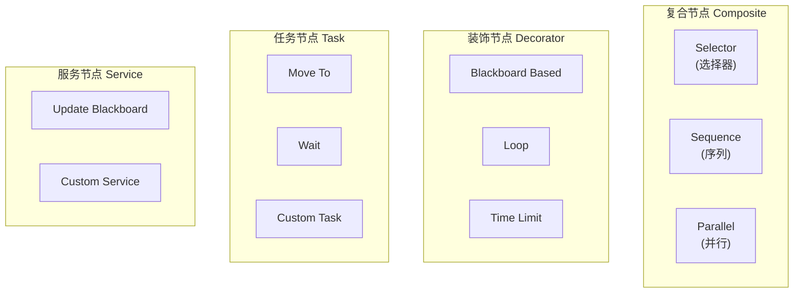
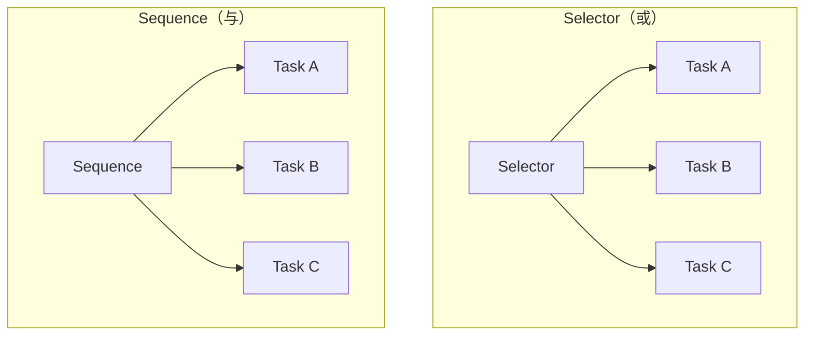

# UBehaviorTree - 行为树

## 概述

`UBehaviorTree` 是 AI 决策的核心资产，定义 AI 的行为逻辑。

- **树结构** - 由节点组成的决策树
- **执行流程** - 从根节点向下遍历
- **黑板集成** - 与 UBlackboardData 配合

```
源码位置：Engine/Source/Runtime/AIModule/Classes/BehaviorTree/BehaviorTree.h
```

**核心定位**：AI 的"大脑逻辑"。

---

## 1. 节点类型



---

## 2. 复合节点

| 节点 | 行为 |
|-----|------|
| **Selector** | 依次尝试子节点，第一个成功则返回成功 |
| **Sequence** | 依次执行子节点，全部成功才返回成功 |
| **Simple Parallel** | 同时执行主任务和后台任务 |



---

## 3. 自定义任务

```cpp
// BTTask_Attack.h
UCLASS()
class UBTTask_Attack : public UBTTaskNode
{
    GENERATED_BODY()
    
public:
    UBTTask_Attack();
    
    virtual EBTNodeResult::Type ExecuteTask(
        UBehaviorTreeComponent& OwnerComp,
        uint8* NodeMemory
    ) override;
    
    virtual EBTNodeResult::Type AbortTask(
        UBehaviorTreeComponent& OwnerComp,
        uint8* NodeMemory
    ) override;
    
protected:
    UPROPERTY(EditAnywhere)
    float AttackRange;
};

// BTTask_Attack.cpp
EBTNodeResult::Type UBTTask_Attack::ExecuteTask(
    UBehaviorTreeComponent& OwnerComp, uint8* NodeMemory)
{
    AAIController* AIController = OwnerComp.GetAIOwner();
    if (!AIController) return EBTNodeResult::Failed;
    
    APawn* ControlledPawn = AIController->GetPawn();
    AActor* TargetActor = Cast<AActor>(
        OwnerComp.GetBlackboardComponent()->GetValueAsObject(TEXT("TargetActor"))
    );
    
    if (ControlledPawn && TargetActor)
    {
        float Distance = FVector::Dist(
            ControlledPawn->GetActorLocation(),
            TargetActor->GetActorLocation()
        );
        
        if (Distance <= AttackRange)
        {
            // 执行攻击
            if (IAttackInterface* Attacker = Cast<IAttackInterface>(ControlledPawn))
            {
                Attacker->Attack(TargetActor);
                return EBTNodeResult::Succeeded;
            }
        }
    }
    
    return EBTNodeResult::Failed;
}
```

---

## 4. 运行行为树

```cpp
// 在 AIController 中
void AMyAIController::BeginPlay()
{
    Super::BeginPlay();
    
    if (BehaviorTreeAsset)
    {
        RunBehaviorTree(BehaviorTreeAsset);
    }
}
```

---

## 5. 总结

| 要点 | 说明 |
|-----|------|
| **本质** | AI 决策树资产 |
| **节点** | Composite, Decorator, Task, Service |
| **数据** | 通过 Blackboard 共享 |
| **运行** | AIController.RunBehaviorTree |

---

> 相关文档：
> - [UBlackboardComponent](./UBlackboardComponent.md) - 黑板组件
> - [AAIController](./AAIController.md) - AI 控制器