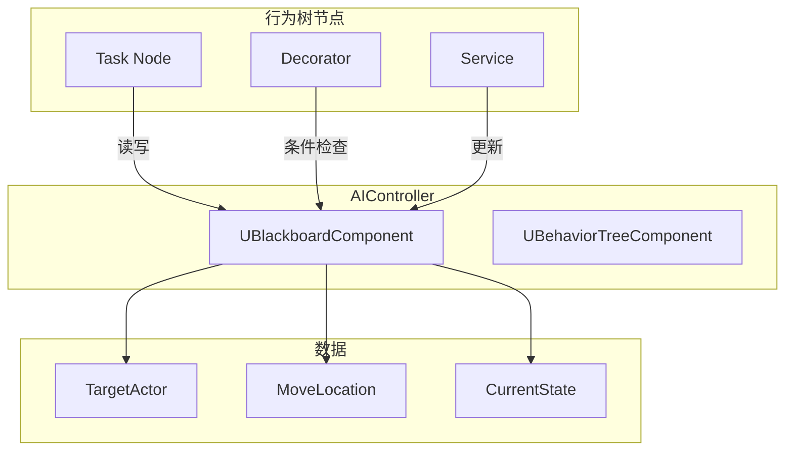

# UBlackboardComponent - 黑板组件

## 概述

`UBlackboardComponent` 是行为树的数据存储中心。

- **键值存储** - 存储 AI 决策数据
- **类型支持** - Bool, Int, Float, Vector, Object, Class 等
- **行为树集成** - 供节点读写数据

```
源码位置：Engine/Source/Runtime/AIModule/Classes/BehaviorTree/BlackboardComponent.h
```

**核心定位**：AI 的"记忆存储"。

---

## 1. 与行为树的关系



---

## 2. 基本操作

```cpp
// 获取黑板组件
UBlackboardComponent* BB = AIController->GetBlackboardComponent();

// 设置值
BB->SetValueAsObject(TEXT("TargetActor"), TargetActor);
BB->SetValueAsVector(TEXT("MoveLocation"), TargetLocation);
BB->SetValueAsBool(TEXT("IsAlerted"), true);
BB->SetValueAsFloat(TEXT("DistanceToTarget"), Distance);
BB->SetValueAsInt(TEXT("AmmoCount"), 30);
BB->SetValueAsEnum(TEXT("CurrentState"), (uint8)EAIState::Combat);

// 获取值
AActor* Target = Cast<AActor>(BB->GetValueAsObject(TEXT("TargetActor")));
FVector Location = BB->GetValueAsVector(TEXT("MoveLocation"));
bool bIsAlerted = BB->GetValueAsBool(TEXT("IsAlerted"));
float Distance = BB->GetValueAsFloat(TEXT("DistanceToTarget"));

// 清除值
BB->ClearValue(TEXT("TargetActor"));
```

---

## 3. 黑板数据资产

```cpp
// 在编辑器中创建 BlackboardData 资产
// 定义所有可用的键

// 在 AIController 中初始化
void AMyAIController::OnPossess(APawn* InPawn)
{
    Super::OnPossess(InPawn);
    
    if (UseBlackboard(BlackboardAsset, Blackboard))
    {
        // 初始化默认值
        Blackboard->SetValueAsVector(TEXT("HomeLocation"), InPawn->GetActorLocation());
    }
    
    RunBehaviorTree(BehaviorTreeAsset);
}
```

---

## 4. 在行为树节点中使用

```cpp
// 自定义 Decorator
UCLASS()
class UBTDecorator_IsTargetInRange : public UBTDecorator
{
    GENERATED_BODY()
    
protected:
    UPROPERTY(EditAnywhere)
    FBlackboardKeySelector TargetKey;
    
    UPROPERTY(EditAnywhere)
    float Range;
    
    virtual bool CalculateRawConditionValue(
        UBehaviorTreeComponent& OwnerComp,
        uint8* NodeMemory
    ) const override
    {
        UBlackboardComponent* BB = OwnerComp.GetBlackboardComponent();
        AActor* Target = Cast<AActor>(BB->GetValueAsObject(TargetKey.SelectedKeyName));
        APawn* Pawn = OwnerComp.GetAIOwner()->GetPawn();
        
        if (Target && Pawn)
        {
            return FVector::Dist(Target->GetActorLocation(), Pawn->GetActorLocation()) <= Range;
        }
        return false;
    }
};
```

---

## 5. 总结

| 要点 | 说明 |
|-----|------|
| **本质** | AI 数据存储 |
| **类型** | Bool, Int, Float, Vector, Object 等 |
| **操作** | SetValue/GetValue/ClearValue |
| **配置** | BlackboardData 资产 |

---

> 相关文档：
> - [UBehaviorTree](./UBehaviorTree.md) - 行为树
> - [AAIController](./AAIController.md) - AI 控制器