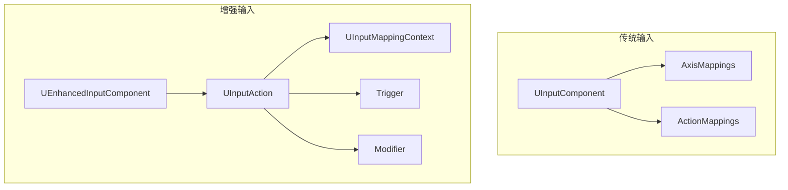
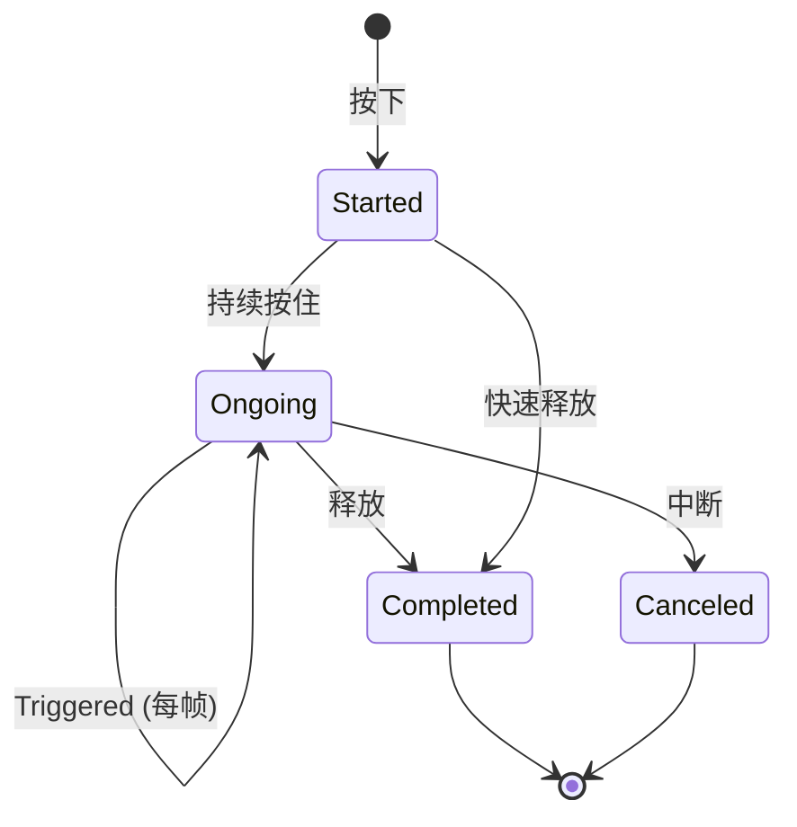

# UEnhancedInputComponent - 增强输入组件

## 概述

`UEnhancedInputComponent` 是 UE5 的新输入系统组件，替代传统的 UInputComponent。

- **输入动作** - 基于 UInputAction 的抽象输入
- **输入映射** - UInputMappingContext 管理绑定
- **触发器** - 灵活的输入触发条件
- **修改器** - 输入值预处理

```
源码位置：Engine/Plugins/EnhancedInput/Source/EnhancedInput/Public/EnhancedInputComponent.h
```

**核心定位**：现代化的输入处理系统。

---

## 1. 架构对比



---

## 2. 绑定方式

```cpp
// 设置输入组件
void AMyCharacter::SetupPlayerInputComponent(UInputComponent* PlayerInputComponent)
{
    Super::SetupPlayerInputComponent(PlayerInputComponent);
    
    // 转换为增强输入组件
    if (UEnhancedInputComponent* EnhancedInput = Cast<UEnhancedInputComponent>(PlayerInputComponent))
    {
        // 绑定移动动作
        EnhancedInput->BindAction(MoveAction, ETriggerEvent::Triggered, this, &AMyCharacter::Move);
        
        // 绑定跳跃动作
        EnhancedInput->BindAction(JumpAction, ETriggerEvent::Started, this, &AMyCharacter::Jump);
        EnhancedInput->BindAction(JumpAction, ETriggerEvent::Completed, this, &AMyCharacter::StopJumping);
        
        // 绑定攻击动作
        EnhancedInput->BindAction(AttackAction, ETriggerEvent::Triggered, this, &AMyCharacter::Attack);
    }
}

// 移动回调
void AMyCharacter::Move(const FInputActionValue& Value)
{
    FVector2D MovementVector = Value.Get<FVector2D>();
    
    if (Controller)
    {
        const FRotator Rotation = Controller->GetControlRotation();
        const FRotator YawRotation(0, Rotation.Yaw, 0);
        
        const FVector ForwardDir = FRotationMatrix(YawRotation).GetUnitAxis(EAxis::X);
        const FVector RightDir = FRotationMatrix(YawRotation).GetUnitAxis(EAxis::Y);
        
        AddMovementInput(ForwardDir, MovementVector.Y);
        AddMovementInput(RightDir, MovementVector.X);
    }
}
```

---

## 3. 触发事件类型

```cpp
enum class ETriggerEvent : uint8
{
    None,       // 无触发
    Triggered,  // 持续触发（每帧）
    Started,    // 开始时触发一次
    Ongoing,    // 持续中（Started 之后）
    Canceled,   // 取消时触发
    Completed   // 完成时触发
};
```



---

## 4. 添加映射上下文

```cpp
void AMyCharacter::BeginPlay()
{
    Super::BeginPlay();
    
    // 获取本地玩家子系统
    if (APlayerController* PC = Cast<APlayerController>(GetController()))
    {
        if (UEnhancedInputLocalPlayerSubsystem* Subsystem = 
            ULocalPlayer::GetSubsystem<UEnhancedInputLocalPlayerSubsystem>(PC->GetLocalPlayer()))
        {
            // 添加映射上下文
            Subsystem->AddMappingContext(DefaultMappingContext, 0);
        }
    }
}
```

---

## 5. 总结

| 要点 | 说明 |
|-----|------|
| **本质** | 现代输入组件 |
| **绑定** | BindAction + ETriggerEvent |
| **输入值** | FInputActionValue |
| **上下文** | UInputMappingContext |

---

> 相关文档：
> - [UInputAction](./UInputAction.md) - 输入动作
> - [UInputMappingContext](./UInputMappingContext.md) - 映射上下文
> - [APlayerController](./APlayerController.md) - 玩家控制器