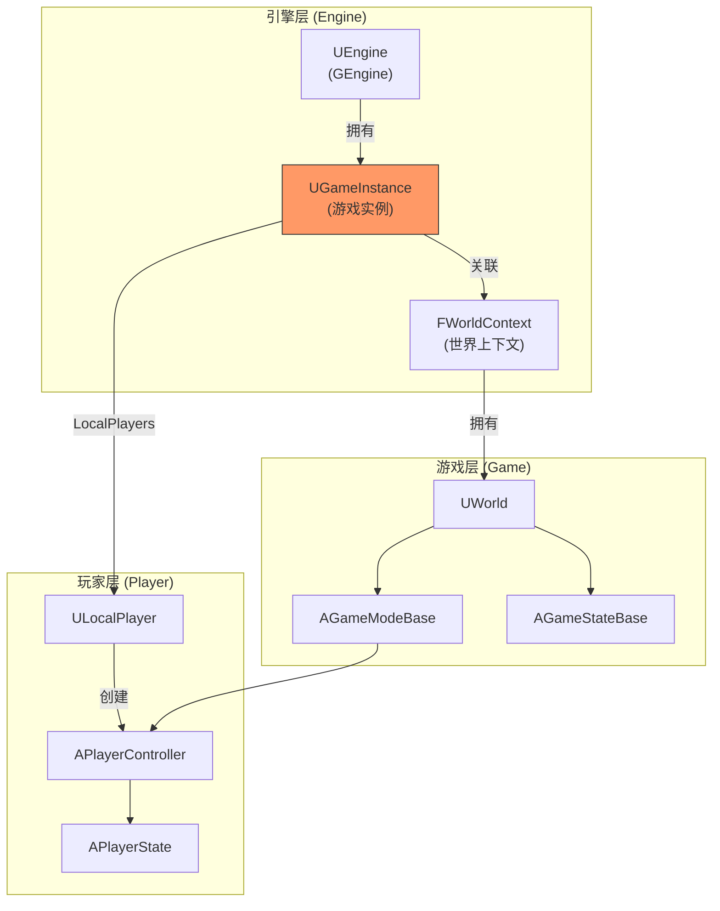
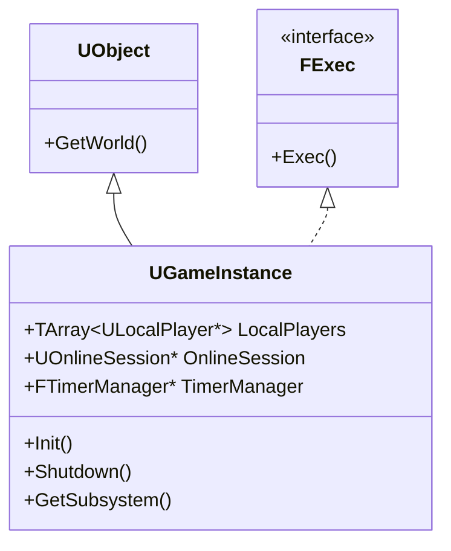
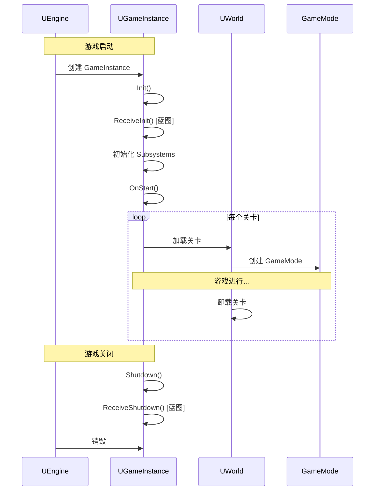
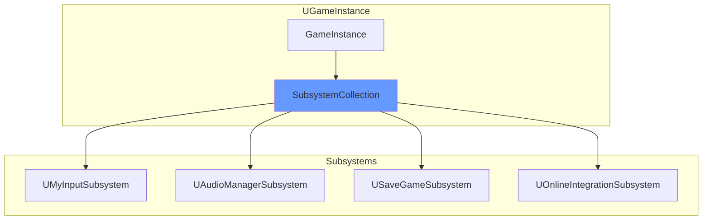
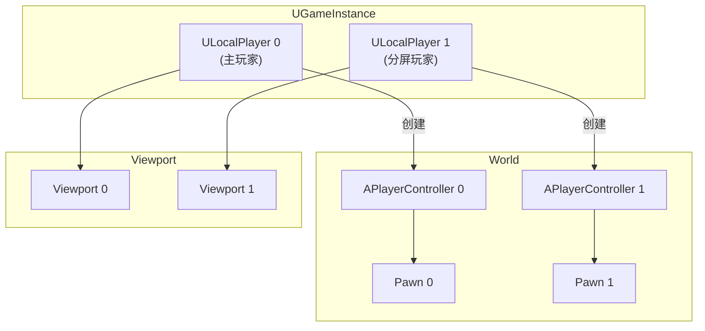
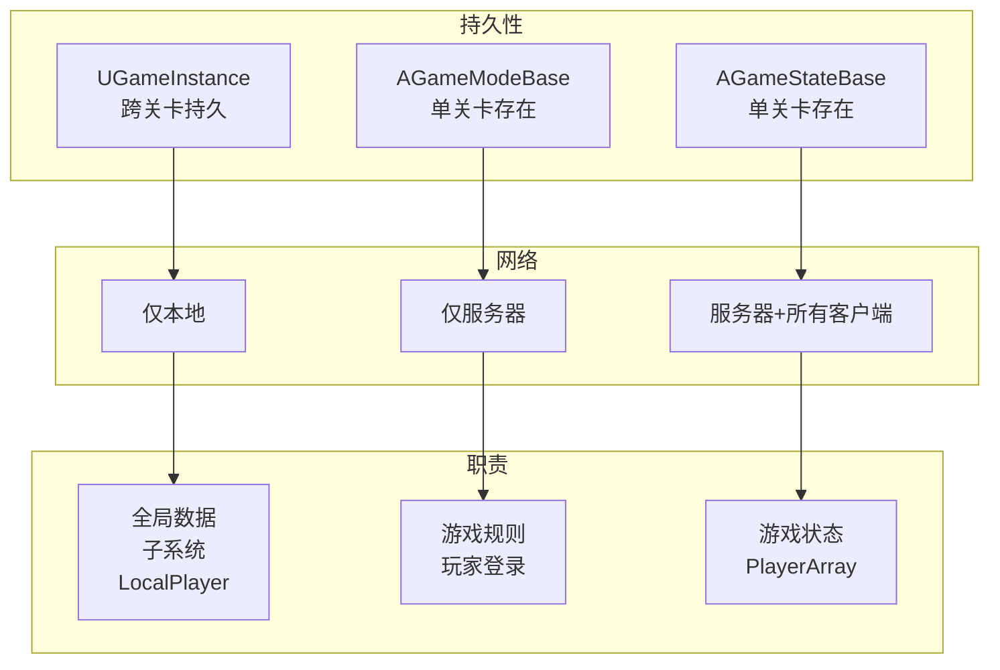

```mermaid
gantt
    title 游戏对象生命周期
    dateFormat X
    axisFormat %s
    
    section 引擎层
    UGameInstance       : 0, 100
    
    section 关卡 1
    UWorld (Level1)     : 10, 40
    GameMode (Level1)   : 15, 35
    GameState (Level1)  : 15, 35
    PlayerController    : 20, 95
    
    section 关卡 2
    UWorld (Level2)     : 50, 80
    GameMode (Level2)   : 55, 75
    GameState (Level2)  : 55, 75
    
    section 关卡 3
    UWorld (Level3)     : 85, 100
```

# UGameInstance - 游戏实例

## 概述

`UGameInstance` 是 UE 中**生命周期最长**的游戏对象。它在游戏启动时创建，关闭时销毁，特点是：

- **跨关卡持久** - 关卡切换时不会销毁，数据保持
- **单例模式** - 每个游戏实例只有一个
- **子系统管理** - 管理 GameInstanceSubsystem
- **本地玩家管理** - 管理 LocalPlayer 列表
- **全局访问点** - 可从任何地方访问

```
源码位置：Engine/Source/Runtime/Engine/Classes/Engine/GameInstance.h
```

**核心定位**：游戏的"根对象"，存储跨关卡的全局数据和服务。

---

## 1. 类层级与位置

### 1.1 在引擎架构中的位置



### 1.2 继承关系



**注意**：`UGameInstance` 继承自 `UObject`，不是 `AActor`，因此：
- 不存在于 World 中
- 没有 Transform
- 不参与网络复制

---

## 2. 生命周期

### 2.1 与其他对象的生命周期对比



### 2.2 生命周期函数



### 2.3 关键生命周期函数

```cpp
// 初始化（游戏启动时）
virtual void Init();

// 蓝图初始化回调
UFUNCTION(BlueprintImplementableEvent)
void ReceiveInit();

// 关闭（游戏退出时）
virtual void Shutdown();

// 蓝图关闭回调
UFUNCTION(BlueprintImplementableEvent)
void ReceiveShutdown();

// 游戏开始运行
virtual void OnStart();

// World 改变时
virtual void OnWorldChanged(UWorld* OldWorld, UWorld* NewWorld) {}

// 关卡加载完成
virtual void LoadComplete(const float LoadTime, const FString& MapName) {}
```

---

## 3. 子系统 (Subsystem)

### 3.1 GameInstanceSubsystem 架构



### 3.2 创建自定义 Subsystem

```cpp
// MyGameSubsystem.h
UCLASS()
class MYGAME_API UMyGameSubsystem : public UGameInstanceSubsystem
{
    GENERATED_BODY()
    
public:
    // 是否应该创建此子系统
    virtual bool ShouldCreateSubsystem(UObject* Outer) const override
    {
        return true;
    }
    
    // 初始化
    virtual void Initialize(FSubsystemCollectionBase& Collection) override
    {
        Super::Initialize(Collection);
        // 初始化逻辑
    }
    
    // 清理
    virtual void Deinitialize() override
    {
        // 清理逻辑
        Super::Deinitialize();
    }
    
    // 自定义功能
    UFUNCTION(BlueprintCallable)
    void MyFunction();
};
```

### 3.3 访问 Subsystem

```cpp
// 从 GameInstance 获取
if (UGameInstance* GI = GetGameInstance())
{
    if (UMyGameSubsystem* MySub = GI->GetSubsystem<UMyGameSubsystem>())
    {
        MySub->MyFunction();
    }
}

// 静态方法获取
UMyGameSubsystem* MySub = UGameInstance::GetSubsystem<UMyGameSubsystem>(GetGameInstance());

// 在蓝图中
// 使用 "Get Game Instance Subsystem" 节点
```

### 3.4 Subsystem 优势

| 传统方法 | Subsystem 方法 |
|---------|---------------|
| 修改 GameInstance 类 | 独立的 Subsystem 类 |
| 紧耦合 | 松耦合 |
| 难以模块化 | 易于模块化 |
| 继承限制 | 可插拔 |

---

## 4. 本地玩家管理

### 4.1 LocalPlayer 列表

```cpp
// 本地玩家列表（分屏支持）
UPROPERTY()
TArray<TObjectPtr<ULocalPlayer>> LocalPlayers;

// 创建本地玩家
ULocalPlayer* CreateLocalPlayer(int32 ControllerId, FString& OutError, bool bSpawnPlayerController);

// 添加/移除本地玩家
virtual int32 AddLocalPlayer(ULocalPlayer* NewPlayer, FPlatformUserId UserId);
virtual bool RemoveLocalPlayer(ULocalPlayer* ExistingPlayer);

// 获取本地玩家
int32 GetNumLocalPlayers() const;
ULocalPlayer* GetLocalPlayerByIndex(int32 Index) const;
ULocalPlayer* GetFirstGamePlayer() const;

// 查找本地玩家
ULocalPlayer* FindLocalPlayerFromControllerId(int32 ControllerId) const;
ULocalPlayer* FindLocalPlayerFromPlatformUserId(FPlatformUserId UserId) const;
ULocalPlayer* FindLocalPlayerFromUniqueNetId(FUniqueNetIdPtr UniqueNetId) const;
```

### 4.2 本地玩家架构



### 4.3 获取 PlayerController

```cpp
// 获取第一个本地 PlayerController
APlayerController* GetFirstLocalPlayerController(const UWorld* World = nullptr) const;

// 获取主玩家的 PlayerController
APlayerController* GetPrimaryPlayerController(bool bRequiresValidUniqueId = true) const;

// 示例用法
void AMyActor::DoSomething()
{
    if (UGameInstance* GI = GetGameInstance())
    {
        APlayerController* PC = GI->GetFirstLocalPlayerController(GetWorld());
        if (PC)
        {
            // 使用 PlayerController
        }
    }
}
```

---

## 5. 关卡切换与旅行

### 5.1 相关函数

```cpp
// 预加载内容（关卡加载前）
virtual void PreloadContentForURL(FURL InURL);

// 创建 GameMode
virtual class AGameModeBase* CreateGameModeForURL(FURL InURL, UWorld* InWorld);

// 覆盖 GameMode 类
virtual TSubclassOf<AGameModeBase> OverrideGameModeClass(
    TSubclassOf<AGameModeBase> GameModeClass, 
    const FString& MapName, 
    const FString& Options, 
    const FString& Portal
) const;

// 旅行前通知
void NotifyPreClientTravel(const FString& PendingURL, ETravelType TravelType, bool bIsSeamlessTravel);

// 返回主菜单
virtual void ReturnToMainMenu();
```

### 5.2 无缝旅行期间数据保持

```cpp
// 在 GameInstance 中保存跨关卡数据
UCLASS()
class UMyGameInstance : public UGameInstance
{
    GENERATED_BODY()
    
public:
    // 这些数据在关卡切换时保持
    UPROPERTY()
    int32 TotalScore;
    
    UPROPERTY()
    TArray<FInventoryItem> PlayerInventory;
    
    UPROPERTY()
    FString CurrentQuestId;
    
    // 关卡切换时的处理
    virtual void OnWorldChanged(UWorld* OldWorld, UWorld* NewWorld) override
    {
        Super::OnWorldChanged(OldWorld, NewWorld);
        
        // 关卡切换后的处理
        if (NewWorld)
        {
            ApplySavedDataToNewLevel();
        }
    }
};
```

---

## 6. 在线会话与回放

### 6.1 在线会话

```cpp
// 在线会话管理器
UPROPERTY()
TObjectPtr<class UOnlineSession> OnlineSession;

// 获取在线会话类
virtual TSubclassOf<UOnlineSession> GetOnlineSessionClass();

// 获取在线会话
class UOnlineSession* GetOnlineSession() const { return OnlineSession; }

// 加入会话
virtual bool JoinSession(ULocalPlayer* LocalPlayer, int32 SessionIndexInSearchResults);
virtual bool JoinSession(ULocalPlayer* LocalPlayer, const FOnlineSessionSearchResult& SearchResult);

// 客户端旅行到会话
virtual bool ClientTravelToSession(int32 ControllerId, FName InSessionName);
```

### 6.2 回放系统

```cpp
// 开始录制回放
virtual void StartRecordingReplay(
    const FString& InName, 
    const FString& FriendlyName, 
    const TArray<FString>& AdditionalOptions = TArray<FString>()
);

// 停止录制
virtual void StopRecordingReplay();

// 播放回放
virtual bool PlayReplay(
    const FString& InName, 
    UWorld* WorldOverride = nullptr, 
    const TArray<FString>& AdditionalOptions = TArray<FString>()
);

// 添加用户到回放
virtual void AddUserToReplay(const FString& UserString);
```

---

## 7. 常用 API

### 7.1 获取 GameInstance

```cpp
// 方式 1：从任何 UObject
UGameInstance* GI = GetGameInstance();

// 方式 2：从 World
UGameInstance* GI = GetWorld()->GetGameInstance();

// 方式 3：模板版本
UMyGameInstance* MyGI = GetGameInstance<UMyGameInstance>();

// 方式 4：全局访问（不推荐）
UGameInstance* GI = GEngine->GetWorldContextFromWorldChecked(GetWorld()).OwningGameInstance;
```

### 7.2 实用工具

```cpp
// 获取 World
virtual class UWorld* GetWorld() const final;

// 获取引擎
class UEngine* GetEngine() const;

// 获取 ViewportClient
class UGameViewportClient* GetGameViewportClient() const;

// 获取定时器管理器
FTimerManager& GetTimerManager() const;

// 获取延迟操作管理器
FLatentActionManager& GetLatentActionManager() const;

// 是否是专用服务器
bool IsDedicatedServerInstance() const;

// 获取在线平台名称
virtual FName GetOnlinePlatformName() const;
```

### 7.3 对象引用管理

```cpp
// 注册对象（防止 GC）
virtual void RegisterReferencedObject(UObject* ObjectToReference);

// 取消注册
virtual void UnregisterReferencedObject(UObject* ObjectToReference);

// 内部存储
UPROPERTY()
TArray<TObjectPtr<UObject>> ReferencedObjects;
```

---

## 8. 自定义 GameInstance

### 8.1 完整示例

```cpp
// MyGameInstance.h
UCLASS()
class MYGAME_API UMyGameInstance : public UGameInstance
{
    GENERATED_BODY()
    
public:
    UMyGameInstance();
    
    //========================================
    // 生命周期
    //========================================
    virtual void Init() override;
    virtual void Shutdown() override;
    virtual void OnStart() override;
    
    //========================================
    // 跨关卡数据
    //========================================
    
    // 玩家进度
    UPROPERTY(BlueprintReadWrite)
    int32 PlayerLevel;
    
    UPROPERTY(BlueprintReadWrite)
    int32 PlayerExperience;
    
    UPROPERTY(BlueprintReadWrite)
    TArray<FName> UnlockedAbilities;
    
    // 游戏设置
    UPROPERTY(BlueprintReadWrite)
    FGameSettings GameSettings;
    
    //========================================
    // 功能接口
    //========================================
    
    UFUNCTION(BlueprintCallable, Category = "Game")
    void SaveGameProgress();
    
    UFUNCTION(BlueprintCallable, Category = "Game")
    void LoadGameProgress();
    
    UFUNCTION(BlueprintCallable, Category = "Game")
    void TravelToLevel(const FString& LevelName);
    
    //========================================
    // 覆盖
    //========================================
    
    virtual TSubclassOf<AGameModeBase> OverrideGameModeClass(
        TSubclassOf<AGameModeBase> GameModeClass, 
        const FString& MapName, 
        const FString& Options, 
        const FString& Portal
    ) const override;
    
protected:
    virtual void OnWorldChanged(UWorld* OldWorld, UWorld* NewWorld) override;
};

// MyGameInstance.cpp
UMyGameInstance::UMyGameInstance()
{
    PlayerLevel = 1;
    PlayerExperience = 0;
}

void UMyGameInstance::Init()
{
    Super::Init();
    
    UE_LOG(LogGame, Log, TEXT("MyGameInstance initialized"));
    
    // 加载保存的进度
    LoadGameProgress();
}

void UMyGameInstance::Shutdown()
{
    // 保存进度
    SaveGameProgress();
    
    UE_LOG(LogGame, Log, TEXT("MyGameInstance shutting down"));
    
    Super::Shutdown();
}

void UMyGameInstance::OnStart()
{
    Super::OnStart();
    
    UE_LOG(LogGame, Log, TEXT("Game started"));
}

void UMyGameInstance::OnWorldChanged(UWorld* OldWorld, UWorld* NewWorld)
{
    Super::OnWorldChanged(OldWorld, NewWorld);
    
    if (NewWorld)
    {
        UE_LOG(LogGame, Log, TEXT("World changed to: %s"), *NewWorld->GetName());
    }
}

TSubclassOf<AGameModeBase> UMyGameInstance::OverrideGameModeClass(
    TSubclassOf<AGameModeBase> GameModeClass, 
    const FString& MapName, 
    const FString& Options, 
    const FString& Portal) const
{
    // 根据地图名选择不同的 GameMode
    if (MapName.Contains(TEXT("Arena")))
    {
        return AArenaGameMode::StaticClass();
    }
    else if (MapName.Contains(TEXT("Lobby")))
    {
        return ALobbyGameMode::StaticClass();
    }
    
    return Super::OverrideGameModeClass(GameModeClass, MapName, Options, Portal);
}

void UMyGameInstance::TravelToLevel(const FString& LevelName)
{
    if (UWorld* World = GetWorld())
    {
        // 保存当前进度
        SaveGameProgress();
        
        // 旅行到新关卡
        World->ServerTravel(LevelName);
    }
}
```

### 8.2 在项目设置中配置

在 `Config/DefaultEngine.ini` 中：

```ini
[/Script/EngineSettings.GameMapsSettings]
GameInstanceClass=/Script/MyGame.MyGameInstance
```

或在编辑器中：
- Project Settings → Maps & Modes → Game Instance Class

---

## 9. 与其他类的对比

### 9.1 GameInstance vs GameMode vs GameState



### 9.2 对比表

| 特性 | UGameInstance | AGameModeBase | AGameStateBase |
|-----|---------------|---------------|----------------|
| **类型** | UObject | AActor | AActor |
| **生命周期** | 整个游戏 | 单关卡 | 单关卡 |
| **网络存在** | 仅本地 | 仅服务器 | 所有端 |
| **主要存储** | 全局设置、进度 | 规则配置 | 比赛状态 |
| **子系统** | ✅ | ❌ | ❌ |
| **LocalPlayer** | ✅ 管理 | ❌ | ❌ |

---

## 10. 常见问题

### Q1: GameInstance 在网络游戏中如何工作？
每台机器（服务器和每个客户端）都有自己的 GameInstance。它们是**完全独立**的，不会同步。用于存储本机的全局数据。

### Q2: 什么数据应该放在 GameInstance？
| 适合 | 不适合 |
|-----|-------|
| 用户设置 | 需要同步的游戏状态 |
| 本地存档进度 | 其他玩家需要看到的数据 |
| 跨关卡的临时数据 | 应复制的比赛数据 |
| 本地 Subsystem | 特定关卡的数据 |

### Q3: 如何在 GameInstance 中使用定时器？
```cpp
GetTimerManager().SetTimer(
    TimerHandle,
    this,
    &UMyGameInstance::OnTimerExpired,
    1.0f,  // 间隔
    true   // 循环
);
```

### Q4: PIE 模式下 GameInstance 的行为？
每个 PIE 窗口都有自己独立的 GameInstance。用于测试多玩家时，每个"客户端"都有独立的 GameInstance。

---

## 11. 总结

| 要点 | 说明 |
|-----|------|
| **本质** | 游戏的"根对象" |
| **生命周期** | 游戏启动到关闭 |
| **持久性** | 跨关卡保持 |
| **网络** | 仅本地存在 |
| **子系统** | 管理 GameInstanceSubsystem |
| **LocalPlayer** | 管理本地玩家列表 |
| **典型用途** | 全局设置、进度存储、关卡切换 |

---

> 相关文档：
> - [AGameModeBase](./AGameModeBase.md) - 游戏模式
> - [AGameStateBase](./AGameStateBase.md) - 游戏状态
> - [ULocalPlayer](./ULocalPlayer.md) - 本地玩家
> - [APlayerController](./APlayerController.md) - 玩家控制器# UGameInstance - 游戏实例

## 概述

`UGameInstance` 是 UE 中**生命周期最长**的游戏对象。它在游戏启动时创建，关闭时销毁，特点是：

- **跨关卡持久** - 关卡切换时不会销毁，数据保持
- **单例模式** - 每个游戏实例只有一个
- **子系统管理** - 管理 GameInstanceSubsystem
- **本地玩家管理** - 管理 LocalPlayer 列表
- **全局访问点** - 可从任何地方访问

```
源码位置：Engine/Source/Runtime/Engine/Classes/Engine/GameInstance.h
```

**核心定位**：游戏的"根对象"，存储跨关卡的全局数据和服务。

---

## 1. 类层级与位置

### 1.1 在引擎架构中的位置


### 1.2 继承关系


**注意**：`UGameInstance` 继承自 `UObject`，不是 `AActor`，因此：
- 不存在于 World 中
- 没有 Transform
- 不参与网络复制

---

## 2. 生命周期

### 2.1 与其他对象的生命周期对比


### 2.2 生命周期函数


### 2.3 关键生命周期函数

```cpp
// 初始化（游戏启动时）
virtual void Init();

// 蓝图初始化回调
UFUNCTION(BlueprintImplementableEvent)
void ReceiveInit();

// 关闭（游戏退出时）
virtual void Shutdown();

// 蓝图关闭回调
UFUNCTION(BlueprintImplementableEvent)
void ReceiveShutdown();

// 游戏开始运行
virtual void OnStart();

// World 改变时
virtual void OnWorldChanged(UWorld* OldWorld, UWorld* NewWorld) {}

// 关卡加载完成
virtual void LoadComplete(const float LoadTime, const FString& MapName) {}
```

---

## 3. 子系统 (Subsystem)

### 3.1 GameInstanceSubsystem 架构


### 3.2 创建自定义 Subsystem

```cpp
// MyGameSubsystem.h
UCLASS()
class MYGAME_API UMyGameSubsystem : public UGameInstanceSubsystem
{
    GENERATED_BODY()
    
public:
    // 是否应该创建此子系统
    virtual bool ShouldCreateSubsystem(UObject* Outer) const override
    {
        return true;
    }
    
    // 初始化
    virtual void Initialize(FSubsystemCollectionBase& Collection) override
    {
        Super::Initialize(Collection);
        // 初始化逻辑
    }
    
    // 清理
    virtual void Deinitialize() override
    {
        // 清理逻辑
        Super::Deinitialize();
    }
    
    // 自定义功能
    UFUNCTION(BlueprintCallable)
    void MyFunction();
};
```

### 3.3 访问 Subsystem

```cpp
// 从 GameInstance 获取
if (UGameInstance* GI = GetGameInstance())
{
    if (UMyGameSubsystem* MySub = GI->GetSubsystem<UMyGameSubsystem>())
    {
        MySub->MyFunction();
    }
}

// 静态方法获取
UMyGameSubsystem* MySub = UGameInstance::GetSubsystem<UMyGameSubsystem>(GetGameInstance());

// 在蓝图中
// 使用 "Get Game Instance Subsystem" 节点
```

### 3.4 Subsystem 优势

| 传统方法 | Subsystem 方法 |
|---------|---------------|
| 修改 GameInstance 类 | 独立的 Subsystem 类 |
| 紧耦合 | 松耦合 |
| 难以模块化 | 易于模块化 |
| 继承限制 | 可插拔 |

---

## 4. 本地玩家管理

### 4.1 LocalPlayer 列表

```cpp
// 本地玩家列表（分屏支持）
UPROPERTY()
TArray<TObjectPtr<ULocalPlayer>> LocalPlayers;

// 创建本地玩家
ULocalPlayer* CreateLocalPlayer(int32 ControllerId, FString& OutError, bool bSpawnPlayerController);

// 添加/移除本地玩家
virtual int32 AddLocalPlayer(ULocalPlayer* NewPlayer, FPlatformUserId UserId);
virtual bool RemoveLocalPlayer(ULocalPlayer* ExistingPlayer);

// 获取本地玩家
int32 GetNumLocalPlayers() const;
ULocalPlayer* GetLocalPlayerByIndex(int32 Index) const;
ULocalPlayer* GetFirstGamePlayer() const;

// 查找本地玩家
ULocalPlayer* FindLocalPlayerFromControllerId(int32 ControllerId) const;
ULocalPlayer* FindLocalPlayerFromPlatformUserId(FPlatformUserId UserId) const;
ULocalPlayer* FindLocalPlayerFromUniqueNetId(FUniqueNetIdPtr UniqueNetId) const;
```

### 4.2 本地玩家架构


### 4.3 获取 PlayerController

```cpp
// 获取第一个本地 PlayerController
APlayerController* GetFirstLocalPlayerController(const UWorld* World = nullptr) const;

// 获取主玩家的 PlayerController
APlayerController* GetPrimaryPlayerController(bool bRequiresValidUniqueId = true) const;

// 示例用法
void AMyActor::DoSomething()
{
    if (UGameInstance* GI = GetGameInstance())
    {
        APlayerController* PC = GI->GetFirstLocalPlayerController(GetWorld());
        if (PC)
        {
            // 使用 PlayerController
        }
    }
}
```

---

## 5. 关卡切换与旅行

### 5.1 相关函数

```cpp
// 预加载内容（关卡加载前）
virtual void PreloadContentForURL(FURL InURL);

// 创建 GameMode
virtual class AGameModeBase* CreateGameModeForURL(FURL InURL, UWorld* InWorld);

// 覆盖 GameMode 类
virtual TSubclassOf<AGameModeBase> OverrideGameModeClass(
    TSubclassOf<AGameModeBase> GameModeClass, 
    const FString& MapName, 
    const FString& Options, 
    const FString& Portal
) const;

// 旅行前通知
void NotifyPreClientTravel(const FString& PendingURL, ETravelType TravelType, bool bIsSeamlessTravel);

// 返回主菜单
virtual void ReturnToMainMenu();
```

### 5.2 无缝旅行期间数据保持

```cpp
// 在 GameInstance 中保存跨关卡数据
UCLASS()
class UMyGameInstance : public UGameInstance
{
    GENERATED_BODY()
    
public:
    // 这些数据在关卡切换时保持
    UPROPERTY()
    int32 TotalScore;
    
    UPROPERTY()
    TArray<FInventoryItem> PlayerInventory;
    
    UPROPERTY()
    FString CurrentQuestId;
    
    // 关卡切换时的处理
    virtual void OnWorldChanged(UWorld* OldWorld, UWorld* NewWorld) override
    {
        Super::OnWorldChanged(OldWorld, NewWorld);
        
        // 关卡切换后的处理
        if (NewWorld)
        {
            ApplySavedDataToNewLevel();
        }
    }
};
```

---

## 6. 在线会话与回放

### 6.1 在线会话

```cpp
// 在线会话管理器
UPROPERTY()
TObjectPtr<class UOnlineSession> OnlineSession;

// 获取在线会话类
virtual TSubclassOf<UOnlineSession> GetOnlineSessionClass();

// 获取在线会话
class UOnlineSession* GetOnlineSession() const { return OnlineSession; }

// 加入会话
virtual bool JoinSession(ULocalPlayer* LocalPlayer, int32 SessionIndexInSearchResults);
virtual bool JoinSession(ULocalPlayer* LocalPlayer, const FOnlineSessionSearchResult& SearchResult);

// 客户端旅行到会话
virtual bool ClientTravelToSession(int32 ControllerId, FName InSessionName);
```

### 6.2 回放系统

```cpp
// 开始录制回放
virtual void StartRecordingReplay(
    const FString& InName, 
    const FString& FriendlyName, 
    const TArray<FString>& AdditionalOptions = TArray<FString>()
);

// 停止录制
virtual void StopRecordingReplay();

// 播放回放
virtual bool PlayReplay(
    const FString& InName, 
    UWorld* WorldOverride = nullptr, 
    const TArray<FString>& AdditionalOptions = TArray<FString>()
);

// 添加用户到回放
virtual void AddUserToReplay(const FString& UserString);
```

---

## 7. 常用 API

### 7.1 获取 GameInstance

```cpp
// 方式 1：从任何 UObject
UGameInstance* GI = GetGameInstance();

// 方式 2：从 World
UGameInstance* GI = GetWorld()->GetGameInstance();

// 方式 3：模板版本
UMyGameInstance* MyGI = GetGameInstance<UMyGameInstance>();

// 方式 4：全局访问（不推荐）
UGameInstance* GI = GEngine->GetWorldContextFromWorldChecked(GetWorld()).OwningGameInstance;
```

### 7.2 实用工具

```cpp
// 获取 World
virtual class UWorld* GetWorld() const final;

// 获取引擎
class UEngine* GetEngine() const;

// 获取 ViewportClient
class UGameViewportClient* GetGameViewportClient() const;

// 获取定时器管理器
FTimerManager& GetTimerManager() const;

// 获取延迟操作管理器
FLatentActionManager& GetLatentActionManager() const;

// 是否是专用服务器
bool IsDedicatedServerInstance() const;

// 获取在线平台名称
virtual FName GetOnlinePlatformName() const;
```

### 7.3 对象引用管理

```cpp
// 注册对象（防止 GC）
virtual void RegisterReferencedObject(UObject* ObjectToReference);

// 取消注册
virtual void UnregisterReferencedObject(UObject* ObjectToReference);

// 内部存储
UPROPERTY()
TArray<TObjectPtr<UObject>> ReferencedObjects;
```

---

## 8. 自定义 GameInstance

### 8.1 完整示例

```cpp
// MyGameInstance.h
UCLASS()
class MYGAME_API UMyGameInstance : public UGameInstance
{
    GENERATED_BODY()
    
public:
    UMyGameInstance();
    
    //========================================
    // 生命周期
    //========================================
    virtual void Init() override;
    virtual void Shutdown() override;
    virtual void OnStart() override;
    
    //========================================
    // 跨关卡数据
    //========================================
    
    // 玩家进度
    UPROPERTY(BlueprintReadWrite)
    int32 PlayerLevel;
    
    UPROPERTY(BlueprintReadWrite)
    int32 PlayerExperience;
    
    UPROPERTY(BlueprintReadWrite)
    TArray<FName> UnlockedAbilities;
    
    // 游戏设置
    UPROPERTY(BlueprintReadWrite)
    FGameSettings GameSettings;
    
    //========================================
    // 功能接口
    //========================================
    
    UFUNCTION(BlueprintCallable, Category = "Game")
    void SaveGameProgress();
    
    UFUNCTION(BlueprintCallable, Category = "Game")
    void LoadGameProgress();
    
    UFUNCTION(BlueprintCallable, Category = "Game")
    void TravelToLevel(const FString& LevelName);
    
    //========================================
    // 覆盖
    //========================================
    
    virtual TSubclassOf<AGameModeBase> OverrideGameModeClass(
        TSubclassOf<AGameModeBase> GameModeClass, 
        const FString& MapName, 
        const FString& Options, 
        const FString& Portal
    ) const override;
    
protected:
    virtual void OnWorldChanged(UWorld* OldWorld, UWorld* NewWorld) override;
};

// MyGameInstance.cpp
UMyGameInstance::UMyGameInstance()
{
    PlayerLevel = 1;
    PlayerExperience = 0;
}

void UMyGameInstance::Init()
{
    Super::Init();
    
    UE_LOG(LogGame, Log, TEXT("MyGameInstance initialized"));
    
    // 加载保存的进度
    LoadGameProgress();
}

void UMyGameInstance::Shutdown()
{
    // 保存进度
    SaveGameProgress();
    
    UE_LOG(LogGame, Log, TEXT("MyGameInstance shutting down"));
    
    Super::Shutdown();
}

void UMyGameInstance::OnStart()
{
    Super::OnStart();
    
    UE_LOG(LogGame, Log, TEXT("Game started"));
}

void UMyGameInstance::OnWorldChanged(UWorld* OldWorld, UWorld* NewWorld)
{
    Super::OnWorldChanged(OldWorld, NewWorld);
    
    if (NewWorld)
    {
        UE_LOG(LogGame, Log, TEXT("World changed to: %s"), *NewWorld->GetName());
    }
}

TSubclassOf<AGameModeBase> UMyGameInstance::OverrideGameModeClass(
    TSubclassOf<AGameModeBase> GameModeClass, 
    const FString& MapName, 
    const FString& Options, 
    const FString& Portal) const
{
    // 根据地图名选择不同的 GameMode
    if (MapName.Contains(TEXT("Arena")))
    {
        return AArenaGameMode::StaticClass();
    }
    else if (MapName.Contains(TEXT("Lobby")))
    {
        return ALobbyGameMode::StaticClass();
    }
    
    return Super::OverrideGameModeClass(GameModeClass, MapName, Options, Portal);
}

void UMyGameInstance::TravelToLevel(const FString& LevelName)
{
    if (UWorld* World = GetWorld())
    {
        // 保存当前进度
        SaveGameProgress();
        
        // 旅行到新关卡
        World->ServerTravel(LevelName);
    }
}
```

### 8.2 在项目设置中配置

在 `Config/DefaultEngine.ini` 中：

```ini
[/Script/EngineSettings.GameMapsSettings]
GameInstanceClass=/Script/MyGame.MyGameInstance
```

或在编辑器中：
- Project Settings → Maps & Modes → Game Instance Class

---

## 9. 与其他类的对比

### 9.1 GameInstance vs GameMode vs GameState


### 9.2 对比表

| 特性 | UGameInstance | AGameModeBase | AGameStateBase |
|-----|---------------|---------------|----------------|
| **类型** | UObject | AActor | AActor |
| **生命周期** | 整个游戏 | 单关卡 | 单关卡 |
| **网络存在** | 仅本地 | 仅服务器 | 所有端 |
| **主要存储** | 全局设置、进度 | 规则配置 | 比赛状态 |
| **子系统** | ✅ | ❌ | ❌ |
| **LocalPlayer** | ✅ 管理 | ❌ | ❌ |

---

## 10. 常见问题

### Q1: GameInstance 在网络游戏中如何工作？
每台机器（服务器和每个客户端）都有自己的 GameInstance。它们是**完全独立**的，不会同步。用于存储本机的全局数据。

### Q2: 什么数据应该放在 GameInstance？
| 适合 | 不适合 |
|-----|-------|
| 用户设置 | 需要同步的游戏状态 |
| 本地存档进度 | 其他玩家需要看到的数据 |
| 跨关卡的临时数据 | 应复制的比赛数据 |
| 本地 Subsystem | 特定关卡的数据 |

### Q3: 如何在 GameInstance 中使用定时器？
```cpp
GetTimerManager().SetTimer(
    TimerHandle,
    this,
    &UMyGameInstance::OnTimerExpired,
    1.0f,  // 间隔
    true   // 循环
);
```

### Q4: PIE 模式下 GameInstance 的行为？
每个 PIE 窗口都有自己独立的 GameInstance。用于测试多玩家时，每个"客户端"都有独立的 GameInstance。

---

## 11. 总结

| 要点 | 说明 |
|-----|------|
| **本质** | 游戏的"根对象" |
| **生命周期** | 游戏启动到关闭 |
| **持久性** | 跨关卡保持 |
| **网络** | 仅本地存在 |
| **子系统** | 管理 GameInstanceSubsystem |
| **LocalPlayer** | 管理本地玩家列表 |
| **典型用途** | 全局设置、进度存储、关卡切换 |

---

> 相关文档：
> - [AGameModeBase](./AGameModeBase.md) - 游戏模式
> - [AGameStateBase](./AGameStateBase.md) - 游戏状态
> - [ULocalPlayer](./ULocalPlayer.md) - 本地玩家
> - [APlayerController](./APlayerController.md) - 玩家控制器