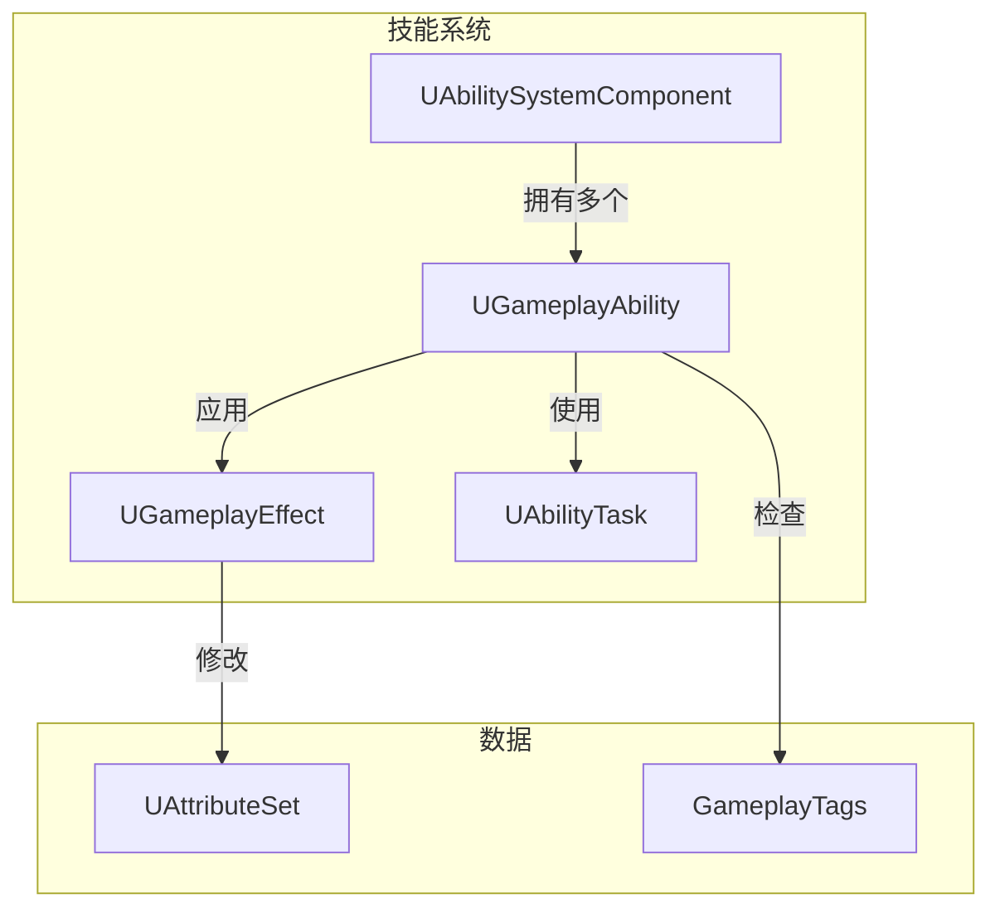
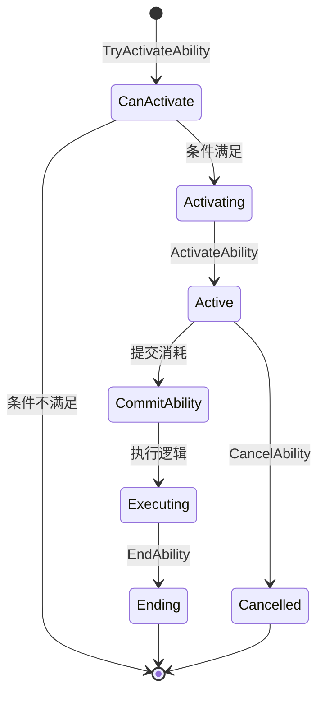
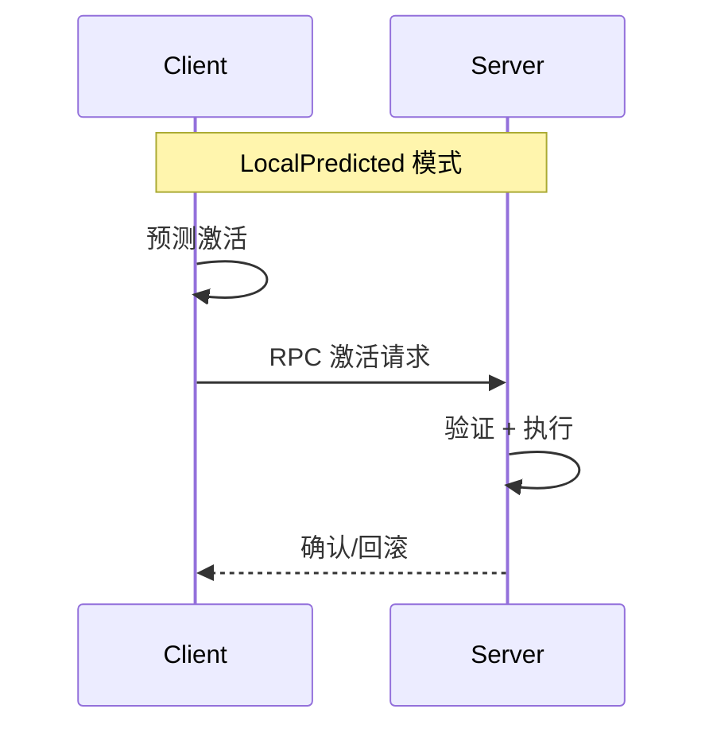

# UGameplayAbility - 游戏技能

## 概述

`UGameplayAbility` 是 GAS（Gameplay Ability System）的核心类，定义一个可执行的技能。

- **技能定义** - 技能逻辑、效果、动画
- **激活条件** - Tag、Cost、Cooldown
- **执行流程** - 激活、执行、结束
- **网络同步** - 客户端预测、服务器验证

```
源码位置：Engine/Plugins/Runtime/GameplayAbilities/Source/GameplayAbilities/Public/Abilities/GameplayAbility.h
```

**核心定位**：定义"技能能做什么"以及"何时可以使用"。

---

## 1. 架构位置



---

## 2. 技能生命周期



---

## 3. 核心函数

### 3.1 激活相关

```cpp
// 能否激活（检查条件）
virtual bool CanActivateAbility(
    const FGameplayAbilitySpecHandle Handle,
    const FGameplayAbilityActorInfo* ActorInfo,
    const FGameplayTagContainer* SourceTags = nullptr,
    const FGameplayTagContainer* TargetTags = nullptr,
    OUT FGameplayTagContainer* OptionalRelevantTags = nullptr
) const;

// 激活技能（入口点）
virtual void ActivateAbility(
    const FGameplayAbilitySpecHandle Handle,
    const FGameplayAbilityActorInfo* ActorInfo,
    const FGameplayAbilityActivationInfo ActivationInfo,
    const FGameplayEventData* TriggerEventData
);

// 提交消耗（冷却+Cost）
virtual bool CommitAbility(
    const FGameplayAbilitySpecHandle Handle,
    const FGameplayAbilityActorInfo* ActorInfo,
    const FGameplayAbilityActivationInfo ActivationInfo
);

// 结束技能
virtual void EndAbility(
    const FGameplayAbilitySpecHandle Handle,
    const FGameplayAbilityActorInfo* ActorInfo,
    const FGameplayAbilityActivationInfo ActivationInfo,
    bool bReplicateEndAbility,
    bool bWasCancelled
);
```

### 3.2 蓝图事件

```cpp
// 蓝图激活事件
UFUNCTION(BlueprintImplementableEvent)
void K2_ActivateAbility();

// 蓝图结束事件
UFUNCTION(BlueprintImplementableEvent)
void K2_OnEndAbility(bool bWasCancelled);

// 蓝图激活条件
UFUNCTION(BlueprintImplementableEvent)
bool K2_CanActivateAbility(FGameplayAbilityActorInfo ActorInfo, FGameplayTagContainer& FailureTags) const;
```

---

## 4. 核心属性

```cpp
// 技能 Tag（用于标识和过滤）
UPROPERTY(EditDefaultsOnly, Category=Tags)
FGameplayTagContainer AbilityTags;

// 激活时阻止的其他技能
UPROPERTY(EditDefaultsOnly, Category=Tags)
FGameplayTagContainer BlockAbilitiesWithTag;

// 激活时取消的其他技能
UPROPERTY(EditDefaultsOnly, Category=Tags)
FGameplayTagContainer CancelAbilitiesWithTag;

// 激活所需的 Tag
UPROPERTY(EditDefaultsOnly, Category=Tags)
FGameplayTagContainer ActivationRequiredTags;

// 激活时阻止的 Tag
UPROPERTY(EditDefaultsOnly, Category=Tags)
FGameplayTagContainer ActivationBlockedTags;

// 冷却效果
UPROPERTY(EditDefaultsOnly, Category=Cooldowns)
TSubclassOf<UGameplayEffect> CooldownGameplayEffectClass;

// 消耗效果
UPROPERTY(EditDefaultsOnly, Category=Costs)
TSubclassOf<UGameplayEffect> CostGameplayEffectClass;
```

---

## 5. 网络模式

```cpp
// 网络执行策略
UPROPERTY(EditDefaultsOnly, Category=Advanced)
TEnumAsByte<EGameplayAbilityNetExecutionPolicy::Type> NetExecutionPolicy;

// 策略选项：
// - LocalPredicted: 客户端预测，服务器验证
// - LocalOnly: 仅本地执行
// - ServerInitiated: 服务器发起
// - ServerOnly: 仅服务器执行
```



---

## 6. 自定义技能示例

```cpp
// GA_FireBall.h
UCLASS()
class UGA_FireBall : public UGameplayAbility
{
    GENERATED_BODY()
    
public:
    UGA_FireBall();
    
    virtual void ActivateAbility(
        const FGameplayAbilitySpecHandle Handle,
        const FGameplayAbilityActorInfo* ActorInfo,
        const FGameplayAbilityActivationInfo ActivationInfo,
        const FGameplayEventData* TriggerEventData
    ) override;
    
protected:
    UPROPERTY(EditDefaultsOnly)
    TSubclassOf<AProjectile> ProjectileClass;
    
    UPROPERTY(EditDefaultsOnly)
    UAnimMontage* CastMontage;
    
    UFUNCTION()
    void OnMontageCompleted();
    
    UFUNCTION()
    void OnMontageCancelled();
};

// GA_FireBall.cpp
UGA_FireBall::UGA_FireBall()
{
    // 设置网络策略
    NetExecutionPolicy = EGameplayAbilityNetExecutionPolicy::LocalPredicted;
    
    // 设置实例化策略
    InstancingPolicy = EGameplayAbilityInstancingPolicy::InstancedPerActor;
}

void UGA_FireBall::ActivateAbility(...)
{
    if (!CommitAbility(Handle, ActorInfo, ActivationInfo))
    {
        EndAbility(Handle, ActorInfo, ActivationInfo, true, true);
        return;
    }
    
    // 播放蒙太奇
    UAbilityTask_PlayMontageAndWait* MontageTask = 
        UAbilityTask_PlayMontageAndWait::CreatePlayMontageAndWaitProxy(
            this, NAME_None, CastMontage
        );
    
    MontageTask->OnCompleted.AddDynamic(this, &UGA_FireBall::OnMontageCompleted);
    MontageTask->OnCancelled.AddDynamic(this, &UGA_FireBall::OnMontageCancelled);
    MontageTask->ReadyForActivation();
}

void UGA_FireBall::OnMontageCompleted()
{
    // 生成火球
    if (AActor* AvatarActor = GetAvatarActorFromActorInfo())
    {
        FTransform SpawnTransform = AvatarActor->GetActorTransform();
        GetWorld()->SpawnActor<AProjectile>(ProjectileClass, SpawnTransform);
    }
    
    EndAbility(CurrentSpecHandle, CurrentActorInfo, CurrentActivationInfo, true, false);
}
```

---

## 7. 总结

| 要点 | 说明 |
|-----|------|
| **本质** | 技能定义和执行逻辑 |
| **激活条件** | Tag、Cost、Cooldown |
| **生命周期** | CanActivate → Activate → Commit → End |
| **网络** | 支持预测和服务器验证 |
| **扩展** | 通过 AbilityTask 实现异步逻辑 |

---

> 相关文档：
> - [UAbilitySystemComponent](./UAbilitySystemComponent.md) - 技能系统组件
> - [UGameplayEffect](./UGameplayEffect.md) - 游戏效果
> - [UAbilityTask](./UAbilityTask.md) - 技能任务