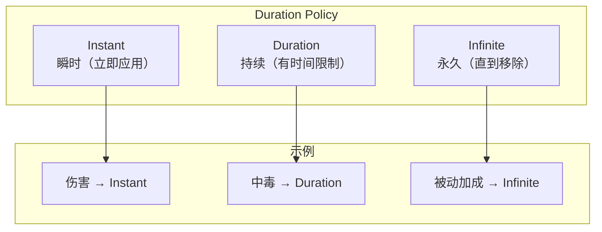
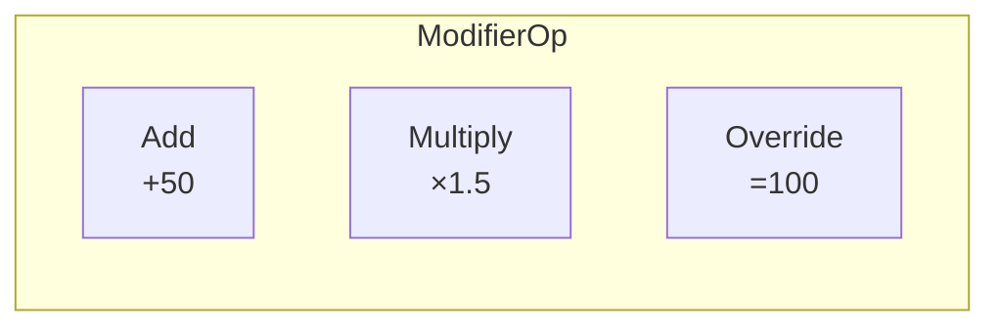
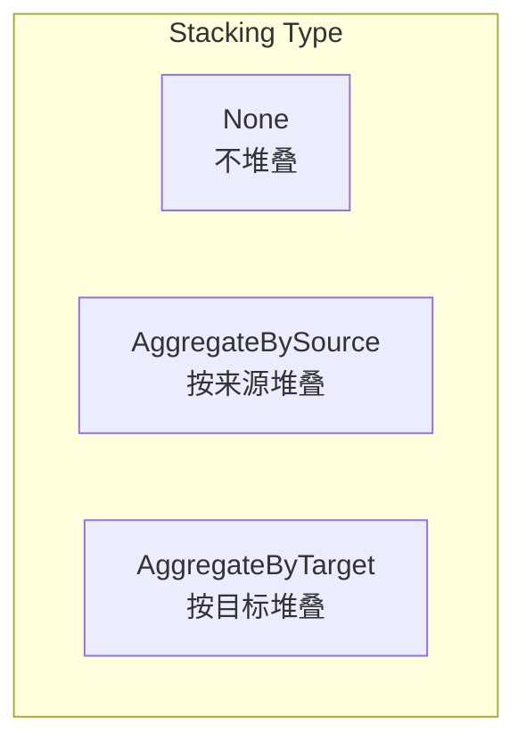
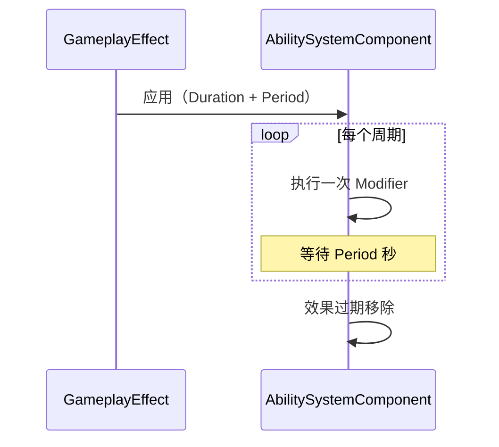

# UGameplayEffect - 游戏效果

## 概述

`UGameplayEffect` (GE) 定义对属性和状态的修改效果。

- **属性修改** - 修改 AttributeSet 中的值
- **持续时间** - 瞬时、持续、永久
- **堆叠** - 多个效果如何叠加
- **Tag 授予** - 授予或移除 Tag

```
源码位置：Engine/Plugins/Runtime/GameplayAbilities/Source/GameplayAbilities/Public/GameplayEffect.h
```

**核心定位**：定义"效果做什么"（伤害、治疗、Buff、Debuff）。

---

## 1. 效果类型



---

## 2. 核心属性

### 2.1 持续时间

```cpp
// 持续时间策略
UPROPERTY(EditDefaultsOnly, Category=Duration)
EGameplayEffectDurationType DurationPolicy;

// Instant - 立即应用，无持续
// Duration - 有持续时间
// Infinite - 永久，直到手动移除

// 持续时间（仅 Duration 类型）
UPROPERTY(EditDefaultsOnly, Category=Duration)
FScalableFloat DurationMagnitude;
```

### 2.2 Modifier（修改器）

```cpp
// 修改器数组
UPROPERTY(EditDefaultsOnly, Category=GameplayEffect)
TArray<FGameplayModifierInfo> Modifiers;

// 修改器结构
struct FGameplayModifierInfo
{
    // 要修改的属性
    FGameplayAttribute Attribute;
    
    // 修改操作类型
    EGameplayModOp::Type ModifierOp;  // Add, Multiply, Override
    
    // 修改值
    FGameplayEffectModifierMagnitude ModifierMagnitude;
};
```



### 2.3 Execution（执行计算）

```cpp
// 自定义执行计算类
UPROPERTY(EditDefaultsOnly, Category=GameplayEffect)
TArray<FGameplayEffectExecutionDefinition> Executions;

// 用于复杂计算（如伤害公式）
UCLASS()
class UDamageExecution : public UGameplayEffectExecutionCalculation
{
    virtual void Execute_Implementation(
        const FGameplayEffectCustomExecutionParameters& Params,
        OUT FGameplayEffectCustomExecutionOutput& Output
    ) const override;
};
```

---

## 3. Tag 系统

```cpp
// 效果授予的 Tag
UPROPERTY(EditDefaultsOnly, Category=Tags)
FGameplayTagContainer GrantedTags;

// 效果应用条件
UPROPERTY(EditDefaultsOnly, Category=Tags)
FGameplayTagContainer ApplicationTagRequirements;

// 移除条件
UPROPERTY(EditDefaultsOnly, Category=Tags)
FGameplayTagContainer RemovalTagRequirements;

// 效果自身的 Tag
UPROPERTY(EditDefaultsOnly, Category=Tags)
FGameplayTagContainer GameplayEffectAssetTag;
```

---

## 4. 堆叠规则



```cpp
// 堆叠类型
UPROPERTY(EditDefaultsOnly, Category=Stacking)
EGameplayEffectStackingType StackingType;

// 最大堆叠数
UPROPERTY(EditDefaultsOnly, Category=Stacking)
int32 StackLimitCount;

// 堆叠刷新策略
UPROPERTY(EditDefaultsOnly, Category=Stacking)
EGameplayEffectStackingDurationPolicy StackDurationRefreshPolicy;

// 堆叠满时策略
UPROPERTY(EditDefaultsOnly, Category=Stacking)
EGameplayEffectStackingExpirationPolicy StackExpirationPolicy;
```

---

## 5. 周期性效果

```cpp
// 是否周期性执行
UPROPERTY(EditDefaultsOnly, Category=Period)
bool bExecutePeriodicEffectOnApplication;

// 周期间隔
UPROPERTY(EditDefaultsOnly, Category=Period)
FScalableFloat Period;
```



---

## 6. 常见效果示例

### 6.1 瞬时伤害

```cpp
// GE_Damage（蓝图或 C++ 数据资产）
DurationPolicy = Instant
Modifiers:
  - Attribute: Health
  - ModifierOp: Add
  - Magnitude: -50  // 减少 50 点生命
```

### 6.2 持续 Buff

```cpp
// GE_AttackBuff
DurationPolicy = Duration
DurationMagnitude = 10.0  // 10 秒
Modifiers:
  - Attribute: AttackPower
  - ModifierOp: Multiply
  - Magnitude: 1.5  // 攻击力 ×1.5
GrantedTags: [State.Buff.Attack]
```

### 6.3 中毒 DOT

```cpp
// GE_Poison
DurationPolicy = Duration
DurationMagnitude = 5.0  // 5 秒
Period = 1.0  // 每秒执行
Modifiers:
  - Attribute: Health
  - ModifierOp: Add
  - Magnitude: -10  // 每秒 -10 生命
GrantedTags: [State.Debuff.Poison]
StackingType = AggregateBySource
StackLimitCount = 3
```

### 6.4 永久被动

```cpp
// GE_PassiveArmor
DurationPolicy = Infinite
Modifiers:
  - Attribute: Defense
  - ModifierOp: Add
  - Magnitude: 20  // +20 防御
```

---

## 7. 自定义执行计算

```cpp
// DamageExecution.h
UCLASS()
class UDamageExecution : public UGameplayEffectExecutionCalculation
{
    GENERATED_BODY()
    
public:
    UDamageExecution();
    
    virtual void Execute_Implementation(
        const FGameplayEffectCustomExecutionParameters& ExecutionParams,
        OUT FGameplayEffectCustomExecutionOutput& OutExecutionOutput
    ) const override;
};

// DamageExecution.cpp
UDamageExecution::UDamageExecution()
{
    // 声明需要捕获的属性
    RelevantAttributesToCapture.Add(UMyAttributeSet::GetAttackPowerAttribute().GetUProperty());
    RelevantAttributesToCapture.Add(UMyAttributeSet::GetDefenseAttribute().GetUProperty());
}

void UDamageExecution::Execute_Implementation(
    const FGameplayEffectCustomExecutionParameters& ExecutionParams,
    OUT FGameplayEffectCustomExecutionOutput& OutExecutionOutput) const
{
    // 获取源和目标的 ASC
    UAbilitySystemComponent* SourceASC = ExecutionParams.GetSourceAbilitySystemComponent();
    UAbilitySystemComponent* TargetASC = ExecutionParams.GetTargetAbilitySystemComponent();
    
    // 捕获属性值
    float AttackPower = 0.f;
    float Defense = 0.f;
    
    ExecutionParams.AttemptCalculateCapturedAttributeMagnitude(
        UMyAttributeSet::GetAttackPowerAttribute(), AttackPower);
    ExecutionParams.AttemptCalculateCapturedAttributeMagnitude(
        UMyAttributeSet::GetDefenseAttribute(), Defense);
    
    // 计算伤害
    float Damage = FMath::Max(AttackPower - Defense, 0.f);
    
    // 输出修改
    if (Damage > 0.f)
    {
        OutExecutionOutput.AddOutputModifier(
            FGameplayModifierEvaluatedData(
                UMyAttributeSet::GetHealthAttribute(),
                EGameplayModOp::Additive,
                -Damage
            )
        );
    }
}
```

---

## 8. 总结

| 要点 | 说明 |
|-----|------|
| **本质** | 属性修改的数据定义 |
| **类型** | Instant, Duration, Infinite |
| **修改** | Add, Multiply, Override |
| **堆叠** | BySource, ByTarget |
| **执行** | Modifier 或 ExecutionCalculation |

---

> 相关文档：
> - [UAbilitySystemComponent](./UAbilitySystemComponent.md) - 技能系统组件
> - [UAttributeSet](./UAttributeSet.md) - 属性集
> - [UGameplayAbility](./UGameplayAbility.md) - 游戏技能