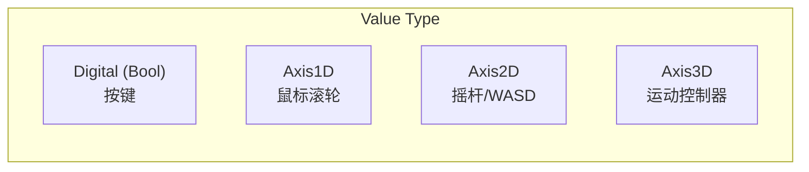

# UInputAction - 输入动作

## 概述

`UInputAction` 定义一个抽象的输入动作，与具体按键解耦。

- **值类型** - Bool, Axis1D, Axis2D, Axis3D
- **触发器** - 定义何时触发
- **修改器** - 输入值预处理

```
源码位置：Engine/Plugins/EnhancedInput/Source/EnhancedInput/Public/InputAction.h
```

**核心定位**：输入的"语义定义"（跳跃、移动、攻击）。

---

## 1. 值类型



```cpp
// 值类型枚举
enum class EInputActionValueType : uint8
{
    Boolean,   // true/false
    Axis1D,    // float
    Axis2D,    // FVector2D
    Axis3D     // FVector
};
```

---

## 2. 创建输入动作

在编辑器中：
1. Content Browser → Add → Input → Input Action
2. 设置 Value Type
3. 添加 Triggers 和 Modifiers

---

## 3. 触发器 (Triggers)

| 触发器 | 说明 |
|-------|------|
| `Down` | 按下时触发 |
| `Pressed` | 刚按下时触发一次 |
| `Released` | 释放时触发一次 |
| `Hold` | 按住一段时间后触发 |
| `HoldAndRelease` | 按住后释放时触发 |
| `Tap` | 快速点击触发 |
| `Pulse` | 周期性触发 |
| `ChordAction` | 组合键触发 |

---

## 4. 修改器 (Modifiers)

| 修改器 | 说明 |
|-------|------|
| `DeadZone` | 死区过滤 |
| `Negate` | 取反 |
| `Scalar` | 缩放 |
| `SwizzleInputAxis` | 交换轴 |
| `Smooth` | 平滑 |
| `ResponseCurve` | 响应曲线 |

---

## 5. 代码中定义

```cpp
// 在 Character 中声明
UPROPERTY(EditAnywhere, BlueprintReadOnly, Category=Input)
TObjectPtr<UInputAction> MoveAction;

UPROPERTY(EditAnywhere, BlueprintReadOnly, Category=Input)
TObjectPtr<UInputAction> LookAction;

UPROPERTY(EditAnywhere, BlueprintReadOnly, Category=Input)
TObjectPtr<UInputAction> JumpAction;

UPROPERTY(EditAnywhere, BlueprintReadOnly, Category=Input)
TObjectPtr<UInputAction> AttackAction;
```

---

## 6. 总结

| 要点 | 说明 |
|-----|------|
| **本质** | 抽象输入定义 |
| **创建** | 编辑器中创建资产 |
| **值类型** | Bool, Axis1D/2D/3D |
| **配置** | Triggers + Modifiers |

---

> 相关文档：
> - [UEnhancedInputComponent](./UEnhancedInputComponent.md) - 增强输入组件
> - [UInputMappingContext](./UInputMappingContext.md) - 映射上下文