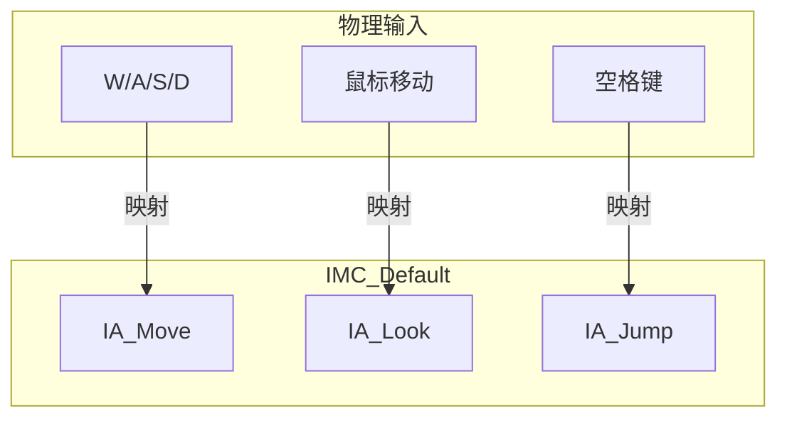
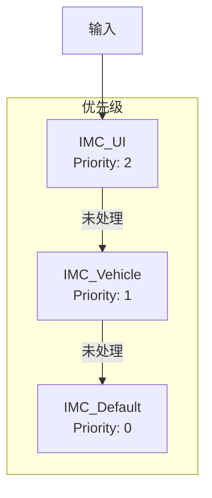

# UInputMappingContext - 输入映射上下文

## 概述

`UInputMappingContext` (IMC) 定义输入动作与物理按键的映射关系。

- **按键绑定** - InputAction ↔ 物理按键
- **上下文切换** - 不同场景使用不同映射
- **优先级** - 多个上下文的处理顺序

```
源码位置：Engine/Plugins/EnhancedInput/Source/EnhancedInput/Public/InputMappingContext.h
```

**核心定位**：输入的"配置文件"。

---

## 1. 架构



---

## 2. 创建映射上下文

在编辑器中：
1. Content Browser → Add → Input → Input Mapping Context
2. 添加 Mappings
3. 为每个 InputAction 设置按键

---

## 3. 多上下文管理



```cpp
// 添加/移除映射上下文
void AMyCharacter::EnterVehicle()
{
    if (UEnhancedInputLocalPlayerSubsystem* Subsystem = GetInputSubsystem())
    {
        Subsystem->RemoveMappingContext(DefaultMappingContext);
        Subsystem->AddMappingContext(VehicleMappingContext, 1);
    }
}

void AMyCharacter::ExitVehicle()
{
    if (UEnhancedInputLocalPlayerSubsystem* Subsystem = GetInputSubsystem())
    {
        Subsystem->RemoveMappingContext(VehicleMappingContext);
        Subsystem->AddMappingContext(DefaultMappingContext, 0);
    }
}
```

---

## 4. 典型映射示例

```
IMC_Default:
├── IA_Move
│   ├── W → (0, 1) + SwizzleInputAxis
│   ├── S → (0, -1) + SwizzleInputAxis
│   ├── A → (-1, 0)
│   ├── D → (1, 0)
│   └── Gamepad Left Stick → Axis2D
├── IA_Look
│   ├── Mouse XY → Axis2D
│   └── Gamepad Right Stick → Axis2D + DeadZone
├── IA_Jump
│   ├── Space → Digital
│   └── Gamepad Face Button Bottom → Digital
└── IA_Attack
    ├── Left Mouse → Digital
    └── Gamepad Right Trigger → Digital
```

---

## 5. 总结

| 要点 | 说明 |
|-----|------|
| **本质** | 输入动作到按键的映射 |
| **创建** | 编辑器中创建资产 |
| **优先级** | 数值越大优先级越高 |
| **切换** | Add/RemoveMappingContext |

---

> 相关文档：
> - [UInputAction](./UInputAction.md) - 输入动作
> - [UEnhancedInputComponent](./UEnhancedInputComponent.md) - 增强输入组件