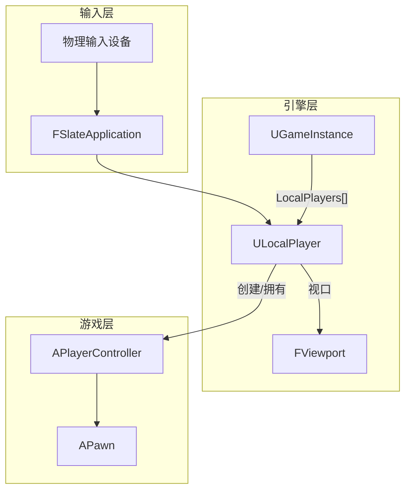
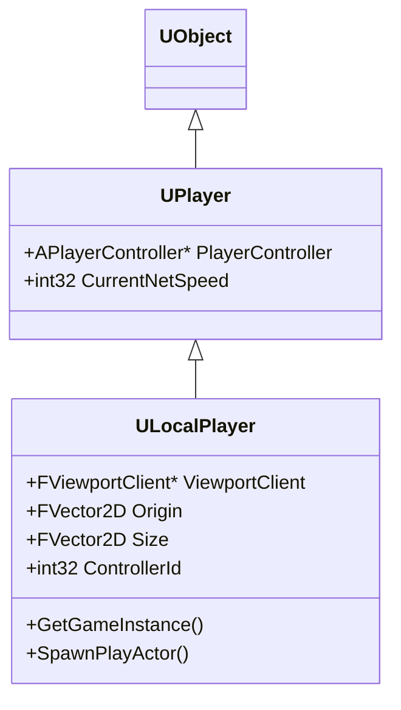
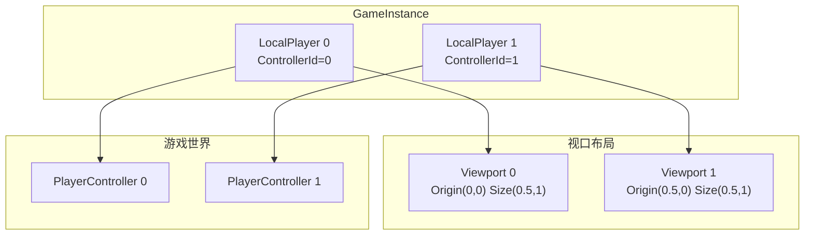

# ULocalPlayer - 本地玩家

## 概述

`ULocalPlayer` 代表本地机器上的一个玩家实例，是输入到 PlayerController 的桥梁。

- **输入路由** - 将物理输入路由到 PlayerController
- **视口关联** - 管理玩家的视口（分屏）
- **跨关卡持久** - 存在于 GameInstance 中

```
源码位置：Engine/Source/Runtime/Engine/Classes/Engine/LocalPlayer.h
```

**核心定位**：物理玩家（手柄/键盘）与游戏世界的连接点。

---

## 1. 架构位置



---

## 2. 继承关系



---

## 3. 核心属性

```cpp
// 关联的 Viewport
UPROPERTY()
TObjectPtr<UGameViewportClient> ViewportClient;

// 视口区域（分屏用）
FVector2D Origin;   // 左上角位置 (0-1)
FVector2D Size;     // 大小 (0-1)

// 控制器 ID（区分多个本地玩家）
UPROPERTY()
int32 ControllerId;

// 平台用户 ID
FPlatformUserId PlatformUserId;

// 来自基类 UPlayer
UPROPERTY()
TObjectPtr<APlayerController> PlayerController;
```

---

## 4. 分屏支持



---

## 5. 关键方法

```cpp
// 生成 PlayerController
bool SpawnPlayActor(const FString& URL, FString& OutError, UWorld* InWorld);

// 获取 PlayerController
APlayerController* GetPlayerController(UWorld* World) const;

// 获取 GameInstance
UGameInstance* GetGameInstance() const;

// 获取 Subsystem
template<typename TSubsystemClass>
TSubsystemClass* GetSubsystem() const;

// 视口位置计算
void GetViewPoint(FMinimalViewInfo& OutViewInfo) const;

// 将屏幕坐标转换为世界坐标
bool DeprojectScreenToWorld(
    FVector2D ScreenPos,
    FVector& WorldPos,
    FVector& WorldDir
) const;
```

---

## 6. 与 UNetConnection 的区别

| 特性 | ULocalPlayer | UNetConnection |
|-----|--------------|----------------|
| **代表** | 本地物理玩家 | 网络连接 |
| **位置** | 客户端本地 | 服务器端 |
| **功能** | 输入、视口 | 网络通信 |
| **分屏** | ✅ 支持多个 | 每连接一个 |

---

## 7. 总结

| 要点 | 说明 |
|-----|------|
| **本质** | 本地物理玩家的代表 |
| **持久性** | 跨关卡存在（在 GameInstance 中） |
| **职责** | 输入路由、视口管理、创建 PC |
| **分屏** | 每个本地玩家一个 |

---

> 相关文档：
> - [UGameInstance](./UGameInstance.md) - 游戏实例
> - [APlayerController](./APlayerController.md) - 玩家控制器